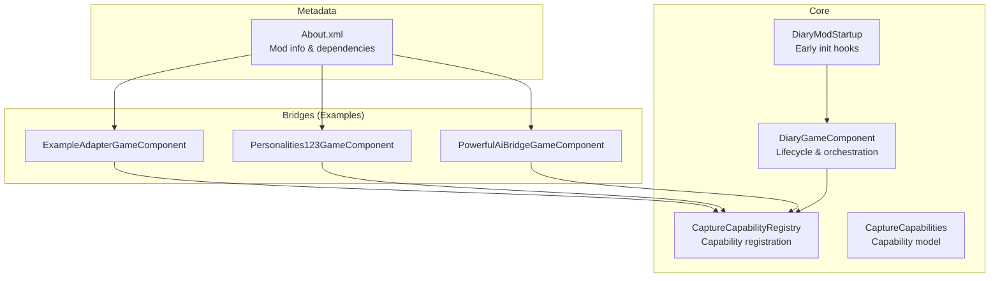
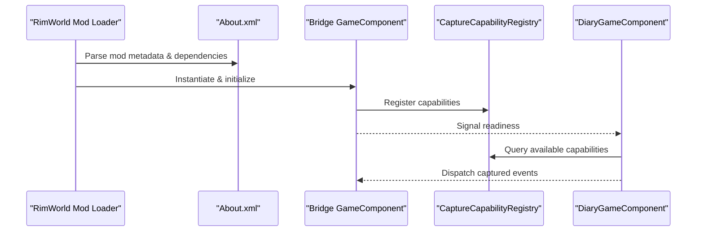
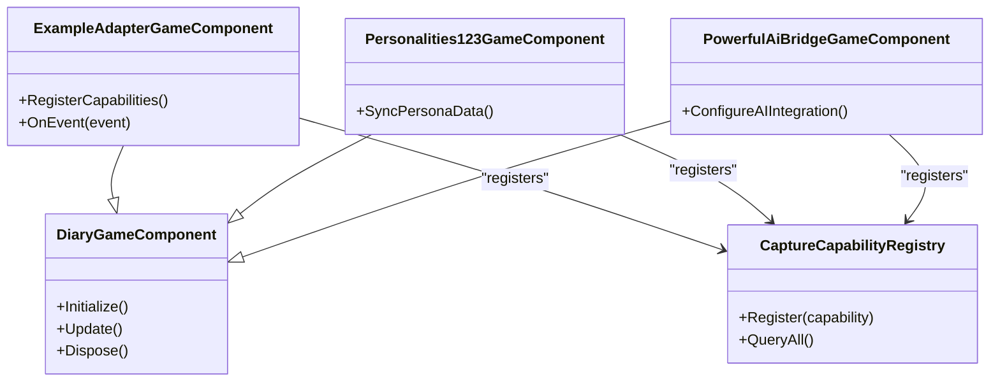
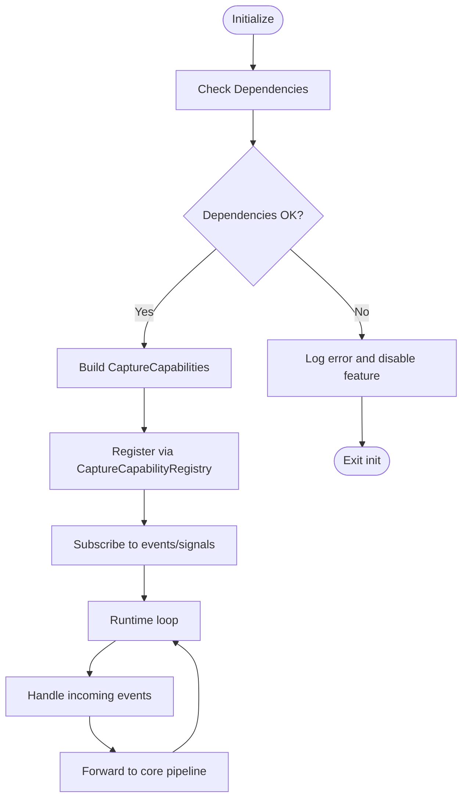
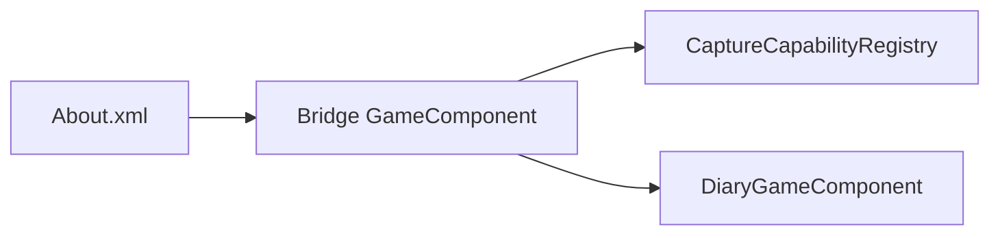

# Basic Bridge Setup

<cite>
**Referenced Files in This Document**
- [PawnDiaryGameComponent.cs](../../../../../../Source/Core/DiaryGameComponent.cs)
- [DiaryModStartup.cs](../../../../../../Source/Patches/DiaryModStartup.cs)
- [ExampleAdapterGameComponent.cs](../../../../../../integrations/PawnDiary.ExampleAdapter/Source/ExampleAdapterGameComponent.cs)
- [Personalities123GameComponent.cs](../../../../../../integrations/PawnDiary.PersonalitiesBridge/Source/Personalities123GameComponent.cs)
- [PowerfulAiBridgeGameComponent.cs](../../../../../../integrations/PawnDiary.PowerfulAiBridge/Source/PowerfulAiBridgeGameComponent.cs)
- [CaptureCapabilities.cs](../../../../../../Source/Integration/CaptureCapabilities.cs)
- [CaptureCapabilityRegistry.cs](../../../../../../Source/Pipeline/CaptureCapabilityRegistry.cs)
- [About.xml](../../../../../../About/About.xml)
</cite>

## Table of Contents
1. [Introduction](#introduction)
2. [Project Structure](#project-structure)
3. [Core Components](#core-components)
4. [Architecture Overview](#architecture-overview)
5. [Detailed Component Analysis](#detailed-component-analysis)
6. [Dependency Analysis](#dependency-analysis)
7. [Performance Considerations](#performance-considerations)
8. [Troubleshooting Guide](#troubleshooting-guide)
9. [Conclusion](#conclusion)
10. [Appendices](#appendices)

## Introduction
This document explains how to set up a minimal, working bridge that integrates with the core system using standard patterns:
- Inherit from the GameComponent base class for lifecycle management
- Configure mod metadata and dependencies via About.xml
- Implement initialization sequences with dependency checks and graceful error handling
- Register capture capabilities and handle basic event capture
- Manage mod loading order and version compatibility

The guidance is derived from existing bridges and the core runtime entry points in this repository.

## Project Structure
At a high level, bridges are implemented as separate mods under integrations/. Each bridge typically includes:
- A GameComponent subclass that participates in the game lifecycle
- An About.xml defining mod metadata and dependencies
- Optional patches or integration code to register capabilities and subscribe to events

**Diagram sources**
- [DiaryGameComponent.cs](../../../../../../Source/Core/DiaryGameComponent.cs)
- [DiaryModStartup.cs](../../../../../../Source/Patches/DiaryModStartup.cs)
- [CaptureCapabilityRegistry.cs](../../../../../../Source/Pipeline/CaptureCapabilityRegistry.cs)
- [CaptureCapabilities.cs](../../../../../../Source/Integration/CaptureCapabilities.cs)
- [ExampleAdapterGameComponent.cs](../../../../../../integrations/PawnDiary.ExampleAdapter/Source/ExampleAdapterGameComponent.cs)
- [Personalities123GameComponent.cs](../../../../../../integrations/PawnDiary.PersonalitiesBridge/Source/Personalities123GameComponent.cs)
- [PowerfulAiBridgeGameComponent.cs](../../../../../../integrations/PawnDiary.PowerfulAiBridge/Source/PowerfulAiBridgeGameComponent.cs)
- [About.xml](../../../../../../About/About.xml)

**Section sources**
- [DiaryGameComponent.cs](../../../../../../Source/Core/DiaryGameComponent.cs)
- [DiaryModStartup.cs](../../../../../../Source/Patches/DiaryModStartup.cs)
- [CaptureCapabilityRegistry.cs](../../../../../../Source/Pipeline/CaptureCapabilityRegistry.cs)
- [CaptureCapabilities.cs](../../../../../../Source/Integration/CaptureCapabilities.cs)
- [ExampleAdapterGameComponent.cs](../../../../../../integrations/PawnDiary.ExampleAdapter/Source/ExampleAdapterGameComponent.cs)
- [Personalities123GameComponent.cs](../../../../../../integrations/PawnDiary.PersonalitiesBridge/Source/Personalities123GameComponent.cs)
- [PowerfulAiBridgeGameComponent.cs](../../../../../../integrations/PawnDiary.PowerfulAiBridge/Source/PowerfulAiBridgeGameComponent.cs)
- [About.xml](../../../../../../About/About.xml)

## Core Components
- DiaryGameComponent: The central GameComponent used by the core and many bridges to manage lifecycle phases and coordinate subsystems. Bridges often inherit from it or compose it to participate in the same lifecycle.
- CaptureCapabilityRegistry: Central registry where bridges declare what they can capture and expose. Bridges call into this during initialization to register their capabilities.
- CaptureCapabilities: Data structure describing a bridge’s capability profile (e.g., supported event types, lanes, constraints).
- DiaryModStartup: Early startup hook used to bootstrap core systems before user content loads.

Key responsibilities:
- Lifecycle: Initialize, update, and dispose phases are handled through the GameComponent pattern.
- Capability Registration: Bridges register their capture capabilities early so the core can discover them.
- Dependency Management: About.xml declares required mods; bridges should verify availability at runtime and fail gracefully if missing.

**Section sources**
- [DiaryGameComponent.cs](../../../../../../Source/Core/DiaryGameComponent.cs)
- [CaptureCapabilityRegistry.cs](../../../../../../Source/Pipeline/CaptureCapabilityRegistry.cs)
- [CaptureCapabilities.cs](../../../../../../Source/Integration/CaptureCapabilities.cs)
- [DiaryModStartup.cs](../../../../../../Source/Patches/DiaryModStartup.cs)

## Architecture Overview
The typical flow for a bridge:
1. Mod loads and parses About.xml for metadata and dependencies.
2. GameComponent initializes and registers its capture capabilities.
3. Core discovers registered capabilities and wires event sources to the bridge.
4. During gameplay, the bridge captures events and contributes data to the diary pipeline.

**Diagram sources**
- [About.xml](../../../../../../About/About.xml)
- [DiaryGameComponent.cs](../../../../../../Source/Core/DiaryGameComponent.cs)
- [CaptureCapabilityRegistry.cs](../../../../../../Source/Pipeline/CaptureCapabilityRegistry.cs)

## Detailed Component Analysis

### Standard Bridge Class Structure
A minimal bridge typically follows these steps:
- Create a class inheriting from the core GameComponent.
- Override initialization to perform setup and capability registration.
- Optionally override update/dispose to manage runtime behavior and cleanup.
- Use dependency checks to ensure required mods are present before enabling features.

Patterns observed across example bridges:
- ExampleAdapterGameComponent demonstrates registering capabilities and integrating with the core.
- Personalities123GameComponent shows a focused bridge that syncs persona-related data.
- PowerfulAiBridgeGameComponent illustrates an AI-focused bridge with similar lifecycle patterns.

**Diagram sources**
- [DiaryGameComponent.cs](../../../../../../Source/Core/DiaryGameComponent.cs)
- [ExampleAdapterGameComponent.cs](../../../../../../integrations/PawnDiary.ExampleAdapter/Source/ExampleAdapterGameComponent.cs)
- [Personalities123GameComponent.cs](../../../../../../integrations/PawnDiary.PersonalitiesBridge/Source/Personalities123GameComponent.cs)
- [PowerfulAiBridgeGameComponent.cs](../../../../../../integrations/PawnDiary.PowerfulAiBridge/Source/PowerfulAiBridgeGameComponent.cs)
- [CaptureCapabilityRegistry.cs](../../../../../../Source/Pipeline/CaptureCapabilityRegistry.cs)

**Section sources**
- [ExampleAdapterGameComponent.cs](../../../../../../integrations/PawnDiary.ExampleAdapter/Source/ExampleAdapterGameComponent.cs)
- [Personalities123GameComponent.cs](../../../../../../integrations/PawnDiary.PersonalitiesBridge/Source/Personalities123GameComponent.cs)
- [PowerfulAiBridgeGameComponent.cs](../../../../../../integrations/PawnDiary.PowerfulAiBridge/Source/PowerfulAiBridgeGameComponent.cs)
- [DiaryGameComponent.cs](../../../../../../Source/Core/DiaryGameComponent.cs)
- [CaptureCapabilityRegistry.cs](../../../../../../Source/Pipeline/CaptureCapabilityRegistry.cs)

### Mod Metadata Configuration (About.xml)
Use About.xml to define:
- Mod identifier, name, and version
- Required dependencies (other mods)
- Load order hints if necessary
- Compatibility notes

Best practices:
- Declare explicit dependencies on core and any optional integrations your bridge requires.
- Provide clear version ranges to avoid incompatible combinations.
- Keep descriptions concise and informative for users.

**Section sources**
- [About.xml](../../../../../../About/About.xml)

### Initialization Sequences and Dependency Checking
Recommended sequence:
1. Parse About.xml to determine enabled features based on dependencies.
2. In GameComponent.Initialize():
   - Check for required mods and log warnings/errors if missing.
   - Register capture capabilities via CaptureCapabilityRegistry.
   - Subscribe to relevant events or signals.
3. In Update():
   - Perform periodic tasks such as syncing state or batching events.
4. In Dispose():
   - Clean up subscriptions and release resources.

Error handling:
- Fail fast when critical dependencies are absent.
- Gracefully degrade functionality when optional dependencies are missing.
- Log actionable messages to aid troubleshooting.

**Section sources**
- [DiaryGameComponent.cs](../../../../../../Source/Core/DiaryGameComponent.cs)
- [CaptureCapabilityRegistry.cs](../../../../../../Source/Pipeline/CaptureCapabilityRegistry.cs)
- [About.xml](../../../../../../About/About.xml)

### Event Capture and Registration
To enable event capture:
- Define a CaptureCapabilities object describing supported event types and lanes.
- Call the registry to register your capabilities during initialization.
- Ensure your GameComponent listens to the appropriate signals/events and forwards data to the core pipeline.

**Diagram sources**
- [CaptureCapabilityRegistry.cs](../../../../../../Source/Pipeline/CaptureCapabilityRegistry.cs)
- [CaptureCapabilities.cs](../../../../../../Source/Integration/CaptureCapabilities.cs)
- [DiaryGameComponent.cs](../../../../../../Source/Core/DiaryGameComponent.cs)

**Section sources**
- [CaptureCapabilityRegistry.cs](../../../../../../Source/Pipeline/CaptureCapabilityRegistry.cs)
- [CaptureCapabilities.cs](../../../../../../Source/Integration/CaptureCapabilities.cs)
- [DiaryGameComponent.cs](../../../../../../Source/Core/DiaryGameComponent.cs)

### Handling Mod Loading Order
Guidelines:
- Prefer declaring dependencies in About.xml rather than hardcoding load order.
- If you must influence load order, use documented mechanisms provided by the platform.
- At runtime, verify that dependent mods are loaded before enabling features.

**Section sources**
- [About.xml](../../../../../../About/About.xml)
- [DiaryModStartup.cs](../../../../../../Source/Patches/DiaryModStartup.cs)

### Version Compatibility Checks
Approach:
- Compare your bridge’s expected API versions against the core and dependent mods.
- Reject incompatible combinations early in initialization.
- Provide clear diagnostics indicating which versions are required.

**Section sources**
- [About.xml](../../../../../../About/About.xml)
- [DiaryGameComponent.cs](../../../../../../Source/Core/DiaryGameComponent.cs)

## Dependency Analysis
Bridges depend on:
- Core GameComponent for lifecycle participation
- CaptureCapabilityRegistry for capability discovery
- About.xml for metadata and dependency declarations

**Diagram sources**
- [About.xml](../../../../../../About/About.xml)
- [DiaryGameComponent.cs](../../../../../../Source/Core/DiaryGameComponent.cs)
- [CaptureCapabilityRegistry.cs](../../../../../../Source/Pipeline/CaptureCapabilityRegistry.cs)

**Section sources**
- [About.xml](../../../../../../About/About.xml)
- [DiaryGameComponent.cs](../../../../../../Source/Core/DiaryGameComponent.cs)
- [CaptureCapabilityRegistry.cs](../../../../../../Source/Pipeline/CaptureCapabilityRegistry.cs)

## Performance Considerations
- Batch event processing where possible to reduce overhead.
- Avoid heavy work in hot paths; defer to background tasks or scheduled updates.
- Minimize allocations during frequent event handling.
- Use capability registration once during initialization rather than repeatedly.

[No sources needed since this section provides general guidance]

## Troubleshooting Guide
Common issues and resolutions:
- Missing dependencies: Verify About.xml dependencies and ensure required mods are installed and compatible.
- Capability not discovered: Confirm registration occurs during initialization and that capability definitions are correct.
- Events not captured: Ensure subscriptions are established after dependencies are verified and that event names/types match expectations.
- Load order problems: Prefer dependency declarations over manual ordering; check logs for initialization failures.

Actionable steps:
- Inspect initialization logs for errors related to dependencies and capability registration.
- Temporarily disable optional integrations to isolate issues.
- Validate version compatibility between your bridge and the core.

**Section sources**
- [About.xml](../../../../../../About/About.xml)
- [DiaryGameComponent.cs](../../../../../../Source/Core/DiaryGameComponent.cs)
- [CaptureCapabilityRegistry.cs](../../../../../../Source/Pipeline/CaptureCapabilityRegistry.cs)

## Conclusion
By following the standard GameComponent inheritance pattern, configuring About.xml correctly, and registering capture capabilities during initialization, you can build robust bridges that integrate seamlessly with the core system. Proper dependency checking, graceful error handling, and careful attention to loading order and version compatibility will ensure a stable user experience.

[No sources needed since this section summarizes without analyzing specific files]

## Appendices

### Minimal Working Bridge Template (Conceptual Steps)
- Create a new class inheriting from the core GameComponent.
- In Initialize():
  - Check required dependencies and abort gracefully if missing.
  - Construct CaptureCapabilities describing supported events.
  - Register capabilities via CaptureCapabilityRegistry.
  - Subscribe to relevant events/signals.
- In Update():
  - Process queued events and forward to the core pipeline.
- In Dispose():
  - Unsubscribe and clean up resources.

[No sources needed since this section provides conceptual guidance]
