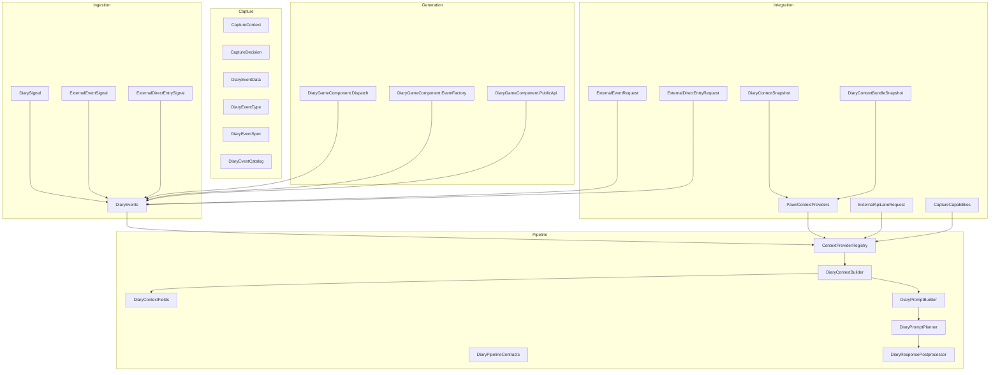
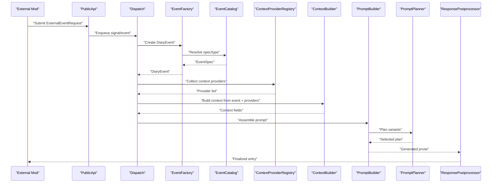
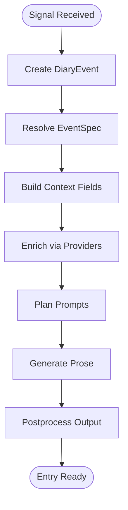
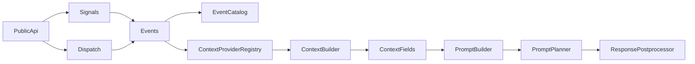

# Context Providers & Capture

## Table of Contents
1. [Introduction](#introduction)
2. [Project Structure](#project-structure)
3. [Core Components](#core-components)
4. [Architecture Overview](#architecture-overview)
5. [Detailed Component Analysis](#detailed-component-analysis)
6. [Dependency Analysis](#dependency-analysis)
7. [Performance Considerations](#performance-considerations)
8. [Troubleshooting Guide](#troubleshooting-guide)
9. [Conclusion](#conclusion)
10. [Appendices](#appendices)

## Introduction
This document explains how to implement context providers and event capture mechanisms for the diary system. It covers:
- The context provider interface and registry
- Event signal creation and ingestion
- Data transformation pipelines from signals to prompts
- Practical examples for capturing conversations, syncing personality states, and injecting custom context into diary generation
- Performance considerations, memory usage optimization, and thread safety guidance

The goal is to help modders extend the diary with custom contextual information and integrate with other mods’ data sources safely and efficiently.

## Project Structure
At a high level, the relevant areas are:
- Ingestion layer: signals and events that carry external or internal game data
- Capture layer: policies and decisions about what to capture and how to represent it
- Pipeline layer: context building, prompt planning, and response postprocessing
- Integration layer: public APIs and snapshots for other mods to consume and contribute data
- Generation layer: context builders and prompt builders used during diary entry creation

**Diagram sources**
- [DiarySignal.cs](../../../../../../Source/Ingestion/DiarySignal.cs)
- [ExternalEventSignal.cs](../../../../../../Source/Ingestion/Sources/ExternalEventSignal.cs)
- [ExternalDirectEntrySignal.cs](../../../../../../Source/Ingestion/Sources/ExternalDirectEntrySignal.cs)
- [DiaryEvents.cs](../../../../../../Source/Ingestion/DiaryEvents.cs)
- [CaptureContext.cs](../../../../../../Source/Capture/CaptureContext.cs)
- [CaptureDecision.cs](../../../../../../Source/Capture/CaptureDecision.cs)
- [DiaryEventData.cs](../../../../../../Source/Capture/DiaryEventData.cs)
- [DiaryEventType.cs](../../../../../../Source/Capture/DiaryEventType.cs)
- [DiaryEventSpec.cs](../../../../../../Source/Capture/Catalog/DiaryEventSpec.cs)
- [DiaryEventCatalog.cs](../../../../../../Source/Capture/Catalog/DiaryEventCatalog.cs)
- [ContextProviderRegistry.cs](../../../../../../Source/Pipeline/ContextProviderRegistry.cs)
- [DiaryPipelineContracts.cs](../../../../../../Source/Pipeline/DiaryPipelineContracts.cs)
- [DiaryContextBuilder.cs](../../../../../../Source/Generation/DiaryContextBuilder.cs)
- [DiaryContextFields.cs](../../../../../../Source/Generation/DiaryContextFields.cs)
- [DiaryPromptBuilder.cs](../../../../../../Source/Generation/DiaryPromptBuilder.cs)
- [DiaryPromptPlanner.cs](../../../../../../Source/Pipeline/DiaryPromptPlanner.cs)
- [DiaryResponsePostprocessor.cs](../../../../../../Source/Pipeline/DiaryResponsePostprocessor.cs)
- [PawnContextProviders.cs](../../../../../../Source/Integration/PawnContextProviders.cs)
- [DiaryContextSnapshot.cs](../../../../../../Source/Integration/DiaryContextSnapshot.cs)
- [DiaryContextBundleSnapshot.cs](../../../../../../Source/Integration/DiaryContextBundleSnapshot.cs)
- [ExternalEventRequest.cs](../../../../../../Source/Integration/ExternalEventRequest.cs)
- [ExternalDirectEntryRequest.cs](../../../../../../Source/Integration/ExternalDirectEntryRequest.cs)
- [ExternalApiLaneRequest.cs](../../../../../../Source/Integration/ExternalApiLaneRequest.cs)
- [CaptureCapabilities.cs](../../../../../../Source/Integration/CaptureCapabilities.cs)
- [DiaryGameComponent.Dispatch.cs](../../../../../../Source/Core/DiaryGameComponent.Dispatch.cs)
- [DiaryGameComponent.EventFactory.cs](../../../../../../Source/Core/DiaryGameComponent.EventFactory.cs)
- [DiaryGameComponent.PublicApi.cs](../../../../../../Source/Core/DiaryGameComponent.PublicApi.cs)

**Section sources**
- [DiarySignal.cs](../../../../../../Source/Ingestion/DiarySignal.cs)
- [ExternalEventSignal.cs](../../../../../../Source/Ingestion/Sources/ExternalEventSignal.cs)
- [ExternalDirectEntrySignal.cs](../../../../../../Source/Ingestion/Sources/ExternalDirectEntrySignal.cs)
- [DiaryEvents.cs](../../../../../../Source/Ingestion/DiaryEvents.cs)
- [CaptureContext.cs](../../../../../../Source/Capture/CaptureContext.cs)
- [CaptureDecision.cs](../../../../../../Source/Capture/CaptureDecision.cs)
- [DiaryEventData.cs](../../../../../../Source/Capture/DiaryEventData.cs)
- [DiaryEventType.cs](../../../../../../Source/Capture/DiaryEventType.cs)
- [DiaryEventSpec.cs](../../../../../../Source/Capture/Catalog/DiaryEventSpec.cs)
- [DiaryEventCatalog.cs](../../../../../../Source/Capture/Catalog/DiaryEventCatalog.cs)
- [ContextProviderRegistry.cs](../../../../../../Source/Pipeline/ContextProviderRegistry.cs)
- [DiaryPipelineContracts.cs](../../../../../../Source/Pipeline/DiaryPipelineContracts.cs)
- [DiaryContextBuilder.cs](../../../../../../Source/Generation/DiaryContextBuilder.cs)
- [DiaryContextFields.cs](../../../../../../Source/Generation/DiaryContextFields.cs)
- [DiaryPromptBuilder.cs](../../../../../../Source/Generation/DiaryPromptBuilder.cs)
- [DiaryPromptPlanner.cs](../../../../../../Source/Pipeline/DiaryPromptPlanner.cs)
- [DiaryResponsePostprocessor.cs](../../../../../../Source/Pipeline/DiaryResponsePostprocessor.cs)
- [PawnContextProviders.cs](../../../../../../Source/Integration/PawnContextProviders.cs)
- [DiaryContextSnapshot.cs](../../../../../../Source/Integration/DiaryContextSnapshot.cs)
- [DiaryContextBundleSnapshot.cs](../../../../../../Source/Integration/DiaryContextBundleSnapshot.cs)
- [ExternalEventRequest.cs](../../../../../../Source/Integration/ExternalEventRequest.cs)
- [ExternalDirectEntryRequest.cs](../../../../../../Source/Integration/ExternalDirectEntryRequest.cs)
- [ExternalApiLaneRequest.cs](../../../../../../Source/Integration/ExternalApiLaneRequest.cs)
- [CaptureCapabilities.cs](../../../../../../Source/Integration/CaptureCapabilities.cs)
- [DiaryGameComponent.Dispatch.cs](../../../../../../Source/Core/DiaryGameComponent.Dispatch.cs)
- [DiaryGameComponent.EventFactory.cs](../../../../../../Source/Core/DiaryGameComponent.EventFactory.cs)
- [DiaryGameComponent.PublicApi.cs](../../../../../../Source/Core/DiaryGameComponent.PublicApi.cs)

## Core Components
- Context Provider Registry: centralizes registration and resolution of context providers by lane or capability. It coordinates which providers contribute to a given context build.
- Signal and Event Types: signals encapsulate raw occurrences; events represent structured captures with types and specs.
- Capture Context and Decision: capture context carries per-event metadata; decision determines whether and how to capture an event.
- Data Models: event data and type enumerations define the shape of captured content.
- Catalog and Specs: event catalog maps event kinds to specifications; specs describe fields and constraints.
- Public API and Requests: integration points for external mods to submit events or direct entries.
- Context Builders and Fields: transform signals into typed context fields consumed by prompt builders.
- Prompt Builder and Planner: assemble narrative context and plan prompts based on available context.
- Response Postprocessor: finalizes generated text and applies decorations.

Key responsibilities:
- Provide a stable contract for context providers to expose additional data.
- Normalize heterogeneous inputs (signals, requests) into consistent event models.
- Ensure deterministic, efficient context assembly for prompt generation.

**Section sources**
- [ContextProviderRegistry.cs](../../../../../../Source/Pipeline/ContextProviderRegistry.cs)
- [DiarySignal.cs](../../../../../../Source/Ingestion/DiarySignal.cs)
- [ExternalEventSignal.cs](../../../../../../Source/Ingestion/Sources/ExternalEventSignal.cs)
- [ExternalDirectEntrySignal.cs](../../../../../../Source/Ingestion/Sources/ExternalDirectEntrySignal.cs)
- [CaptureContext.cs](../../../../../../Source/Capture/CaptureContext.cs)
- [CaptureDecision.cs](../../../../../../Source/Capture/CaptureDecision.cs)
- [DiaryEventData.cs](../../../../../../Source/Capture/DiaryEventData.cs)
- [DiaryEventType.cs](../../../../../../Source/Capture/DiaryEventType.cs)
- [DiaryEventSpec.cs](../../../../../../Source/Capture/Catalog/DiaryEventSpec.cs)
- [DiaryEventCatalog.cs](../../../../../../Source/Capture/Catalog/DiaryEventCatalog.cs)
- [ExternalEventRequest.cs](../../../../../../Source/Integration/ExternalEventRequest.cs)
- [ExternalDirectEntryRequest.cs](../../../../../../Source/Integration/ExternalDirectEntryRequest.cs)
- [ExternalApiLaneRequest.cs](../../../../../../Source/Integration/ExternalApiLaneRequest.cs)
- [DiaryContextBuilder.cs](../../../../../../Source/Generation/DiaryContextBuilder.cs)
- [DiaryContextFields.cs](../../../../../../Source/Generation/DiaryContextFields.cs)
- [DiaryPromptBuilder.cs](../../../../../../Source/Generation/DiaryPromptBuilder.cs)
- [DiaryPromptPlanner.cs](../../../../../../Source/Pipeline/DiaryPromptPlanner.cs)
- [DiaryResponsePostprocessor.cs](../../../../../../Source/Pipeline/DiaryResponsePostprocessor.cs)

## Architecture Overview
The ingestion-to-generation pipeline transforms external or internal signals into diary entries through well-defined stages:
- Signals arrive via patches or public APIs
- Events are created and cataloged
- Context providers enrich the capture context
- Context builder assembles typed fields
- Prompt builder plans and renders prompts
- Postprocessor finalizes output

**Diagram sources**
- [DiaryGameComponent.PublicApi.cs](../../../../../../Source/Core/DiaryGameComponent.PublicApi.cs)
- [DiaryGameComponent.Dispatch.cs](../../../../../../Source/Core/DiaryGameComponent.Dispatch.cs)
- [DiaryGameComponent.EventFactory.cs](../../../../../../Source/Core/DiaryGameComponent.EventFactory.cs)
- [DiaryEventCatalog.cs](../../../../../../Source/Capture/Catalog/DiaryEventCatalog.cs)
- [ContextProviderRegistry.cs](../../../../../../Source/Pipeline/ContextProviderRegistry.cs)
- [DiaryContextBuilder.cs](../../../../../../Source/Generation/DiaryContextBuilder.cs)
- [DiaryPromptBuilder.cs](../../../../../../Source/Generation/DiaryPromptBuilder.cs)
- [DiaryPromptPlanner.cs](../../../../../../Source/Pipeline/DiaryPromptPlanner.cs)
- [DiaryResponsePostprocessor.cs](../../../../../../Source/Pipeline/DiaryResponsePostprocessor.cs)

## Detailed Component Analysis

### Context Provider Interface and Registry
- Purpose: Allow mods to contribute contextual data to the diary pipeline without tight coupling.
- Registration: Providers register themselves with the registry, typically by lane identity or capability.
- Resolution: During context building, the registry selects applicable providers and invokes them to populate context fields.
- Contracts: Use pipeline contracts to define expected input/output shapes and lifecycle semantics.

Implementation notes:
- Keep provider methods lightweight and idempotent where possible.
- Avoid heavy allocations inside hot paths; reuse buffers if needed.
- Prefer immutable context snapshots for safe sharing across threads.

**Section sources**
- [ContextProviderRegistry.cs](../../../../../../Source/Pipeline/ContextProviderRegistry.cs)
- [DiaryPipelineContracts.cs](../../../../../../Source/Pipeline/DiaryPipelineContracts.cs)

### Event Signals and Creation
- Signals: Lightweight carriers of raw occurrences (e.g., external events, direct entries).
- Event Creation: Factory converts signals into structured events using catalog specs.
- Catalog: Maps event kinds to specs that define required fields and validation rules.

Best practices:
- Validate inputs early at signal boundaries.
- Normalize timestamps and identifiers consistently.
- Deduplicate when appropriate using event specs.

**Section sources**
- [DiarySignal.cs](../../../../../../Source/Ingestion/DiarySignal.cs)
- [ExternalEventSignal.cs](../../../../../../Source/Ingestion/Sources/ExternalEventSignal.cs)
- [ExternalDirectEntrySignal.cs](../../../../../../Source/Ingestion/Sources/ExternalDirectEntrySignal.cs)
- [DiaryEvents.cs](../../../../../../Source/Ingestion/DiaryEvents.cs)
- [DiaryGameComponent.EventFactory.cs](../../../../../../Source/Core/DiaryGameComponent.EventFactory.cs)
- [DiaryEventCatalog.cs](../../../../../../Source/Capture/Catalog/DiaryEventCatalog.cs)
- [DiaryEventSpec.cs](../../../../../../Source/Capture/Catalog/DiaryEventSpec.cs)

### Capture Context and Decisions
- Capture Context: Holds per-event metadata such as pawn identity, source lane, and provenance.
- Capture Decision: Determines whether an event should be captured, suppressed, or transformed.
- Event Data and Types: Define the canonical representation and enumeration of event kinds.

Guidelines:
- Make decisions deterministic and testable.
- Keep context small; defer heavy computations to later stages.
- Use typed event data to avoid stringly-typed payloads.

**Section sources**
- [CaptureContext.cs](../../../../../../Source/Capture/CaptureContext.cs)
- [CaptureDecision.cs](../../../../../../Source/Capture/CaptureDecision.cs)
- [DiaryEventData.cs](../../../../../../Source/Capture/DiaryEventData.cs)
- [DiaryEventType.cs](../../../../../../Source/Capture/DiaryEventType.cs)

### Data Transformation Pipelines
- Context Builder: Assembles typed context fields from events and providers.
- Context Fields: Strongly-typed containers for domain-specific data.
- Prompt Builder: Converts context into prompt templates and variants.
- Prompt Planner: Selects optimal prompt plan based on context and tuning.
- Response Postprocessor: Applies decorations, sanitization, and formatting.

Flow overview:

**Diagram sources**
- [DiaryContextBuilder.cs](../../../../../../Source/Generation/DiaryContextBuilder.cs)
- [DiaryContextFields.cs](../../../../../../Source/Generation/DiaryContextFields.cs)
- [DiaryPromptBuilder.cs](../../../../../../Source/Generation/DiaryPromptBuilder.cs)
- [DiaryPromptPlanner.cs](../../../../../../Source/Pipeline/DiaryPromptPlanner.cs)
- [DiaryResponsePostprocessor.cs](../../../../../../Source/Pipeline/DiaryResponsePostprocessor.cs)

**Section sources**
- [DiaryContextBuilder.cs](../../../../../../Source/Generation/DiaryContextBuilder.cs)
- [DiaryContextFields.cs](../../../../../../Source/Generation/DiaryContextFields.cs)
- [DiaryPromptBuilder.cs](../../../../../../Source/Generation/DiaryPromptBuilder.cs)
- [DiaryPromptPlanner.cs](../../../../../../Source/Pipeline/DiaryPromptPlanner.cs)
- [DiaryResponsePostprocessor.cs](../../../../../../Source/Pipeline/DiaryResponsePostprocessor.cs)

### Integration Points and External Mods
- Public API: Entry points for external mods to submit events or direct entries.
- Requests: Structured request types for external submissions.
- Snapshots: Read-only views of context and capabilities for consumers.
- Capabilities: Declares supported features for discovery and gating.

Usage patterns:
- Submit external events via dedicated request types.
- Use snapshots to inspect current state without side effects.
- Respect capability flags before invoking advanced features.

**Section sources**
- [DiaryGameComponent.PublicApi.cs](../../../../../../Source/Core/DiaryGameComponent.PublicApi.cs)
- [ExternalEventRequest.cs](../../../../../../Source/Integration/ExternalEventRequest.cs)
- [ExternalDirectEntryRequest.cs](../../../../../../Source/Integration/ExternalDirectEntryRequest.cs)
- [ExternalApiLaneRequest.cs](../../../../../../Source/Integration/ExternalApiLaneRequest.cs)
- [PawnContextProviders.cs](../../../../../../Source/Integration/PawnContextProviders.cs)
- [DiaryContextSnapshot.cs](../../../../../../Source/Integration/DiaryContextSnapshot.cs)
- [DiaryContextBundleSnapshot.cs](../../../../../../Source/Integration/DiaryContextBundleSnapshot.cs)
- [CaptureCapabilities.cs](../../../../../../Source/Integration/CaptureCapabilities.cs)

### Practical Examples

#### Capturing Conversations
- Track conversation events from another mod and convert them into signals.
- Enrich context with participants, topics, and sentiment indicators.
- Inject conversation summaries into diary entries via context providers.

Steps:
- Subscribe to conversation events and emit signals.
- Map conversation attributes to event specs.
- Register a provider that adds conversation context fields.

**Section sources**
- [ConversationTracker.cs](../../../../../../integrations/PawnDiary.RimTalkBridge/Source/ConversationTracker.cs)
- [DiaryContextInjector.cs](../../../../../../integrations/PawnDiary.RimTalkBridge/Source/DiaryContextInjector.cs)
- [DiaryContextBuilder.cs](../../../../../../Source/Generation/DiaryContextBuilder.cs)
- [DiaryContextFields.cs](../../../../../../Source/Generation/DiaryContextFields.cs)
- [ContextProviderRegistry.cs](../../../../../../Source/Pipeline/ContextProviderRegistry.cs)

#### Syncing Personality States
- Maintain a bridge component that reads personality mod state.
- Periodically snapshot personality attributes and publish updates.
- Use persona sync logic to reconcile differences and avoid churn.

Steps:
- Implement periodic sync routine.
- Convert personality changes into signals or direct entries.
- Update context providers to reflect latest personality state.

**Section sources**
- [PersonaSync.cs](../../../../../../integrations/PawnDiary.RimTalkBridge/Source/PersonaSync.cs)
- [Personalities123GameComponent.cs](../../../../../../integrations/PawnDiary.PersonalitiesBridge/Source/Personalities123GameComponent.cs)
- [DiaryContextBuilder.cs](../../../../../../Source/Generation/DiaryContextBuilder.cs)
- [DiaryContextFields.cs](../../../../../../Source/Generation/DiaryContextFields.cs)

#### Injecting Custom Context into Diary Generation
- Register a custom context provider for your domain.
- Populate context fields during build phase.
- Ensure fields are consumed by prompt builders and planners.

Steps:
- Implement provider methods adhering to pipeline contracts.
- Register provider with the registry under a specific lane.
- Verify context appears in snapshots and affects prompts.

**Section sources**
- [ContextProviderRegistry.cs](../../../../../../Source/Pipeline/ContextProviderRegistry.cs)
- [DiaryPipelineContracts.cs](../../../../../../Source/Pipeline/DiaryPipelineContracts.cs)
- [DiaryContextBuilder.cs](../../../../../../Source/Generation/DiaryContextBuilder.cs)
- [DiaryPromptBuilder.cs](../../../../../../Source/Generation/DiaryPromptBuilder.cs)
- [DiaryPromptPlanner.cs](../../../../../../Source/Pipeline/DiaryPromptPlanner.cs)

## Dependency Analysis
The following diagram highlights key dependencies between ingestion, capture, pipeline, integration, and generation layers.

**Diagram sources**
- [DiarySignal.cs](../../../../../../Source/Ingestion/DiarySignal.cs)
- [DiaryEvents.cs](../../../../../../Source/Ingestion/DiaryEvents.cs)
- [DiaryEventCatalog.cs](../../../../../../Source/Capture/Catalog/DiaryEventCatalog.cs)
- [ContextProviderRegistry.cs](../../../../../../Source/Pipeline/ContextProviderRegistry.cs)
- [DiaryContextBuilder.cs](../../../../../../Source/Generation/DiaryContextBuilder.cs)
- [DiaryContextFields.cs](../../../../../../Source/Generation/DiaryContextFields.cs)
- [DiaryPromptBuilder.cs](../../../../../../Source/Generation/DiaryPromptBuilder.cs)
- [DiaryPromptPlanner.cs](../../../../../../Source/Pipeline/DiaryPromptPlanner.cs)
- [DiaryResponsePostprocessor.cs](../../../../../../Source/Pipeline/DiaryResponsePostprocessor.cs)
- [DiaryGameComponent.PublicApi.cs](../../../../../../Source/Core/DiaryGameComponent.PublicApi.cs)
- [DiaryGameComponent.Dispatch.cs](../../../../../../Source/Core/DiaryGameComponent.Dispatch.cs)

**Section sources**
- [DiarySignal.cs](../../../../../../Source/Ingestion/DiarySignal.cs)
- [DiaryEvents.cs](../../../../../../Source/Ingestion/DiaryEvents.cs)
- [DiaryEventCatalog.cs](../../../../../../Source/Capture/Catalog/DiaryEventCatalog.cs)
- [ContextProviderRegistry.cs](../../../../../../Source/Pipeline/ContextProviderRegistry.cs)
- [DiaryContextBuilder.cs](../../../../../../Source/Generation/DiaryContextBuilder.cs)
- [DiaryContextFields.cs](../../../../../../Source/Generation/DiaryContextFields.cs)
- [DiaryPromptBuilder.cs](../../../../../../Source/Generation/DiaryPromptBuilder.cs)
- [DiaryPromptPlanner.cs](../../../../../../Source/Pipeline/DiaryPromptPlanner.cs)
- [DiaryResponsePostprocessor.cs](../../../../../../Source/Pipeline/DiaryResponsePostprocessor.cs)
- [DiaryGameComponent.PublicApi.cs](../../../../../../Source/Core/DiaryGameComponent.PublicApi.cs)
- [DiaryGameComponent.Dispatch.cs](../../../../../../Source/Core/DiaryGameComponent.Dispatch.cs)

## Performance Considerations
- Minimize allocations in hot paths: prefer reusable buffers and value types where feasible.
- Batch operations: group multiple signals or updates to reduce overhead.
- Defer heavy work: move expensive computations out of capture decisions and into background tasks or scheduled phases.
- Cache results: memoize provider outputs keyed by stable identifiers to avoid recomputation.
- Limit context size: keep context fields concise; include only necessary details for prompt generation.
- Avoid blocking calls: ensure provider methods return quickly and do not perform I/O.

[No sources needed since this section provides general guidance]

## Troubleshooting Guide
Common issues and resolutions:
- Missing context fields: verify provider registration and lane mapping; check pipeline contracts for field names.
- Duplicate entries: review deduplication logic in event specs and catalog mappings.
- Slow generation: profile provider execution times; consider caching or lazy evaluation.
- Thread safety errors: ensure providers use thread-safe structures and avoid shared mutable state.
- External submission failures: validate request payloads against schema; check capability flags.

Diagnostic tips:
- Inspect snapshots to confirm context availability.
- Log provider invocation counts and durations.
- Use minimal reproducible examples to isolate issues.

**Section sources**
- [DiaryContextSnapshot.cs](../../../../../../Source/Integration/DiaryContextSnapshot.cs)
- [DiaryContextBundleSnapshot.cs](../../../../../../Source/Integration/DiaryContextBundleSnapshot.cs)
- [CaptureCapabilities.cs](../../../../../../Source/Integration/CaptureCapabilities.cs)

## Conclusion
By leveraging the context provider registry, signal-based ingestion, and robust transformation pipelines, you can extend the diary system with rich, mod-driven context. Follow best practices for performance and thread safety, and use the provided integration points to collaborate with other mods effectively.

[No sources needed since this section summarizes without analyzing specific files]

## Appendices

### Quick Reference: Key Interfaces and Types
- Context Provider Registry: manages provider lifecycle and selection
- Signal Types: external event and direct entry signals
- Event Catalog and Specs: define event schemas and validation
- Context Builder and Fields: assemble typed context for prompts
- Prompt Builder and Planner: generate and select prompts
- Public API and Requests: integration surface for external mods

**Section sources**
- [ContextProviderRegistry.cs](../../../../../../Source/Pipeline/ContextProviderRegistry.cs)
- [ExternalEventSignal.cs](../../../../../../Source/Ingestion/Sources/ExternalEventSignal.cs)
- [ExternalDirectEntrySignal.cs](../../../../../../Source/Ingestion/Sources/ExternalDirectEntrySignal.cs)
- [DiaryEventCatalog.cs](../../../../../../Source/Capture/Catalog/DiaryEventCatalog.cs)
- [DiaryEventSpec.cs](../../../../../../Source/Capture/Catalog/DiaryEventSpec.cs)
- [DiaryContextBuilder.cs](../../../../../../Source/Generation/DiaryContextBuilder.cs)
- [DiaryContextFields.cs](../../../../../../Source/Generation/DiaryContextFields.cs)
- [DiaryPromptBuilder.cs](../../../../../../Source/Generation/DiaryPromptBuilder.cs)
- [DiaryPromptPlanner.cs](../../../../../../Source/Pipeline/DiaryPromptPlanner.cs)
- [ExternalEventRequest.cs](../../../../../../Source/Integration/ExternalEventRequest.cs)
- [ExternalDirectEntryRequest.cs](../../../../../../Source/Integration/ExternalDirectEntryRequest.cs)
