# Data Synchronization Patterns

<cite>
**Referenced Files in This Document**
- [PawnDiaryApi.cs](../../../../../../Source/Integration/PawnDiaryApi.cs)
- [ExternalEventRequest.cs](../../../../../../Source/Integration/ExternalEventRequest.cs)
- [ExternalDirectEntryRequest.cs](../../../../../../Source/Integration/ExternalDirectEntryRequest.cs)
- [ExternalPromptEntryRequest.cs](../../../../../../Source/Integration/ExternalPromptEntryRequest.cs)
- [ExternalApiLaneRequest.cs](../../../../../../Source/Integration/ExternalApiLaneRequest.cs)
- [DiaryGameComponent.PublicApi.cs](../../../../../../Source/Core/DiaryGameComponent.PublicApi.cs)
- [DiaryGameComponent.Dispatch.cs](../../../../../../Source/Core/DiaryGameComponent.Dispatch.cs)
- [DiaryGameComponent.InteractionBatching.cs](../../../../../../Source/Core/DiaryGameComponent.InteractionBatching.cs)
- [DiaryGameComponent.TaleBatching.cs](../../../../../../Source/Core/DiaryGameComponent.TaleBatching.cs)
- [DiaryGameComponent.ExternalApiBudget.cs](../../../../../../Source/Core/DiaryGameComponent.ExternalApiBudget.cs)
- [DiaryGameComponent.IntegrationSnapshots.cs](../../../../../../Source/Core/DiaryGameComponent.IntegrationSnapshots.cs)
- [DiaryGameComponent.PlayLogSpeech.cs](../../../../../../Source/Core/DiaryGameComponent.PlayLogSpeech.cs)
- [DiaryGameComponent.EventWindows.cs](../../../../../../Source/Core/DiaryGameComponent.EventWindows.cs)
- [DiaryGameComponent.AmbientThoughts.cs](../../../../../../Source/Core/DiaryGameComponent.AmbientThoughts.cs)
- [DiaryGameComponent.Hediffs.cs](../../../../../../Source/Core/DiaryGameComponent.Hediffs.cs)
- [DiaryGameComponent.Quests.cs](../../../../../../Source/Core/DiaryGameComponent.Quests.cs)
- [DiaryGameComponent.Royalty.cs](../../../../../../Source/Core/DiaryGameComponent.Royalty.cs)
- [DiaryGameComponent.BiotechFamily.cs](../../../../../../Source/Core/DiaryGameComponent.BiotechFamily.cs)
- [DiaryGameComponent.BiotechGrowth.cs](../../../../../../Source/Core/DiaryGameComponent.BiotechGrowth.cs)
- [DiaryGameComponent.BiotechMechanitor.cs](../../../../../../Source/Core/DiaryGameComponent.BiotechMechanitor.cs)
- [DiaryGameComponent.Odyssey.cs](../../../../../../Source/Core/DiaryGameComponent.Odyssey.cs)
- [DiaryGameComponent.Voice.cs](../../../../../../Source/Core/DiaryGameComponent.Voice.cs)
- [DiaryGameComponent.Work.cs](../../../../../../Source/Core/DiaryGameComponent.Work.cs)
- [DiaryGameComponent.PromptPreview.cs](../../../../../../Source/Core/DiaryGameComponent.PromptPreview.cs)
- [DiaryGameComponent.GenerationDispatch.cs](../../../../../../Source/Core/DiaryGameComponent.GenerationDispatch.cs)
- [DiaryGameComponent.GenerationEligibility.cs](../../../../../../Source/Core/DiaryGameComponent.GenerationEligibility.cs)
- [DiaryGameComponent.Export.cs](../../../../../../Source/Core/DiaryGameComponent.Export.cs)
- [DiaryGameComponent.DevTools.cs](../../../../../../Source/Core/DiaryGameComponent.DevTools.cs)
- [DiaryGameComponent.Lookup.cs](../../../../../../Source/Core/DiaryGameComponent.Lookup.cs)
- [DiaryGameComponent.Progression.cs](../../../../../../Source/Core/DiaryGameComponent.Progression.cs)
- [DiaryGameComponent.RoyaltyMilestones.cs](../../../../../../Source/Core/DiaryGameComponent.RoyaltyMilestones.cs)
- [DiaryGameComponent.RoyaltyPermits.cs](../../../../../../Source/Core/DiaryGameComponent.RoyaltyPermits.cs)
- [DiaryGameComponent.RoyaltyProgression.cs](../../../../../../Source/Core/DiaryGameComponent.RoyaltyProgression.cs)
- [DiaryGameComponent.RoyaltySuccession.cs](../../../../../../Source/Core/DiaryGameComponent.RoyaltySuccession.cs)
- [DiaryGameComponent.ThoughtProgression.cs](../../../../../../Source/Core/DiaryGameComponent.ThoughtProgression.cs)
- [DiaryGameComponent.Anomaly.cs](../../../../../../Source/Core/DiaryGameComponent.Anomaly.cs)
- [DiaryGameComponent.DaySummary.cs](../../../../../../Source/Core/DiaryGameComponent.DaySummary.cs)
- [DiaryGameComponent.Arrivals.cs](../../../../../../Source/Core/DiaryGameComponent.Arrivals.cs)
- [DiaryGameComponent.Dev.cs](../../../../../../Source/Core/DiaryGameComponent.Dev.cs)
- [DiaryGameComponent.ApiLanes.cs](../../../../../../Source/Core/DiaryGameComponent.ApiLanes.cs)
- [DiaryGameComponent.EventFactory.cs](../../../../../../Source/Core/DiaryGameComponent.EventFactory.cs)
- [DiaryGameComponent.EventRetention.cs](../../../../../../Source/Core/DiaryGameComponent.EventRetention.cs)
- [DiaryGameComponent.Generation.cs](../../../../../../Source/Core/DiaryGameComponent.Generation.cs)
- [DiaryGameComponent.Interactions.cs](../../../../../../Source/Core/DiaryGameComponent.Interactions.cs)
- [DiaryGameComponent.ObservedConditions.cs](../../../../../../Source/Core/DiaryGameComponent.ObservedConditions.cs)
- [DiaryGameComponent.cs](../../../../../../Source/Core/DiaryGameComponent.cs)
- [DiaryArchiveRepository.cs](../../../../../../Source/Core/DiaryArchiveRepository.cs)
- [DiaryEventRepository.cs](../../../../../../Source/Core/DiaryEventRepository.cs)
- [PawnMemoryRepository.cs](../../../../../../Source/Core/PawnMemoryRepository.cs)
- [CaptureContext.cs](../../../../../../Source/Capture/CaptureContext.cs)
- [DiaryEventData.cs](../../../../../../Source/Capture/DiaryEventData.cs)
- [DiaryEventType.cs](../../../../../../Source/Capture/DiaryEventType.cs)
- [GenericEventTypeDedup.cs](../../../../../../Source/Capture/GenericEventTypeDedup.cs)
- [RecentEventExpiry.cs](../../../../../../Source/Capture/RecentEventExpiry.cs)
- [DiarySignal.cs](../../../../../../Source/Ingestion/DiarySignal.cs)
- [DiaryEvents.cs](../../../../../../Source/Ingestion/DiaryEvents.cs)
- [ExternalEventSignal.cs](../../../../../../Source/Ingestion/Sources/ExternalEventSignal.cs)
- [ExternalDirectEntrySignal.cs](../../../../../../Source/Ingestion/Sources/ExternalDirectEntrySignal.cs)
- [PersonaSync.cs](../../../../../../integrations/PawnDiary.RimTalkBridge/Source/PersonaSync.cs)
- [ConversationTracker.cs](../../../../../../integrations/PawnDiary.RimTalkBridge/Source/ConversationTracker.cs)
- [ColonyContextInjector.cs](../../../../../../integrations/PawnDiary.RimTalkBridge/Source/ColonyContextInjector.cs)
- [DiaryContextInjector.cs](../../../../../../integrations/PawnDiary.RimTalkBridge/Source/DiaryContextInjector.cs)
- [EnneagramSync.cs](../../../../../../integrations/PawnDiary.PersonalitiesBridge/Source/EnneagramSync.cs)
- [Personalities123GameComponent.cs](../../../../../../integrations/PawnDiary.PersonalitiesBridge/Source/Personalities123GameComponent.cs)
- [PowerfulAiBridgeGameComponent.cs](../../../../../../integrations/PawnDiary.PowerfulAiBridge/Source/PowerfulAiBridgeGameComponent.cs)
- [PowerfulAiReflection.cs](../../../../../../integrations/PawnDiary.PowerfulAiBridge/Source/PowerfulAiReflection.cs)
- [ApiEndpointPolicy.cs](../../../../../../Source/Pipeline/ApiEndpointPolicy.cs)
- [ApiLaneIdentity.cs](../../../../../../Source/Pipeline/ApiLaneIdentity.cs)
- [ApiLaneImport.cs](../../../../../../Source/Pipeline/ApiLaneImport.cs)
- [ApiLaneSelector.cs](../../../../../../Source/Pipeline/ApiLaneSelector.cs)
- [ExternalApiBudgetPolicy.cs](../../../../../../Source/Pipeline/ExternalApiBudgetPolicy.cs)
- [ExternalOverrideArbitration.cs](../../../../../../Source/Pipeline/ExternalOverrideArbitration.cs)
- [ListenerRegistry.cs](../../../../../../Source/Pipeline/ListenerRegistry.cs)
- [DiaryPipelineContracts.cs](../../../../../../Source/Pipeline/DiaryPipelineContracts.cs)
- [DiaryResponsePostprocessor.cs](../../../../../../Source/Pipeline/DiaryResponsePostprocessor.cs)
- [DiarySaveNormalization.cs](../../../../../../Source/Pipeline/DiarySaveNormalization.cs)
- [DiaryTextDecorations.cs](../../../../../../Source/Pipeline/DiaryTextDecorations.cs)
- [DiaryRichTextDecorators.cs](../../../../../../Source/Pipeline/DiaryRichTextDecorators.cs)
- [DiaryListText.cs](../../../../../../Source/Pipeline/DiaryListText.cs)
- [DiarySentenceExcerpt.cs](../../../../../../Source/Pipeline/DiarySentenceExcerpt.cs)
- [DiaryNameHighlighter.cs](../../../../../../Source/Pipeline/DiaryNameHighlighter.cs)
- [DiaryParagraphReflow.cs](../../../../../../Source/Pipeline/DiaryParagraphReflow.cs)
- [DiaryRetentionPlan.cs](../../../../../../Source/Pipeline/DiaryRetentionPlan.cs)
- [DiaryArchiveFallback.cs](../../../../../../Source/Pipeline/DiaryArchiveFallback.cs)
- [DiaryArchiveCompactionPlanner.cs](../../../../../../Source/Pipeline/DiaryArchiveCompactionPlanner.cs)
- [DiaryArchiveEligibility.cs](../../../../../../Source/Pipeline/DiaryArchiveEligibility.cs)
- [DiaryEventDomainClassifier.cs](../../../../../../Source/Pipeline/DiaryEventDomainClassifier.cs)
- [DiaryEventPromptKeys.cs](../../../../../../Source/Pipeline/DiaryEventPromptKeys.cs)
- [DiaryGenerationStatus.cs](../../../../../../Source/Pipeline/DiaryGenerationStatus.cs)
- [DiaryLifeBoundaryPolicy.cs](../../../../../../Source/Pipeline/DiaryLifeBoundaryPolicy.cs)
- [DiaryPromptCapture.cs](../../../../../../Source/Pipeline/DiaryPromptCapture.cs)
- [DiaryPromptPlanner.cs](../../../../../../Source/Pipeline/DiaryPromptPlanner.cs)
- [DiaryTextDecorationContracts.cs](../../../../../../Source/Pipeline/DiaryTextDecorationContracts.cs)
- [DiaryTextDecorationFactCodec.cs](../../../../../../Source/Pipeline/DiaryTextDecorationFactCodec.cs)
- [DiaryTextDecorationMatcher.cs](../../../../../../Source/Pipeline/DiaryTextDecorationMatcher.cs)
- [DiaryTextDecorationText.cs](../../../../../../Source/Pipeline/DiaryTextDecorationText.cs)
- [EventWindowPolicy.cs](../../../../../../Source/Pipeline/EventWindowPolicy.cs)
- [HediffPersonaOverridePolicy.cs](../../../../../../Source/Pipeline/HediffPersonaOverridePolicy.cs)
- [HumorChancePolicy.cs](../../../../../../Source/Pipeline/HumorChancePolicy.cs)
- [ModelReasoningCapability.cs](../../../../../../Source/Pipeline/ModelReasoningCapability.cs)
- [OdysseyContextFormatter.cs](../../../../../../Source/Pipeline/OdysseyContextFormatter.cs)
- [OdysseyJourneyContracts.cs](../../../../../../Source/Pipeline/OdysseyJourneyContracts.cs)
- [OdysseyLandingPolicy.cs](../../../../../../Source/Pipeline/OdysseyLandingPolicy.cs)
- [OdysseyLifecyclePolicy.cs](../../../../../../Source/Pipeline/OdysseyLifecyclePolicy.cs)
- [OdysseyLocationPolicy.cs](../../../../../../Source/Pipeline/OdysseyLocationPolicy.cs)
- [OdysseyWriterPolicy.cs](../../../../../../Source/Pipeline/OdysseyWriterPolicy.cs)
- [PlayerWritingStyleText.cs](../../../../../../Source/Pipeline/PlayerWritingStyleText.cs)
- [ProgressionMilestonePolicy.cs](../../../../../../Source/Pipeline/ProgressionMilestonePolicy.cs)
- [PromptContextDetail.cs](../../../../../../Source/Pipeline/PromptContextDetail.cs)
- [PromptEnchantmentPlanner.cs](../../../../../../Source/Pipeline/PromptEnchantmentPlanner.cs)
- [PromptTextSanitizer.cs](../../../../../../Source/Pipeline/PromptTextSanitizer.cs)
- [PsychotypeResolutionPolicy.cs](../../../../../../Source/Pipeline/PsychotypeResolutionPolicy.cs)
- [PsychotypeRollPolicy.cs](../../../../../../Source/Pipeline/PsychotypeRollPolicy.cs)
- [PsychotypeText.cs](../../../../../../Source/Pipeline/PsychotypeText.cs)
- [PsychotypeTraitAffinities.cs](../../../../../../Source/Pipeline/PsychotypeTraitAffinities.cs)
- [TextTruncation.cs](../../../../../../Source/Pipeline/TextTruncation.cs)
- [WritingStyleResolutionPolicy.cs](../../../../../../Source/Pipeline/WritingStyleResolutionPolicy.cs)
- [ExternalApiSetupSnapshot.cs](../../../../../../Source/Integration/DiaryApiSetupSnapshot.cs)
- [ExternalApiLaneSnapshot.cs](../../../../../../Source/Integration/DiaryApiLaneSnapshot.cs)
- [ExternalContextBundleSnapshot.cs](../../../../../../Source/Integration/DiaryContextBundleSnapshot.cs)
- [ExternalContextSnapshot.cs](../../../../../../Source/Integration/DiaryContextSnapshot.cs)
- [ExternalEntryHandle.cs](../../../../../../Source/Integration/DiaryEntryHandle.cs)
- [ExternalEntryProseSnapshot.cs](../../../../../../Source/Integration/DiaryEntryProseSnapshot.cs)
- [ExternalEntrySnapshot.cs](../../../../../../Source/Integration/DiaryEntrySnapshot.cs)
- [ExternalEntryStatsSnapshot.cs](../../../../../../Source/Integration/DiaryEntryStatsSnapshot.cs)
- [ExternalEntryStatusSnapshot.cs](../../../../../../Source/Integration/DiaryEntryStatusSnapshot.cs)
- [ExternalEntryTitleQuery.cs](../../../../../../Source/Integration/DiaryEntryTitleQuery.cs)
- [ExternalEntryTitleSnapshot.cs](../../../../../../Source/Integration/DiaryEntryTitleSnapshot.cs)
- [ExternalEventFilterSnapshot.cs](../../../../../../Source/Integration/DiaryEventFilterSnapshot.cs)
- [ExternalEventSubmissionResult.cs](../../../../../../Source/Integration/DiaryEventSubmissionResult.cs)
- [ExternalHealthSummarySnapshot.cs](../../../../../../Source/Integration/DiaryHealthSummarySnapshot.cs)
- [ExternalPawnSummarySnapshot.cs](../../../../../../Source/Integration/DiaryPawnSummarySnapshot.cs)
- [ExternalPromptEnchantmentCandidateSnapshot.cs](../../../../../../Source/Integration/DiaryPromptEnchantmentCandidateSnapshot.cs)
- [ExternalPromptPreviewSnapshot.cs](../../../../../../Source/Integration/DiaryPromptPreviewSnapshot.cs)
- [ExternalPsychotypeSnapshot.cs](../../../../../../Source/Integration/DiaryPsychotypeSnapshot.cs)
- [ExternalWritingStyleSnapshot.cs](../../../../../../Source/Integration/DiaryWritingStyleSnapshot.cs)
- [EntryStatusListeners.cs](../../../../../../Source/Integration/EntryStatusListeners.cs)
- [ExternalLlmCompletionService.cs](../../../../../../Source/Integration/ExternalLlmCompletionService.cs)
- [ExternalPsychotypeGenerators.cs](../../../../../../Source/Integration/ExternalPsychotypeGenerators.cs)
- [PawnContextProviders.cs](../../../../../../Source/Integration/PawnContextProviders.cs)
- [SubmitEventOutcome.cs](../../../../../../Source/Integration/SubmitEventOutcome.cs)
</cite>

## Table of Contents
1. [Introduction](#introduction)
2. [Project Structure](#project-structure)
3. [Core Components](#core-components)
4. [Architecture Overview](#architecture-overview)
5. [Detailed Component Analysis](#detailed-component-analysis)
6. [Dependency Analysis](#dependency-analysis)
7. [Performance Considerations](#performance-considerations)
8. [Troubleshooting Guide](#troubleshooting-guide)
9. [Conclusion](#conclusion)
10. [Appendices](#appendices)

## Introduction
This document explains data synchronization patterns between Pawn Diary and external mods, focusing on bidirectional flows, state conflict resolution, performance optimization, real-time updates, batching, and change detection. It synthesizes implementation details from the core API surface, ingestion pipeline, batching mechanisms, and concrete bridges (RimTalk, Personalities, Powerful AI). The goal is to help mod authors implement robust integrations that maintain consistency under concurrent updates and heavy event loads.

## Project Structure
At a high level, synchronization spans:
- External API surface for reading/writing diary entries and events
- Ingestion layer converting signals into internal events
- Core game component orchestrating dispatch, batching, and retention
- Pipeline policies shaping prompts, context, and responses
- Bridge implementations providing domain-specific sync logic (persona, conversation history, traits)

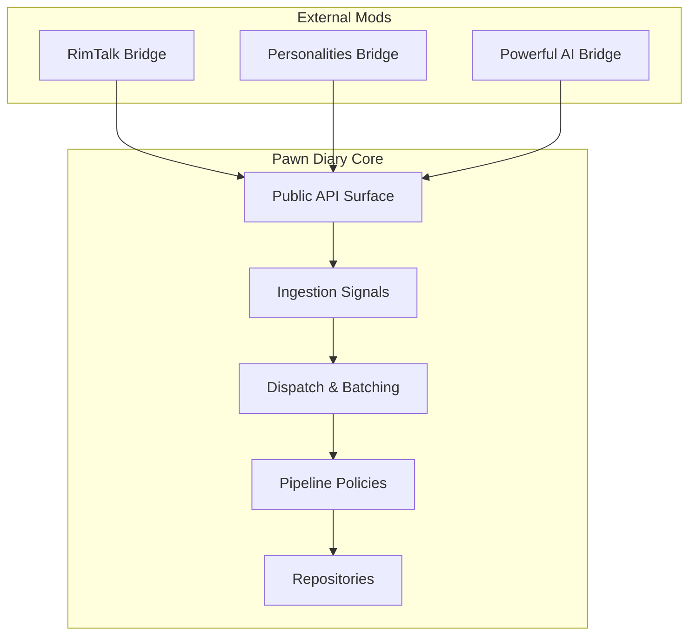

[No sources needed since this diagram shows conceptual workflow, not actual code structure]

## Core Components
- Public API surface exposes typed requests for submitting events, direct entries, prompt-based entries, and lane-scoped operations. It also provides snapshots for querying current state without blocking gameplay.
- Ingestion transforms incoming signals into normalized events consumed by the core.
- Dispatch coordinates lifecycle, batching windows, and budget enforcement.
- Pipeline applies policies for override arbitration, text decoration, retention, and response postprocessing.
- Bridges implement domain-specific synchronization such as persona mapping, conversation history sharing, and trait alignment.

Key responsibilities:
- Bidirectional flow: read snapshots and write events/entries via the API; push changes back through signals or lane imports.
- Conflict resolution: use override arbitration and lane identity to decide authoritative sources.
- Performance: batch updates, enforce budgets, deduplicate events, and limit memory footprint with retention plans.

**Section sources**
- [PawnDiaryApi.cs](../../../../../../Source/Integration/PawnDiaryApi.cs)
- [DiaryGameComponent.PublicApi.cs](../../../../../../Source/Core/DiaryGameComponent.PublicApi.cs)
- [DiaryGameComponent.Dispatch.cs](../../../../../../Source/Core/DiaryGameComponent.Dispatch.cs)
- [DiaryGameComponent.InteractionBatching.cs](../../../../../../Source/Core/DiaryGameComponent.InteractionBatching.cs)
- [DiaryGameComponent.TaleBatching.cs](../../../../../../Source/Core/DiaryGameComponent.TaleBatching.cs)
- [DiaryGameComponent.ExternalApiBudget.cs](../../../../../../Source/Core/DiaryGameComponent.ExternalApiBudget.cs)
- [DiaryGameComponent.IntegrationSnapshots.cs](../../../../../../Source/Core/DiaryGameComponent.IntegrationSnapshots.cs)
- [DiarySignal.cs](../../../../../../Source/Ingestion/DiarySignal.cs)
- [ExternalEventSignal.cs](../../../../../../Source/Ingestion/Sources/ExternalEventSignal.cs)
- [ExternalDirectEntrySignal.cs](../../../../../../Source/Ingestion/Sources/ExternalDirectEntrySignal.cs)
- [ApiEndpointPolicy.cs](../../../../../../Source/Pipeline/ApiEndpointPolicy.cs)
- [ExternalOverrideArbitration.cs](../../../../../../Source/Pipeline/ExternalOverrideArbitration.cs)
- [ExternalApiBudgetPolicy.cs](../../../../../../Source/Pipeline/ExternalApiBudgetPolicy.cs)

## Architecture Overview
The synchronization architecture separates concerns across layers:
- External API: request/response contracts and snapshot queries
- Ingestion: signal normalization and routing
- Core orchestration: dispatch, batching, budget control, and retention
- Pipeline: policy-driven transformations and persistence
- Bridges: domain-specific adapters using the API and signals

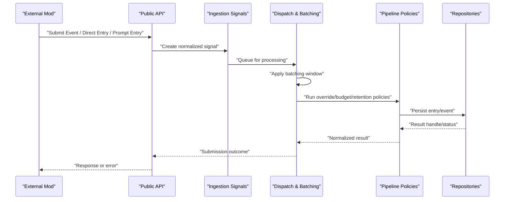

**Diagram sources**
- [PawnDiaryApi.cs](../../../../../../Source/Integration/PawnDiaryApi.cs)
- [ExternalEventRequest.cs](../../../../../../Source/Integration/ExternalEventRequest.cs)
- [ExternalDirectEntryRequest.cs](../../../../../../Source/Integration/ExternalDirectEntryRequest.cs)
- [ExternalPromptEntryRequest.cs](../../../../../../Source/Integration/ExternalPromptEntryRequest.cs)
- [ExternalEventSignal.cs](../../../../../../Source/Ingestion/Sources/ExternalEventSignal.cs)
- [ExternalDirectEntrySignal.cs](../../../../../../Source/Ingestion/Sources/ExternalDirectEntrySignal.cs)
- [DiaryGameComponent.Dispatch.cs](../../../../../../Source/Core/DiaryGameComponent.Dispatch.cs)
- [DiaryGameComponent.InteractionBatching.cs](../../../../../../Source/Core/DiaryGameComponent.InteractionBatching.cs)
- [DiaryGameComponent.TaleBatching.cs](../../../../../../Source/Core/DiaryGameComponent.TaleBatching.cs)
- [ExternalOverrideArbitration.cs](../../../../../../Source/Pipeline/ExternalOverrideArbitration.cs)
- [ExternalApiBudgetPolicy.cs](../../../../../../Source/Pipeline/ExternalApiBudgetPolicy.cs)
- [DiaryArchiveRepository.cs](../../../../../../Source/Core/DiaryArchiveRepository.cs)
- [DiaryEventRepository.cs](../../../../../../Source/Core/DiaryEventRepository.cs)

## Detailed Component Analysis

### Public API Surface and Request Contracts
The public API defines typed requests for:
- Submitting external events
- Creating direct diary entries
- Generating entries via prompts
- Lane-scoped operations and snapshots

These contracts ensure consistent payloads and enable strong typing for both inbound and outbound data.

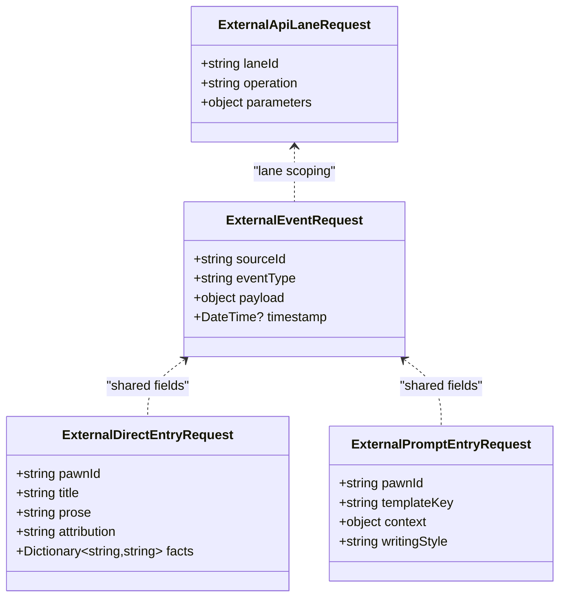

**Diagram sources**
- [ExternalEventRequest.cs](../../../../../../Source/Integration/ExternalEventRequest.cs)
- [ExternalDirectEntryRequest.cs](../../../../../../Source/Integration/ExternalDirectEntryRequest.cs)
- [ExternalPromptEntryRequest.cs](../../../../../../Source/Integration/ExternalPromptEntryRequest.cs)
- [ExternalApiLaneRequest.cs](../../../../../../Source/Integration/ExternalApiLaneRequest.cs)

**Section sources**
- [PawnDiaryApi.cs](../../../../../../Source/Integration/PawnDiaryApi.cs)
- [ExternalEventRequest.cs](../../../../../../Source/Integration/ExternalEventRequest.cs)
- [ExternalDirectEntryRequest.cs](../../../../../../Source/Integration/ExternalDirectEntryRequest.cs)
- [ExternalPromptEntryRequest.cs](../../../../../../Source/Integration/ExternalPromptEntryRequest.cs)
- [ExternalApiLaneRequest.cs](../../../../../../Source/Integration/ExternalApiLaneRequest.cs)

### Ingestion and Normalization
Incoming signals are normalized into internal representations before dispatch. Deduplication and expiry policies reduce redundant work and keep memory bounded.

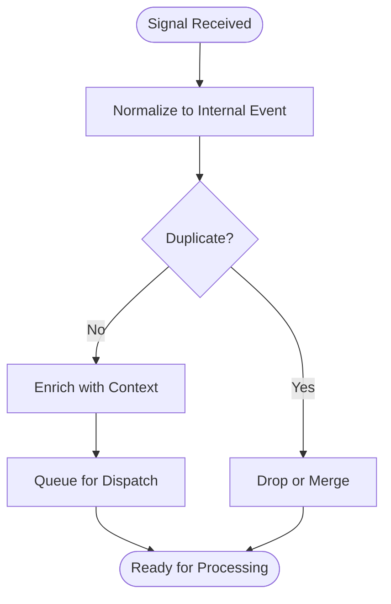

**Diagram sources**
- [DiarySignal.cs](../../../../../../Source/Ingestion/DiarySignal.cs)
- [DiaryEvents.cs](../../../../../../Source/Ingestion/DiaryEvents.cs)
- [ExternalEventSignal.cs](../../../../../../Source/Ingestion/Sources/ExternalEventSignal.cs)
- [ExternalDirectEntrySignal.cs](../../../../../../Source/Ingestion/Sources/ExternalDirectEntrySignal.cs)
- [GenericEventTypeDedup.cs](../../../../../../Source/Capture/GenericEventTypeDedup.cs)
- [RecentEventExpiry.cs](../../../../../../Source/Capture/RecentEventExpiry.cs)

**Section sources**
- [DiarySignal.cs](../../../../../../Source/Ingestion/DiarySignal.cs)
- [DiaryEvents.cs](../../../../../../Source/Ingestion/DiaryEvents.cs)
- [ExternalEventSignal.cs](../../../../../../Source/Ingestion/Sources/ExternalEventSignal.cs)
- [ExternalDirectEntrySignal.cs](../../../../../../Source/Ingestion/Sources/ExternalDirectEntrySignal.cs)
- [GenericEventTypeDedup.cs](../../../../../../Source/Capture/GenericEventTypeDedup.cs)
- [RecentEventExpiry.cs](../../../../../../Source/Capture/RecentEventExpiry.cs)

### Dispatch and Batching
Dispatch coordinates timing and grouping of operations to minimize overhead and avoid frame spikes. Interaction and tale batching provide dedicated windows for high-frequency updates.

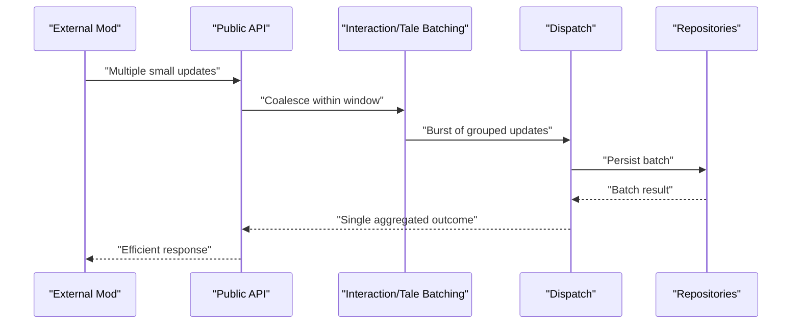

**Diagram sources**
- [DiaryGameComponent.Dispatch.cs](../../../../../../Source/Core/DiaryGameComponent.Dispatch.cs)
- [DiaryGameComponent.InteractionBatching.cs](../../../../../../Source/Core/DiaryGameComponent.InteractionBatching.cs)
- [DiaryGameComponent.TaleBatching.cs](../../../../../../Source/Core/DiaryGameComponent.TaleBatching.cs)
- [DiaryArchiveRepository.cs](../../../../../../Source/Core/DiaryArchiveRepository.cs)
- [DiaryEventRepository.cs](../../../../../../Source/Core/DiaryEventRepository.cs)

**Section sources**
- [DiaryGameComponent.Dispatch.cs](../../../../../../Source/Core/DiaryGameComponent.Dispatch.cs)
- [DiaryGameComponent.InteractionBatching.cs](../../../../../../Source/Core/DiaryGameComponent.InteractionBatching.cs)
- [DiaryGameComponent.TaleBatching.cs](../../../../../../Source/Core/DiaryGameComponent.TaleBatching.cs)

### Budget Enforcement and Rate Limiting
External API budget policies cap resource usage per tick/frame to prevent performance degradation.

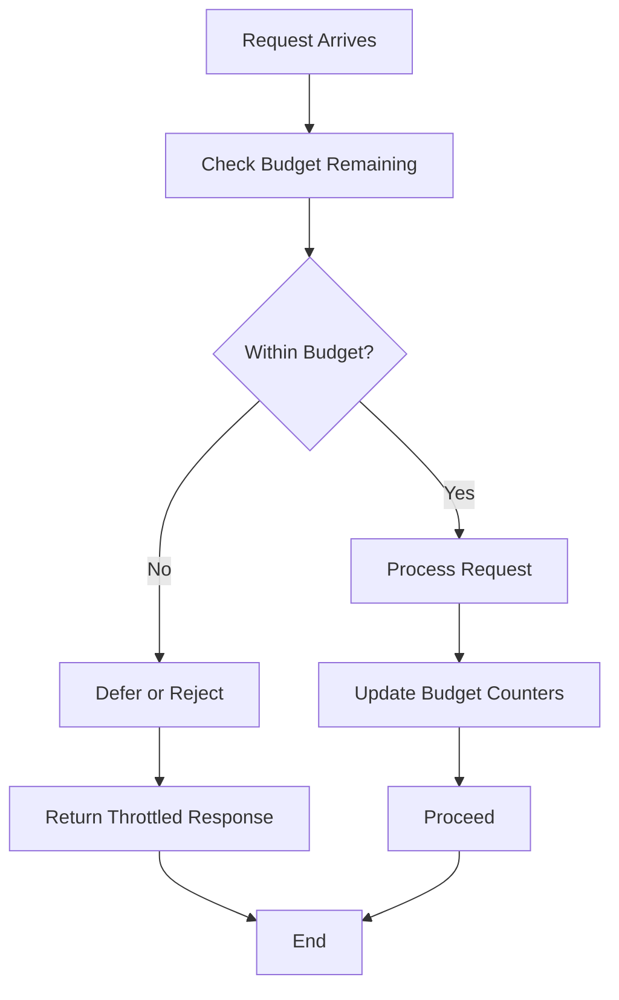

**Diagram sources**
- [DiaryGameComponent.ExternalApiBudget.cs](../../../../../../Source/Core/DiaryGameComponent.ExternalApiBudget.cs)
- [ExternalApiBudgetPolicy.cs](../../../../../../Source/Pipeline/ExternalApiBudgetPolicy.cs)

**Section sources**
- [DiaryGameComponent.ExternalApiBudget.cs](../../../../../../Source/Core/DiaryGameComponent.ExternalApiBudget.cs)
- [ExternalApiBudgetPolicy.cs](../../../../../../Source/Pipeline/ExternalApiBudgetPolicy.cs)

### Snapshot-Based Read Path
Read-heavy operations use snapshots to avoid live locks and expensive computations during gameplay.

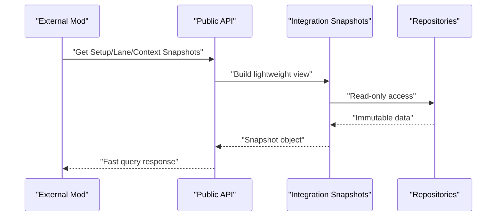

**Diagram sources**
- [DiaryGameComponent.IntegrationSnapshots.cs](../../../../../../Source/Core/DiaryGameComponent.IntegrationSnapshots.cs)
- [ExternalApiSetupSnapshot.cs](../../../../../../Source/Integration/DiaryApiSetupSnapshot.cs)
- [ExternalApiLaneSnapshot.cs](../../../../../../Source/Integration/DiaryApiLaneSnapshot.cs)
- [ExternalContextBundleSnapshot.cs](../../../../../../Source/Integration/DiaryContextBundleSnapshot.cs)
- [ExternalContextSnapshot.cs](../../../../../../Source/Integration/DiaryContextSnapshot.cs)
- [ExternalEntrySnapshot.cs](../../../../../../Source/Integration/DiaryEntrySnapshot.cs)
- [ExternalEntryStatsSnapshot.cs](../../../../../../Source/Integration/DiaryEntryStatsSnapshot.cs)
- [ExternalEntryStatusSnapshot.cs](../../../../../../Source/Integration/DiaryEntryStatusSnapshot.cs)
- [ExternalEntryTitleSnapshot.cs](../../../../../../Source/Integration/DiaryEntryTitleSnapshot.cs)
- [ExternalEventFilterSnapshot.cs](../../../../../../Source/Integration/DiaryEventFilterSnapshot.cs)
- [ExternalHealthSummarySnapshot.cs](../../../../../../Source/Integration/DiaryHealthSummarySnapshot.cs)
- [ExternalPawnSummarySnapshot.cs](../../../../../../Source/Integration/DiaryPawnSummarySnapshot.cs)
- [ExternalPromptEnchantmentCandidateSnapshot.cs](../../../../../../Source/Integration/DiaryPromptEnchantmentCandidateSnapshot.cs)
- [ExternalPromptPreviewSnapshot.cs](../../../../../../Source/Integration/DiaryPromptPreviewSnapshot.cs)
- [ExternalPsychotypeSnapshot.cs](../../../../../../Source/Integration/DiaryPsychotypeSnapshot.cs)
- [ExternalWritingStyleSnapshot.cs](../../../../../../Source/Integration/DiaryWritingStyleSnapshot.cs)

**Section sources**
- [DiaryGameComponent.IntegrationSnapshots.cs](../../../../../../Source/Core/DiaryGameComponent.IntegrationSnapshots.cs)
- [ExternalApiSetupSnapshot.cs](../../../../../../Source/Integration/DiaryApiSetupSnapshot.cs)
- [ExternalApiLaneSnapshot.cs](../../../../../../Source/Integration/DiaryApiLaneSnapshot.cs)
- [ExternalContextBundleSnapshot.cs](../../../../../../Source/Integration/DiaryContextBundleSnapshot.cs)
- [ExternalContextSnapshot.cs](../../../../../../Source/Integration/DiaryContextSnapshot.cs)
- [ExternalEntrySnapshot.cs](../../../../../../Source/Integration/DiaryEntrySnapshot.cs)
- [ExternalEntryStatsSnapshot.cs](../../../../../../Source/Integration/DiaryEntryStatsSnapshot.cs)
- [ExternalEntryStatusSnapshot.cs](../../../../../../Source/Integration/DiaryEntryStatusSnapshot.cs)
- [ExternalEntryTitleSnapshot.cs](../../../../../../Source/Integration/DiaryEntryTitleSnapshot.cs)
- [ExternalEventFilterSnapshot.cs](../../../../../../Source/Integration/DiaryEventFilterSnapshot.cs)
- [ExternalHealthSummarySnapshot.cs](../../../../../../Source/Integration/DiaryHealthSummarySnapshot.cs)
- [ExternalPawnSummarySnapshot.cs](../../../../../../Source/Integration/DiaryPawnSummarySnapshot.cs)
- [ExternalPromptEnchantmentCandidateSnapshot.cs](../../../../../../Source/Integration/DiaryPromptEnchantmentCandidateSnapshot.cs)
- [ExternalPromptPreviewSnapshot.cs](../../../../../../Source/Integration/DiaryPromptPreviewSnapshot.cs)
- [ExternalPsychotypeSnapshot.cs](../../../../../../Source/Integration/DiaryPsychotypeSnapshot.cs)
- [ExternalWritingStyleSnapshot.cs](../../../../../../Source/Integration/DiaryWritingStyleSnapshot.cs)

### Persona Synchronization (RimTalk Bridge)
The RimTalk bridge synchronizes persona-related data and conversation history between RimTalk and Pawn Diary. It uses targeted injectors to enrich context and maintains a tracker for recent interactions.

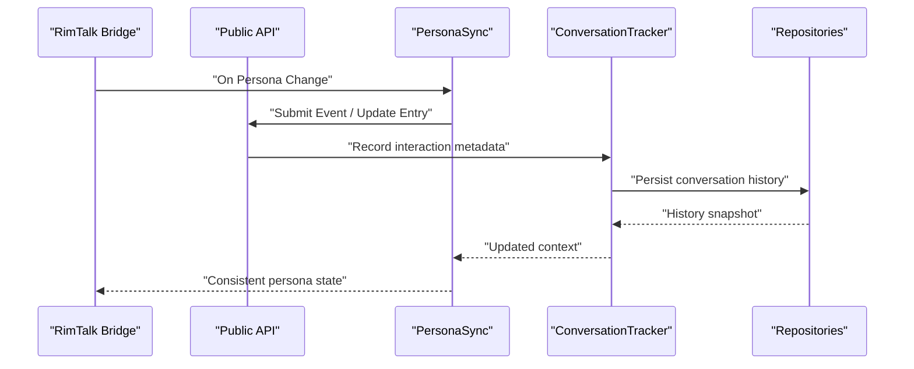

**Diagram sources**
- [PersonaSync.cs](../../../../../../integrations/PawnDiary.RimTalkBridge/Source/PersonaSync.cs)
- [ConversationTracker.cs](../../../../../../integrations/PawnDiary.RimTalkBridge/Source/ConversationTracker.cs)
- [ColonyContextInjector.cs](../../../../../../integrations/PawnDiary.RimTalkBridge/Source/ColonyContextInjector.cs)
- [DiaryContextInjector.cs](../../../../../../integrations/PawnDiary.RimTalkBridge/Source/DiaryContextInjector.cs)
- [ExternalEventRequest.cs](../../../../../../Source/Integration/ExternalEventRequest.cs)
- [ExternalDirectEntryRequest.cs](../../../../../../Source/Integration/ExternalDirectEntryRequest.cs)
- [DiaryEventRepository.cs](../../../../../../Source/Core/DiaryEventRepository.cs)

**Section sources**
- [PersonaSync.cs](../../../../../../integrations/PawnDiary.RimTalkBridge/Source/PersonaSync.cs)
- [ConversationTracker.cs](../../../../../../integrations/PawnDiary.RimTalkBridge/Source/ConversationTracker.cs)
- [ColonyContextInjector.cs](../../../../../../integrations/PawnDiary.RimTalkBridge/Source/ColonyContextInjector.cs)
- [DiaryContextInjector.cs](../../../../../../integrations/PawnDiary.RimTalkBridge/Source/DiaryContextInjector.cs)

### Personality Trait Mapping (Personalities Bridge)
The Personalities bridge maps personality constructs (e.g., Enneagram types) to Pawn Diary’s persona system, ensuring consistent trait representation across systems.

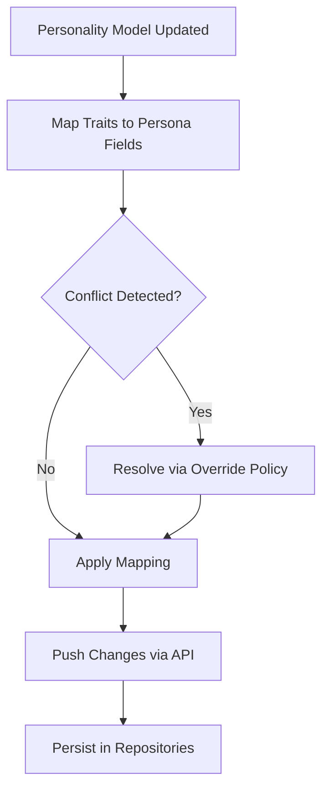

**Diagram sources**
- [EnneagramSync.cs](../../../../../../integrations/PawnDiary.PersonalitiesBridge/Source/EnneagramSync.cs)
- [Personalities123GameComponent.cs](../../../../../../integrations/PawnDiary.PersonalitiesBridge/Source/Personalities123GameComponent.cs)
- [ExternalOverrideArbitration.cs](../../../../../../Source/Pipeline/ExternalOverrideArbitration.cs)
- [ExternalEventRequest.cs](../../../../../../Source/Integration/ExternalEventRequest.cs)
- [DiaryEventRepository.cs](../../../../../../Source/Core/DiaryEventRepository.cs)

**Section sources**
- [EnneagramSync.cs](../../../../../../integrations/PawnDiary.PersonalitiesBridge/Source/EnneagramSync.cs)
- [Personalities123GameComponent.cs](../../../../../../integrations/PawnDiary.PersonalitiesBridge/Source/Personalities123GameComponent.cs)
- [ExternalOverrideArbitration.cs](../../../../../../Source/Pipeline/ExternalOverrideArbitration.cs)

### Reflection and State Sharing (Powerful AI Bridge)
The Powerful AI bridge reflects AI-generated content back into Pawn Diary, coordinating reflection cycles and maintaining coherence with existing entries.

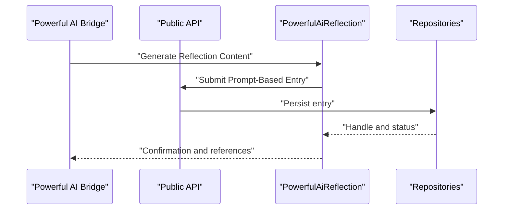

**Diagram sources**
- [PowerfulAiBridgeGameComponent.cs](../../../../../../integrations/PawnDiary.PowerfulAiBridge/Source/PowerfulAiBridgeGameComponent.cs)
- [PowerfulAiReflection.cs](../../../../../../integrations/PawnDiary.PowerfulAiBridge/Source/PowerfulAiReflection.cs)
- [ExternalPromptEntryRequest.cs](../../../../../../Source/Integration/ExternalPromptEntryRequest.cs)
- [DiaryArchiveRepository.cs](../../../../../../Source/Core/DiaryArchiveRepository.cs)

**Section sources**
- [PowerfulAiBridgeGameComponent.cs](../../../../../../integrations/PawnDiary.PowerfulAiBridge/Source/PowerfulAiBridgeGameComponent.cs)
- [PowerfulAiReflection.cs](../../../../../../integrations/PawnDiary.PowerfulAiBridge/Source/PowerfulAiReflection.cs)
- [ExternalPromptEntryRequest.cs](../../../../../../Source/Integration/ExternalPromptEntryRequest.cs)

### Real-Time Synchronization Strategies
- Use snapshots for frequent reads to avoid contention.
- Coalesce writes within batching windows to reduce overhead.
- Apply budget policies to throttle bursts and maintain steady performance.
- Employ deduplication and expiry to prevent redundant processing.

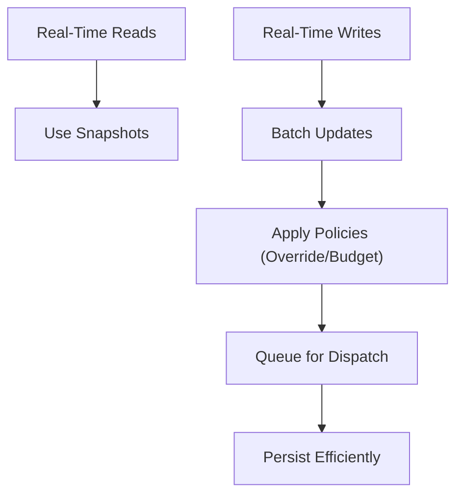

**Diagram sources**
- [DiaryGameComponent.IntegrationSnapshots.cs](../../../../../../Source/Core/DiaryGameComponent.IntegrationSnapshots.cs)
- [DiaryGameComponent.InteractionBatching.cs](../../../../../../Source/Core/DiaryGameComponent.InteractionBatching.cs)
- [DiaryGameComponent.TaleBatching.cs](../../../../../../Source/Core/DiaryGameComponent.TaleBatching.cs)
- [ExternalOverrideArbitration.cs](../../../../../../Source/Pipeline/ExternalOverrideArbitration.cs)
- [ExternalApiBudgetPolicy.cs](../../../../../../Source/Pipeline/ExternalApiBudgetPolicy.cs)

**Section sources**
- [DiaryGameComponent.IntegrationSnapshots.cs](../../../../../../Source/Core/DiaryGameComponent.IntegrationSnapshots.cs)
- [DiaryGameComponent.InteractionBatching.cs](../../../../../../Source/Core/DiaryGameComponent.InteractionBatching.cs)
- [DiaryGameComponent.TaleBatching.cs](../../../../../../Source/Core/DiaryGameComponent.TaleBatching.cs)
- [ExternalOverrideArbitration.cs](../../../../../../Source/Pipeline/ExternalOverrideArbitration.cs)
- [ExternalApiBudgetPolicy.cs](../../../../../../Source/Pipeline/ExternalApiBudgetPolicy.cs)

### Batch Updates and Change Detection
- Group related updates (interactions, tales) to amortize costs.
- Track deltas and apply only meaningful changes to minimize churn.
- Use lane identity to scope batches and avoid cross-lane interference.

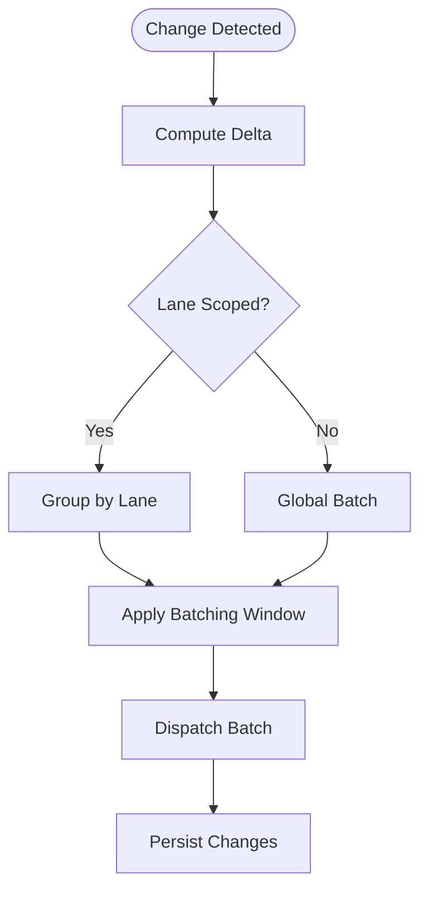

**Diagram sources**
- [ApiLaneIdentity.cs](../../../../../../Source/Pipeline/ApiLaneIdentity.cs)
- [ApiLaneImport.cs](../../../../../../Source/Pipeline/ApiLaneImport.cs)
- [ApiLaneSelector.cs](../../../../../../Source/Pipeline/ApiLaneSelector.cs)
- [DiaryGameComponent.InteractionBatching.cs](../../../../../../Source/Core/DiaryGameComponent.InteractionBatching.cs)
- [DiaryGameComponent.TaleBatching.cs](../../../../../../Source/Core/DiaryGameComponent.TaleBatching.cs)

**Section sources**
- [ApiLaneIdentity.cs](../../../../../../Source/Pipeline/ApiLaneIdentity.cs)
- [ApiLaneImport.cs](../../../../../../Source/Pipeline/ApiLaneImport.cs)
- [ApiLaneSelector.cs](../../../../../../Source/Pipeline/ApiLaneSelector.cs)
- [DiaryGameComponent.InteractionBatching.cs](../../../../../../Source/Core/DiaryGameComponent.InteractionBatching.cs)
- [DiaryGameComponent.TaleBatching.cs](../../../../../../Source/Core/DiaryGameComponent.TaleBatching.cs)

### State Conflict Resolution Strategies
- Override arbitration determines authoritative sources when multiple mods attempt conflicting updates.
- Lane identity isolates scopes to reduce collisions.
- Postprocessors normalize outputs and reconcile differences.

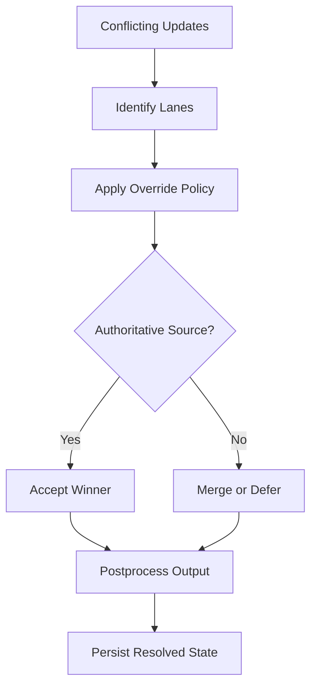

**Diagram sources**
- [ExternalOverrideArbitration.cs](../../../../../../Source/Pipeline/ExternalOverrideArbitration.cs)
- [ApiLaneIdentity.cs](../../../../../../Source/Pipeline/ApiLaneIdentity.cs)
- [DiaryResponsePostprocessor.cs](../../../../../../Source/Pipeline/DiaryResponsePostprocessor.cs)

**Section sources**
- [ExternalOverrideArbitration.cs](../../../../../../Source/Pipeline/ExternalOverrideArbitration.cs)
- [ApiLaneIdentity.cs](../../../../../../Source/Pipeline/ApiLaneIdentity.cs)
- [DiaryResponsePostprocessor.cs](../../../../../../Source/Pipeline/DiaryResponsePostprocessor.cs)

## Dependency Analysis
The following diagram highlights key dependencies among API, ingestion, dispatch, and pipeline components.

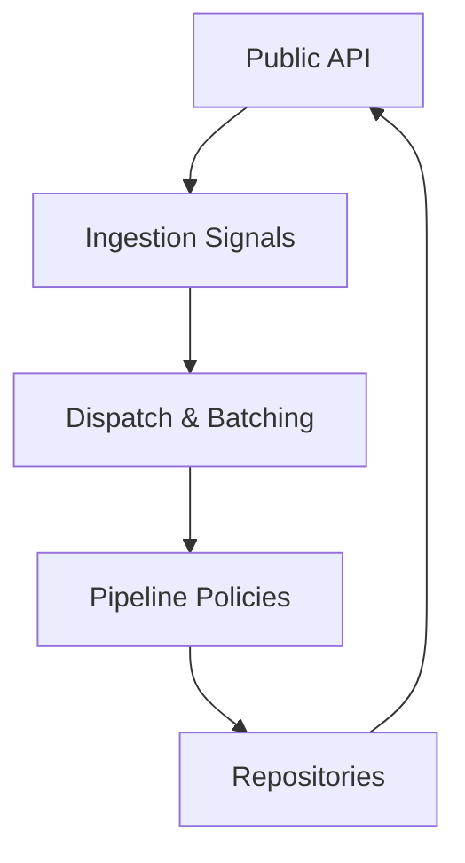

**Diagram sources**
- [PawnDiaryApi.cs](../../../../../../Source/Integration/PawnDiaryApi.cs)
- [DiarySignal.cs](../../../../../../Source/Ingestion/DiarySignal.cs)
- [DiaryGameComponent.Dispatch.cs](../../../../../../Source/Core/DiaryGameComponent.Dispatch.cs)
- [ApiEndpointPolicy.cs](../../../../../../Source/Pipeline/ApiEndpointPolicy.cs)
- [DiaryArchiveRepository.cs](../../../../../../Source/Core/DiaryArchiveRepository.cs)
- [DiaryEventRepository.cs](../../../../../../Source/Core/DiaryEventRepository.cs)

**Section sources**
- [PawnDiaryApi.cs](../../../../../../Source/Integration/PawnDiaryApi.cs)
- [DiarySignal.cs](../../../../../../Source/Ingestion/DiarySignal.cs)
- [DiaryGameComponent.Dispatch.cs](../../../../../../Source/Core/DiaryGameComponent.Dispatch.cs)
- [ApiEndpointPolicy.cs](../../../../../../Source/Pipeline/ApiEndpointPolicy.cs)
- [DiaryArchiveRepository.cs](../../../../../../Source/Core/DiaryArchiveRepository.cs)
- [DiaryEventRepository.cs](../../../../../../Source/Core/DiaryEventRepository.cs)

## Performance Considerations
- Prefer snapshot reads to avoid live locks and heavy computation during gameplay.
- Batch updates to reduce overhead and smooth frame pacing.
- Enforce external API budgets to prevent spikes and maintain responsiveness.
- Use deduplication and expiry to limit redundant processing and memory growth.
- Scope operations by lane identity to minimize cross-mod interference.

[No sources needed since this section provides general guidance]

## Troubleshooting Guide
Common issues and resolutions:
- Data inconsistency: verify override arbitration rules and lane scoping; ensure deterministic ordering of updates.
- Race conditions: rely on batching windows and snapshot reads; avoid direct mutation of shared state outside the API.
- Memory pressure: tune retention plans and archive compaction; monitor budget counters and adjust thresholds.
- Stale context: refresh snapshots periodically; invalidate caches when relevant entries change.

**Section sources**
- [ExternalOverrideArbitration.cs](../../../../../../Source/Pipeline/ExternalOverrideArbitration.cs)
- [DiaryRetentionPlan.cs](../../../../../../Source/Pipeline/DiaryRetentionPlan.cs)
- [DiaryArchiveCompactionPlanner.cs](../../../../../../Source/Pipeline/DiaryArchiveCompactionPlanner.cs)
- [DiaryGameComponent.ExternalApiBudget.cs](../../../../../../Source/Core/DiaryGameComponent.ExternalApiBudget.cs)
- [DiaryGameComponent.IntegrationSnapshots.cs](../../../../../../Source/Core/DiaryGameComponent.IntegrationSnapshots.cs)

## Conclusion
Robust synchronization between Pawn Diary and external mods hinges on clear boundaries (API, ingestion, dispatch, pipeline), disciplined batching and budgeting, and explicit conflict resolution strategies. Bridges like RimTalk, Personalities, and Powerful AI demonstrate practical patterns for persona sync, conversation history sharing, and trait mapping. By leveraging snapshots, lanes, and policies, mod authors can achieve consistent, performant, and scalable integrations.

[No sources needed since this section summarizes without analyzing specific files]

## Appendices

### Concrete Examples from Existing Bridges
- Persona synchronization: see persona sync and conversation tracking components.
- Conversation history sharing: see colony and diary context injectors.
- Personality trait mapping: see ennea-mapping and game component integration.

**Section sources**
- [PersonaSync.cs](../../../../../../integrations/PawnDiary.RimTalkBridge/Source/PersonaSync.cs)
- [ConversationTracker.cs](../../../../../../integrations/PawnDiary.RimTalkBridge/Source/ConversationTracker.cs)
- [ColonyContextInjector.cs](../../../../../../integrations/PawnDiary.RimTalkBridge/Source/ColonyContextInjector.cs)
- [DiaryContextInjector.cs](../../../../../../integrations/PawnDiary.RimTalkBridge/Source/DiaryContextInjector.cs)
- [EnneagramSync.cs](../../../../../../integrations/PawnDiary.PersonalitiesBridge/Source/EnneagramSync.cs)
- [Personalities123GameComponent.cs](../../../../../../integrations/PawnDiary.PersonalitiesBridge/Source/Personalities123GameComponent.cs)
- [PowerfulAiBridgeGameComponent.cs](../../../../../../integrations/PawnDiary.PowerfulAiBridge/Source/PowerfulAiBridgeGameComponent.cs)
- [PowerfulAiReflection.cs](../../../../../../integrations/PawnDiary.PowerfulAiBridge/Source/PowerfulAiReflection.cs)
