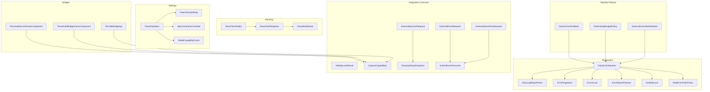
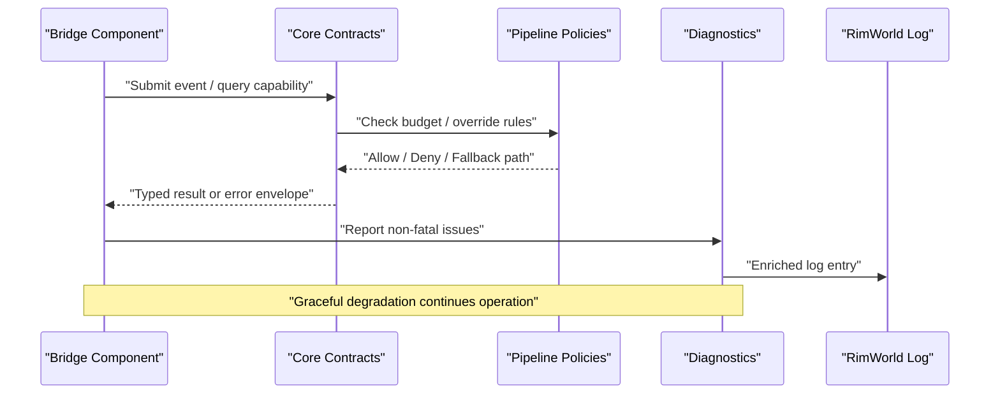
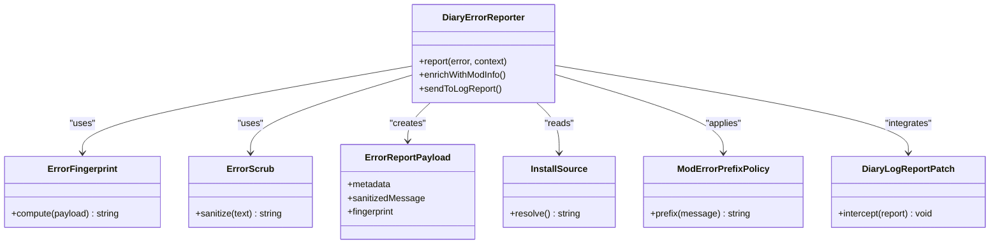
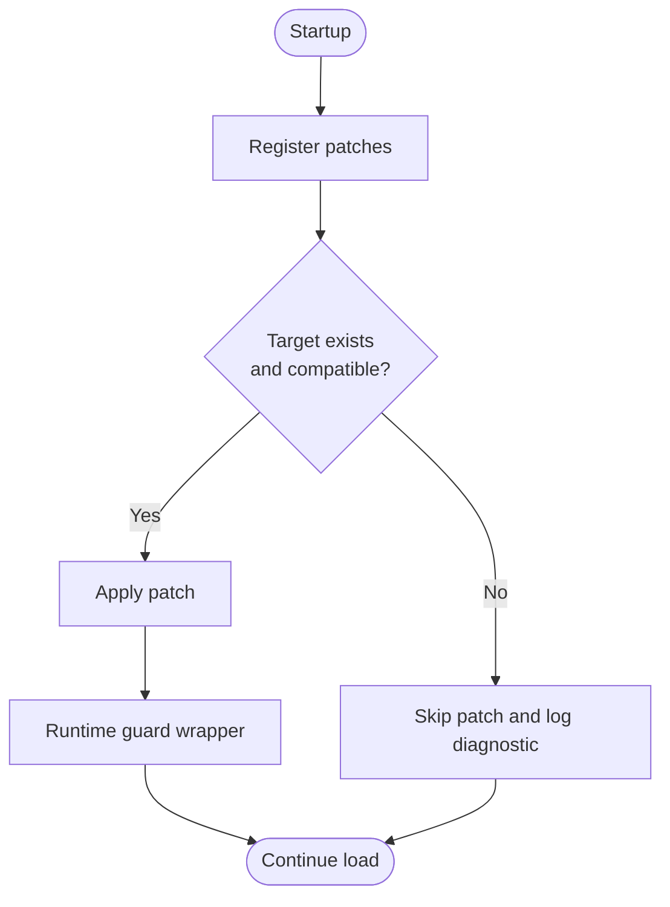
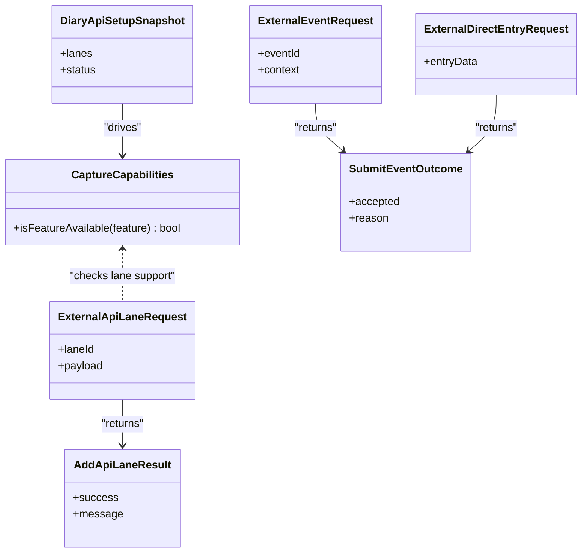
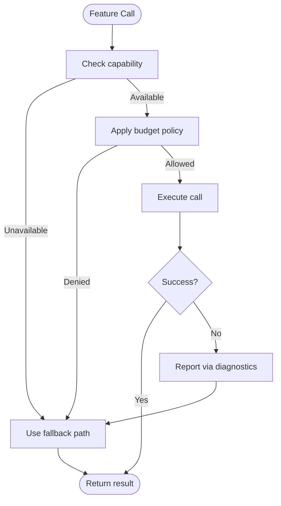
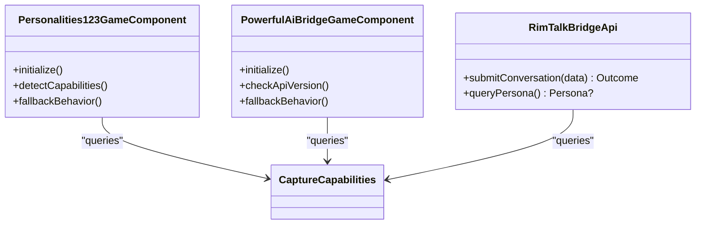
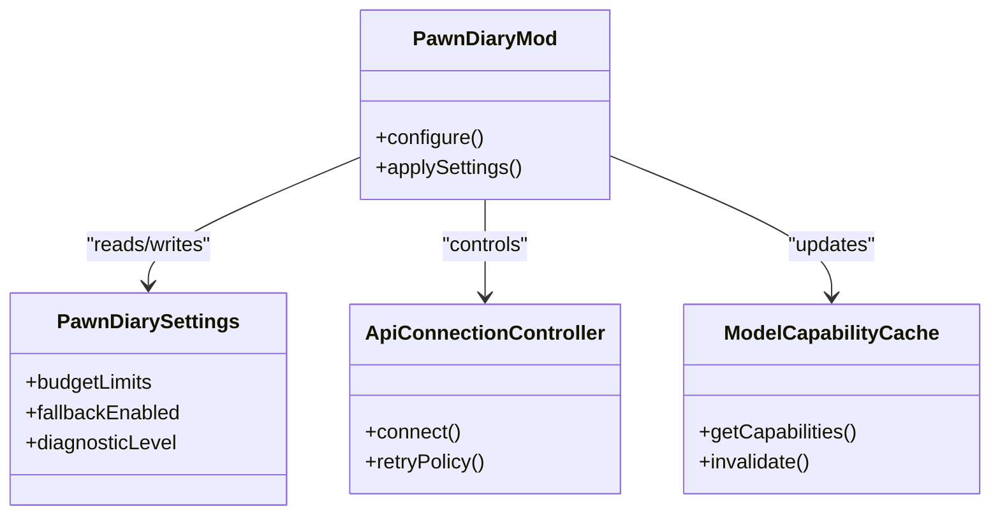
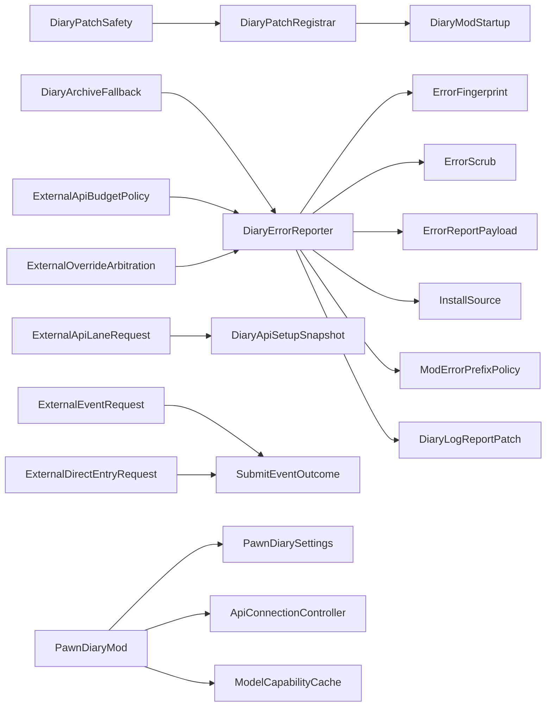

# Error Handling & Graceful Degradation

- [DiaryErrorReporter.cs](../../../../../../Source/Diagnostics/DiaryErrorReporter.cs)
- [DiaryLogReportPatch.cs](../../../../../../Source/Diagnostics/DiaryLogReportPatch.cs)
- [ErrorFingerprint.cs](../../../../../../Source/Diagnostics/Pure/ErrorFingerprint.cs)
- [ErrorReportPayload.cs](../../../../../../Source/Diagnostics/Pure/ErrorReportPayload.cs)
- [ErrorScrub.cs](../../../../../../Source/Diagnostics/Pure/ErrorScrub.cs)
- [InstallSource.cs](../../../../../../Source/Diagnostics/Pure/InstallSource.cs)
- [ModErrorPrefixPolicy.cs](../../../../../../Source/Diagnostics/Pure/ModErrorPrefixPolicy.cs)
- [DiaryPatchSafety.cs](../../../../../../Source/Patches/DiaryPatchSafety.cs)
- [DiaryPatchRegistrar.cs](../../../../../../Source/Patches/DiaryPatchRegistrar.cs)
- [DiaryModStartup.cs](../../../../../../Source/Patches/DiaryModStartup.cs)
- [ExternalApiLaneRequest.cs](../../../../../../Source/Integration/ExternalApiLaneRequest.cs)
- [AddApiLaneResult.cs](../../../../../../Source/Integration/AddApiLaneResult.cs)
- [DiaryApiSetupSnapshot.cs](../../../../../../Source/Integration/DiaryApiSetupSnapshot.cs)
- [CaptureCapabilities.cs](../../../../../../Source/Integration/CaptureCapabilities.cs)
- [ExternalEventRequest.cs](../../../../../../Source/Integration/ExternalEventRequest.cs)
- [ExternalDirectEntryRequest.cs](../../../../../../Source/Integration/ExternalDirectEntryRequest.cs)
- [SubmitEventOutcome.cs](../../../../../../Source/Integration/SubmitEventOutcome.cs)
- [DiaryArchiveFallback.cs](../../../../../../Source/Pipeline/DiaryArchiveFallback.cs)
- [ExternalApiBudgetPolicy.cs](../../../../../../Source/Pipeline/ExternalApiBudgetPolicy.cs)
- [ExternalOverrideArbitration.cs](../../../../../../Source/Pipeline/ExternalOverrideArbitration.cs)
- [PawnDiaryMod.cs](../../../../../../Source/Settings/PawnDiaryMod.cs)
- [PawnDiarySettings.cs](../../../../../../Source/Settings/PawnDiarySettings.cs)
- [ApiConnectionController.cs](../../../../../../Source/Settings/ApiConnectionController.cs)
- [ModelCapabilityCache.cs](../../../../../../Source/Settings/ModelCapabilityCache.cs)
- [Personalities123GameComponent.cs](../../../../../../integrations/PawnDiary.PersonalitiesBridge/Source/Personalities123GameComponent.cs)
- [PowerfulAiBridgeGameComponent.cs](../../../../../../integrations/PawnDiary.PowerfulAiBridge/Source/PowerfulAiBridgeGameComponent.cs)
- [RimTalkBridgeApi.cs](../../../../../../integrations/PawnDiary.RimTalkBridge/Source/PawnDiaryRimTalkBridgeApi.cs)
## Table of Contents
1. [Introduction](#introduction)
2. [Project Structure](#project-structure)
3. [Core Components](#core-components)
4. [Architecture Overview](#architecture-overview)
5. [Detailed Component Analysis](#detailed-component-analysis)
6. [Dependency Analysis](#dependency-analysis)
7. [Performance Considerations](#performance-considerations)
8. [Troubleshooting Guide](#troubleshooting-guide)
9. [Conclusion](#conclusion)
10. [Appendices](#appendices)

## Introduction
This document explains error handling strategies and graceful degradation patterns used across the mod’s core and bridge implementations. It focuses on exception handling best practices, error reporting mechanisms, fallback strategies when features are unavailable, safe patching, version compatibility checks, feature detection, handling missing dependencies and API changes, logging and diagnostics, user-friendly messages, and stability guidance for different RimWorld versions and mod configurations.

## Project Structure
The repository organizes error handling and resilience into focused areas:
- Diagnostics: centralized error reporting, scrubbing, fingerprinting, and log integration
- Patch safety: robust patch registration and runtime guards
- Integration contracts: typed requests/responses and capability snapshots to decouple bridges from core
- Pipeline policies: budgeting, override arbitration, and archive fallbacks
- Settings: connection control, model capabilities, and mod-level toggles
- Bridges: per-integration components that implement feature detection and safe calls



**Diagram sources**
- [DiaryErrorReporter.cs](../../../../../../Source/Diagnostics/DiaryErrorReporter.cs)
- [ErrorFingerprint.cs](../../../../../../Source/Diagnostics/Pure/ErrorFingerprint.cs)
- [ErrorScrub.cs](../../../../../../Source/Diagnostics/Pure/ErrorScrub.cs)
- [ErrorReportPayload.cs](../../../../../../Source/Diagnostics/Pure/ErrorReportPayload.cs)
- [InstallSource.cs](../../../../../../Source/Diagnostics/Pure/InstallSource.cs)
- [ModErrorPrefixPolicy.cs](../../../../../../Source/Diagnostics/Pure/ModErrorPrefixPolicy.cs)
- [DiaryLogReportPatch.cs](../../../../../../Source/Diagnostics/DiaryLogReportPatch.cs)
- [DiaryPatchSafety.cs](../../../../../../Source/Patches/DiaryPatchSafety.cs)
- [DiaryPatchRegistrar.cs](../../../../../../Source/Patches/DiaryPatchRegistrar.cs)
- [DiaryModStartup.cs](../../../../../../Source/Patches/DiaryModStartup.cs)
- [ExternalApiLaneRequest.cs](../../../../../../Source/Integration/ExternalApiLaneRequest.cs)
- [AddApiLaneResult.cs](../../../../../../Source/Integration/AddApiLaneResult.cs)
- [DiaryApiSetupSnapshot.cs](../../../../../../Source/Integration/DiaryApiSetupSnapshot.cs)
- [CaptureCapabilities.cs](../../../../../../Source/Integration/CaptureCapabilities.cs)
- [ExternalEventRequest.cs](../../../../../../Source/Integration/ExternalEventRequest.cs)
- [ExternalDirectEntryRequest.cs](../../../../../../Source/Integration/ExternalDirectEntryRequest.cs)
- [SubmitEventOutcome.cs](../../../../../../Source/Integration/SubmitEventOutcome.cs)
- [DiaryArchiveFallback.cs](../../../../../../Source/Pipeline/DiaryArchiveFallback.cs)
- [ExternalApiBudgetPolicy.cs](../../../../../../Source/Pipeline/ExternalApiBudgetPolicy.cs)
- [ExternalOverrideArbitration.cs](../../../../../../Source/Pipeline/ExternalOverrideArbitration.cs)
- [PawnDiaryMod.cs](../../../../../../Source/Settings/PawnDiaryMod.cs)
- [PawnDiarySettings.cs](../../../../../../Source/Settings/PawnDiarySettings.cs)
- [ApiConnectionController.cs](../../../../../../Source/Settings/ApiConnectionController.cs)
- [ModelCapabilityCache.cs](../../../../../../Source/Settings/ModelCapabilityCache.cs)
- [Personalities123GameComponent.cs](../../../../../../integrations/PawnDiary.PersonalitiesBridge/Source/Personalities123GameComponent.cs)
- [PowerfulAiBridgeGameComponent.cs](../../../../../../integrations/PawnDiary.PowerfulAiBridge/Source/PowerfulAiBridgeGameComponent.cs)
- [RimTalkBridgeApi.cs](../../../../../../integrations/PawnDiary.RimTalkBridge/Source/PawnDiaryRimTalkBridgeApi.cs)

**Section sources**
- [DiaryErrorReporter.cs](../../../../../../Source/Diagnostics/DiaryErrorReporter.cs)
- [DiaryPatchSafety.cs](../../../../../../Source/Patches/DiaryPatchSafety.cs)
- [ExternalApiLaneRequest.cs](../../../../../../Source/Integration/ExternalApiLaneRequest.cs)
- [DiaryArchiveFallback.cs](../../../../../../Source/Pipeline/DiaryArchiveFallback.cs)
- [ExternalApiBudgetPolicy.cs](../../../../../../Source/Pipeline/ExternalApiBudgetPolicy.cs)
- [PawnDiaryMod.cs](../../../../../../Source/Settings/PawnDiaryMod.cs)
- [Personalities123GameComponent.cs](../../../../../../integrations/PawnDiary.PersonalitiesBridge/Source/Personalities123GameComponent.cs)
- [PowerfulAiBridgeGameComponent.cs](../../../../../../integrations/PawnDiary.PowerfulAiBridge/Source/PowerfulAiBridgeGameComponent.cs)
- [RimTalkBridgeApi.cs](../../../../../../integrations/PawnDiary.RimTalkBridge/Source/PawnDiaryRimTalkBridgeApi.cs)

## Core Components
- Diagnostics subsystem centralizes error capture, sanitization, fingerprinting, and reporting. It integrates with the game’s log report pipeline and enriches reports with install source and mod prefix context.
- Patch safety layer ensures patches are registered safely, with guards against incompatible targets and runtime failures.
- Integration contracts define typed request/response types and capability snapshots so bridges can detect available features without direct coupling.
- Pipeline policies enforce budgets, arbitrate overrides, and provide archive fallbacks when generation or external services fail.
- Settings expose runtime controls for connections, capabilities, and behavior toggles.
- Bridge components implement feature detection and safe calls to third-party mods, falling back gracefully when APIs are missing or changed.

**Section sources**
- [DiaryErrorReporter.cs](../../../../../../Source/Diagnostics/DiaryErrorReporter.cs)
- [DiaryPatchSafety.cs](../../../../../../Source/Patches/DiaryPatchSafety.cs)
- [ExternalApiLaneRequest.cs](../../../../../../Source/Integration/ExternalApiLaneRequest.cs)
- [DiaryArchiveFallback.cs](../../../../../../Source/Pipeline/DiaryArchiveFallback.cs)
- [ExternalApiBudgetPolicy.cs](../../../../../../Source/Pipeline/ExternalApiBudgetPolicy.cs)
- [PawnDiaryMod.cs](../../../../../../Source/Settings/PawnDiaryMod.cs)
- [Personalities123GameComponent.cs](../../../../../../integrations/PawnDiary.PersonalitiesBridge/Source/Personalities123GameComponent.cs)
- [PowerfulAiBridgeGameComponent.cs](../../../../../../integrations/PawnDiary.PowerfulAiBridge/Source/PowerfulAiBridgeGameComponent.cs)
- [RimTalkBridgeApi.cs](../../../../../../integrations/PawnDiary.RimTalkBridge/Source/PawnDiaryRimTalkBridgeApi.cs)

## Architecture Overview
The system separates concerns between diagnostics, patching, integration contracts, pipeline policies, settings, and bridges. Bridges call into core via typed contracts; core enforces budgets and fallbacks; diagnostics capture and sanitize errors; settings control runtime behavior.



**Diagram sources**
- [ExternalApiLaneRequest.cs](../../../../../../Source/Integration/ExternalApiLaneRequest.cs)
- [ExternalEventRequest.cs](../../../../../../Source/Integration/ExternalEventRequest.cs)
- [ExternalDirectEntryRequest.cs](../../../../../../Source/Integration/ExternalDirectEntryRequest.cs)
- [ExternalApiBudgetPolicy.cs](../../../../../../Source/Pipeline/ExternalApiBudgetPolicy.cs)
- [ExternalOverrideArbitration.cs](../../../../../../Source/Pipeline/ExternalOverrideArbitration.cs)
- [DiaryArchiveFallback.cs](../../../../../../Source/Pipeline/DiaryArchiveFallback.cs)
- [DiaryErrorReporter.cs](../../../../../../Source/Diagnostics/DiaryErrorReporter.cs)
- [DiaryLogReportPatch.cs](../../../../../../Source/Diagnostics/DiaryLogReportPatch.cs)

## Detailed Component Analysis

### Diagnostics Subsystem
The diagnostics subsystem provides:
- Centralized error reporting with enrichment (mod prefix, install source)
- Scrubbing of sensitive data before persistence or transmission
- Stable fingerprints for deduplication and triage
- Integration with the game’s log report pipeline



**Diagram sources**
- [DiaryErrorReporter.cs](../../../../../../Source/Diagnostics/DiaryErrorReporter.cs)
- [ErrorFingerprint.cs](../../../../../../Source/Diagnostics/Pure/ErrorFingerprint.cs)
- [ErrorScrub.cs](../../../../../../Source/Diagnostics/Pure/ErrorScrub.cs)
- [ErrorReportPayload.cs](../../../../../../Source/Diagnostics/Pure/ErrorReportPayload.cs)
- [InstallSource.cs](../../../../../../Source/Diagnostics/Pure/InstallSource.cs)
- [ModErrorPrefixPolicy.cs](../../../../../../Source/Diagnostics/Pure/ModErrorPrefixPolicy.cs)
- [DiaryLogReportPatch.cs](../../../../../../Source/Diagnostics/DiaryLogReportPatch.cs)

Best practices illustrated by this subsystem:
- Always sanitize before persisting or transmitting
- Attach stable identifiers (fingerprints) for deduplication
- Enrich with mod context for faster triage
- Integrate with the game’s log report pipeline for visibility

**Section sources**
- [DiaryErrorReporter.cs](../../../../../../Source/Diagnostics/DiaryErrorReporter.cs)
- [ErrorFingerprint.cs](../../../../../../Source/Diagnostics/Pure/ErrorFingerprint.cs)
- [ErrorScrub.cs](../../../../../../Source/Diagnostics/Pure/ErrorScrub.cs)
- [ErrorReportPayload.cs](../../../../../../Source/Diagnostics/Pure/ErrorReportPayload.cs)
- [InstallSource.cs](../../../../../../Source/Diagnostics/Pure/InstallSource.cs)
- [ModErrorPrefixPolicy.cs](../../../../../../Source/Diagnostics/Pure/ModErrorPrefixPolicy.cs)
- [DiaryLogReportPatch.cs](../../../../../../Source/Diagnostics/DiaryLogReportPatch.cs)

### Safe Patching and Version Compatibility
Safe patching is enforced through a registrar and safety utilities:
- Registrar coordinates patch application and lifecycle
- Safety utilities validate targets and guard against runtime exceptions
- Startup orchestrates initialization order and recovery paths



**Diagram sources**
- [DiaryPatchRegistrar.cs](../../../../../../Source/Patches/DiaryPatchRegistrar.cs)
- [DiaryPatchSafety.cs](../../../../../../Source/Patches/DiaryPatchSafety.cs)
- [DiaryModStartup.cs](../../../../../../Source/Patches/DiaryModStartup.cs)

Guidelines:
- Always validate target availability before patching
- Wrap patched calls in try/catch with minimal scope
- Provide clear diagnostics when skipping patches due to incompatibility
- Keep patch logic small and isolated to reduce risk

**Section sources**
- [DiaryPatchRegistrar.cs](../../../../../../Source/Patches/DiaryPatchRegistrar.cs)
- [DiaryPatchSafety.cs](../../../../../../Source/Patches/DiaryPatchSafety.cs)
- [DiaryModStartup.cs](../../../../../../Source/Patches/DiaryModStartup.cs)

### Feature Detection and Capability Snapshots
Bridges should avoid hard dependencies on other mods. Instead:
- Use typed capability snapshots to detect available features
- Request operations via typed requests and receive typed outcomes
- Fall back to local-only behavior when features are unavailable



**Diagram sources**
- [CaptureCapabilities.cs](../../../../../../Source/Integration/CaptureCapabilities.cs)
- [ExternalApiLaneRequest.cs](../../../../../../Source/Integration/ExternalApiLaneRequest.cs)
- [AddApiLaneResult.cs](../../../../../../Source/Integration/AddApiLaneResult.cs)
- [DiaryApiSetupSnapshot.cs](../../../../../../Source/Integration/DiaryApiSetupSnapshot.cs)
- [ExternalEventRequest.cs](../../../../../../Source/Integration/ExternalEventRequest.cs)
- [ExternalDirectEntryRequest.cs](../../../../../../Source/Integration/ExternalDirectEntryRequest.cs)
- [SubmitEventOutcome.cs](../../../../../../Source/Integration/SubmitEventOutcome.cs)

Implementation tips:
- Query capabilities once at startup and cache results
- Gate optional integrations behind capability checks
- Return explicit reasons for rejection in outcomes

**Section sources**
- [CaptureCapabilities.cs](../../../../../../Source/Integration/CaptureCapabilities.cs)
- [ExternalApiLaneRequest.cs](../../../../../../Source/Integration/ExternalApiLaneRequest.cs)
- [AddApiLaneResult.cs](../../../../../../Source/Integration/AddApiLaneResult.cs)
- [DiaryApiSetupSnapshot.cs](../../../../../../Source/Integration/DiaryApiSetupSnapshot.cs)
- [ExternalEventRequest.cs](../../../../../../Source/Integration/ExternalEventRequest.cs)
- [ExternalDirectEntryRequest.cs](../../../../../../Source/Integration/ExternalDirectEntryRequest.cs)
- [SubmitEventOutcome.cs](../../../../../../Source/Integration/SubmitEventOutcome.cs)

### Graceful Degradation and Fallback Strategies
When external services or features are unavailable:
- Budget policies throttle or deny requests under pressure
- Override arbitration selects safe defaults
- Archive fallback preserves continuity using stored data



**Diagram sources**
- [ExternalApiBudgetPolicy.cs](../../../../../../Source/Pipeline/ExternalApiBudgetPolicy.cs)
- [ExternalOverrideArbitration.cs](../../../../../../Source/Pipeline/ExternalOverrideArbitration.cs)
- [DiaryArchiveFallback.cs](../../../../../../Source/Pipeline/DiaryArchiveFallback.cs)
- [DiaryErrorReporter.cs](../../../../../../Source/Diagnostics/DiaryErrorReporter.cs)

Practical examples:
- If an external AI service is down, generate entries locally using cached context
- If a bridge mod is missing, disable its features and continue with default persona logic
- If network calls fail, retry with backoff and fall back to last known good state

**Section sources**
- [ExternalApiBudgetPolicy.cs](../../../../../../Source/Pipeline/ExternalApiBudgetPolicy.cs)
- [ExternalOverrideArbitration.cs](../../../../../../Source/Pipeline/ExternalOverrideArbitration.cs)
- [DiaryArchiveFallback.cs](../../../../../../Source/Pipeline/DiaryArchiveFallback.cs)
- [DiaryErrorReporter.cs](../../../../../../Source/Diagnostics/DiaryErrorReporter.cs)

### Logging, Diagnostics, and User-Friendly Messages
- Use the diagnostics subsystem to attach mod context and sanitized payloads
- Integrate with the game’s log report pipeline for consistent visibility
- Prefer actionable messages for users while preserving detailed logs for developers

```mermaid
sequenceDiagram
participant Caller as "Caller"
participant Reporter as "DiaryErrorReporter"
participant Scrubber as "ErrorScrub"
participant Finger as "ErrorFingerprint"
participant Log as "Game Log"
Caller->>Reporter : "report(error)"
Reporter->>Scrubber : "sanitize(error.message)"
Reporter->>Finger : "compute fingerprint"
Reporter->>Log : "write enriched entry"
Note over Reporter,Log : "User sees friendly message; dev sees details"
```

**Diagram sources**
- [DiaryErrorReporter.cs](../../../../../../Source/Diagnostics/DiaryErrorReporter.cs)
- [ErrorScrub.cs](../../../../../../Source/Diagnostics/Pure/ErrorScrub.cs)
- [ErrorFingerprint.cs](../../../../../../Source/Diagnostics/Pure/ErrorFingerprint.cs)
- [DiaryLogReportPatch.cs](../../../../../../Source/Diagnostics/DiaryLogReportPatch.cs)

Guidelines:
- Separate user-facing messages from developer logs
- Include stable identifiers (fingerprints) for issue tracking
- Avoid leaking secrets or player data in logs

**Section sources**
- [DiaryErrorReporter.cs](../../../../../../Source/Diagnostics/DiaryErrorReporter.cs)
- [ErrorScrub.cs](../../../../../../Source/Diagnostics/Pure/ErrorScrub.cs)
- [ErrorFingerprint.cs](../../../../../../Source/Diagnostics/Pure/ErrorFingerprint.cs)
- [DiaryLogReportPatch.cs](../../../../../../Source/Diagnostics/DiaryLogReportPatch.cs)

### Bridge Implementation Patterns
Bridges should:
- Detect presence and capabilities of target mods
- Use typed requests and outcomes to communicate with core
- Handle missing dependencies and API changes gracefully
- Respect budgets and fallback paths

Examples:
- Personalities bridge component initializes only if required classes exist and exposes capability flags
- Powerful AI bridge component checks for required methods and falls back to local persona logic
- RimTalk bridge API validates method signatures and returns structured outcomes



**Diagram sources**
- [Personalities123GameComponent.cs](../../../../../../integrations/PawnDiary.PersonalitiesBridge/Source/Personalities123GameComponent.cs)
- [PowerfulAiBridgeGameComponent.cs](../../../../../../integrations/PawnDiary.PowerfulAiBridge/Source/PowerfulAiBridgeGameComponent.cs)
- [RimTalkBridgeApi.cs](../../../../../../integrations/PawnDiary.RimTalkBridge/Source/PawnDiaryRimTalkBridgeApi.cs)
- [CaptureCapabilities.cs](../../../../../../Source/Integration/CaptureCapabilities.cs)

**Section sources**
- [Personalities123GameComponent.cs](../../../../../../integrations/PawnDiary.PersonalitiesBridge/Source/Personalities123GameComponent.cs)
- [PowerfulAiBridgeGameComponent.cs](../../../../../../integrations/PawnDiary.PowerfulAiBridge/Source/PowerfulAiBridgeGameComponent.cs)
- [RimTalkBridgeApi.cs](../../../../../../integrations/PawnDiary.RimTalkBridge/Source/PawnDiaryRimTalkBridgeApi.cs)
- [CaptureCapabilities.cs](../../../../../../Source/Integration/CaptureCapabilities.cs)

### Settings and Runtime Controls
Runtime controls influence error handling and degradation:
- Connection controller manages connectivity and retries
- Model capability cache stores detected features
- Mod-level settings toggle behaviors and thresholds



**Diagram sources**
- [PawnDiaryMod.cs](../../../../../../Source/Settings/PawnDiaryMod.cs)
- [PawnDiarySettings.cs](../../../../../../Source/Settings/PawnDiarySettings.cs)
- [ApiConnectionController.cs](../../../../../../Source/Settings/ApiConnectionController.cs)
- [ModelCapabilityCache.cs](../../../../../../Source/Settings/ModelCapabilityCache.cs)

**Section sources**
- [PawnDiaryMod.cs](../../../../../../Source/Settings/PawnDiaryMod.cs)
- [PawnDiarySettings.cs](../../../../../../Source/Settings/PawnDiarySettings.cs)
- [ApiConnectionController.cs](../../../../../../Source/Settings/ApiConnectionController.cs)
- [ModelCapabilityCache.cs](../../../../../../Source/Settings/ModelCapabilityCache.cs)

## Dependency Analysis
The following diagram shows key dependency relationships among error handling and resilience components:



**Diagram sources**
- [DiaryPatchSafety.cs](../../../../../../Source/Patches/DiaryPatchSafety.cs)
- [DiaryPatchRegistrar.cs](../../../../../../Source/Patches/DiaryPatchRegistrar.cs)
- [DiaryModStartup.cs](../../../../../../Source/Patches/DiaryModStartup.cs)
- [DiaryErrorReporter.cs](../../../../../../Source/Diagnostics/DiaryErrorReporter.cs)
- [ErrorFingerprint.cs](../../../../../../Source/Diagnostics/Pure/ErrorFingerprint.cs)
- [ErrorScrub.cs](../../../../../../Source/Diagnostics/Pure/ErrorScrub.cs)
- [ErrorReportPayload.cs](../../../../../../Source/Diagnostics/Pure/ErrorReportPayload.cs)
- [InstallSource.cs](../../../../../../Source/Diagnostics/Pure/InstallSource.cs)
- [ModErrorPrefixPolicy.cs](../../../../../../Source/Diagnostics/Pure/ModErrorPrefixPolicy.cs)
- [DiaryLogReportPatch.cs](../../../../../../Source/Diagnostics/DiaryLogReportPatch.cs)
- [ExternalApiLaneRequest.cs](../../../../../../Source/Integration/ExternalApiLaneRequest.cs)
- [DiaryApiSetupSnapshot.cs](../../../../../../Source/Integration/DiaryApiSetupSnapshot.cs)
- [ExternalEventRequest.cs](../../../../../../Source/Integration/ExternalEventRequest.cs)
- [ExternalDirectEntryRequest.cs](../../../../../../Source/Integration/ExternalDirectEntryRequest.cs)
- [SubmitEventOutcome.cs](../../../../../../Source/Integration/SubmitEventOutcome.cs)
- [DiaryArchiveFallback.cs](../../../../../../Source/Pipeline/DiaryArchiveFallback.cs)
- [ExternalApiBudgetPolicy.cs](../../../../../../Source/Pipeline/ExternalApiBudgetPolicy.cs)
- [ExternalOverrideArbitration.cs](../../../../../../Source/Pipeline/ExternalOverrideArbitration.cs)
- [PawnDiaryMod.cs](../../../../../../Source/Settings/PawnDiaryMod.cs)
- [PawnDiarySettings.cs](../../../../../../Source/Settings/PawnDiarySettings.cs)
- [ApiConnectionController.cs](../../../../../../Source/Settings/ApiConnectionController.cs)
- [ModelCapabilityCache.cs](../../../../../../Source/Settings/ModelCapabilityCache.cs)

**Section sources**
- [DiaryPatchSafety.cs](../../../../../../Source/Patches/DiaryPatchSafety.cs)
- [DiaryPatchRegistrar.cs](../../../../../../Source/Patches/DiaryPatchRegistrar.cs)
- [DiaryModStartup.cs](../../../../../../Source/Patches/DiaryModStartup.cs)
- [DiaryErrorReporter.cs](../../../../../../Source/Diagnostics/DiaryErrorReporter.cs)
- [ExternalApiLaneRequest.cs](../../../../../../Source/Integration/ExternalApiLaneRequest.cs)
- [ExternalEventRequest.cs](../../../../../../Source/Integration/ExternalEventRequest.cs)
- [ExternalDirectEntryRequest.cs](../../../../../../Source/Integration/ExternalDirectEntryRequest.cs)
- [DiaryArchiveFallback.cs](../../../../../../Source/Pipeline/DiaryArchiveFallback.cs)
- [ExternalApiBudgetPolicy.cs](../../../../../../Source/Pipeline/ExternalApiBudgetPolicy.cs)
- [ExternalOverrideArbitration.cs](../../../../../../Source/Pipeline/ExternalOverrideArbitration.cs)
- [PawnDiaryMod.cs](../../../../../../Source/Settings/PawnDiaryMod.cs)
- [PawnDiarySettings.cs](../../../../../../Source/Settings/PawnDiarySettings.cs)
- [ApiConnectionController.cs](../../../../../../Source/Settings/ApiConnectionController.cs)
- [ModelCapabilityCache.cs](../../../../../../Source/Settings/ModelCapabilityCache.cs)

## Performance Considerations
- Minimize expensive operations inside hot paths; prefer lazy initialization and caching of capability results
- Use budget policies to prevent cascading failures under load
- Keep error reporting lightweight; batch or throttle where appropriate
- Ensure fallback paths are efficient and do not introduce additional contention

[No sources needed since this section provides general guidance]

## Troubleshooting Guide
Common scenarios and resolutions:
- Missing dependency: Bridges detect absence via capability checks and disable features; verify mod load order and presence
- API change: Bridges check method signatures or version flags; update bridge to match new contract or use fallback
- Network failure: Connection controller applies retry/backoff; review logs for timeouts and adjust budget settings
- Patch incompatibility: Patch safety skips incompatible patches; check diagnostics for skip reasons and update to supported RimWorld version

Actionable steps:
- Inspect diagnostics output for enriched entries and fingerprints
- Review capability snapshots to confirm which features are active
- Adjust settings for budgets and fallbacks during troubleshooting
- Reproduce with minimal mod set to isolate conflicts

**Section sources**
- [DiaryErrorReporter.cs](../../../../../../Source/Diagnostics/DiaryErrorReporter.cs)
- [DiaryPatchSafety.cs](../../../../../../Source/Patches/DiaryPatchSafety.cs)
- [CaptureCapabilities.cs](../../../../../../Source/Integration/CaptureCapabilities.cs)
- [ApiConnectionController.cs](../../../../../../Source/Settings/ApiConnectionController.cs)
- [PawnDiarySettings.cs](../../../../../../Source/Settings/PawnDiarySettings.cs)

## Conclusion
Robust error handling and graceful degradation are achieved through a layered approach: safe patching, typed integration contracts, capability-driven feature detection, budgeted execution, and comprehensive diagnostics. By adhering to these patterns, the mod remains stable across RimWorld versions and diverse mod configurations, providing a resilient experience even when external features are unavailable or change over time.

[No sources needed since this section summarizes without analyzing specific files]

## Appendices
- Best practices checklist:
  - Always wrap risky calls in try/catch with minimal scope
  - Use capability checks before invoking optional features
  - Sanitize all diagnostic payloads
  - Provide user-friendly messages and detailed logs separately
  - Implement fallback paths for every optional integration
  - Cache capability results and invalidate on configuration changes
  - Monitor budgets and adjust thresholds based on performance

[No sources needed since this section provides general guidance]
