# Implementation Patterns

<cite>
**Referenced Files in This Document**
- [CaptureCapabilities.cs](../../../../../../Source/Integration/CaptureCapabilities.cs)
- [DiaryContextBundleSnapshot.cs](../../../../../../Source/Integration/DiaryContextBundleSnapshot.cs)
- [DiaryContextSnapshot.cs](../../../../../../Source/Integration/DiaryContextSnapshot.cs)
- [PawnContextProviders.cs](../../../../../../Source/Integration/PawnContextProviders.cs)
- [DiaryEventSubmissionResult.cs](../../../../../../Source/Integration/DiaryEventSubmissionResult.cs)
- [ExternalEventRequest.cs](../../../../../../Source/Integration/ExternalEventRequest.cs)
- [ExternalDirectEntryRequest.cs](../../../../../../Source/Integration/ExternalDirectEntryRequest.cs)
- [ExternalPromptEntryRequest.cs](../../../../../../Source/Integration/ExternalPromptEntryRequest.cs)
- [ExternalApiLaneRequest.cs](../../../../../../Source/Integration/ExternalApiLaneRequest.cs)
- [AddApiLaneResult.cs](../../../../../../Source/Integration/AddApiLaneResult.cs)
- [DiaryApiSetupSnapshot.cs](../../../../../../Source/Integration/DiaryApiSetupSnapshot.cs)
- [DiaryApiLaneSnapshot.cs](../../../../../../Source/Integration/DiaryApiLaneSnapshot.cs)
- [EntryStatusListeners.cs](../../../../../../Source/Integration/EntryStatusListeners.cs)
- [CaptureCapabilityRegistry.cs](../../../../../../Source/Pipeline/CaptureCapabilityRegistry.cs)
- [ContextProviderRegistry.cs](../../../../../../Source/Pipeline/ContextProviderRegistry.cs)
- [ListenerRegistry.cs](../../../../../../Source/Pipeline/ListenerRegistry.cs)
- [ApiLaneIdentity.cs](../../../../../../Source/Pipeline/ApiLaneIdentity.cs)
- [ApiLaneImport.cs](../../../../../../Source/Pipeline/ApiLaneImport.cs)
- [ApiLaneSelector.cs](../../../../../../Source/Pipeline/ApiLaneSelector.cs)
- [ApiEndpointPolicy.cs](../../../../../../Source/Pipeline/ApiEndpointPolicy.cs)
- [ExternalOverrideArbitration.cs](../../../../../../Source/Pipeline/ExternalOverrideArbitration.cs)
- [ExternalApiBudgetPolicy.cs](../../../../../../Source/Pipeline/ExternalApiBudgetPolicy.cs)
- [DiaryGameComponent.Dispatch.cs](../../../../../../Source/Core/DiaryGameComponent.Dispatch.cs)
- [DiaryGameComponent.PublicApi.cs](../../../../../../Source/Core/DiaryGameComponent.PublicApi.cs)
- [DiaryGameComponent.IntegrationSnapshots.cs](../../../../../../Source/Core/DiaryGameComponent.IntegrationSnapshots.cs)
- [DiaryPatchRegistrar.cs](../../../../../../Source/Patches/DiaryPatchRegistrar.cs)
- [DiaryModStartup.cs](../../../../../../Source/Patches/DiaryModStartup.cs)
- [BridgeIds.cs](../../../../../../integrations/PawnDiary.PersonalitiesBridge/Source/BridgeIds.cs)
- [Personalities123GameComponent.cs](../../../../../../integrations/PawnDiary.PersonalitiesBridge/Source/Personalities123GameComponent.cs)
- [EnneagramSync.cs](../../../../../../integrations/PawnDiary.PersonalitiesBridge/Source/EnneagramSync.cs)
- [BridgeIds.cs](../../../../../../integrations/PawnDiary.PowerfulAiBridge/Source/BridgeIds.cs)
- [PowerfulAiBridgeGameComponent.cs](../../../../../../integrations/PawnDiary.PowerfulAiBridge/Source/PowerfulAiBridgeGameComponent.cs)
- [PowerfulAiReflection.cs](../../../../../../integrations/PawnDiary.PowerfulAiBridge/Source/PowerfulAiReflection.cs)
- [ColonyContextInjector.cs](../../../../../../integrations/PawnDiary.RimTalkBridge/Source/ColonyContextInjector.cs)
- [DiaryContextInjector.cs](../../../../../../integrations/PawnDiary.RimTalkBridge/Source/DiaryContextInjector.cs)
- [PersonaChattinessPolicyDef.cs](../../../../../../integrations/PawnDiary.RimTalkBridge/Source/PersonaChattinessPolicyDef.cs)
- [ConversationAssessmentCoordinator.cs](../../../../../../integrations/PawnDiary.RimTalkBridge/Source/ConversationAssessmentCoordinator.cs)
- [RecentDiaryEventCache.cs](../../../../../../integrations/PawnDiary.RimTalkBridge/Source/RecentDiaryEventCache.cs)
</cite>

## Table of Contents
1. [Introduction](#introduction)
2. [Project Structure](#project-structure)
3. [Core Components](#core-components)
4. [Architecture Overview](#architecture-overview)
5. [Detailed Component Analysis](#detailed-component-analysis)
6. [Dependency Analysis](#dependency-analysis)
7. [Performance Considerations](#performance-considerations)
8. [Troubleshooting Guide](#troubleshooting-guide)
9. [Conclusion](#conclusion)
10. [Appendices](#appendices)

## Introduction
This document explains bridge implementation patterns and best practices for integrating external systems with the core diary pipeline. It focuses on:
- Standard bridge class structure and initialization sequences
- Configuration management and capability negotiation
- Implementing capture capabilities, context providers, and event handlers
- Common scenarios: state synchronization, bidirectional data flow, and conflict resolution
- Handling mod dependencies, version compatibility, and graceful degradation

The guidance is grounded in the repository’s integration contracts, registries, and example bridges.

## Project Structure
Bridges are implemented as separate mods under integrations/. Each bridge typically includes:
- A GameComponent to register lifecycle hooks
- Capability declarations and snapshot types
- Context injection or polling logic
- Optional policy definitions for tuning behavior
- Patches or signals to connect to target mod events

```mermaid
graph TB
subgraph "Core"
Core["Core Integration Contracts<br/>and Registries"]
PublicAPI["Public API Surface"]
Dispatch["Dispatch & Lifecycle"]
end
subgraph "Bridges"
Personalities["Personalities Bridge"]
PowerfulAI["Powerful AI Bridge"]
RimTalk["RimTalk Bridge"]
end
subgraph "Runtime"
PatchReg["Patch Registrar"]
Startup["Mod Startup"]
end
Personalities --> Core
PowerfulAI --> Core
RimTalk --> Core
Core --> PublicAPI
Core --> Dispatch
Startup --> PatchReg
PatchReg --> Core
```

**Diagram sources**
- [DiaryModStartup.cs](../../../../../../Source/Patches/DiaryModStartup.cs)
- [DiaryPatchRegistrar.cs](../../../../../../Source/Patches/DiaryPatchRegistrar.cs)
- [DiaryGameComponent.PublicApi.cs](../../../../../../Source/Core/DiaryGameComponent.PublicApi.cs)
- [DiaryGameComponent.Dispatch.cs](../../../../../../Source/Core/DiaryGameComponent.Dispatch.cs)
- [Personalities123GameComponent.cs](../../../../../../integrations/PawnDiary.PersonalitiesBridge/Source/Personalities123GameComponent.cs)
- [PowerfulAiBridgeGameComponent.cs](../../../../../../integrations/PawnDiary.PowerfulAiBridge/Source/PowerfulAiBridgeGameComponent.cs)
- [ColonyContextInjector.cs](../../../../../../integrations/PawnDiary.RimTalkBridge/Source/ColonyContextInjector.cs)

**Section sources**
- [DiaryModStartup.cs](../../../../../../Source/Patches/DiaryModStartup.cs)
- [DiaryPatchRegistrar.cs](../../../../../../Source/Patches/DiaryPatchRegistrar.cs)
- [DiaryGameComponent.PublicApi.cs](../../../../../../Source/Core/DiaryGameComponent.PublicApi.cs)
- [DiaryGameComponent.Dispatch.cs](../../../../../../Source/Core/DiaryGameComponent.Dispatch.cs)

## Core Components
This section outlines the standard building blocks used by bridges.

- Capture capabilities and snapshots
  - Bridges declare what they can capture and provide structured snapshots for consumption by the core.
  - Key artifacts include capability descriptors and snapshot bundles.

- Context providers
  - Bridges contribute contextual information (e.g., personality traits, conversation history) via provider registrations.

- Event handling and submission
  - Bridges subscribe to game or third-party events and submit results through the public API surface.

- Lane identity and selection
  - Bridges may define lanes to route requests/responses and select appropriate endpoints.

- Budgeting and override arbitration
  - External calls are budgeted; conflicts between multiple bridges are arbitrated.

**Section sources**
- [CaptureCapabilities.cs](../../../../../../Source/Integration/CaptureCapabilities.cs)
- [DiaryContextBundleSnapshot.cs](../../../../../../Source/Integration/DiaryContextBundleSnapshot.cs)
- [DiaryContextSnapshot.cs](../../../../../../Source/Integration/DiaryContextSnapshot.cs)
- [PawnContextProviders.cs](../../../../../../Source/Integration/PawnContextProviders.cs)
- [DiaryEventSubmissionResult.cs](../../../../../../Source/Integration/DiaryEventSubmissionResult.cs)
- [ExternalEventRequest.cs](../../../../../../Source/Integration/ExternalEventRequest.cs)
- [ExternalDirectEntryRequest.cs](../../../../../../Source/Integration/ExternalDirectEntryRequest.cs)
- [ExternalPromptEntryRequest.cs](../../../../../../Source/Integration/ExternalPromptEntryRequest.cs)
- [ExternalApiLaneRequest.cs](../../../../../../Source/Integration/ExternalApiLaneRequest.cs)
- [AddApiLaneResult.cs](../../../../../../Source/Integration/AddApiLaneResult.cs)
- [DiaryApiSetupSnapshot.cs](../../../../../../Source/Integration/DiaryApiSetupSnapshot.cs)
- [DiaryApiLaneSnapshot.cs](../../../../../../Source/Integration/DiaryApiLaneSnapshot.cs)
- [EntryStatusListeners.cs](../../../../../../Source/Integration/EntryStatusListeners.cs)
- [CaptureCapabilityRegistry.cs](../../../../../../Source/Pipeline/CaptureCapabilityRegistry.cs)
- [ContextProviderRegistry.cs](../../../../../../Source/Pipeline/ContextProviderRegistry.cs)
- [ListenerRegistry.cs](../../../../../../Source/Pipeline/ListenerRegistry.cs)
- [ApiLaneIdentity.cs](../../../../../../Source/Pipeline/ApiLaneIdentity.cs)
- [ApiLaneImport.cs](../../../../../../Source/Pipeline/ApiLaneImport.cs)
- [ApiLaneSelector.cs](../../../../../../Source/Pipeline/ApiLaneSelector.cs)
- [ApiEndpointPolicy.cs](../../../../../../Source/Pipeline/ApiEndpointPolicy.cs)
- [ExternalOverrideArbitration.cs](../../../../../../Source/Pipeline/ExternalOverrideArbitration.cs)
- [ExternalApiBudgetPolicy.cs](../../../../../../Source/Pipeline/ExternalApiBudgetPolicy.cs)

## Architecture Overview
The bridge architecture separates concerns across contracts, registries, and runtime components. Bridges implement contracts and register themselves during startup. The core coordinates discovery, capability negotiation, and request routing.

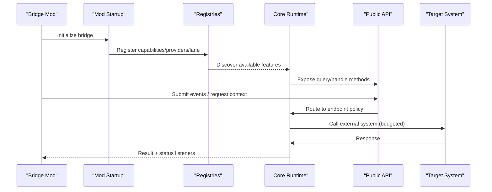

**Diagram sources**
- [DiaryModStartup.cs](../../../../../../Source/Patches/DiaryModStartup.cs)
- [CaptureCapabilityRegistry.cs](../../../../../../Source/Pipeline/CaptureCapabilityRegistry.cs)
- [ContextProviderRegistry.cs](../../../../../../Source/Pipeline/ContextProviderRegistry.cs)
- [ApiEndpointPolicy.cs](../../../../../../Source/Pipeline/ApiEndpointPolicy.cs)
- [ExternalApiBudgetPolicy.cs](../../../../../../Source/Pipeline/ExternalApiBudgetPolicy.cs)
- [DiaryGameComponent.PublicApi.cs](../../../../../../Source/Core/DiaryGameComponent.PublicApi.cs)

## Detailed Component Analysis

### Standard Bridge Class Structure
A typical bridge consists of:
- A GameComponent that initializes registration and lifecycle hooks
- Capability declarations and snapshot types
- Provider implementations for context enrichment
- Event handlers that translate external events into core submissions
- Optional policy definitions for tunable behavior

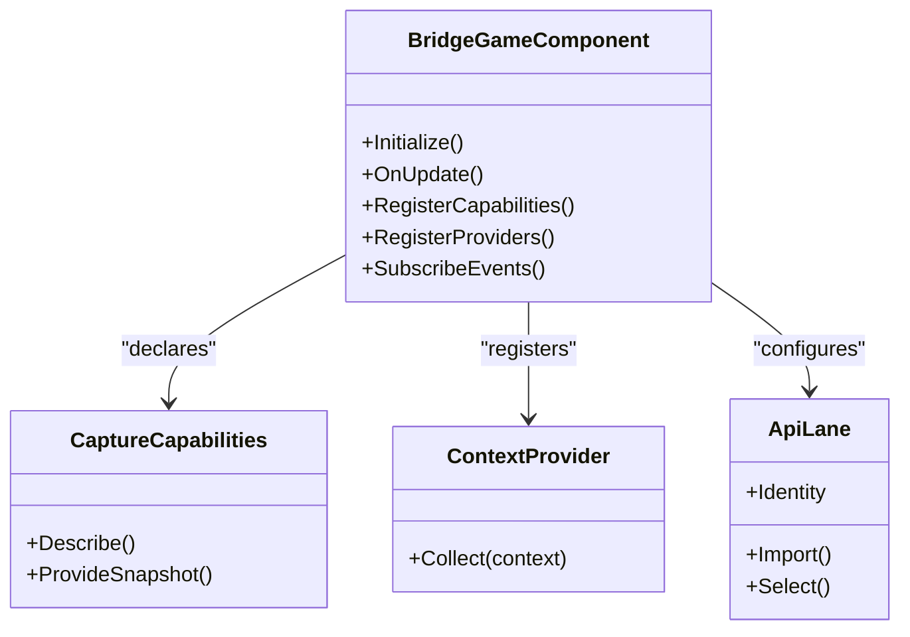

**Diagram sources**
- [Personalities123GameComponent.cs](../../../../../../integrations/PawnDiary.PersonalitiesBridge/Source/Personalities123GameComponent.cs)
- [CaptureCapabilities.cs](../../../../../../Source/Integration/CaptureCapabilities.cs)
- [PawnContextProviders.cs](../../../../../../Source/Integration/PawnContextProviders.cs)
- [ApiLaneIdentity.cs](../../../../../../Source/Pipeline/ApiLaneIdentity.cs)
- [ApiLaneImport.cs](../../../../../../Source/Pipeline/ApiLaneImport.cs)
- [ApiLaneSelector.cs](../../../../../../Source/Pipeline/ApiLaneSelector.cs)

**Section sources**
- [Personalities123GameComponent.cs](../../../../../../integrations/PawnDiary.PersonalitiesBridge/Source/Personalities123GameComponent.cs)
- [CaptureCapabilities.cs](../../../../../../Source/Integration/CaptureCapabilities.cs)
- [PawnContextProviders.cs](../../../../../../Source/Integration/PawnContextProviders.cs)
- [ApiLaneIdentity.cs](../../../../../../Source/Pipeline/ApiLaneIdentity.cs)
- [ApiLaneImport.cs](../../../../../../Source/Pipeline/ApiLaneImport.cs)
- [ApiLaneSelector.cs](../../../../../../Source/Pipeline/ApiLaneSelector.cs)

### Initialization Sequences and Configuration Management
Initialization follows a consistent pattern:
- Startup registers patchers and core services
- Bridge GameComponents register capabilities, providers, and lanes
- Configuration is read from settings and applied to policies

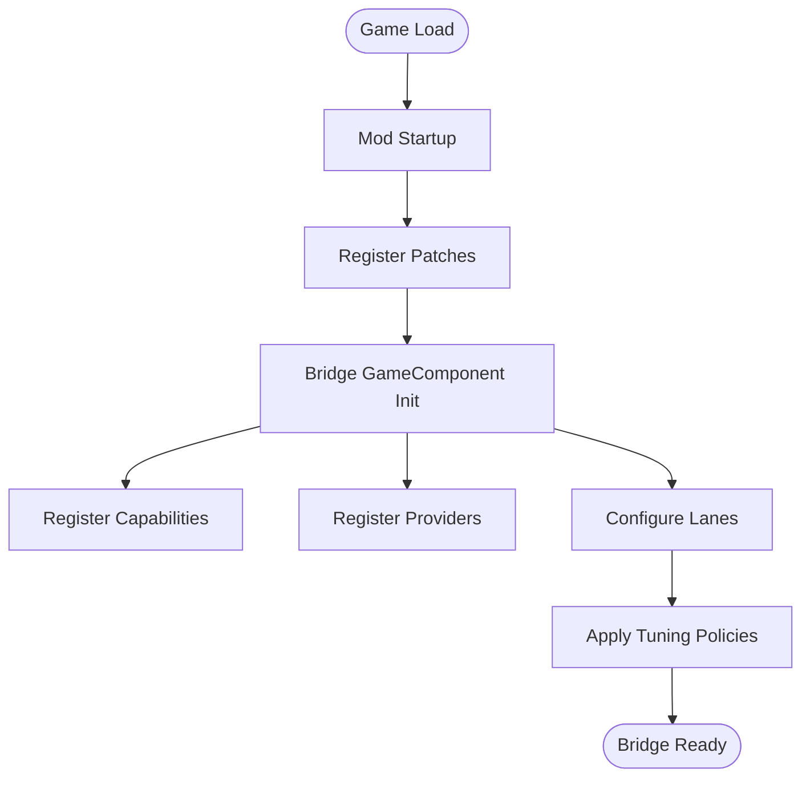

**Diagram sources**
- [DiaryModStartup.cs](../../../../../../Source/Patches/DiaryModStartup.cs)
- [DiaryPatchRegistrar.cs](../../../../../../Source/Patches/DiaryPatchRegistrar.cs)
- [Personalities123GameComponent.cs](../../../../../../integrations/PawnDiary.PersonalitiesBridge/Source/Personalities123GameComponent.cs)
- [PowerfulAiBridgeGameComponent.cs](../../../../../../integrations/PawnDiary.PowerfulAiBridge/Source/PowerfulAiBridgeGameComponent.cs)

**Section sources**
- [DiaryModStartup.cs](../../../../../../Source/Patches/DiaryModStartup.cs)
- [DiaryPatchRegistrar.cs](../../../../../../Source/Patches/DiaryPatchRegistrar.cs)
- [Personalities123GameComponent.cs](../../../../../../integrations/PawnDiary.PersonalitiesBridge/Source/Personalities123GameComponent.cs)
- [PowerfulAiBridgeGameComponent.cs](../../../../../../integrations/PawnDiary.PowerfulAiBridge/Source/PowerfulAiBridgeGameComponent.cs)

### Implementing Capture Capabilities
Bridges expose capture capabilities to allow the core to request domain-specific snapshots. Typical steps:
- Declare capability identifiers and metadata
- Provide snapshot builders that assemble relevant state
- Ensure idempotent reads and minimal allocations

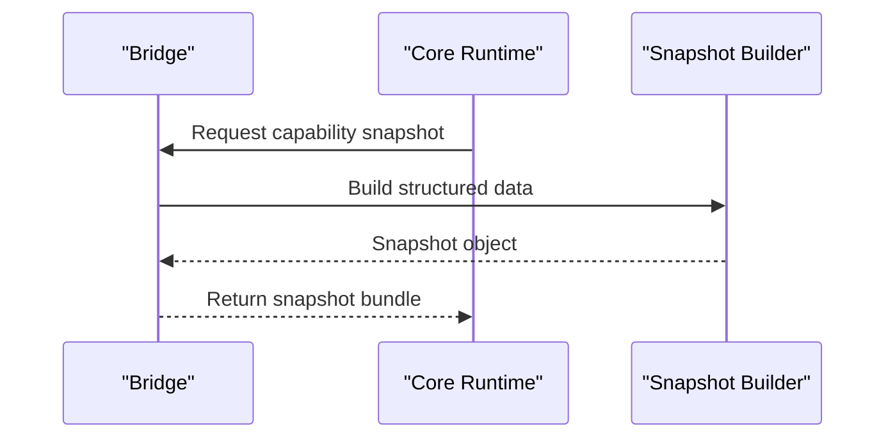

**Diagram sources**
- [CaptureCapabilities.cs](../../../../../../Source/Integration/CaptureCapabilities.cs)
- [DiaryContextBundleSnapshot.cs](../../../../../../Source/Integration/DiaryContextBundleSnapshot.cs)
- [DiaryContextSnapshot.cs](../../../../../../Source/Integration/DiaryContextSnapshot.cs)

**Section sources**
- [CaptureCapabilities.cs](../../../../../../Source/Integration/CaptureCapabilities.cs)
- [DiaryContextBundleSnapshot.cs](../../../../../../Source/Integration/DiaryContextBundleSnapshot.cs)
- [DiaryContextSnapshot.cs](../../../../../../Source/Integration/DiaryContextSnapshot.cs)

### Implementing Context Providers
Context providers enrich prompts and generation by supplying additional facts. Guidelines:
- Implement provider interfaces to collect contextual fields
- Use stable keys and avoid sensitive data
- Cache expensive computations when safe

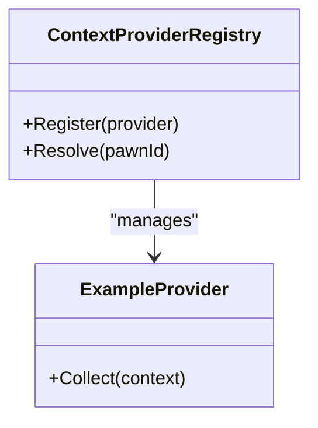

**Diagram sources**
- [ContextProviderRegistry.cs](../../../../../../Source/Pipeline/ContextProviderRegistry.cs)
- [PawnContextProviders.cs](../../../../../../Source/Integration/PawnContextProviders.cs)

**Section sources**
- [ContextProviderRegistry.cs](../../../../../../Source/Pipeline/ContextProviderRegistry.cs)
- [PawnContextProviders.cs](../../../../../../Source/Integration/PawnContextProviders.cs)

### Implementing Event Handlers and Submission
Bridges subscribe to external events and submit them via the public API. Recommended flow:
- Subscribe to target mod events
- Transform payloads into core-compatible requests
- Submit through the public API and handle outcomes

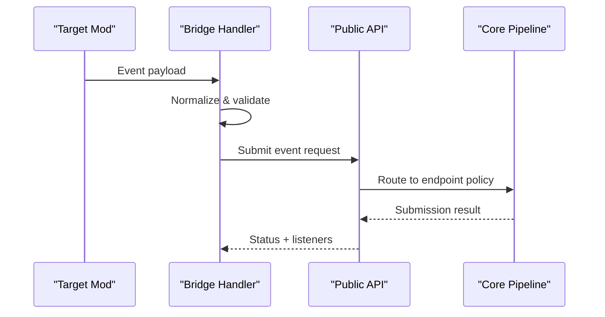

**Diagram sources**
- [DiaryGameComponent.PublicApi.cs](../../../../../../Source/Core/DiaryGameComponent.PublicApi.cs)
- [ExternalEventRequest.cs](../../../../../../Source/Integration/ExternalEventRequest.cs)
- [ExternalDirectEntryRequest.cs](../../../../../../Source/Integration/ExternalDirectEntryRequest.cs)
- [ExternalPromptEntryRequest.cs](../../../../../../Source/Integration/ExternalPromptEntryRequest.cs)
- [DiaryEventSubmissionResult.cs](../../../../../../Source/Integration/DiaryEventSubmissionResult.cs)
- [ApiEndpointPolicy.cs](../../../../../../Source/Pipeline/ApiEndpointPolicy.cs)

**Section sources**
- [DiaryGameComponent.PublicApi.cs](../../../../../../Source/Core/DiaryGameComponent.PublicApi.cs)
- [ExternalEventRequest.cs](../../../../../../Source/Integration/ExternalEventRequest.cs)
- [ExternalDirectEntryRequest.cs](../../../../../../Source/Integration/ExternalDirectEntryRequest.cs)
- [ExternalPromptEntryRequest.cs](../../../../../../Source/Integration/ExternalPromptEntryRequest.cs)
- [DiaryEventSubmissionResult.cs](../../../../../../Source/Integration/DiaryEventSubmissionResult.cs)
- [ApiEndpointPolicy.cs](../../../../../../Source/Pipeline/ApiEndpointPolicy.cs)

### Bidirectional Data Flow and State Synchronization
Some bridges need to both consume and produce state. Patterns:
- Polling-based sync: periodically fetch remote state and reconcile locally
- Push-based sync: react to incoming events and update local caches
- Conflict resolution: apply deterministic rules (e.g., last-write-wins, priority lanes)

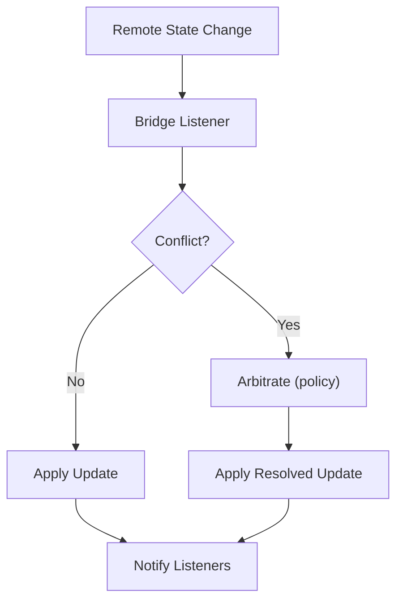

**Diagram sources**
- [ExternalOverrideArbitration.cs](../../../../../../Source/Pipeline/ExternalOverrideArbitration.cs)
- [EntryStatusListeners.cs](../../../../../../Source/Integration/EntryStatusListeners.cs)
- [RecentDiaryEventCache.cs](../../../../../../integrations/PawnDiary.RimTalkBridge/Source/RecentDiaryEventCache.cs)

**Section sources**
- [ExternalOverrideArbitration.cs](../../../../../../Source/Pipeline/ExternalOverrideArbitration.cs)
- [EntryStatusListeners.cs](../../../../../../Source/Integration/EntryStatusListeners.cs)
- [RecentDiaryEventCache.cs](../../../../../../integrations/PawnDiary.RimTalkBridge/Source/RecentDiaryEventCache.cs)

### Example Bridges: Patterns in Practice

#### Personalities Bridge
- Demonstrates GameComponent initialization, capability declaration, and periodic sync
- Uses a dedicated sync component to reconcile personality data

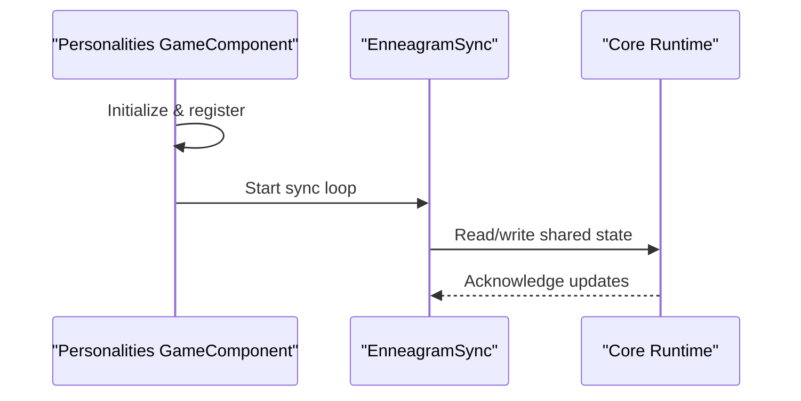

**Diagram sources**
- [Personalities123GameComponent.cs](../../../../../../integrations/PawnDiary.PersonalitiesBridge/Source/Personalities123GameComponent.cs)
- [EnneagramSync.cs](../../../../../../integrations/PawnDiary.PersonalitiesBridge/Source/EnneagramSync.cs)

**Section sources**
- [Personalities123GameComponent.cs](../../../../../../integrations/PawnDiary.PersonalitiesBridge/Source/Personalities123GameComponent.cs)
- [EnneagramSync.cs](../../../../../../integrations/PawnDiary.PersonalitiesBridge/Source/EnneagramSync.cs)

#### Powerful AI Bridge
- Shows reflection-based integration and lane configuration
- Uses reflection utilities to interact with target APIs safely

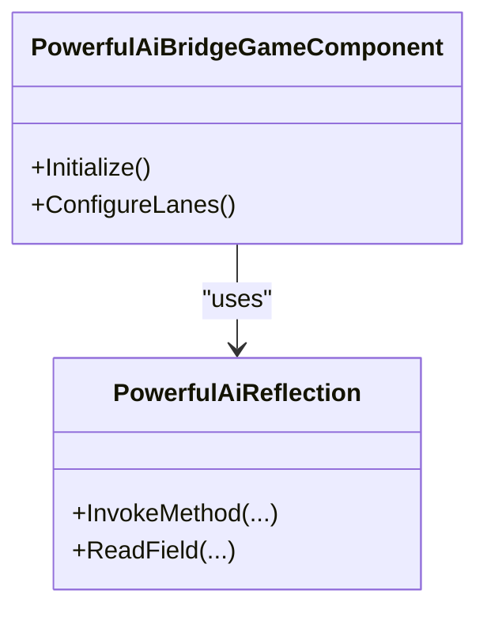

**Diagram sources**
- [PowerfulAiBridgeGameComponent.cs](../../../../../../integrations/PawnDiary.PowerfulAiBridge/Source/PowerfulAiBridgeGameComponent.cs)
- [PowerfulAiReflection.cs](../../../../../../integrations/PawnDiary.PowerfulAiBridge/Source/PowerfulAiReflection.cs)

**Section sources**
- [PowerfulAiBridgeGameComponent.cs](../../../../../../integrations/PawnDiary.PowerfulAiBridge/Source/PowerfulAiBridgeGameComponent.cs)
- [PowerfulAiReflection.cs](../../../../../../integrations/PawnDiary.PowerfulAiBridge/Source/PowerfulAiReflection.cs)

#### RimTalk Bridge
- Injects colony-level context and tracks conversations
- Provides policy definitions for persona chattiness and assessment coordination

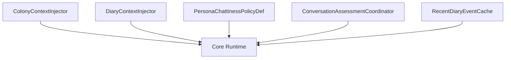

**Diagram sources**
- [ColonyContextInjector.cs](../../../../../../integrations/PawnDiary.RimTalkBridge/Source/ColonyContextInjector.cs)
- [DiaryContextInjector.cs](../../../../../../integrations/PawnDiary.RimTalkBridge/Source/DiaryContextInjector.cs)
- [PersonaChattinessPolicyDef.cs](../../../../../../integrations/PawnDiary.RimTalkBridge/Source/PersonaChattinessPolicyDef.cs)
- [ConversationAssessmentCoordinator.cs](../../../../../../integrations/PawnDiary.RimTalkBridge/Source/ConversationAssessmentCoordinator.cs)
- [RecentDiaryEventCache.cs](../../../../../../integrations/PawnDiary.RimTalkBridge/Source/RecentDiaryEventCache.cs)

**Section sources**
- [ColonyContextInjector.cs](../../../../../../integrations/PawnDiary.RimTalkBridge/Source/ColonyContextInjector.cs)
- [DiaryContextInjector.cs](../../../../../../integrations/PawnDiary.RimTalkBridge/Source/DiaryContextInjector.cs)
- [PersonaChattinessPolicyDef.cs](../../../../../../integrations/PawnDiary.RimTalkBridge/Source/PersonaChattinessPolicyDef.cs)
- [ConversationAssessmentCoordinator.cs](../../../../../../integrations/PawnDiary.RimTalkBridge/Source/ConversationAssessmentCoordinator.cs)
- [RecentDiaryEventCache.cs](../../../../../../integrations/PawnDiary.RimTalkBridge/Source/RecentDiaryEventCache.cs)

### Code Templates for Common Scenarios

#### Template: Capability Declaration and Snapshot Provision
- Define capability identifiers and metadata
- Implement snapshot assembly returning structured data
- Ensure thread-safe reads and minimal allocations

**Section sources**
- [CaptureCapabilities.cs](../../../../../../Source/Integration/CaptureCapabilities.cs)
- [DiaryContextBundleSnapshot.cs](../../../../../../Source/Integration/DiaryContextBundleSnapshot.cs)
- [DiaryContextSnapshot.cs](../../../../../../Source/Integration/DiaryContextSnapshot.cs)

#### Template: Context Provider Registration
- Register provider instances with the registry
- Implement collection logic keyed by pawn or entity
- Cache computed values where appropriate

**Section sources**
- [ContextProviderRegistry.cs](../../../../../../Source/Pipeline/ContextProviderRegistry.cs)
- [PawnContextProviders.cs](../../../../../../Source/Integration/PawnContextProviders.cs)

#### Template: Event Submission via Public API
- Convert external event to a core request type
- Submit using the public API
- Handle submission results and status listeners

**Section sources**
- [DiaryGameComponent.PublicApi.cs](../../../../../../Source/Core/DiaryGameComponent.PublicApi.cs)
- [ExternalEventRequest.cs](../../../../../../Source/Integration/ExternalEventRequest.cs)
- [ExternalDirectEntryRequest.cs](../../../../../../Source/Integration/ExternalDirectEntryRequest.cs)
- [ExternalPromptEntryRequest.cs](../../../../../../Source/Integration/ExternalPromptEntryRequest.cs)
- [DiaryEventSubmissionResult.cs](../../../../../../Source/Integration/DiaryEventSubmissionResult.cs)
- [EntryStatusListeners.cs](../../../../../../Source/Integration/EntryStatusListeners.cs)

#### Template: Lane Identity, Import, and Selection
- Define lane identity and import mapping
- Select appropriate endpoint based on context
- Apply budgeting and override arbitration

**Section sources**
- [ApiLaneIdentity.cs](../../../../../../Source/Pipeline/ApiLaneIdentity.cs)
- [ApiLaneImport.cs](../../../../../../Source/Pipeline/ApiLaneImport.cs)
- [ApiLaneSelector.cs](../../../../../../Source/Pipeline/ApiLaneSelector.cs)
- [ExternalApiLaneRequest.cs](../../../../../../Source/Integration/ExternalApiLaneRequest.cs)
- [ExternalApiBudgetPolicy.cs](../../../../../../Source/Pipeline/ExternalApiBudgetPolicy.cs)
- [ExternalOverrideArbitration.cs](../../../../../../Source/Pipeline/ExternalOverrideArbitration.cs)

#### Template: Graceful Degradation and Version Compatibility
- Check feature availability before enabling functionality
- Fall back to no-op or reduced-feature mode if unavailable
- Log warnings for missing dependencies without crashing

[No sources needed since this section provides general guidance]

## Dependency Analysis
Bridges depend on core contracts and registries. They also rely on runtime services for dispatch and API exposure.

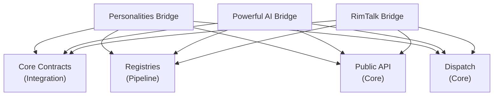

**Diagram sources**
- [CaptureCapabilities.cs](../../../../../../Source/Integration/CaptureCapabilities.cs)
- [PawnContextProviders.cs](../../../../../../Source/Integration/PawnContextProviders.cs)
- [CaptureCapabilityRegistry.cs](../../../../../../Source/Pipeline/CaptureCapabilityRegistry.cs)
- [ContextProviderRegistry.cs](../../../../../../Source/Pipeline/ContextProviderRegistry.cs)
- [DiaryGameComponent.PublicApi.cs](../../../../../../Source/Core/DiaryGameComponent.PublicApi.cs)
- [DiaryGameComponent.Dispatch.cs](../../../../../../Source/Core/DiaryGameComponent.Dispatch.cs)
- [Personalities123GameComponent.cs](../../../../../../integrations/PawnDiary.PersonalitiesBridge/Source/Personalities123GameComponent.cs)
- [PowerfulAiBridgeGameComponent.cs](../../../../../../integrations/PawnDiary.PowerfulAiBridge/Source/PowerfulAiBridgeGameComponent.cs)
- [ColonyContextInjector.cs](../../../../../../integrations/PawnDiary.RimTalkBridge/Source/ColonyContextInjector.cs)

**Section sources**
- [CaptureCapabilities.cs](../../../../../../Source/Integration/CaptureCapabilities.cs)
- [PawnContextProviders.cs](../../../../../../Source/Integration/PawnContextProviders.cs)
- [CaptureCapabilityRegistry.cs](../../../../../../Source/Pipeline/CaptureCapabilityRegistry.cs)
- [ContextProviderRegistry.cs](../../../../../../Source/Pipeline/ContextProviderRegistry.cs)
- [DiaryGameComponent.PublicApi.cs](../../../../../../Source/Core/DiaryGameComponent.PublicApi.cs)
- [DiaryGameComponent.Dispatch.cs](../../../../../../Source/Core/DiaryGameComponent.Dispatch.cs)
- [Personalities123GameComponent.cs](../../../../../../integrations/PawnDiary.PersonalitiesBridge/Source/Personalities123GameComponent.cs)
- [PowerfulAiBridgeGameComponent.cs](../../../../../../integrations/PawnDiary.PowerfulAiBridge/Source/PowerfulAiBridgeGameComponent.cs)
- [ColonyContextInjector.cs](../../../../../../integrations/PawnDiary.RimTalkBridge/Source/ColonyContextInjector.cs)

## Performance Considerations
- Prefer batched operations and caching for expensive context collection
- Avoid heavy allocations in hot paths; reuse buffers where possible
- Respect external API budgets to prevent throttling or timeouts
- Debounce frequent events to reduce submission overhead
- Use selective snapshot fields to minimize payload size

[No sources needed since this section provides general guidance]

## Troubleshooting Guide
Common issues and resolutions:
- Missing dependencies: verify presence and load order; use graceful degradation
- Capability not recognized: ensure capability registration occurs before first use
- Conflicting overrides: review arbitration policy and lane priorities
- Budget exceeded: adjust frequency or scope of external calls
- Snapshot inconsistencies: validate idempotency and cache invalidation strategies

**Section sources**
- [ExternalApiBudgetPolicy.cs](../../../../../../Source/Pipeline/ExternalApiBudgetPolicy.cs)
- [ExternalOverrideArbitration.cs](../../../../../../Source/Pipeline/ExternalOverrideArbitration.cs)
- [CaptureCapabilityRegistry.cs](../../../../../../Source/Pipeline/CaptureCapabilityRegistry.cs)
- [ContextProviderRegistry.cs](../../../../../../Source/Pipeline/ContextProviderRegistry.cs)
- [EntryStatusListeners.cs](../../../../../../Source/Integration/EntryStatusListeners.cs)

## Conclusion
By following the standardized bridge patterns—clear capability declarations, robust context providers, disciplined event submission, and careful lane management—you can build reliable integrations that scale across mods and versions. Emphasize graceful degradation, budget compliance, and deterministic conflict resolution to maintain stability and performance.

## Appendices

### Appendix A: Bridge IDs and Identifiers
Use stable identifiers for bridges and lanes to ensure consistent routing and debugging.

**Section sources**
- [BridgeIds.cs](../../../../../../integrations/PawnDiary.PersonalitiesBridge/Source/BridgeIds.cs)
- [BridgeIds.cs](../../../../../../integrations/PawnDiary.PowerfulAiBridge/Source/BridgeIds.cs)

### Appendix B: API Setup and Lane Snapshots
Inspect setup and lane snapshots to diagnose configuration issues and verify active lanes.

**Section sources**
- [DiaryApiSetupSnapshot.cs](../../../../../../Source/Integration/DiaryApiSetupSnapshot.cs)
- [DiaryApiLaneSnapshot.cs](../../../../../../Source/Integration/DiaryApiLaneSnapshot.cs)
- [DiaryGameComponent.IntegrationSnapshots.cs](../../../../../../Source/Core/DiaryGameComponent.IntegrationSnapshots.cs)
