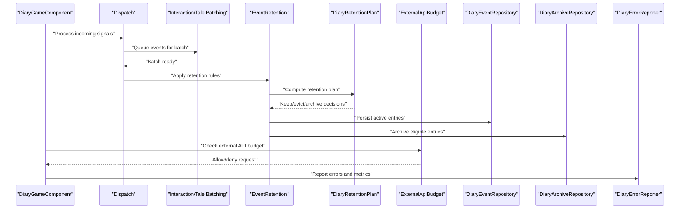
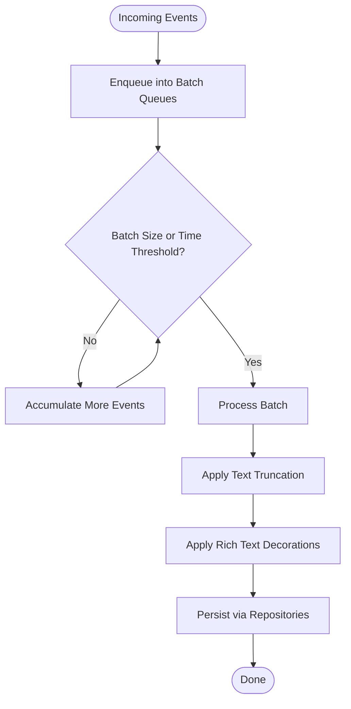
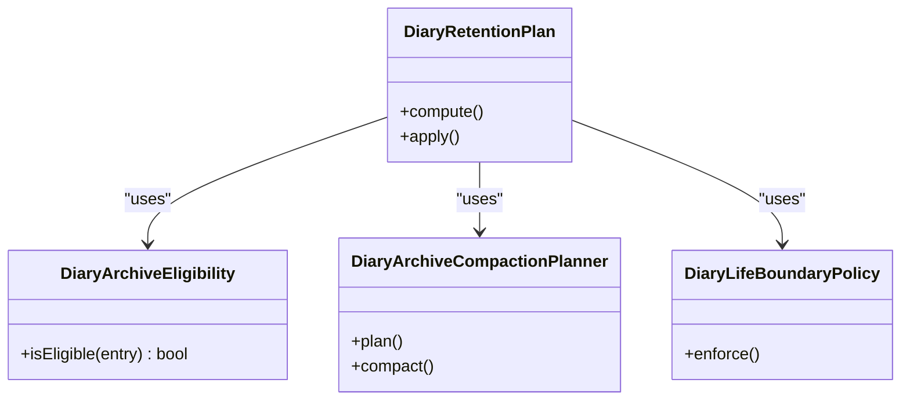
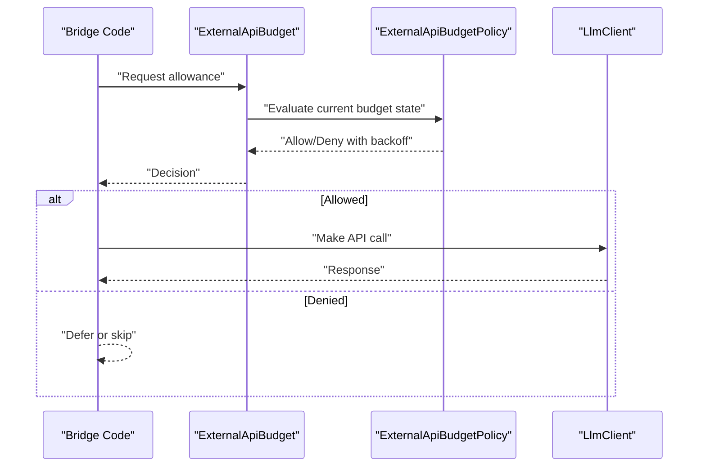
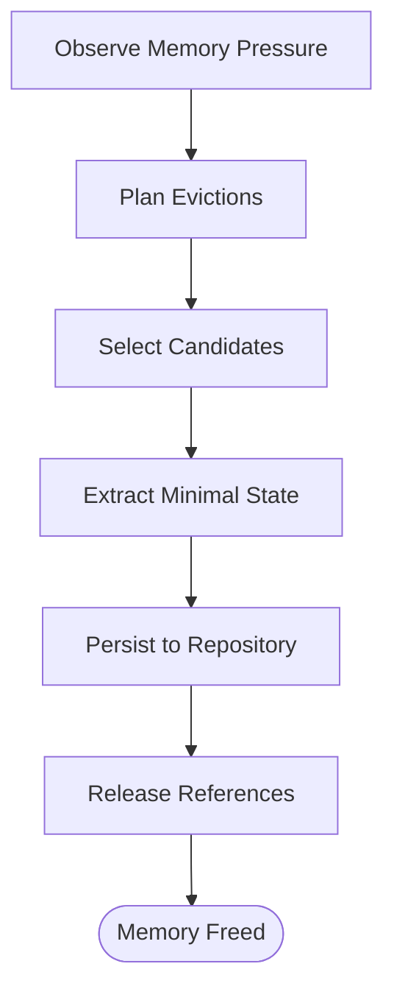
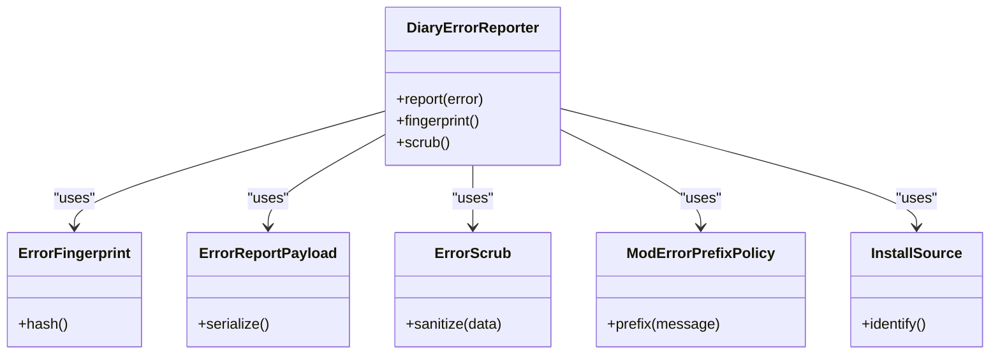
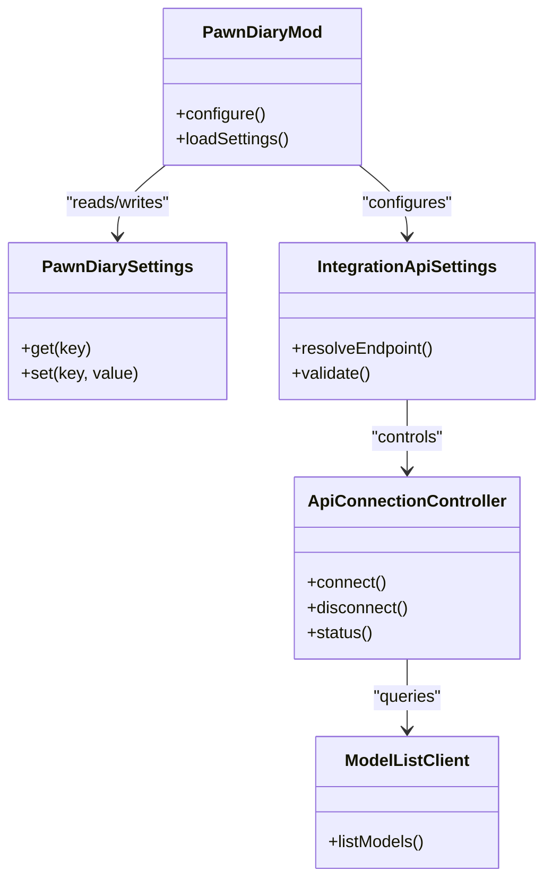
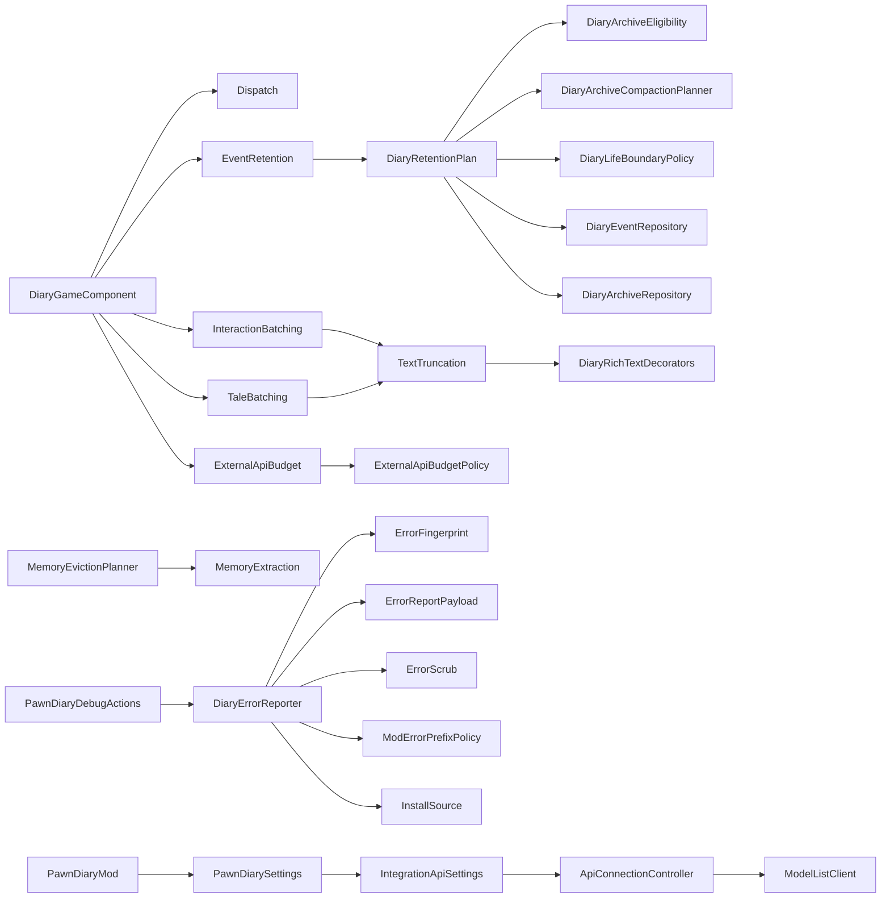

# Performance & Debugging

- [DiaryGameComponent.cs](../../../../../Source/Core/DiaryGameComponent.cs)
- [DiaryGameComponent.Dispatch.cs](../../../../../Source/Core/DiaryGameComponent.Dispatch.cs)
- [DiaryGameComponent.EventRetention.cs](../../../../../Source/Core/DiaryGameComponent.EventRetention.cs)
- [DiaryGameComponent.InteractionBatching.cs](../../../../../Source/Core/DiaryGameComponent.InteractionBatching.cs)
- [DiaryGameComponent.TaleBatching.cs](../../../../../Source/Core/DiaryGameComponent.TaleBatching.cs)
- [DiaryGameComponent.ExternalApiBudget.cs](../../../../../Source/Core/DiaryGameComponent.ExternalApiBudget.cs)
- [ExternalApiBudgetPolicy.cs](../../../../../Source/Pipeline/ExternalApiBudgetPolicy.cs)
- [DiaryEventRepository.cs](../../../../../Source/Core/DiaryEventRepository.cs)
- [DiaryArchiveRepository.cs](../../../../../Source/Core/DiaryArchiveRepository.cs)
- [MemoryEvictionPlanner.cs](../../../../../Source/Pipeline/Memory/MemoryEvictionPlanner.cs)
- [MemoryExtraction.cs](../../../../../Source/Pipeline/Memory/MemoryExtraction.cs)
- [DiaryPipelineContracts.cs](../../../../../Source/Pipeline/DiaryPipelineContracts.cs)
- [PawnDiaryDebugActions.cs](../../../../../Source/Dev/PawnDiaryDebugActions.cs)
- [DiaryErrorReporter.cs](../../../../../Source/Diagnostics/DiaryErrorReporter.cs)
- [DiaryLogReportPatch.cs](../../../../../Source/Diagnostics/DiaryLogReportPatch.cs)
- [ErrorFingerprint.cs](../../../../../Source/Diagnostics/Pure/ErrorFingerprint.cs)
- [ErrorReportPayload.cs](../../../../../Source/Diagnostics/Pure/ErrorReportPayload.cs)
- [ErrorScrub.cs](../../../../../Source/Diagnostics/Pure/ErrorScrub.cs)
- [ModErrorPrefixPolicy.cs](../../../../../Source/Diagnostics/Pure/ModErrorPrefixPolicy.cs)
- [InstallSource.cs](../../../../../Source/Diagnostics/Pure/InstallSource.cs)
- [PawnDiaryMod.cs](../../../../../Source/Settings/PawnDiaryMod.cs)
- [PawnDiarySettings.cs](../../../../../Source/Settings/PawnDiarySettings.cs)
- [IntegrationApiSettings.cs](../../../../../Source/Settings/IntegrationApiSettings.cs)
- [ApiConnectionController.cs](../../../../../Source/Settings/ApiConnectionController.cs)
- [ModelListClient.cs](../../../../../Source/Settings/ModelListClient.cs)
- [LlmClient.cs](../../../../../Source/Generation/LlmClient.cs)
- [ExternalDirectEntryRequest.cs](../../../../../Source/Integration/ExternalDirectEntryRequest.cs)
- [ExternalEventRequest.cs](../../../../../Source/Integration/ExternalEventRequest.cs)
- [ExternalPromptEntryRequest.cs](../../../../../Source/Integration/ExternalPromptEntryRequest.cs)
- [ExternalApiLaneRequest.cs](../../../../../Source/Integration/ExternalApiLaneRequest.cs)
- [DiaryApiSetupSnapshot.cs](../../../../../Source/Integration/DiaryApiSetupSnapshot.cs)
- [DiaryHealthSummarySnapshot.cs](../../../../../Source/Integration/DiaryHealthSummarySnapshot.cs)
- [DiaryEntryStatsSnapshot.cs](../../../../../Source/Integration/DiaryEntryStatsSnapshot.cs)
- [DiaryEntryStatusSnapshot.cs](../../../../../Source/Integration/DiaryEntryStatusSnapshot.cs)
- [DiaryContextBundleSnapshot.cs](../../../../../Source/Integration/DiaryContextBundleSnapshot.cs)
- [DiaryContextSnapshot.cs](../../../../../Source/Integration/DiaryContextSnapshot.cs)
- [DiaryEventSubmissionResult.cs](../../../../../Source/Integration/DiaryEventSubmissionResult.cs)
- [SubmitEventOutcome.cs](../../../../../Source/Integration/SubmitEventOutcome.cs)
- [DiaryLifeBoundaryPolicy.cs](../../../../../Source/Pipeline/DiaryLifeBoundaryPolicy.cs)
- [DiaryRetentionPlan.cs](../../../../../Source/Pipeline/DiaryRetentionPlan.cs)
- [DiaryArchiveEligibility.cs](../../../../../Source/Pipeline/DiaryArchiveEligibility.cs)
- [DiaryArchiveCompactionPlanner.cs](../../../../../Source/Pipeline/DiaryArchiveCompactionPlanner.cs)
- [TextTruncation.cs](../../../../../Source/Pipeline/TextTruncation.cs)
- [DiaryTextDecorations.cs](../../../../../Source/Pipeline/DiaryTextDecorations.cs)
- [DiaryRichTextDecorators.cs](../../../../../Source/Pipeline/DiaryRichTextDecorators.cs)
- [RecentEventExpiry.cs](../../../../../Source/Capture/RecentEventExpiry.cs)
- [GenericEventTypeDedup.cs](../../../../../Source/Capture/GenericEventTypeDedup.cs)
- [DiarySaveNormalization.cs](../../../../../Source/Pipeline/DiarySaveNormalization.cs)
## Table of Contents
1. [Introduction](#introduction)
2. [Project Structure](#project-structure)
3. [Core Components](#core-components)
4. [Architecture Overview](#architecture-overview)
5. [Detailed Component Analysis](#detailed-component-analysis)
6. [Dependency Analysis](#dependency-analysis)
7. [Performance Considerations](#performance-considerations)
8. [Troubleshooting Guide](#troubleshooting-guide)
9. [Conclusion](#conclusion)
10. [Appendices](#appendices)

## Introduction
This document provides performance optimization and debugging guidance for bridge development within the project. It focuses on memory management, API call throttling, efficient data synchronization, logging strategies, profiling techniques, bottleneck identification, event processing optimization, resource usage management, and troubleshooting workflows for common performance issues and complex integration problems. The content is grounded in the codebase’s existing components for batching, retention, budgeting, diagnostics, and settings.

## Project Structure
The project organizes performance-critical logic across several areas:
- Core orchestration and dispatching
- Batching and retention policies
- External API budgeting and throttling
- Memory planning and eviction
- Diagnostics and error reporting
- Settings and runtime controls

```mermaid
graph TB
subgraph "Core"
GC["DiaryGameComponent"]
Dispatch["Dispatch"]
Retention["EventRetention"]
IntBatch["InteractionBatching"]
TaleBatch["TaleBatching"]
ApiBudget["ExternalApiBudget"]
end
subgraph "Pipeline"
BudgetPolicy["ExternalApiBudgetPolicy"]
LifeBound["DiaryLifeBoundaryPolicy"]
RetPlan["DiaryRetentionPlan"]
ArchiveElig["DiaryArchiveEligibility"]
ArchiveCompact["DiaryArchiveCompactionPlanner"]
TextTrunc["TextTruncation"]
RichText["DiaryRichTextDecorators"]
end
subgraph "Memory"
Evict["MemoryEvictionPlanner"]
Extract["MemoryExtraction"]
end
subgraph "Diagnostics"
DevAct["PawnDiaryDebugActions"]
ErrRep["DiaryErrorReporter"]
LogPatch["DiaryLogReportPatch"]
Fp["ErrorFingerprint"]
Payload["ErrorReportPayload"]
Scrub["ErrorScrub"]
Prefix["ModErrorPrefixPolicy"]
InstallSrc["InstallSource"]
end
subgraph "Settings"
ModCfg["PawnDiaryMod"]
Settings["PawnDiarySettings"]
IntApi["IntegrationApiSettings"]
ConnCtrl["ApiConnectionController"]
ModelList["ModelListClient"]
end
GC --> Dispatch
GC --> Retention
GC --> IntBatch
GC --> TaleBatch
GC --> ApiBudget
ApiBudget --> BudgetPolicy
Retention --> RetPlan
RetPlan --> ArchiveElig
RetPlan --> ArchiveCompact
RetPlan --> LifeBound
IntBatch --> TextTrunc
TaleBatch --> TextTrunc
TextTrunc --> RichText
Evict --> Extract
DevAct --> ErrRep
ErrRep --> Fp
ErrRep --> Payload
ErrRep --> Scrub
ErrRep --> Prefix
ErrRep --> InstallSrc
ModCfg --> Settings
Settings --> IntApi
IntApi --> ConnCtrl
ConnCtrl --> ModelList
```

**Diagram sources**
- [DiaryGameComponent.cs](../../../../../Source/Core/DiaryGameComponent.cs)
- [DiaryGameComponent.Dispatch.cs](../../../../../Source/Core/DiaryGameComponent.Dispatch.cs)
- [DiaryGameComponent.EventRetention.cs](../../../../../Source/Core/DiaryGameComponent.EventRetention.cs)
- [DiaryGameComponent.InteractionBatching.cs](../../../../../Source/Core/DiaryGameComponent.InteractionBatching.cs)
- [DiaryGameComponent.TaleBatching.cs](../../../../../Source/Core/DiaryGameComponent.TaleBatching.cs)
- [DiaryGameComponent.ExternalApiBudget.cs](../../../../../Source/Core/DiaryGameComponent.ExternalApiBudget.cs)
- [ExternalApiBudgetPolicy.cs](../../../../../Source/Pipeline/ExternalApiBudgetPolicy.cs)
- [DiaryLifeBoundaryPolicy.cs](../../../../../Source/Pipeline/DiaryLifeBoundaryPolicy.cs)
- [DiaryRetentionPlan.cs](../../../../../Source/Pipeline/DiaryRetentionPlan.cs)
- [DiaryArchiveEligibility.cs](../../../../../Source/Pipeline/DiaryArchiveEligibility.cs)
- [DiaryArchiveCompactionPlanner.cs](../../../../../Source/Pipeline/DiaryArchiveCompactionPlanner.cs)
- [TextTruncation.cs](../../../../../Source/Pipeline/TextTruncation.cs)
- [DiaryRichTextDecorators.cs](../../../../../Source/Pipeline/DiaryRichTextDecorators.cs)
- [MemoryEvictionPlanner.cs](../../../../../Source/Pipeline/Memory/MemoryEvictionPlanner.cs)
- [MemoryExtraction.cs](../../../../../Source/Pipeline/Memory/MemoryExtraction.cs)
- [PawnDiaryDebugActions.cs](../../../../../Source/Dev/PawnDiaryDebugActions.cs)
- [DiaryErrorReporter.cs](../../../../../Source/Diagnostics/DiaryErrorReporter.cs)
- [DiaryLogReportPatch.cs](../../../../../Source/Diagnostics/DiaryLogReportPatch.cs)
- [ErrorFingerprint.cs](../../../../../Source/Diagnostics/Pure/ErrorFingerprint.cs)
- [ErrorReportPayload.cs](../../../../../Source/Diagnostics/Pure/ErrorReportPayload.cs)
- [ErrorScrub.cs](../../../../../Source/Diagnostics/Pure/ErrorScrub.cs)
- [ModErrorPrefixPolicy.cs](../../../../../Source/Diagnostics/Pure/ModErrorPrefixPolicy.cs)
- [InstallSource.cs](../../../../../Source/Diagnostics/Pure/InstallSource.cs)
- [PawnDiaryMod.cs](../../../../../Source/Settings/PawnDiaryMod.cs)
- [PawnDiarySettings.cs](../../../../../Source/Settings/PawnDiarySettings.cs)
- [IntegrationApiSettings.cs](../../../../../Source/Settings/IntegrationApiSettings.cs)
- [ApiConnectionController.cs](../../../../../Source/Settings/ApiConnectionController.cs)
- [ModelListClient.cs](../../../../../Source/Settings/ModelListClient.cs)

**Section sources**
- [DiaryGameComponent.cs](../../../../../Source/Core/DiaryGameComponent.cs)
- [DiaryGameComponent.Dispatch.cs](../../../../../Source/Core/DiaryGameComponent.Dispatch.cs)
- [DiaryGameComponent.EventRetention.cs](../../../../../Source/Core/DiaryGameComponent.EventRetention.cs)
- [DiaryGameComponent.InteractionBatching.cs](../../../../../Source/Core/DiaryGameComponent.InteractionBatching.cs)
- [DiaryGameComponent.TaleBatching.cs](../../../../../Source/Core/DiaryGameComponent.TaleBatching.cs)
- [DiaryGameComponent.ExternalApiBudget.cs](../../../../../Source/Core/DiaryGameComponent.ExternalApiBudget.cs)
- [ExternalApiBudgetPolicy.cs](../../../../../Source/Pipeline/ExternalApiBudgetPolicy.cs)
- [DiaryRetentionPlan.cs](../../../../../Source/Pipeline/DiaryRetentionPlan.cs)
- [DiaryArchiveEligibility.cs](../../../../../Source/Pipeline/DiaryArchiveEligibility.cs)
- [DiaryArchiveCompactionPlanner.cs](../../../../../Source/Pipeline/DiaryArchiveCompactionPlanner.cs)
- [MemoryEvictionPlanner.cs](../../../../../Source/Pipeline/Memory/MemoryEvictionPlanner.cs)
- [MemoryExtraction.cs](../../../../../Source/Pipeline/Memory/MemoryExtraction.cs)
- [PawnDiaryDebugActions.cs](../../../../../Source/Dev/PawnDiaryDebugActions.cs)
- [DiaryErrorReporter.cs](../../../../../Source/Diagnostics/DiaryErrorReporter.cs)
- [DiaryLogReportPatch.cs](../../../../../Source/Diagnostics/DiaryLogReportPatch.cs)
- [ErrorFingerprint.cs](../../../../../Source/Diagnostics/Pure/ErrorFingerprint.cs)
- [ErrorReportPayload.cs](../../../../../Source/Diagnostics/Pure/ErrorReportPayload.cs)
- [ErrorScrub.cs](../../../../../Source/Diagnostics/Pure/ErrorScrub.cs)
- [ModErrorPrefixPolicy.cs](../../../../../Source/Diagnostics/Pure/ModErrorPrefixPolicy.cs)
- [InstallSource.cs](../../../../../Source/Diagnostics/Pure/InstallSource.cs)
- [PawnDiaryMod.cs](../../../../../Source/Settings/PawnDiaryMod.cs)
- [PawnDiarySettings.cs](../../../../../Source/Settings/PawnDiarySettings.cs)
- [IntegrationApiSettings.cs](../../../../../Source/Settings/IntegrationApiSettings.cs)
- [ApiConnectionController.cs](../../../../../Source/Settings/ApiConnectionController.cs)
- [ModelListClient.cs](../../../../../Source/Settings/ModelListClient.cs)

## Core Components
- Orchestration and dispatch: Central game component coordinates lifecycle, dispatches events, and integrates subsystems.
- Batching: Interaction and tale batching reduce per-frame overhead by grouping operations.
- Retention and archival: Policies determine event lifetime, archive eligibility, compaction, and boundaries.
- External API budgeting: Controls rate and volume of external calls to prevent spikes.
- Memory planning: Eviction planner and extraction utilities manage memory pressure.
- Diagnostics: Error reporter, log patch, debug actions, and pure diagnostic utilities provide visibility.
- Settings: Runtime configuration for APIs, connections, and behavior toggles.

Key responsibilities and interactions are implemented across the core pipeline and diagnostics modules.

**Section sources**
- [DiaryGameComponent.cs](../../../../../Source/Core/DiaryGameComponent.cs)
- [DiaryGameComponent.Dispatch.cs](../../../../../Source/Core/DiaryGameComponent.Dispatch.cs)
- [DiaryGameComponent.InteractionBatching.cs](../../../../../Source/Core/DiaryGameComponent.InteractionBatching.cs)
- [DiaryGameComponent.TaleBatching.cs](../../../../../Source/Core/DiaryGameComponent.TaleBatching.cs)
- [DiaryGameComponent.EventRetention.cs](../../../../../Source/Core/DiaryGameComponent.EventRetention.cs)
- [DiaryGameComponent.ExternalApiBudget.cs](../../../../../Source/Core/DiaryGameComponent.ExternalApiBudget.cs)
- [ExternalApiBudgetPolicy.cs](../../../../../Source/Pipeline/ExternalApiBudgetPolicy.cs)
- [DiaryRetentionPlan.cs](../../../../../Source/Pipeline/DiaryRetentionPlan.cs)
- [DiaryArchiveEligibility.cs](../../../../../Source/Pipeline/DiaryArchiveEligibility.cs)
- [DiaryArchiveCompactionPlanner.cs](../../../../../Source/Pipeline/DiaryArchiveCompactionPlanner.cs)
- [MemoryEvictionPlanner.cs](../../../../../Source/Pipeline/Memory/MemoryEvictionPlanner.cs)
- [MemoryExtraction.cs](../../../../../Source/Pipeline/Memory/MemoryExtraction.cs)
- [PawnDiaryDebugActions.cs](../../../../../Source/Dev/PawnDiaryDebugActions.cs)
- [DiaryErrorReporter.cs](../../../../../Source/Diagnostics/DiaryErrorReporter.cs)
- [DiaryLogReportPatch.cs](../../../../../Source/Diagnostics/DiaryLogReportPatch.cs)
- [ErrorFingerprint.cs](../../../../../Source/Diagnostics/Pure/ErrorFingerprint.cs)
- [ErrorReportPayload.cs](../../../../../Source/Diagnostics/Pure/ErrorReportPayload.cs)
- [ErrorScrub.cs](../../../../../Source/Diagnostics/Pure/ErrorScrub.cs)
- [ModErrorPrefixPolicy.cs](../../../../../Source/Diagnostics/Pure/ModErrorPrefixPolicy.cs)
- [InstallSource.cs](../../../../../Source/Diagnostics/Pure/InstallSource.cs)
- [PawnDiaryMod.cs](../../../../../Source/Settings/PawnDiaryMod.cs)
- [PawnDiarySettings.cs](../../../../../Source/Settings/PawnDiarySettings.cs)
- [IntegrationApiSettings.cs](../../../../../Source/Settings/IntegrationApiSettings.cs)
- [ApiConnectionController.cs](../../../../../Source/Settings/ApiConnectionController.cs)
- [ModelListClient.cs](../../../../../Source/Settings/ModelListClient.cs)

## Architecture Overview
The system orchestrates event ingestion, batching, retention, and external API calls while enforcing budgets and memory constraints. Diagnostics capture errors and expose snapshots for health monitoring.



**Diagram sources**
- [DiaryGameComponent.cs](../../../../../Source/Core/DiaryGameComponent.cs)
- [DiaryGameComponent.Dispatch.cs](../../../../../Source/Core/DiaryGameComponent.Dispatch.cs)
- [DiaryGameComponent.InteractionBatching.cs](../../../../../Source/Core/DiaryGameComponent.InteractionBatching.cs)
- [DiaryGameComponent.TaleBatching.cs](../../../../../Source/Core/DiaryGameComponent.TaleBatching.cs)
- [DiaryGameComponent.EventRetention.cs](../../../../../Source/Core/DiaryGameComponent.EventRetention.cs)
- [DiaryRetentionPlan.cs](../../../../../Source/Pipeline/DiaryRetentionPlan.cs)
- [DiaryEventRepository.cs](../../../../../Source/Core/DiaryEventRepository.cs)
- [DiaryArchiveRepository.cs](../../../../../Source/Core/DiaryArchiveRepository.cs)
- [DiaryGameComponent.ExternalApiBudget.cs](../../../../../Source/Core/DiaryGameComponent.ExternalApiBudget.cs)
- [ExternalApiBudgetPolicy.cs](../../../../../Source/Pipeline/ExternalApiBudgetPolicy.cs)
- [DiaryErrorReporter.cs](../../../../../Source/Diagnostics/DiaryErrorReporter.cs)

## Detailed Component Analysis

### Event Processing and Batching
- Interaction batching groups frequent UI or gameplay interactions to minimize per-call overhead.
- Tale batching consolidates narrative-related updates into fewer operations.
- Both rely on text truncation and rich text decoration to keep payloads compact and rendering efficient.



**Diagram sources**
- [DiaryGameComponent.InteractionBatching.cs](../../../../../Source/Core/DiaryGameComponent.InteractionBatching.cs)
- [DiaryGameComponent.TaleBatching.cs](../../../../../Source/Core/DiaryGameComponent.TaleBatching.cs)
- [TextTruncation.cs](../../../../../Source/Pipeline/TextTruncation.cs)
- [DiaryRichTextDecorators.cs](../../../../../Source/Pipeline/DiaryRichTextDecorators.cs)
- [DiaryEventRepository.cs](../../../../../Source/Core/DiaryEventRepository.cs)
- [DiaryArchiveRepository.cs](../../../../../Source/Core/DiaryArchiveRepository.cs)

**Section sources**
- [DiaryGameComponent.InteractionBatching.cs](../../../../../Source/Core/DiaryGameComponent.InteractionBatching.cs)
- [DiaryGameComponent.TaleBatching.cs](../../../../../Source/Core/DiaryGameComponent.TaleBatching.cs)
- [TextTruncation.cs](../../../../../Source/Pipeline/TextTruncation.cs)
- [DiaryRichTextDecorators.cs](../../../../../Source/Pipeline/DiaryRichTextDecorators.cs)
- [DiaryEventRepository.cs](../../../../../Source/Core/DiaryEventRepository.cs)
- [DiaryArchiveRepository.cs](../../../../../Source/Core/DiaryArchiveRepository.cs)

### Retention, Archival, and Lifecycle Boundaries
- Retention policy computes which events to keep, evict, or archive based on time windows and domain rules.
- Archive eligibility determines when entries qualify for archival; compaction reduces storage footprint.
- Life boundary policy enforces global lifecycle constraints (e.g., maximum age).



**Diagram sources**
- [DiaryRetentionPlan.cs](../../../../../Source/Pipeline/DiaryRetentionPlan.cs)
- [DiaryArchiveEligibility.cs](../../../../../Source/Pipeline/DiaryArchiveEligibility.cs)
- [DiaryArchiveCompactionPlanner.cs](../../../../../Source/Pipeline/DiaryArchiveCompactionPlanner.cs)
- [DiaryLifeBoundaryPolicy.cs](../../../../../Source/Pipeline/DiaryLifeBoundaryPolicy.cs)

**Section sources**
- [DiaryGameComponent.EventRetention.cs](../../../../../Source/Core/DiaryGameComponent.EventRetention.cs)
- [DiaryRetentionPlan.cs](../../../../../Source/Pipeline/DiaryRetentionPlan.cs)
- [DiaryArchiveEligibility.cs](../../../../../Source/Pipeline/DiaryArchiveEligibility.cs)
- [DiaryArchiveCompactionPlanner.cs](../../../../../Source/Pipeline/DiaryArchiveCompactionPlanner.cs)
- [DiaryLifeBoundaryPolicy.cs](../../../../../Source/Pipeline/DiaryLifeBoundaryPolicy.cs)

### External API Budgeting and Throttling
- External API budget component enforces rate limits and caps to avoid overloading external services.
- Policy-based approach allows dynamic adjustment based on runtime conditions.



**Diagram sources**
- [DiaryGameComponent.ExternalApiBudget.cs](../../../../../Source/Core/DiaryGameComponent.ExternalApiBudget.cs)
- [ExternalApiBudgetPolicy.cs](../../../../../Source/Pipeline/ExternalApiBudgetPolicy.cs)
- [LlmClient.cs](../../../../../Source/Generation/LlmClient.cs)

**Section sources**
- [DiaryGameComponent.ExternalApiBudget.cs](../../../../../Source/Core/DiaryGameComponent.ExternalApiBudget.cs)
- [ExternalApiBudgetPolicy.cs](../../../../../Source/Pipeline/ExternalApiBudgetPolicy.cs)
- [LlmClient.cs](../../../../../Source/Generation/LlmClient.cs)

### Memory Management and Eviction Planning
- Memory eviction planner evaluates memory pressure and plans what to extract or discard.
- Extraction utilities prepare minimal representations for persistence or archival.



**Diagram sources**
- [MemoryEvictionPlanner.cs](../../../../../Source/Pipeline/Memory/MemoryEvictionPlanner.cs)
- [MemoryExtraction.cs](../../../../../Source/Pipeline/Memory/MemoryExtraction.cs)
- [DiaryEventRepository.cs](../../../../../Source/Core/DiaryEventRepository.cs)
- [DiaryArchiveRepository.cs](../../../../../Source/Core/DiaryArchiveRepository.cs)

**Section sources**
- [MemoryEvictionPlanner.cs](../../../../../Source/Pipeline/Memory/MemoryEvictionPlanner.cs)
- [MemoryExtraction.cs](../../../../../Source/Pipeline/Memory/MemoryExtraction.cs)
- [DiaryEventRepository.cs](../../../../../Source/Core/DiaryEventRepository.cs)
- [DiaryArchiveRepository.cs](../../../../../Source/Core/DiaryArchiveRepository.cs)

### Diagnostics and Logging Strategy
- Error reporter centralizes error reporting with fingerprinting, payload sanitization, and mod prefixing.
- Log report patch augments logs for better traceability.
- Debug actions expose developer-friendly commands for inspection and testing.



**Diagram sources**
- [DiaryErrorReporter.cs](../../../../../Source/Diagnostics/DiaryErrorReporter.cs)
- [ErrorFingerprint.cs](../../../../../Source/Diagnostics/Pure/ErrorFingerprint.cs)
- [ErrorReportPayload.cs](../../../../../Source/Diagnostics/Pure/ErrorReportPayload.cs)
- [ErrorScrub.cs](../../../../../Source/Diagnostics/Pure/ErrorScrub.cs)
- [ModErrorPrefixPolicy.cs](../../../../../Source/Diagnostics/Pure/ModErrorPrefixPolicy.cs)
- [InstallSource.cs](../../../../../Source/Diagnostics/Pure/InstallSource.cs)
- [DiaryLogReportPatch.cs](../../../../../Source/Diagnostics/DiaryLogReportPatch.cs)
- [PawnDiaryDebugActions.cs](../../../../../Source/Dev/PawnDiaryDebugActions.cs)

**Section sources**
- [DiaryErrorReporter.cs](../../../../../Source/Diagnostics/DiaryErrorReporter.cs)
- [ErrorFingerprint.cs](../../../../../Source/Diagnostics/Pure/ErrorFingerprint.cs)
- [ErrorReportPayload.cs](../../../../../Source/Diagnostics/Pure/ErrorReportPayload.cs)
- [ErrorScrub.cs](../../../../../Source/Diagnostics/Pure/ErrorScrub.cs)
- [ModErrorPrefixPolicy.cs](../../../../../Source/Diagnostics/Pure/ModErrorPrefixPolicy.cs)
- [InstallSource.cs](../../../../../Source/Diagnostics/Pure/InstallSource.cs)
- [DiaryLogReportPatch.cs](../../../../../Source/Diagnostics/DiaryLogReportPatch.cs)
- [PawnDiaryDebugActions.cs](../../../../../Source/Dev/PawnDiaryDebugActions.cs)

### Settings and Runtime Controls
- Settings module exposes configuration for API lanes, connection control, model listing, and advanced behaviors.
- Integration API settings and connection controller coordinate external service access.



**Diagram sources**
- [PawnDiaryMod.cs](../../../../../Source/Settings/PawnDiaryMod.cs)
- [PawnDiarySettings.cs](../../../../../Source/Settings/PawnDiarySettings.cs)
- [IntegrationApiSettings.cs](../../../../../Source/Settings/IntegrationApiSettings.cs)
- [ApiConnectionController.cs](../../../../../Source/Settings/ApiConnectionController.cs)
- [ModelListClient.cs](../../../../../Source/Settings/ModelListClient.cs)

**Section sources**
- [PawnDiaryMod.cs](../../../../../Source/Settings/PawnDiaryMod.cs)
- [PawnDiarySettings.cs](../../../../../Source/Settings/PawnDiarySettings.cs)
- [IntegrationApiSettings.cs](../../../../../Source/Settings/IntegrationApiSettings.cs)
- [ApiConnectionController.cs](../../../../../Source/Settings/ApiConnectionController.cs)
- [ModelListClient.cs](../../../../../Source/Settings/ModelListClient.cs)

## Dependency Analysis
The following diagram highlights key dependencies among performance-critical components:



**Diagram sources**
- [DiaryGameComponent.cs](../../../../../Source/Core/DiaryGameComponent.cs)
- [DiaryGameComponent.Dispatch.cs](../../../../../Source/Core/DiaryGameComponent.Dispatch.cs)
- [DiaryGameComponent.EventRetention.cs](../../../../../Source/Core/DiaryGameComponent.EventRetention.cs)
- [DiaryGameComponent.InteractionBatching.cs](../../../../../Source/Core/DiaryGameComponent.InteractionBatching.cs)
- [DiaryGameComponent.TaleBatching.cs](../../../../../Source/Core/DiaryGameComponent.TaleBatching.cs)
- [DiaryGameComponent.ExternalApiBudget.cs](../../../../../Source/Core/DiaryGameComponent.ExternalApiBudget.cs)
- [ExternalApiBudgetPolicy.cs](../../../../../Source/Pipeline/ExternalApiBudgetPolicy.cs)
- [DiaryRetentionPlan.cs](../../../../../Source/Pipeline/DiaryRetentionPlan.cs)
- [DiaryArchiveEligibility.cs](../../../../../Source/Pipeline/DiaryArchiveEligibility.cs)
- [DiaryArchiveCompactionPlanner.cs](../../../../../Source/Pipeline/DiaryArchiveCompactionPlanner.cs)
- [DiaryLifeBoundaryPolicy.cs](../../../../../Source/Pipeline/DiaryLifeBoundaryPolicy.cs)
- [TextTruncation.cs](../../../../../Source/Pipeline/TextTruncation.cs)
- [DiaryRichTextDecorators.cs](../../../../../Source/Pipeline/DiaryRichTextDecorators.cs)
- [DiaryEventRepository.cs](../../../../../Source/Core/DiaryEventRepository.cs)
- [DiaryArchiveRepository.cs](../../../../../Source/Core/DiaryArchiveRepository.cs)
- [MemoryEvictionPlanner.cs](../../../../../Source/Pipeline/Memory/MemoryEvictionPlanner.cs)
- [MemoryExtraction.cs](../../../../../Source/Pipeline/Memory/MemoryExtraction.cs)
- [PawnDiaryDebugActions.cs](../../../../../Source/Dev/PawnDiaryDebugActions.cs)
- [DiaryErrorReporter.cs](../../../../../Source/Diagnostics/DiaryErrorReporter.cs)
- [ErrorFingerprint.cs](../../../../../Source/Diagnostics/Pure/ErrorFingerprint.cs)
- [ErrorReportPayload.cs](../../../../../Source/Diagnostics/Pure/ErrorReportPayload.cs)
- [ErrorScrub.cs](../../../../../Source/Diagnostics/Pure/ErrorScrub.cs)
- [ModErrorPrefixPolicy.cs](../../../../../Source/Diagnostics/Pure/ModErrorPrefixPolicy.cs)
- [InstallSource.cs](../../../../../Source/Diagnostics/Pure/InstallSource.cs)
- [PawnDiaryMod.cs](../../../../../Source/Settings/PawnDiaryMod.cs)
- [PawnDiarySettings.cs](../../../../../Source/Settings/PawnDiarySettings.cs)
- [IntegrationApiSettings.cs](../../../../../Source/Settings/IntegrationApiSettings.cs)
- [ApiConnectionController.cs](../../../../../Source/Settings/ApiConnectionController.cs)
- [ModelListClient.cs](../../../../../Source/Settings/ModelListClient.cs)

**Section sources**
- [DiaryGameComponent.cs](../../../../../Source/Core/DiaryGameComponent.cs)
- [DiaryGameComponent.Dispatch.cs](../../../../../Source/Core/DiaryGameComponent.Dispatch.cs)
- [DiaryGameComponent.EventRetention.cs](../../../../../Source/Core/DiaryGameComponent.EventRetention.cs)
- [DiaryGameComponent.InteractionBatching.cs](../../../../../Source/Core/DiaryGameComponent.InteractionBatching.cs)
- [DiaryGameComponent.TaleBatching.cs](../../../../../Source/Core/DiaryGameComponent.TaleBatching.cs)
- [DiaryGameComponent.ExternalApiBudget.cs](../../../../../Source/Core/DiaryGameComponent.ExternalApiBudget.cs)
- [ExternalApiBudgetPolicy.cs](../../../../../Source/Pipeline/ExternalApiBudgetPolicy.cs)
- [DiaryRetentionPlan.cs](../../../../../Source/Pipeline/DiaryRetentionPlan.cs)
- [DiaryArchiveEligibility.cs](../../../../../Source/Pipeline/DiaryArchiveEligibility.cs)
- [DiaryArchiveCompactionPlanner.cs](../../../../../Source/Pipeline/DiaryArchiveCompactionPlanner.cs)
- [DiaryLifeBoundaryPolicy.cs](../../../../../Source/Pipeline/DiaryLifeBoundaryPolicy.cs)
- [TextTruncation.cs](../../../../../Source/Pipeline/TextTruncation.cs)
- [DiaryRichTextDecorators.cs](../../../../../Source/Pipeline/DiaryRichTextDecorators.cs)
- [DiaryEventRepository.cs](../../../../../Source/Core/DiaryEventRepository.cs)
- [DiaryArchiveRepository.cs](../../../../../Source/Core/DiaryArchiveRepository.cs)
- [MemoryEvictionPlanner.cs](../../../../../Source/Pipeline/Memory/MemoryEvictionPlanner.cs)
- [MemoryExtraction.cs](../../../../../Source/Pipeline/Memory/MemoryExtraction.cs)
- [PawnDiaryDebugActions.cs](../../../../../Source/Dev/PawnDiaryDebugActions.cs)
- [DiaryErrorReporter.cs](../../../../../Source/Diagnostics/DiaryErrorReporter.cs)
- [ErrorFingerprint.cs](../../../../../Source/Diagnostics/Pure/ErrorFingerprint.cs)
- [ErrorReportPayload.cs](../../../../../Source/Diagnostics/Pure/ErrorReportPayload.cs)
- [ErrorScrub.cs](../../../../../Source/Diagnostics/Pure/ErrorScrub.cs)
- [ModErrorPrefixPolicy.cs](../../../../../Source/Diagnostics/Pure/ModErrorPrefixPolicy.cs)
- [InstallSource.cs](../../../../../Source/Diagnostics/Pure/InstallSource.cs)
- [PawnDiaryMod.cs](../../../../../Source/Settings/PawnDiaryMod.cs)
- [PawnDiarySettings.cs](../../../../../Source/Settings/PawnDiarySettings.cs)
- [IntegrationApiSettings.cs](../../../../../Source/Settings/IntegrationApiSettings.cs)
- [ApiConnectionController.cs](../../../../../Source/Settings/ApiConnectionController.cs)
- [ModelListClient.cs](../../../../../Source/Settings/ModelListClient.cs)

## Performance Considerations
- Prefer batching for high-frequency events (interactions, tales) to reduce per-call overhead and I/O churn.
- Use retention and archival policies to cap live memory footprint; archive older entries and compact archives regularly.
- Enforce external API budgets to smooth out spikes and avoid throttling from remote services.
- Apply text truncation and rich text decorations judiciously to minimize payload sizes without losing essential context.
- Leverage memory eviction planning to proactively release references under pressure.
- Normalize saves and deduplicate events where possible to reduce redundant work.

[No sources needed since this section provides general guidance]

## Troubleshooting Guide
Common performance issues and debugging approaches:

- Symptom: Frequent stutters during event bursts
  - Actions: Increase batch thresholds, review retention plan, check text truncation impact, inspect repository write patterns.
  - Tools: Debug actions for inspection, error reporter for anomalies.

- Symptom: External API rate-limit errors
  - Actions: Tune budget policy, implement backoff, defer non-critical requests, monitor connection status.
  - Tools: Connection controller, model list client, budget policy evaluation.

- Symptom: High memory usage over time
  - Actions: Enable eviction planning, verify extraction completeness, ensure archives are compacted, confirm life boundary enforcement.
  - Tools: Eviction planner, extraction utilities, retention plan diagnostics.

- Symptom: Inconsistent logs or noisy error reports
  - Actions: Use log report patch, sanitize payloads, apply mod prefixes, identify install source for context.
  - Tools: Error reporter, scrubber, fingerprinter, prefix policy, install source.

- Symptom: Slow UI rendering due to diary entries
  - Actions: Reduce entry size via truncation, limit decorations, cache visible entries, normalize save structures.
  - Tools: Text truncation, rich text decorators, save normalization.

**Section sources**
- [DiaryGameComponent.Dispatch.cs](../../../../../Source/Core/DiaryGameComponent.Dispatch.cs)
- [DiaryGameComponent.InteractionBatching.cs](../../../../../Source/Core/DiaryGameComponent.InteractionBatching.cs)
- [DiaryGameComponent.TaleBatching.cs](../../../../../Source/Core/DiaryGameComponent.TaleBatching.cs)
- [DiaryRetentionPlan.cs](../../../../../Source/Pipeline/DiaryRetentionPlan.cs)
- [TextTruncation.cs](../../../../../Source/Pipeline/TextTruncation.cs)
- [DiaryRichTextDecorators.cs](../../../../../Source/Pipeline/DiaryRichTextDecorators.cs)
- [DiaryEventRepository.cs](../../../../../Source/Core/DiaryEventRepository.cs)
- [DiaryArchiveRepository.cs](../../../../../Source/Core/DiaryArchiveRepository.cs)
- [DiaryGameComponent.ExternalApiBudget.cs](../../../../../Source/Core/DiaryGameComponent.ExternalApiBudget.cs)
- [ExternalApiBudgetPolicy.cs](../../../../../Source/Pipeline/ExternalApiBudgetPolicy.cs)
- [ApiConnectionController.cs](../../../../../Source/Settings/ApiConnectionController.cs)
- [ModelListClient.cs](../../../../../Source/Settings/ModelListClient.cs)
- [MemoryEvictionPlanner.cs](../../../../../Source/Pipeline/Memory/MemoryEvictionPlanner.cs)
- [MemoryExtraction.cs](../../../../../Source/Pipeline/Memory/MemoryExtraction.cs)
- [DiaryLogReportPatch.cs](../../../../../Source/Diagnostics/DiaryLogReportPatch.cs)
- [DiaryErrorReporter.cs](../../../../../Source/Diagnostics/DiaryErrorReporter.cs)
- [ErrorScrub.cs](../../../../../Source/Diagnostics/Pure/ErrorScrub.cs)
- [ErrorFingerprint.cs](../../../../../Source/Diagnostics/Pure/ErrorFingerprint.cs)
- [ModErrorPrefixPolicy.cs](../../../../../Source/Diagnostics/Pure/ModErrorPrefixPolicy.cs)
- [InstallSource.cs](../../../../../Source/Diagnostics/Pure/InstallSource.cs)
- [DiarySaveNormalization.cs](../../../../../Source/Pipeline/DiarySaveNormalization.cs)

## Conclusion
By leveraging batching, retention/archival policies, external API budgeting, memory eviction planning, and robust diagnostics, bridge developers can achieve stable performance and maintainable systems. Use the provided tools and settings to tune behavior, monitor health, and resolve issues efficiently.

[No sources needed since this section summarizes without analyzing specific files]

## Appendices

### API Surface for Health and Status
- Setup snapshot: Inspect configured API lanes and endpoints.
- Health summary: Aggregate operational status and recent metrics.
- Entry stats/status: Track counts, ages, and states of entries.
- Context bundles/snapshots: Validate context composition and availability.
- Submission results/outcomes: Monitor success/failure rates and reasons.

**Section sources**
- [DiaryApiSetupSnapshot.cs](../../../../../Source/Integration/DiaryApiSetupSnapshot.cs)
- [DiaryHealthSummarySnapshot.cs](../../../../../Source/Integration/DiaryHealthSummarySnapshot.cs)
- [DiaryEntryStatsSnapshot.cs](../../../../../Source/Integration/DiaryEntryStatsSnapshot.cs)
- [DiaryEntryStatusSnapshot.cs](../../../../../Source/Integration/DiaryEntryStatusSnapshot.cs)
- [DiaryContextBundleSnapshot.cs](../../../../../Source/Integration/DiaryContextBundleSnapshot.cs)
- [DiaryContextSnapshot.cs](../../../../../Source/Integration/DiaryContextSnapshot.cs)
- [DiaryEventSubmissionResult.cs](../../../../../Source/Integration/DiaryEventSubmissionResult.cs)
- [SubmitEventOutcome.cs](../../../../../Source/Integration/SubmitEventOutcome.cs)

### Data Synchronization Patterns
- Deduplicate events to avoid redundant processing.
- Expire recent events to bound working set size.
- Normalize saves to ensure consistent structure and reduce reconciliation costs.

**Section sources**
- [GenericEventTypeDedup.cs](../../../../../Source/Capture/GenericEventTypeDedup.cs)
- [RecentEventExpiry.cs](../../../../../Source/Capture/RecentEventExpiry.cs)
- [DiarySaveNormalization.cs](../../../../../Source/Pipeline/DiarySaveNormalization.cs)
