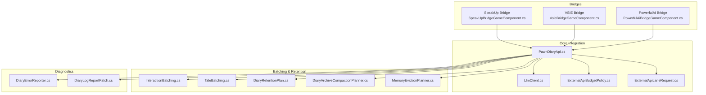
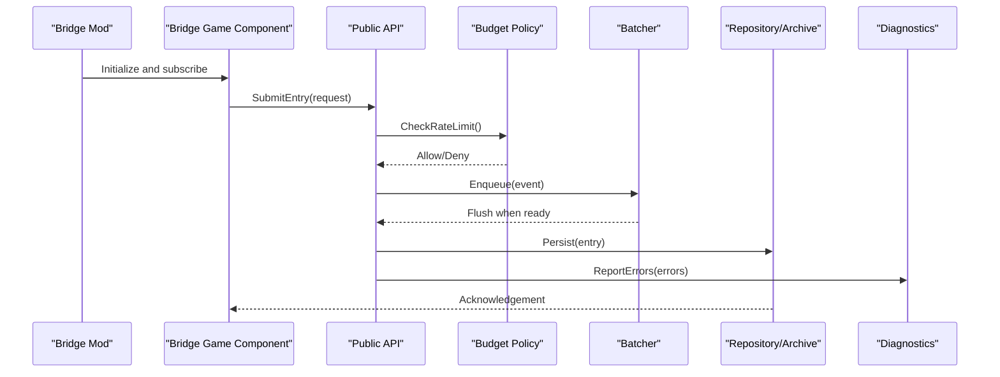
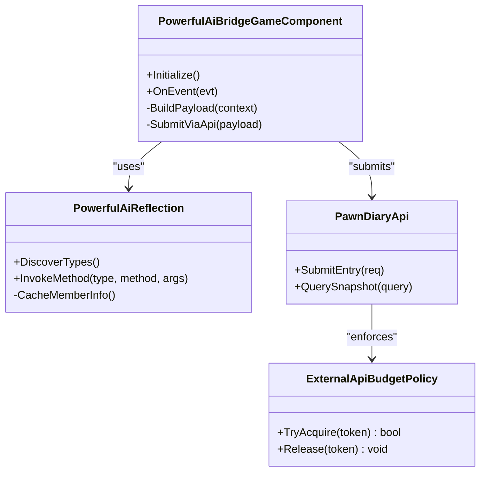
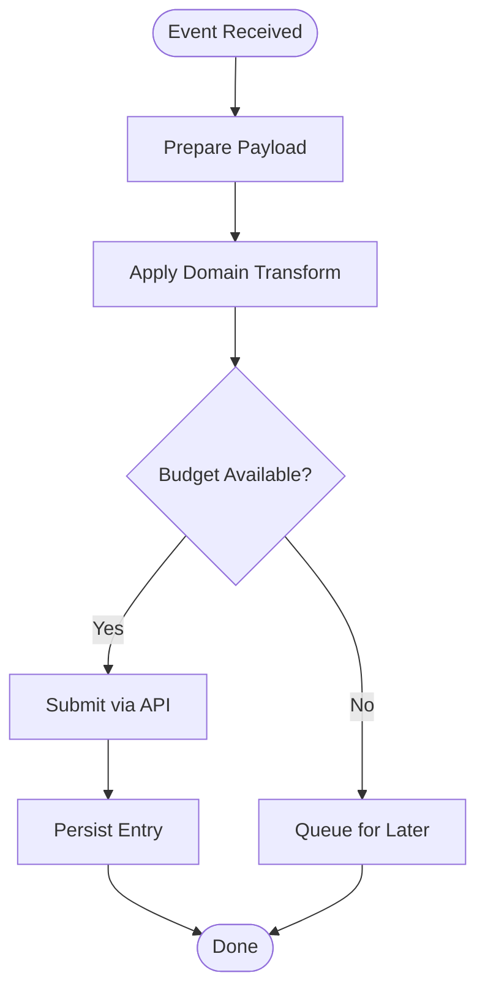
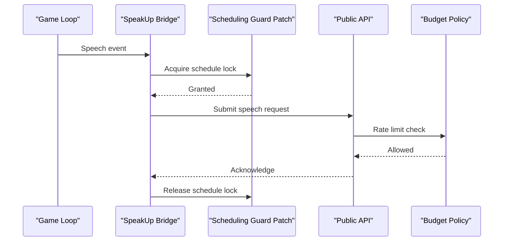
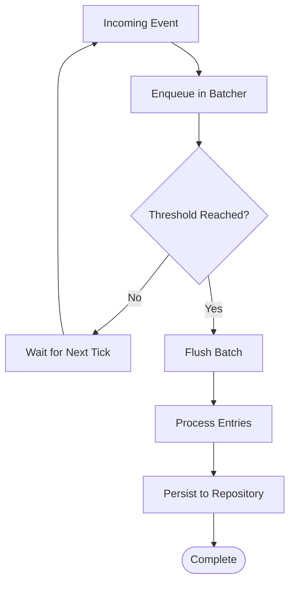
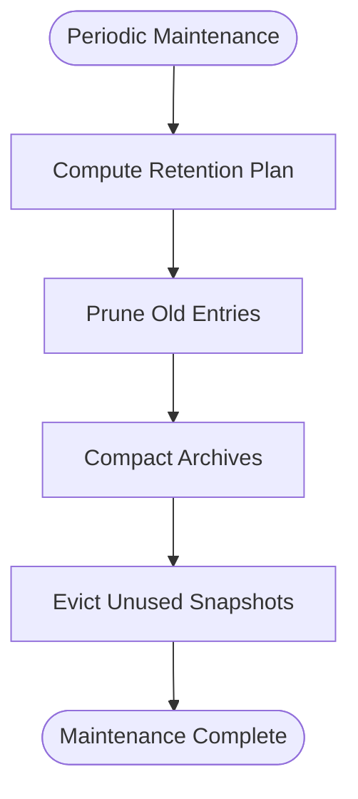
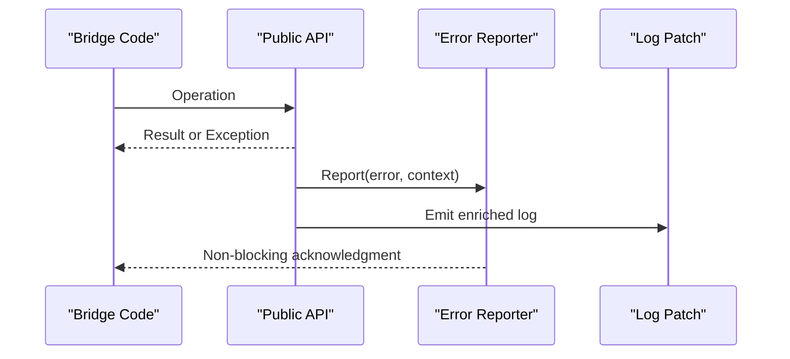
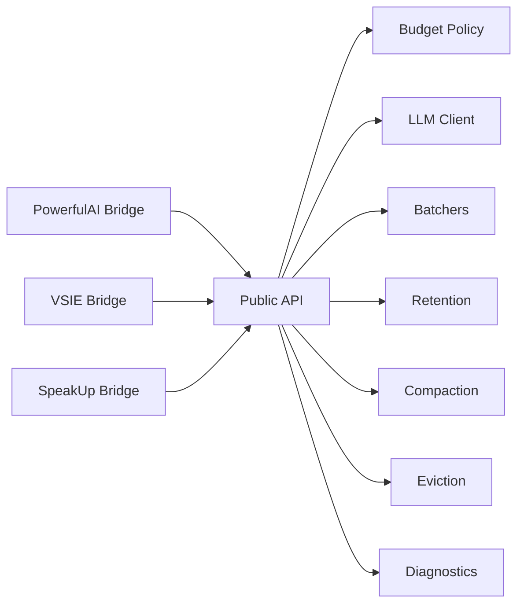

# Advanced Techniques & Optimization

- [PowerfulAiBridgeGameComponent.cs](../../../../../integrations/PawnDiary.PowerfulAiBridge/Source/PowerfulAiBridgeGameComponent.cs)
- PowerfulAiBridgeMod.cs
- [PowerfulAiReflection.cs](../../../../../integrations/PawnDiary.PowerfulAiBridge/Source/PowerfulAiReflection.cs)
- VsieBridgeGameComponent.cs
- [VsieBridgeMod.cs](../../../../../integrations/PawnDiary.Vsie/Source/VsieBridgeMod.cs)
- [SpeakUpBridgeGameComponent.cs](../../../../../integrations/PawnDiary.SpeakUp/Source/SpeakUpBridgeGameComponent.cs)
- [SpeakUpBridgeMod.cs](../../../../../integrations/PawnDiary.SpeakUp/Source/SpeakUpBridgeMod.cs)
- [SpeakUpReplySchedulingGuardPatch.cs](../../../../../Source/Patches/SpeakUpReplySchedulingGuardPatch.cs)
- [DiaryGameComponent.InteractionBatching.cs](../../../../../Source/Core/DiaryGameComponent.InteractionBatching.cs)
- [DiaryGameComponent.TaleBatching.cs](../../../../../Source/Core/DiaryGameComponent.TaleBatching.cs)
- [ExternalApiBudgetPolicy.cs](../../../../../Source/Pipeline/ExternalApiBudgetPolicy.cs)
- [ExternalApiLaneRequest.cs](../../../../../Source/Integration/ExternalApiLaneRequest.cs)
- [PawnDiaryApi.cs](../../../../../Source/Integration/PawnDiaryApi.cs)
- [LlmClient.cs](../../../../../Source/Generation/LlmClient.cs)
- [MemoryEvictionPlanner.cs](../../../../../Source/Pipeline/Memory/MemoryEvictionPlanner.cs)
- [DiaryRetentionPlan.cs](../../../../../Source/Pipeline/DiaryRetentionPlan.cs)
- [DiaryArchiveCompactionPlanner.cs](../../../../../Source/Pipeline/DiaryArchiveCompactionPlanner.cs)
- [DiaryErrorReporter.cs](../../../../../Source/Diagnostics/DiaryErrorReporter.cs)
- [DiaryLogReportPatch.cs](../../../../../Source/Diagnostics/DiaryLogReportPatch.cs)
## Table of Contents
1. [Introduction](#introduction)
2. [Project Structure](#project-structure)
3. [Core Components](#core-components)
4. [Architecture Overview](#architecture-overview)
5. [Detailed Component Analysis](#detailed-component-analysis)
6. [Dependency Analysis](#dependency-analysis)
7. [Performance Considerations](#performance-considerations)
8. [Troubleshooting Guide](#troubleshooting-guide)
9. [Conclusion](#conclusion)

## Introduction
This document focuses on advanced integration techniques and optimization strategies used by specialized bridges that connect the core system to external services: PowerfulAI Bridge, VSIE Bridge, and SpeakUp Bridge. It analyzes performance optimization patterns, memory management strategies, efficient data processing approaches, asynchronous operations, batch processing, caching strategies, resource management, debugging techniques, profiling methods, and troubleshooting common integration issues. The goal is to provide guidelines for creating high-performance bridges that maintain game stability while delivering rich functionality.

## Project Structure
The repository organizes bridge implementations under integrations, each with its own mod entry point, game component, and supporting utilities. Core batching, budgeting, retention, and diagnostics are implemented in the main Source tree and consumed by bridges.

**Diagram sources**
- [PowerfulAiBridgeGameComponent.cs](../../../../../integrations/PawnDiary.PowerfulAiBridge/Source/PowerfulAiBridgeGameComponent.cs)
- VsieBridgeGameComponent.cs
- [SpeakUpBridgeGameComponent.cs](../../../../../integrations/PawnDiary.SpeakUp/Source/SpeakUpBridgeGameComponent.cs)
- [PawnDiaryApi.cs](../../../../../Source/Integration/PawnDiaryApi.cs)
- [LlmClient.cs](../../../../../Source/Generation/LlmClient.cs)
- [ExternalApiBudgetPolicy.cs](../../../../../Source/Pipeline/ExternalApiBudgetPolicy.cs)
- [ExternalApiLaneRequest.cs](../../../../../Source/Integration/ExternalApiLaneRequest.cs)
- [DiaryGameComponent.InteractionBatching.cs](../../../../../Source/Core/DiaryGameComponent.InteractionBatching.cs)
- [DiaryGameComponent.TaleBatching.cs](../../../../../Source/Core/DiaryGameComponent.TaleBatching.cs)
- [DiaryRetentionPlan.cs](../../../../../Source/Pipeline/DiaryRetentionPlan.cs)
- [DiaryArchiveCompactionPlanner.cs](../../../../../Source/Pipeline/DiaryArchiveCompactionPlanner.cs)
- [MemoryEvictionPlanner.cs](../../../../../Source/Pipeline/Memory/MemoryEvictionPlanner.cs)
- [DiaryErrorReporter.cs](../../../../../Source/Diagnostics/DiaryErrorReporter.cs)
- [DiaryLogReportPatch.cs](../../../../../Source/Diagnostics/DiaryLogReportPatch.cs)

**Section sources**
- [PowerfulAiBridgeGameComponent.cs](../../../../../integrations/PawnDiary.PowerfulAiBridge/Source/PowerfulAiBridgeGameComponent.cs)
- VsieBridgeGameComponent.cs
- [SpeakUpBridgeGameComponent.cs](../../../../../integrations/PawnDiary.SpeakUp/Source/SpeakUpBridgeGameComponent.cs)
- [PawnDiaryApi.cs](../../../../../Source/Integration/PawnDiaryApi.cs)
- [LlmClient.cs](../../../../../Source/Generation/LlmClient.cs)
- [ExternalApiBudgetPolicy.cs](../../../../../Source/Pipeline/ExternalApiBudgetPolicy.cs)
- [ExternalApiLaneRequest.cs](../../../../../Source/Integration/ExternalApiLaneRequest.cs)
- [DiaryGameComponent.InteractionBatching.cs](../../../../../Source/Core/DiaryGameComponent.InteractionBatching.cs)
- [DiaryGameComponent.TaleBatching.cs](../../../../../Source/Core/DiaryGameComponent.TaleBatching.cs)
- [DiaryRetentionPlan.cs](../../../../../Source/Pipeline/DiaryRetentionPlan.cs)
- [DiaryArchiveCompactionPlanner.cs](../../../../../Source/Pipeline/DiaryArchiveCompactionPlanner.cs)
- [MemoryEvictionPlanner.cs](../../../../../Source/Pipeline/Memory/MemoryEvictionPlanner.cs)
- [DiaryErrorReporter.cs](../../../../../Source/Diagnostics/DiaryErrorReporter.cs)
- [DiaryLogReportPatch.cs](../../../../../Source/Diagnostics/DiaryLogReportPatch.cs)

## Core Components
- Bridge Game Components: Each bridge registers a game component that subscribes to events, prepares payloads, and submits them via the public API. They encapsulate bridge-specific logic such as reflection or scheduling guards.
- Public API: A stable surface for bridges to submit entries, queries, and requests. Bridges should prefer this over direct internal calls to ensure compatibility and safety.
- External API Budget Policy: Enforces rate limits and throttling to protect game performance and external service quotas.
- Batching: Interaction and tale batching reduce per-frame overhead by coalescing updates into periodic flushes.
- Retention and Compaction: Manage memory footprint by pruning old entries and compacting archives.
- Diagnostics: Centralized error reporting and log patching aid debugging without impacting runtime performance.

**Section sources**
- [PowerfulAiBridgeGameComponent.cs](../../../../../integrations/PawnDiary.PowerfulAiBridge/Source/PowerfulAiBridgeGameComponent.cs)
- VsieBridgeGameComponent.cs
- [SpeakUpBridgeGameComponent.cs](../../../../../integrations/PawnDiary.SpeakUp/Source/SpeakUpBridgeGameComponent.cs)
- [PawnDiaryApi.cs](../../../../../Source/Integration/PawnDiaryApi.cs)
- [ExternalApiBudgetPolicy.cs](../../../../../Source/Pipeline/ExternalApiBudgetPolicy.cs)
- [DiaryGameComponent.InteractionBatching.cs](../../../../../Source/Core/DiaryGameComponent.InteractionBatching.cs)
- [DiaryGameComponent.TaleBatching.cs](../../../../../Source/Core/DiaryGameComponent.TaleBatching.cs)
- [DiaryRetentionPlan.cs](../../../../../Source/Pipeline/DiaryRetentionPlan.cs)
- [DiaryArchiveCompactionPlanner.cs](../../../../../Source/Pipeline/DiaryArchiveCompactionPlanner.cs)
- [MemoryEvictionPlanner.cs](../../../../../Source/Pipeline/Memory/MemoryEvictionPlanner.cs)
- [DiaryErrorReporter.cs](../../../../../Source/Diagnostics/DiaryErrorReporter.cs)
- [DiaryLogReportPatch.cs](../../../../../Source/Diagnostics/DiaryLogReportPatch.cs)

## Architecture Overview
The bridges integrate through a layered architecture:
- Presentation Layer: Bridge mods initialize components and patches.
- Integration Layer: Public API exposes safe endpoints for submissions and queries.
- Processing Layer: Budgeting, batching, and retention policies shape throughput and memory usage.
- Storage Layer: Diary repositories and archives persist data efficiently.
- Diagnostics Layer: Error reporting and log patching capture issues without blocking gameplay.

**Diagram sources**
- PowerfulAiBridgeMod.cs
- [VsieBridgeMod.cs](../../../../../integrations/PawnDiary.Vsie/Source/VsieBridgeMod.cs)
- [SpeakUpBridgeMod.cs](../../../../../integrations/PawnDiary.SpeakUp/Source/SpeakUpBridgeMod.cs)
- [PawnDiaryApi.cs](../../../../../Source/Integration/PawnDiaryApi.cs)
- [ExternalApiBudgetPolicy.cs](../../../../../Source/Pipeline/ExternalApiBudgetPolicy.cs)
- [DiaryGameComponent.InteractionBatching.cs](../../../../../Source/Core/DiaryGameComponent.InteractionBatching.cs)
- [DiaryGameComponent.TaleBatching.cs](../../../../../Source/Core/DiaryGameComponent.TaleBatching.cs)
- [DiaryErrorReporter.cs](../../../../../Source/Diagnostics/DiaryErrorReporter.cs)

## Detailed Component Analysis

### PowerfulAI Bridge
Key responsibilities:
- Reflection-based discovery and invocation of target APIs.
- Efficient payload construction and submission via the public API.
- Graceful degradation if reflection fails or types are unavailable.

Optimization highlights:
- Use reflection caches to avoid repeated lookups.
- Defer heavy computations off the main thread where possible.
- Respect budget policy to prevent spikes.

**Diagram sources**
- [PowerfulAiBridgeGameComponent.cs](../../../../../integrations/PawnDiary.PowerfulAiBridge/Source/PowerfulAiBridgeGameComponent.cs)
- [PowerfulAiReflection.cs](../../../../../integrations/PawnDiary.PowerfulAiBridge/Source/PowerfulAiReflection.cs)
- [PawnDiaryApi.cs](../../../../../Source/Integration/PawnDiaryApi.cs)
- [ExternalApiBudgetPolicy.cs](../../../../../Source/Pipeline/ExternalApiBudgetPolicy.cs)

**Section sources**
- [PowerfulAiBridgeGameComponent.cs](../../../../../integrations/PawnDiary.PowerfulAiBridge/Source/PowerfulAiBridgeGameComponent.cs)
- [PowerfulAiReflection.cs](../../../../../integrations/PawnDiary.PowerfulAiBridge/Source/PowerfulAiReflection.cs)
- PowerfulAiBridgeMod.cs
- [PawnDiaryApi.cs](../../../../../Source/Integration/PawnDiaryApi.cs)
- [ExternalApiBudgetPolicy.cs](../../../../../Source/Pipeline/ExternalApiBudgetPolicy.cs)

### VSIE Bridge
Key responsibilities:
- Subscribes to relevant game events and translates them into bridge-specific payloads.
- Coordinates with the public API for submission and retrieval.
- Applies domain-specific transformations before sending data.

Optimization highlights:
- Minimize allocations by reusing buffers and avoiding string concatenation hot paths.
- Batch small updates to reduce API calls.
- Use snapshot queries to avoid deep traversal during UI rendering.

**Diagram sources**
- VsieBridgeGameComponent.cs
- [VsieBridgeMod.cs](../../../../../integrations/PawnDiary.Vsie/Source/VsieBridgeMod.cs)
- [ExternalApiBudgetPolicy.cs](../../../../../Source/Pipeline/ExternalApiBudgetPolicy.cs)
- [PawnDiaryApi.cs](../../../../../Source/Integration/PawnDiaryApi.cs)

**Section sources**
- VsieBridgeGameComponent.cs
- [VsieBridgeMod.cs](../../../../../integrations/PawnDiary.Vsie/Source/VsieBridgeMod.cs)
- [ExternalApiBudgetPolicy.cs](../../../../../Source/Pipeline/ExternalApiBudgetPolicy.cs)
- [PawnDiaryApi.cs](../../../../../Source/Integration/PawnDiaryApi.cs)

### SpeakUp Bridge
Key responsibilities:
- Integrates speech-related events and replies.
- Schedules replies safely to avoid conflicts with other systems.
- Uses patches to guard reply scheduling and prevent race conditions.

Optimization highlights:
- Guarded scheduling ensures only one reply path runs at a time.
- Coalesce rapid speech events to avoid redundant processing.
- Leverage batching to group related voice outputs.

**Diagram sources**
- [SpeakUpBridgeGameComponent.cs](../../../../../integrations/PawnDiary.SpeakUp/Source/SpeakUpBridgeGameComponent.cs)
- [SpeakUpBridgeMod.cs](../../../../../integrations/PawnDiary.SpeakUp/Source/SpeakUpBridgeMod.cs)
- [SpeakUpReplySchedulingGuardPatch.cs](../../../../../Source/Patches/SpeakUpReplySchedulingGuardPatch.cs)
- [PawnDiaryApi.cs](../../../../../Source/Integration/PawnDiaryApi.cs)
- [ExternalApiBudgetPolicy.cs](../../../../../Source/Pipeline/ExternalApiBudgetPolicy.cs)

**Section sources**
- [SpeakUpBridgeGameComponent.cs](../../../../../integrations/PawnDiary.SpeakUp/Source/SpeakUpBridgeGameComponent.cs)
- [SpeakUpBridgeMod.cs](../../../../../integrations/PawnDiary.SpeakUp/Source/SpeakUpBridgeMod.cs)
- [SpeakUpReplySchedulingGuardPatch.cs](../../../../../Source/Patches/SpeakUpReplySchedulingGuardPatch.cs)
- [PawnDiaryApi.cs](../../../../../Source/Integration/PawnDiaryApi.cs)
- [ExternalApiBudgetPolicy.cs](../../../../../Source/Pipeline/ExternalApiBudgetPolicy.cs)

### Asynchronous Operations and Threading
Guidelines:
- Offload long-running work (reflection, serialization, network I/O) to background tasks.
- Avoid holding locks across async boundaries.
- Use cancellation tokens to abort pending work when the game pauses or exits.
- Ensure all UI-bound operations run on the main thread.

[No sources needed since this section provides general guidance]

### Batch Processing Patterns
Patterns observed:
- Interaction batching aggregates frequent micro-events into periodic flushes.
- Tale batching consolidates narrative updates to reduce churn.
- Bridges should enqueue events rather than submitting immediately, letting the core decide optimal flush timing.

**Diagram sources**
- [DiaryGameComponent.InteractionBatching.cs](../../../../../Source/Core/DiaryGameComponent.InteractionBatching.cs)
- [DiaryGameComponent.TaleBatching.cs](../../../../../Source/Core/DiaryGameComponent.TaleBatching.cs)

**Section sources**
- [DiaryGameComponent.InteractionBatching.cs](../../../../../Source/Core/DiaryGameComponent.InteractionBatching.cs)
- [DiaryGameComponent.TaleBatching.cs](../../../../../Source/Core/DiaryGameComponent.TaleBatching.cs)

### Caching Strategies
Recommendations:
- Cache reflection metadata and frequently accessed type/method info.
- Maintain short-lived caches for computed snapshots to avoid recomputation.
- Implement eviction policies aligned with memory budgets.

**Section sources**
- [PowerfulAiReflection.cs](../../../../../integrations/PawnDiary.PowerfulAiBridge/Source/PowerfulAiReflection.cs)
- [MemoryEvictionPlanner.cs](../../../../../Source/Pipeline/Memory/MemoryEvictionPlanner.cs)

### Memory Management and Retention
Strategies:
- Use retention plans to prune older entries based on configurable policies.
- Compact archives periodically to reclaim space and improve IO performance.
- Monitor memory pressure and trigger evictions proactively.

**Diagram sources**
- [DiaryRetentionPlan.cs](../../../../../Source/Pipeline/DiaryRetentionPlan.cs)
- [DiaryArchiveCompactionPlanner.cs](../../../../../Source/Pipeline/DiaryArchiveCompactionPlanner.cs)
- [MemoryEvictionPlanner.cs](../../../../../Source/Pipeline/Memory/MemoryEvictionPlanner.cs)

**Section sources**
- [DiaryRetentionPlan.cs](../../../../../Source/Pipeline/DiaryRetentionPlan.cs)
- [DiaryArchiveCompactionPlanner.cs](../../../../../Source/Pipeline/DiaryArchiveCompactionPlanner.cs)
- [MemoryEvictionPlanner.cs](../../../../../Source/Pipeline/Memory/MemoryEvictionPlanner.cs)

### Resource Management and Budgeting
Approach:
- Enforce external API budgets to cap request rates and smooth CPU usage.
- Use lane-specific requests to isolate workloads and prioritize critical flows.
- Release resources promptly after use; avoid lingering references.

**Section sources**
- [ExternalApiBudgetPolicy.cs](../../../../../Source/Pipeline/ExternalApiBudgetPolicy.cs)
- [ExternalApiLaneRequest.cs](../../../../../Source/Integration/ExternalApiLaneRequest.cs)

### Debugging Techniques and Profiling Methods
Techniques:
- Centralized error reporter captures exceptions and contextual details without crashing the game.
- Log report patch enriches logs with structured information for faster triage.
- Use diagnostic snapshots and query endpoints to inspect state without intrusive logging.

**Diagram sources**
- [DiaryErrorReporter.cs](../../../../../Source/Diagnostics/DiaryErrorReporter.cs)
- [DiaryLogReportPatch.cs](../../../../../Source/Diagnostics/DiaryLogReportPatch.cs)
- [PawnDiaryApi.cs](../../../../../Source/Integration/PawnDiaryApi.cs)

**Section sources**
- [DiaryErrorReporter.cs](../../../../../Source/Diagnostics/DiaryErrorReporter.cs)
- [DiaryLogReportPatch.cs](../../../../../Source/Diagnostics/DiaryLogReportPatch.cs)
- [PawnDiaryApi.cs](../../../../../Source/Integration/PawnDiaryApi.cs)

## Dependency Analysis
Bridges depend on the public API and shared pipeline policies. Strong cohesion exists within each bridge’s component and reflection utilities. Loose coupling is achieved by using standardized request/response contracts and budget enforcement.

**Diagram sources**
- [PowerfulAiBridgeGameComponent.cs](../../../../../integrations/PawnDiary.PowerfulAiBridge/Source/PowerfulAiBridgeGameComponent.cs)
- VsieBridgeGameComponent.cs
- [SpeakUpBridgeGameComponent.cs](../../../../../integrations/PawnDiary.SpeakUp/Source/SpeakUpBridgeGameComponent.cs)
- [PawnDiaryApi.cs](../../../../../Source/Integration/PawnDiaryApi.cs)
- [ExternalApiBudgetPolicy.cs](../../../../../Source/Pipeline/ExternalApiBudgetPolicy.cs)
- [LlmClient.cs](../../../../../Source/Generation/LlmClient.cs)
- [DiaryGameComponent.InteractionBatching.cs](../../../../../Source/Core/DiaryGameComponent.InteractionBatching.cs)
- [DiaryGameComponent.TaleBatching.cs](../../../../../Source/Core/DiaryGameComponent.TaleBatching.cs)
- [DiaryRetentionPlan.cs](../../../../../Source/Pipeline/DiaryRetentionPlan.cs)
- [DiaryArchiveCompactionPlanner.cs](../../../../../Source/Pipeline/DiaryArchiveCompactionPlanner.cs)
- [MemoryEvictionPlanner.cs](../../../../../Source/Pipeline/Memory/MemoryEvictionPlanner.cs)
- [DiaryErrorReporter.cs](../../../../../Source/Diagnostics/DiaryErrorReporter.cs)

**Section sources**
- [PowerfulAiBridgeGameComponent.cs](../../../../../integrations/PawnDiary.PowerfulAiBridge/Source/PowerfulAiBridgeGameComponent.cs)
- VsieBridgeGameComponent.cs
- [SpeakUpBridgeGameComponent.cs](../../../../../integrations/PawnDiary.SpeakUp/Source/SpeakUpBridgeGameComponent.cs)
- [PawnDiaryApi.cs](../../../../../Source/Integration/PawnDiaryApi.cs)
- [ExternalApiBudgetPolicy.cs](../../../../../Source/Pipeline/ExternalApiBudgetPolicy.cs)
- [LlmClient.cs](../../../../../Source/Generation/LlmClient.cs)
- [DiaryGameComponent.InteractionBatching.cs](../../../../../Source/Core/DiaryGameComponent.InteractionBatching.cs)
- [DiaryGameComponent.TaleBatching.cs](../../../../../Source/Core/DiaryGameComponent.TaleBatching.cs)
- [DiaryRetentionPlan.cs](../../../../../Source/Pipeline/DiaryRetentionPlan.cs)
- [DiaryArchiveCompactionPlanner.cs](../../../../../Source/Pipeline/DiaryArchiveCompactionPlanner.cs)
- [MemoryEvictionPlanner.cs](../../../../../Source/Pipeline/Memory/MemoryEvictionPlanner.cs)
- [DiaryErrorReporter.cs](../../../../../Source/Diagnostics/DiaryErrorReporter.cs)

## Performance Considerations
- Prefer batching over immediate submissions to reduce per-event overhead.
- Apply budget policies to smooth request rates and avoid spikes.
- Cache reflection and computed results; implement eviction aligned with memory budgets.
- Keep hot paths allocation-free; reuse buffers and avoid unnecessary string operations.
- Use retention and compaction to keep storage lean and IO fast.
- Profile with low-cost diagnostics; avoid heavy logging in tight loops.

[No sources needed since this section provides general guidance]

## Troubleshooting Guide
Common issues and resolutions:
- Excessive CPU usage: Verify budget policy is enabled and thresholds are appropriate; enable batching.
- Stuttering on speech events: Ensure scheduling guard patch is active and not conflicting with other mods.
- High memory growth: Tune retention plan and compaction intervals; monitor eviction planner activity.
- Intermittent failures: Inspect centralized error reports and enriched logs for root causes.

**Section sources**
- [ExternalApiBudgetPolicy.cs](../../../../../Source/Pipeline/ExternalApiBudgetPolicy.cs)
- [SpeakUpReplySchedulingGuardPatch.cs](../../../../../Source/Patches/SpeakUpReplySchedulingGuardPatch.cs)
- [DiaryRetentionPlan.cs](../../../../../Source/Pipeline/DiaryRetentionPlan.cs)
- [DiaryArchiveCompactionPlanner.cs](../../../../../Source/Pipeline/DiaryArchiveCompactionPlanner.cs)
- [MemoryEvictionPlanner.cs](../../../../../Source/Pipeline/Memory/MemoryEvictionPlanner.cs)
- [DiaryErrorReporter.cs](../../../../../Source/Diagnostics/DiaryErrorReporter.cs)
- [DiaryLogReportPatch.cs](../../../../../Source/Diagnostics/DiaryLogReportPatch.cs)

## Conclusion
High-performance bridges rely on disciplined use of batching, budgeting, caching, and retention. By leveraging the public API, adhering to threading best practices, and employing robust diagnostics, bridges can deliver rich functionality while preserving game stability. The patterns demonstrated by PowerfulAI, VSIE, and SpeakUp bridges serve as practical blueprints for building scalable integrations.
