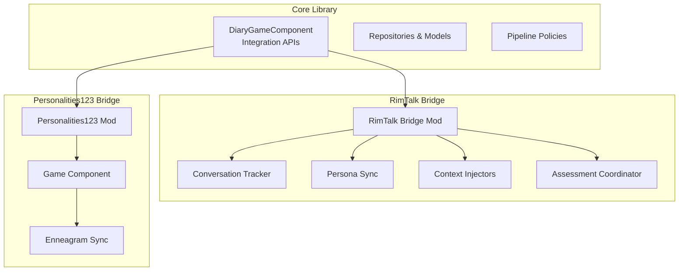
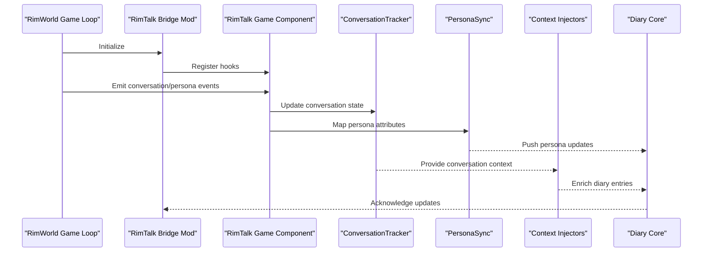
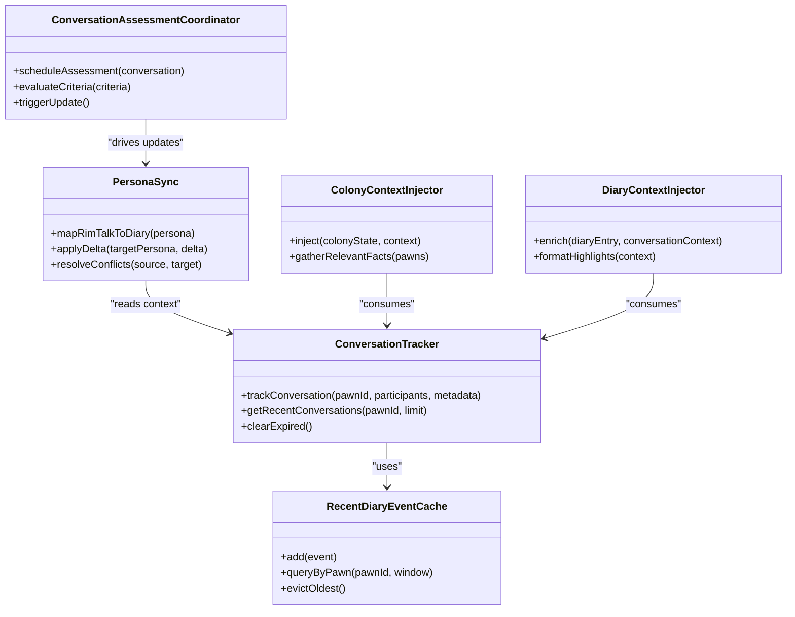
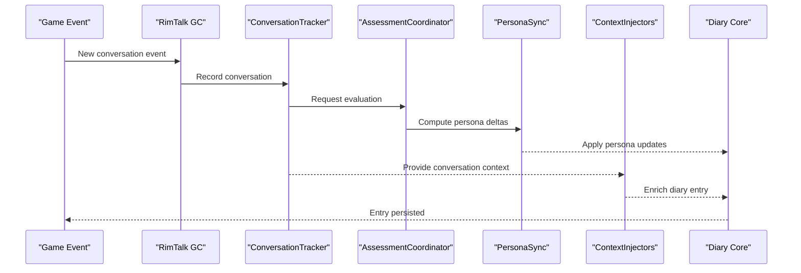
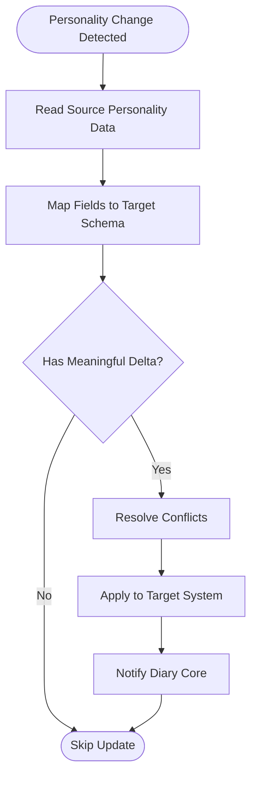
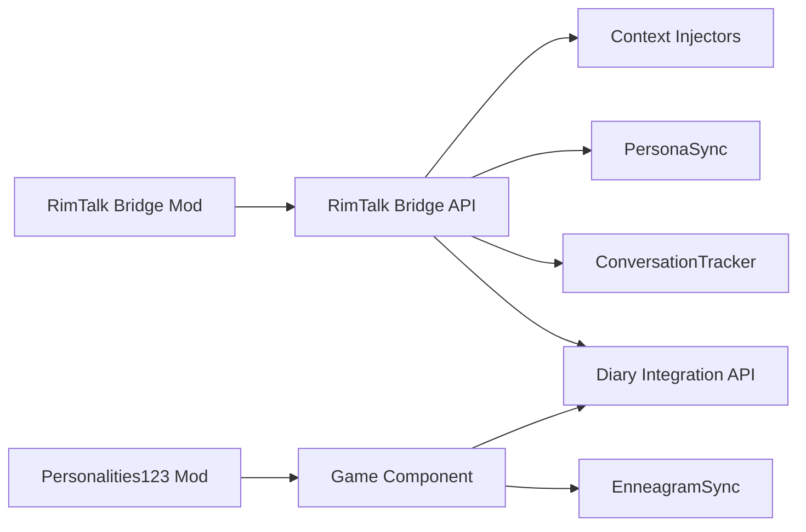

# Complex Integration Patterns

## Table of Contents
1. [Introduction](#introduction)
2. [Project Structure](#project-structure)
3. [Core Components](#core-components)
4. [Architecture Overview](#architecture-overview)
5. [Detailed Component Analysis](#detailed-component-analysis)
6. [Dependency Analysis](#dependency-analysis)
7. [Performance Considerations](#performance-considerations)
8. [Troubleshooting Guide](#troubleshooting-guide)
9. [Conclusion](#conclusion)

## Introduction
This document analyzes complex integration patterns demonstrated by the RimTalk Bridge and Personalities123 Bridge implementations within the Pawn Diary ecosystem. It focuses on bidirectional synchronization mechanisms, state management strategies, performance optimization techniques, conversation tracking, personality system mapping, and real-time data synchronization. The analysis includes architectural decisions, trade-offs, and lessons learned from implementing sophisticated mod integrations, with practical examples for handling complex game state changes while maintaining consistency across multiple mods.

## Project Structure
The repository organizes integration logic into dedicated bridge modules under integrations/. Each bridge encapsulates its own mod-specific adapters, API contracts, and synchronization policies. The core library provides shared infrastructure for event capture, context injection, persistence, and external API lanes used by bridges to integrate with third-party systems.

[No sources needed since this diagram shows conceptual structure]

## Core Components
- RimTalk Bridge: Provides conversation tracking, persona synchronization, colony/diary context injection, and assessment coordination to align RimTalk’s conversational model with Pawn Diary’s narrative pipeline.
- Personalities123 Bridge: Synchronizes personality traits (e.g., Enneagram types) between the Personalities123 mod and Pawn Diary, ensuring consistent persona representation across both systems.

Key responsibilities:
- Bidirectional sync: Keep both source and target systems updated when either side changes.
- State management: Maintain canonical state and reconcile conflicts deterministically.
- Performance: Batch updates, cache recent events, and throttle heavy operations.
- Real-time synchronization: React to in-game events and propagate changes promptly without blocking gameplay.

**Section sources**
- [PawnDiaryRimTalkBridgeMod.cs](../../../../../integrations/PawnDiary.RimTalkBridge/Source/PawnDiaryRimTalkBridgeMod.cs)
- [Personalities123Mod.cs](../../../../../integrations/PawnDiary.PersonalitiesBridge/Source/PawnDiaryPersonalities123Mod.cs)

## Architecture Overview
Both bridges follow a common pattern:
- Mod entry points initialize components and register lifecycle hooks.
- Game components observe game events and translate them into domain-specific signals.
- Sync engines map and reconcile state between the host mod and Pawn Diary.
- Context injectors enrich diary entries and prompts with cross-mod information.
- Assessment or policy layers decide when and how to update targets based on thresholds or conditions.

**Diagram sources**
- [PawnDiaryRimTalkBridgeMod.cs](../../../../../integrations/PawnDiary.RimTalkBridge/Source/PawnDiaryRimTalkBridgeMod.cs)
- [ConversationTracker.cs](../../../../../integrations/PawnDiary.RimTalkBridge/Source/ConversationTracker.cs)
- [PersonaSync.cs](../../../../../integrations/PawnDiary.RimTalkBridge/Source/PersonaSync.cs)
- [DiaryContextInjector.cs](../../../../../integrations/PawnDiary.RimTalkBridge/Source/DiaryContextInjector.cs)

## Detailed Component Analysis

### RimTalk Bridge: Conversation Tracking and Persona Synchronization
The RimTalk Bridge implements a robust conversation tracking system that captures dialog events, maintains per-pawn conversation history, and exposes conversation context to the diary pipeline. Persona synchronization maps RimTalk persona attributes to Pawn Diary personas, enabling consistent characterization across both systems.

Key elements:
- ConversationTracker: Maintains conversation timelines, speaker-listener relationships, and contextual metadata.
- PersonaSync: Maps persona fields, resolves conflicts, and applies deltas to avoid redundant writes.
- ColonyContextInjector and DiaryContextInjector: Enrich context with colony-level and diary-specific details derived from conversations and personas.
- RecentDiaryEventCache: Optimizes lookups for recent events to reduce overhead during prompt generation.
- ConversationAssessmentCoordinator and PolicyDefs: Decide when assessments should be triggered based on conversation dynamics and persona chattiness.

**Diagram sources**
- [ConversationTracker.cs](../../../../../integrations/PawnDiary.RimTalkBridge/Source/ConversationTracker.cs)
- [PersonaSync.cs](../../../../../integrations/PawnDiary.RimTalkBridge/Source/PersonaSync.cs)
- [ColonyContextInjector.cs](../../../../../integrations/PawnDiary.RimTalkBridge/Source/ColonyContextInjector.cs)
- [DiaryContextInjector.cs](../../../../../integrations/PawnDiary.RimTalkBridge/Source/DiaryContextInjector.cs)
- [RecentDiaryEventCache.cs](../../../../../integrations/PawnDiary.RimTalkBridge/Source/RecentDiaryEventCache.cs)
- [ConversationAssessmentCoordinator.cs](../../../../../integrations/PawnDiary.RimTalkBridge/Source/ConversationAssessmentCoordinator.cs)
- [ConversationAssessmentPolicyDef.cs](../../../../../integrations/PawnDiary.RimTalkBridge/Source/ConversationAssessmentPolicyDef.cs)
- [PersonaChattinessPolicyDef.cs](../../../../../integrations/PawnDiary.RimTalkBridge/Source/PersonaChattinessPolicyDef.cs)

**Section sources**
- [ConversationTracker.cs](../../../../../integrations/PawnDiary.RimTalkBridge/Source/ConversationTracker.cs)
- [PersonaSync.cs](../../../../../integrations/PawnDiary.RimTalkBridge/Source/PersonaSync.cs)
- [ColonyContextInjector.cs](../../../../../integrations/PawnDiary.RimTalkBridge/Source/ColonyContextInjector.cs)
- [DiaryContextInjector.cs](../../../../../integrations/PawnDiary.RimTalkBridge/Source/DiaryContextInjector.cs)
- [RecentDiaryEventCache.cs](../../../../../integrations/PawnDiary.RimTalkBridge/Source/RecentDiaryEventCache.cs)
- [ConversationAssessmentCoordinator.cs](../../../../../integrations/PawnDiary.RimTalkBridge/Source/ConversationAssessmentCoordinator.cs)
- [ConversationAssessmentPolicyDef.cs](../../../../../integrations/PawnDiary.RimTalkBridge/Source/ConversationAssessmentPolicyDef.cs)
- [PersonaChattinessPolicyDef.cs](../../../../../integrations/PawnDiary.RimTalkBridge/Source/PersonaChattinessPolicyDef.cs)

#### Sequence: Conversation-to-Diary Flow

**Diagram sources**
- [ConversationTracker.cs](../../../../../integrations/PawnDiary.RimTalkBridge/Source/ConversationTracker.cs)
- [ConversationAssessmentCoordinator.cs](../../../../../integrations/PawnDiary.RimTalkBridge/Source/ConversationAssessmentCoordinator.cs)
- [PersonaSync.cs](../../../../../integrations/PawnDiary.RimTalkBridge/Source/PersonaSync.cs)
- [DiaryContextInjector.cs](../../../../../integrations/PawnDiary.RimTalkBridge/Source/DiaryContextInjector.cs)

### Personalities123 Bridge: Personality Mapping and Enneagram Sync
The Personalities123 Bridge synchronizes personality traits such as Enneagram types between the Personalities123 mod and Pawn Diary. It ensures that persona representations remain consistent across both systems and reacts to changes in either direction.

Key elements:
- Personalities123GameComponent: Observes personality changes and triggers sync routines.
- EnneagramSync: Maps Enneagram attributes to Pawn Diary persona fields, applying deltas and resolving conflicts.
- BridgeIds: Defines stable identifiers for cross-mod references.

**Diagram sources**
- [Personalities123GameComponent.cs](../../../../../integrations/PawnDiary.PersonalitiesBridge/Source/Personalities123GameComponent.cs)
- [EnneagramSync.cs](../../../../../integrations/PawnDiary.PersonalitiesBridge/Source/EnneagramSync.cs)
- [BridgeIds.cs](../../../../../integrations/PawnDiary.PersonalitiesBridge/Source/BridgeIds.cs)

**Section sources**
- [Personalities123Mod.cs](../../../../../integrations/PawnDiary.PersonalitiesBridge/Source/PawnDiaryPersonalities123Mod.cs)
- [Personalities123GameComponent.cs](../../../../../integrations/PawnDiary.PersonalitiesBridge/Source/Personalities123GameComponent.cs)
- [EnneagramSync.cs](../../../../../integrations/PawnDiary.PersonalitiesBridge/Source/EnneagramSync.cs)
- [BridgeIds.cs](../../../../../integrations/PawnDiary.PersonalitiesBridge/Source/BridgeIds.cs)

## Dependency Analysis
Bridges depend on core integration APIs and share common patterns for event observation, state reconciliation, and context enrichment. Dependencies are intentionally decoupled via well-defined interfaces and snapshot-based exchanges to minimize coupling and improve testability.

**Diagram sources**
- [PawnDiaryRimTalkBridgeMod.cs](../../../../../integrations/PawnDiary.RimTalkBridge/Source/PawnDiaryRimTalkBridgeMod.cs)
- [PawnDiaryRimTalkBridgeApi.cs](../../../../../integrations/PawnDiary.RimTalkBridge/Source/PawnDiaryRimTalkBridgeApi.cs)
- [Personalities123Mod.cs](../../../../../integrations/PawnDiary.PersonalitiesBridge/Source/PawnDiaryPersonalities123Mod.cs)
- [Personalities123GameComponent.cs](../../../../../integrations/PawnDiary.PersonalitiesBridge/Source/Personalities123GameComponent.cs)

**Section sources**
- [PawnDiaryRimTalkBridgeApi.cs](../../../../../integrations/PawnDiary.RimTalkBridge/Source/PawnDiaryRimTalkBridgeApi.cs)
- [BridgeIds.cs](../../../../../integrations/PawnDiary.PersonalitiesBridge/Source/BridgeIds.cs)

## Performance Considerations
- Batching and throttling: Group frequent updates (e.g., rapid persona changes) to reduce write amplification and UI churn.
- Caching recent events: Use RecentDiaryEventCache to speed up context assembly and avoid repeated queries.
- Delta-driven updates: Only apply meaningful changes to target systems to prevent unnecessary recomputation.
- Asynchronous processing: Offload heavy computations (e.g., assessments) to background tasks where possible.
- Snapshot-based exchange: Use immutable snapshots for inter-component communication to reduce locking and contention.

[No sources needed since this section provides general guidance]

## Troubleshooting Guide
Common issues and resolutions:
- Stale persona state: Ensure PersonaSync applies deltas correctly and clears expired caches; verify conflict resolution rules.
- Missing conversation context: Validate ConversationTracker retention windows and eviction policies; check assessment criteria thresholds.
- Duplicate diary entries: Confirm deduplication keys and ensure context injectors do not re-enter already processed contexts.
- Cross-mod ID mismatches: Verify BridgeIds definitions and ensure stable identifiers are used consistently across both mods.

Practical checks:
- Inspect assessment logs to confirm when evaluations trigger.
- Monitor cache sizes and eviction rates to tune retention windows.
- Compare source and target snapshots to identify drift and reconcile differences.

**Section sources**
- [RecentDiaryEventCache.cs](../../../../../integrations/PawnDiary.RimTalkBridge/Source/RecentDiaryEventCache.cs)
- [ConversationAssessmentCoordinator.cs](../../../../../integrations/PawnDiary.RimTalkBridge/Source/ConversationAssessmentCoordinator.cs)
- [PersonaSync.cs](../../../../../integrations/PawnDiary.RimTalkBridge/Source/PersonaSync.cs)
- [BridgeIds.cs](../../../../../integrations/PawnDiary.PersonalitiesBridge/Source/BridgeIds.cs)

## Conclusion
The RimTalk Bridge and Personalities123 Bridge demonstrate advanced integration patterns centered around bidirectional synchronization, robust state management, and performance-conscious design. By leveraging conversation tracking, persona mapping, context injection, and assessment policies, these bridges maintain consistency across multiple mods while preserving responsiveness. Key lessons include the importance of delta-driven updates, snapshot-based communication, and careful tuning of caching and batching strategies to balance accuracy and performance.

[No sources needed since this section summarizes without analyzing specific files]
