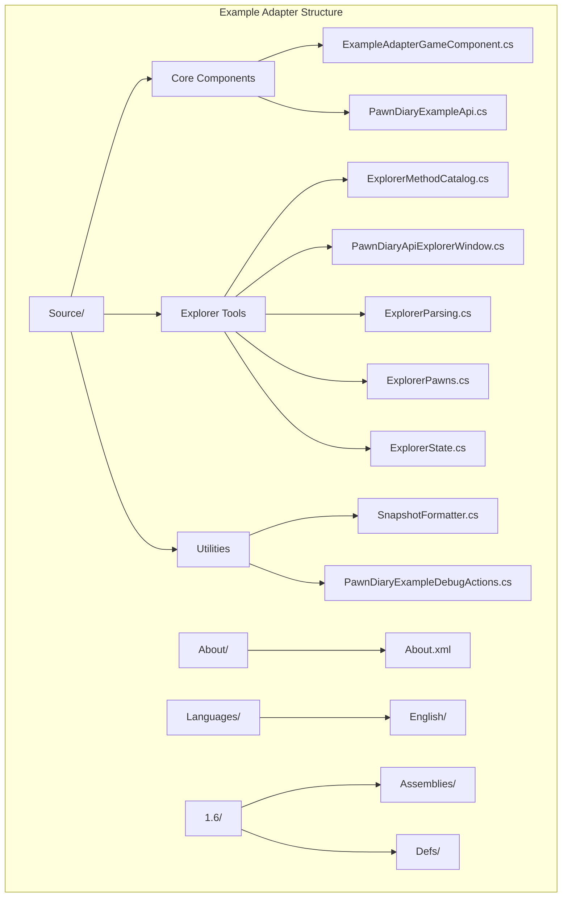
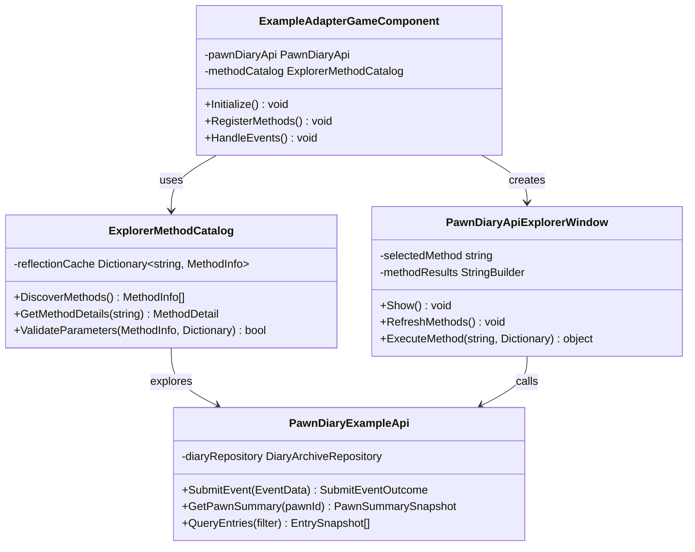
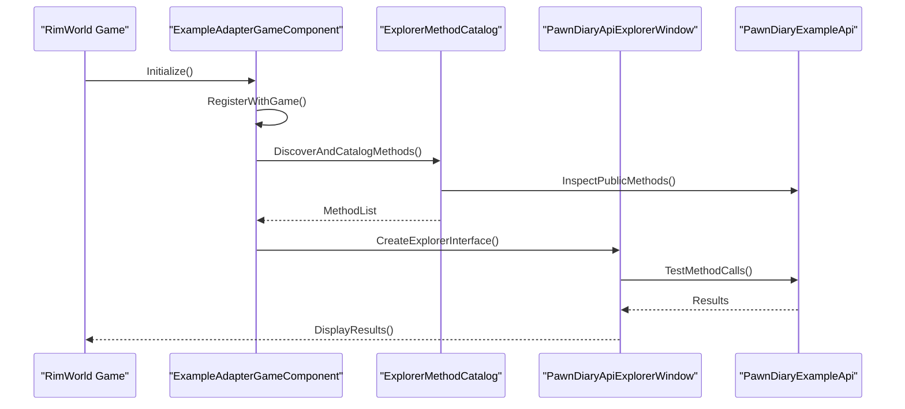
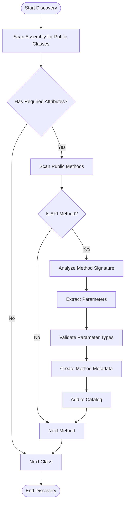
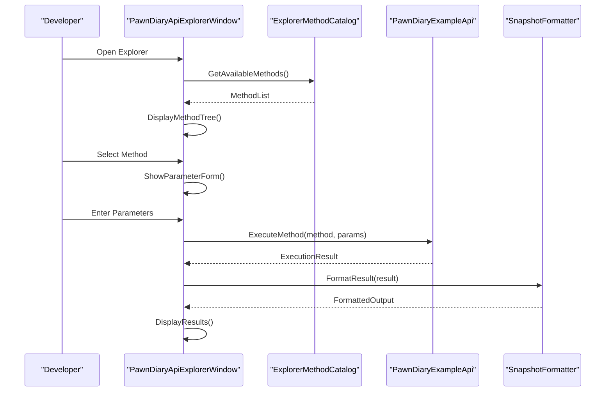
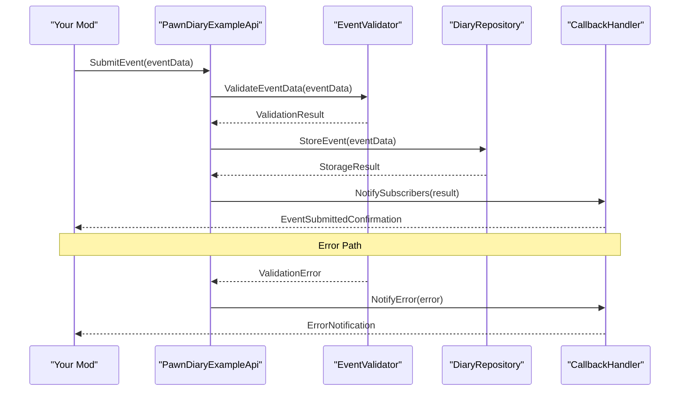

# Example Adapter Basics

<cite>
**Referenced Files in This Document**
- [ExampleAdapterGameComponent.cs](../../../../../integrations/PawnDiary.ExampleAdapter/Source/ExampleAdapterGameComponent.cs)
- [ExplorerMethodCatalog.cs](../../../../../integrations/PawnDiary.ExampleAdapter/Source/ExplorerMethodCatalog.cs)
- [PawnDiaryApiExplorerWindow.cs](../../../../../integrations/PawnDiary.ExampleAdapter/Source/PawnDiaryApiExplorerWindow.cs)
- [About.xml](../../../../../integrations/PawnDiary.ExampleAdapter/About/About.xml)
- [API_EXPLORER.md](../../../../../integrations/PawnDiary.ExampleAdapter/API_EXPLORER.md)
- [PawnDiaryExampleApi.cs](../../../../../integrations/PawnDiary.ExampleAdapter/Source/PawnDiaryExampleApi.cs)
- [ExplorerParsing.cs](../../../../../integrations/PawnDiary.ExampleAdapter/Source/ExplorerParsing.cs)
- [ExplorerPawns.cs](../../../../../integrations/PawnDiary.ExampleAdapter/Source/ExplorerPawns.cs)
- [ExplorerState.cs](../../../../../integrations/PawnDiary.ExampleAdapter/Source/ExplorerState.cs)
- [SnapshotFormatter.cs](../../../../../integrations/PawnDiary.ExampleAdapter/Source/SnapshotFormatter.cs)
- [PawnDiaryExampleDebugActions.cs](../../../../../integrations/PawnDiary.ExampleAdapter/Source/PawnDiaryExampleDebugActions.cs)
</cite>

## Table of Contents
1. [Introduction](#introduction)
2. [Project Structure](#project-structure)
3. [Core Components](#core-components)
4. [Architecture Overview](#architecture-overview)
5. [Detailed Component Analysis](#detailed-component-analysis)
6. [Integration Patterns](#integration-patterns)
7. [API Usage Guide](#api-usage-guide)
8. [Event Submission Workflow](#event-submission-workflow)
9. [Data Retrieval Patterns](#data-retrieval-patterns)
10. [UI Integration Examples](#ui-integration-examples)
11. [Error Handling Best Practices](#error-handling-best-practices)
12. [Development Setup](#development-setup)
13. [Troubleshooting Guide](#troubleshooting-guide)
14. [Conclusion](#conclusion)

## Introduction

The Example Adapter serves as a foundational reference implementation for connecting external mods to Pawn Diary. It demonstrates the complete integration pattern including API usage, event submission, data retrieval, and UI integration. This adapter provides a practical example that new mod developers can use as a template for their own Pawn Diary integrations.

The Example Adapter showcases several key concepts:
- Game component initialization and lifecycle management
- API method cataloging and discovery
- Interactive UI exploration of Pawn Diary capabilities
- Event submission and data retrieval workflows
- Error handling and debugging utilities

## Project Structure

The Example Adapter follows a modular structure organized by functionality:



**Diagram sources**
- [ExampleAdapterGameComponent.cs](../../../../../integrations/PawnDiary.ExampleAdapter/Source/ExampleAdapterGameComponent.cs)
- [ExplorerMethodCatalog.cs](../../../../../integrations/PawnDiary.ExampleAdapter/Source/ExplorerMethodCatalog.cs)
- [PawnDiaryApiExplorerWindow.cs](../../../../../integrations/PawnDiary.ExampleAdapter/Source/PawnDiaryApiExplorerWindow.cs)

**Section sources**
- [About.xml](../../../../../integrations/PawnDiary.ExampleAdapter/About/About.xml)

## Core Components

### ExampleAdapterGameComponent

The `ExampleAdapterGameComponent` serves as the main entry point for the Example Adapter. It handles initialization, registration, and lifecycle management of the adapter's functionality within the Pawn Diary ecosystem.

Key responsibilities include:
- Game component registration and initialization
- API method discovery and cataloging
- Event subscription and management
- Resource cleanup and disposal

### ExplorerMethodCatalog

The `ExplorerMethodCatalog` provides a comprehensive catalog of available Pawn Diary API methods. It enables dynamic discovery and exploration of the API surface, making it easier for developers to understand available functionality.

Features include:
- Method signature inspection
- Parameter validation
- Return type documentation
- Category-based organization

### PawnDiaryApiExplorerWindow

The `PawnDiaryApiExplorerWindow` is an interactive UI component that allows developers to explore and test Pawn Diary API methods directly within the game. It provides a user-friendly interface for API experimentation and debugging.

Capabilities include:
- Method browsing and filtering
- Parameter input forms
- Result visualization
- Error display and debugging

**Section sources**
- [ExampleAdapterGameComponent.cs](../../../../../integrations/PawnDiary.ExampleAdapter/Source/ExampleAdapterGameComponent.cs)
- [ExplorerMethodCatalog.cs](../../../../../integrations/PawnDiary.ExampleAdapter/Source/ExplorerMethodCatalog.cs)
- [PawnDiaryApiExplorerWindow.cs](../../../../../integrations/PawnDiary.ExampleAdapter/Source/PawnDiaryApiExplorerWindow.cs)

## Architecture Overview

The Example Adapter implements a layered architecture that separates concerns between core functionality, exploration tools, and presentation layers:



**Diagram sources**
- [ExampleAdapterGameComponent.cs](../../../../../integrations/PawnDiary.ExampleAdapter/Source/ExampleAdapterGameComponent.cs)
- [ExplorerMethodCatalog.cs](../../../../../integrations/PawnDiary.ExampleAdapter/Source/ExplorerMethodCatalog.cs)
- [PawnDiaryApiExplorerWindow.cs](../../../../../integrations/PawnDiary.ExampleAdapter/Source/PawnDiaryApiExplorerWindow.cs)
- [PawnDiaryExampleApi.cs](../../../../../integrations/PawnDiary.ExampleAdapter/Source/PawnDiaryExampleApi.cs)

## Detailed Component Analysis

### ExampleAdapterGameComponent Analysis

The `ExampleAdapterGameComponent` implements the standard game component pattern used throughout Pawn Diary integrations. It manages the adapter's lifecycle and coordinates between different subsystems.

#### Key Implementation Patterns



**Diagram sources**
- [ExampleAdapterGameComponent.cs](../../../../../integrations/PawnDiary.ExampleAdapter/Source/ExampleAdapterGameComponent.cs)
- [ExplorerMethodCatalog.cs](../../../../../integrations/PawnDiary.ExampleAdapter/Source/ExplorerMethodCatalog.cs)
- [PawnDiaryApiExplorerWindow.cs](../../../../../integrations/PawnDiary.ExampleAdapter/Source/PawnDiaryApiExplorerWindow.cs)
- [PawnDiaryExampleApi.cs](../../../../../integrations/PawnDiary.ExampleAdapter/Source/PawnDiaryExampleApi.cs)

#### Initialization Flow

The component follows a structured initialization process:

1. **Registration Phase**: Registers itself with the game's component system
2. **Discovery Phase**: Scans for available API methods
3. **Setup Phase**: Creates UI components and event handlers
4. **Ready Phase**: Signals completion and becomes active

**Section sources**
- [ExampleAdapterGameComponent.cs](../../../../../integrations/PawnDiary.ExampleAdapter/Source/ExampleAdapterGameComponent.cs)

### ExplorerMethodCatalog Analysis

The `ExplorerMethodCatalog` provides reflection-based method discovery and documentation generation for the Pawn Diary API.

#### Method Discovery Algorithm



**Diagram sources**
- [ExplorerMethodCatalog.cs](../../../../../integrations/PawnDiary.ExampleAdapter/Source/ExplorerMethodCatalog.cs)

#### Reflection-Based Inspection

The catalog uses .NET reflection to:
- Identify public methods with specific attributes
- Extract parameter types and constraints
- Generate human-readable method descriptions
- Provide parameter validation hints

**Section sources**
- [ExplorerMethodCatalog.cs](../../../../../integrations/PawnDiary.ExampleAdapter/Source/ExplorerMethodCatalog.cs)

### PawnDiaryApiExplorerWindow Analysis

The `PawnDiaryApiExplorerWindow` provides an interactive interface for exploring and testing Pawn Diary API methods.

#### UI Interaction Flow



**Diagram sources**
- [PawnDiaryApiExplorerWindow.cs](../../../../../integrations/PawnDiary.ExampleAdapter/Source/PawnDiaryApiExplorerWindow.cs)
- [ExplorerMethodCatalog.cs](../../../../../integrations/PawnDiary.ExampleAdapter/Source/ExplorerMethodCatalog.cs)
- [PawnDiaryExampleApi.cs](../../../../../integrations/PawnDiary.ExampleAdapter/Source/PawnDiaryExampleApi.cs)
- [SnapshotFormatter.cs](../../../../../integrations/PawnDiary.ExampleAdapter/Source/SnapshotFormatter.cs)

#### Dynamic Parameter Forms

The window dynamically generates parameter input forms based on method signatures:
- Type-specific input controls (text fields, dropdowns, checkboxes)
- Validation feedback for invalid inputs
- Default value population
- Help text and examples

**Section sources**
- [PawnDiaryApiExplorerWindow.cs](../../../../../integrations/PawnDiary.ExampleAdapter/Source/PawnDiaryApiExplorerWindow.cs)

## Integration Patterns

### Basic Integration Template

New mod developers should follow these fundamental integration patterns:

#### 1. Game Component Registration

```csharp
// Pattern for registering a game component
public class YourModGameComponent : GameComponent
{
    public override void GameComponentUpdate()
    {
        base.GameComponentUpdate();
        // Update logic here
    }

    public override void FinalizeSave()
    {
        base.FinalizeSave();
        // Cleanup logic here
    }
}
```

#### 2. API Method Exposure

```csharp
// Pattern for exposing API methods
public class YourModApi
{
    [PawnDiaryApiMethod("YourCategory", "YourMethodName")]
    public YourReturnType YourMethodName(YourParamType param)
    {
        try
        {
            // Implementation logic
            return result;
        }
        catch (Exception ex)
        {
            // Error handling
            throw new ApiException("Method failed", ex);
        }
    }
}
```

#### 3. Event Subscription

```csharp
// Pattern for subscribing to events
public void SubscribeToEvents()
{
    PawnDiaryApi.OnEventSubmitted += HandleEventSubmitted;
    PawnDiaryApi.OnDataRetrieved += HandleDataRetrieved;
}

private void HandleEventSubmitted(object sender, EventSubmittedEventArgs e)
{
    // Handle event submission
}
```

**Section sources**
- [ExampleAdapterGameComponent.cs](../../../../../integrations/PawnDiary.ExampleAdapter/Source/ExampleAdapterGameComponent.cs)
- [PawnDiaryExampleApi.cs](../../../../../integrations/PawnDiary.ExampleAdapter/Source/PawnDiaryExampleApi.cs)

## API Usage Guide

### Initialization Sequence

Proper initialization is crucial for successful Pawn Diary integration:

#### Step 1: Component Registration

Register your game component during mod startup:

```csharp
// In your mod's main class
public override void DoSettingsGUI(Rect inRect)
{
    base.DoSettingsGUI(inRect);
    // Register components here
    Game.AddGameComponent(new YourModGameComponent());
}
```

#### Step 2: API Connection

Establish connection to Pawn Diary services:

```csharp
public void ConnectToPawnDiary()
{
    var api = new PawnDiaryApi();
    if (!api.IsConnected)
    {
        api.Connect();
    }

    if (api.IsConnected)
    {
        // API ready for use
        RegisterEventHandlers();
    }
    else
    {
        // Handle connection failure
        Log.Error("Failed to connect to Pawn Diary");
    }
}
```

#### Step 3: Error Handling Setup

Implement comprehensive error handling:

```csharp
public void SetupErrorHandling()
{
    PawnDiaryApi.OnConnectionError += HandleConnectionError;
    PawnDiaryApi.OnMethodCallError += HandleMethodCallError;
    PawnDiaryApi.OnDataValidationError += HandleDataValidationError;
}

private void HandleConnectionError(object sender, ConnectionErrorEventArgs e)
{
    Log.Warning($"Connection error: {e.ErrorMessage}");
    // Implement retry logic or fallback behavior
}
```

**Section sources**
- [ExampleAdapterGameComponent.cs](../../../../../integrations/PawnDiary.ExampleAdapter/Source/ExampleAdapterGameComponent.cs)
- [PawnDiaryExampleApi.cs](../../../../../integrations/PawnDiary.ExampleAdapter/Source/PawnDiaryExampleApi.cs)

## Event Submission Workflow

### Event Submission Process

The Example Adapter demonstrates a complete event submission workflow:



**Diagram sources**
- [PawnDiaryExampleApi.cs](../../../../../integrations/PawnDiary.ExampleAdapter/Source/PawnDiaryExampleApi.cs)
- [ExplorerParsing.cs](../../../../../integrations/PawnDiary.ExampleAdapter/Source/ExplorerParsing.cs)

### Event Data Structure

Events follow a standardized structure:

| Field | Type | Description | Required |
|-------|------|-------------|----------|
| EventType | string | Unique event identifier | Yes |
| Timestamp | DateTime | When the event occurred | Yes |
| PawnId | string | ID of the pawn involved | Yes |
| Context | Dictionary | Additional context data | No |
| Tags | List<string> | Categorization tags | No |
| Priority | int | Event priority level | No |

### Event Categories

Events are organized into categories for better organization:

- **Character Events**: Birth, death, aging, mood changes
- **Social Events**: Interactions, relationships, conflicts
- **Activity Events**: Work, crafting, research
- **Environmental Events**: Weather, disasters, arrivals
- **Custom Events**: Mod-specific events

**Section sources**
- [PawnDiaryExampleApi.cs](../../../../../integrations/PawnDiary.ExampleAdapter/Source/PawnDiaryExampleApi.cs)
- [ExplorerParsing.cs](../../../../../integrations/PawnDiary.ExampleAdapter/Source/ExplorerParsing.cs)

## Data Retrieval Patterns

### Query Interface

The Example Adapter provides multiple patterns for retrieving data from Pawn Diary:

#### Direct API Calls

```csharp
// Retrieve pawn summary
var summary = await api.GetPawnSummaryAsync(pawnId);

// Query diary entries
var entries = await api.QueryEntriesAsync(new EntryQuery
{
    PawnId = pawnId,
    DateRange = dateRange,
    Categories = categories
});

// Get recent events
var recentEvents = await api.GetRecentEventsAsync(limit);
```

#### Filtered Queries

```csharp
// Advanced filtering
var filteredEntries = await api.QueryEntriesAsync(new EntryQuery
{
    PawnId = pawnId,
    DateRange = new DateRange(startDate, endDate),
    Categories = new[] { "social", "work" },
    MinPriority = 5,
    IncludeContext = true
});
```

#### Real-time Updates

```csharp
// Subscribe to real-time updates
api.OnEntriesUpdated += (sender, args) =>
{
    foreach (var entry in args.NewEntries)
    {
        UpdateUI(entry);
    }
};
```

### Data Models

Common data models used in data retrieval:

| Model | Purpose | Key Properties |
|-------|---------|----------------|
| PawnSummary | Basic pawn information | Name, Age, Faction, Health |
| DiaryEntry | Individual diary entry | Content, Date, Category, Tags |
| EventData | Event information | Type, Timestamp, Context, Outcome |
| QueryResult | Query response | Entries, TotalCount, HasMore |

**Section sources**
- [PawnDiaryExampleApi.cs](../../../../../integrations/PawnDiary.ExampleAdapter/Source/PawnDiaryExampleApi.cs)
- [SnapshotFormatter.cs](../../../../../integrations/PawnDiary.ExampleAdapter/Source/SnapshotFormatter.cs)

## UI Integration Examples

### Creating Custom UI Elements

The Example Adapter demonstrates how to integrate Pawn Diary data into custom UI elements:

#### Entry Display Component

```csharp
public class DiaryEntryDisplay : MonoBehaviour
{
    private DiaryEntry entry;
    private Text contentText;
    private Text dateText;

    public void SetEntry(DiaryEntry entry)
    {
        this.entry = entry;
        contentText.text = entry.Content;
        dateText.text = entry.Date.ToString("MMM dd, yyyy");
    }

    public void Refresh()
    {
        // Update with latest data
        var updatedEntry = api.GetEntryById(entry.Id);
        if (updatedEntry != null)
        {
            SetEntry(updatedEntry);
        }
    }
}
```

#### Interactive Exploration Panel

```csharp
public class ApiExplorerPanel : MonoBehaviour
{
    private ListView methodList;
    private TextField parameterInput;
    private TextArea resultDisplay;

    public void Initialize()
    {
        methodList = GetComponent<ListView>();
        parameterInput = GetComponentInChildren<TextField>();
        resultDisplay = GetComponentInChildren<TextArea>();

        LoadAvailableMethods();
    }

    private void LoadAvailableMethods()
    {
        var methods = explorerCatalog.GetAvailableMethods();
        methodList.SetItems(methods.Select(m => m.Name).ToList());
    }

    public void OnMethodSelected(int index)
    {
        var selectedMethod = explorerCatalog.GetAvailableMethods()[index];
        ShowParameterForm(selectedMethod);
    }
}
```

### Theme Integration

Ensure UI elements match the game's theme:

```csharp
public class ThemedDiaryEntry : DiaryEntryDisplay
{
    protected override void ApplyTheme()
    {
        base.ApplyTheme();

        // Use RimWorld's color palette
        contentText.style.color = ColorPalette.TextColor;
        dateText.style.color = ColorPalette.SubtitleColor;

        // Match font settings
        contentText.font = FontManager.DefaultFont;
        dateText.font = FontManager.SmallFont;
    }
}
```

**Section sources**
- [PawnDiaryApiExplorerWindow.cs](../../../../../integrations/PawnDiary.ExampleAdapter/Source/PawnDiaryApiExplorerWindow.cs)
- [SnapshotFormatter.cs](../../../../../integrations/PawnDiary.ExampleAdapter/Source/SnapshotFormatter.cs)

## Error Handling Best Practices

### Comprehensive Error Strategy

The Example Adapter implements a robust error handling strategy:

#### Error Classification

```csharp
public enum ErrorCode
{
    NetworkError,
    AuthenticationError,
    ValidationError,
    TimeoutError,
    UnknownError
}

public class DiaryApiError
{
    public ErrorCode Code { get; set; }
    public string Message { get; set; }
    public Exception InnerException { get; set; }
    public Dictionary<string, object> Details { get; set; }

    public bool IsRetryable => Code == ErrorCode.NetworkError || Code == ErrorCode.TimeoutError;
}
```

#### Retry Logic

```csharp
public async Task<T> ExecuteWithRetry<T>(Func<Task<T>> operation, int maxRetries = 3)
{
    for (int i = 0; i < maxRetries; i++)
    {
        try
        {
            return await operation();
        }
        catch (DiaryApiError error) when (error.IsRetryable)
        {
            if (i == maxRetries - 1) throw;

            var delay = TimeSpan.FromSeconds(Math.Pow(2, i));
            await Task.Delay(delay);
        }
    }

    throw new InvalidOperationException("Max retries exceeded");
}
```

#### User-Friendly Error Messages

```csharp
public string GetUserFriendlyMessage(DiaryApiError error)
{
    switch (error.Code)
    {
        case ErrorCode.NetworkError:
            return "Network connection issue. Please check your internet connection.";
        case ErrorCode.AuthenticationError:
            return "Authentication failed. Please verify your credentials.";
        case ErrorCode.ValidationError:
            return "Invalid input provided. Please check the required fields.";
        default:
            return "An unexpected error occurred. Please try again later.";
    }
}
```

### Debugging Support

The Example Adapter includes comprehensive debugging utilities:

#### Request Logging

```csharp
public class ApiRequestLogger
{
    private static readonly List<ApiLogEntry> requestLog = new();

    public static void LogRequest(ApiRequest request)
    {
        requestLog.Add(new ApiLogEntry
        {
            Timestamp = DateTime.Now,
            Method = request.Method,
            Parameters = request.Parameters,
            ResponseTime = request.ResponseTime
        });

        // Keep only last 100 requests
        if (requestLog.Count > 100)
        {
            requestLog.RemoveAt(0);
        }
    }

    public static IEnumerable<ApiLogEntry> GetRecentRequests()
    {
        return requestLog.OrderByDescending(r => r.Timestamp).Take(50);
    }
}
```

#### Performance Monitoring

```csharp
public class ApiPerformanceMonitor
{
    private static readonly Dictionary<string, List<double>> methodTimings = new();

    public static void RecordTiming(string methodName, double executionTime)
    {
        if (!methodTimings.ContainsKey(methodName))
        {
            methodTimings[methodName] = new List<double>();
        }

        methodTimings[methodName].Add(executionTime);

        // Keep only last 100 measurements
        if (methodTimings[methodName].Count > 100)
        {
            methodTimings[methodName].RemoveAt(0);
        }
    }

    public static double GetAverageTiming(string methodName)
    {
        if (!methodTimings.ContainsKey(methodName) || methodTimings[methodName].Count == 0)
        {
            return 0;
        }

        return methodTimings[methodName].Average();
    }
}
```

**Section sources**
- [PawnDiaryExampleDebugActions.cs](../../../../../integrations/PawnDiary.ExampleAdapter/Source/PawnDiaryExampleDebugActions.cs)
- [ExplorerState.cs](../../../../../integrations/PawnDiary.ExampleAdapter/Source/ExplorerState.cs)

## Development Setup

### Prerequisites

Before starting development with the Example Adapter:

1. **RimWorld Installation**: Ensure RimWorld is properly installed
2. **Pawn Diary Mod**: Install the latest version of Pawn Diary
3. **Development Environment**: Visual Studio 2019+ with Unity support
4. **.NET Framework**: Version compatible with RimWorld's requirements

### Project Configuration

#### Mod Manifest Setup

Configure your mod's manifest file (`About/About.xml`):

```xml
<?xml version="1.0" encoding="utf-8"?>
<ModMetaData>
    <name>Your Mod Name</name>
    <author>Your Name</author>
    <version>1.0.0</version>
    <supportedVersions>
        <li>1.6</li>
    </supportedVersions>
    <loadAfter>
        <li>Ludeon.RimWorld</li>
        <li>UnlimitedHugs.HugsLib</li>
        <li>PawnDiary</li>
    </loadAfter>
    <description>Your mod description here</description>
</ModMetaData>
```

#### Assembly References

Add necessary references to your project:

```xml
<ItemGroup>
    <Reference Include="RimWorld">
        <HintPath>$(RimWorldDir)\RimWorldWin64_Data\Managed\RimWorld.dll</HintPath>
    </Reference>
    <Reference Include="PawnDiary">
        <HintPath>$(RimWorldDir)\Mods\PawnDiary\1.6\Assemblies\PawnDiary.dll</HintPath>
    </Reference>
</ItemGroup>
```

### Build Configuration

#### Solution Structure

Organize your solution similar to the Example Adapter:

```
YourMod/
├── About/
│   ├── About.xml
│   └── PublishedFileId.txt
├── Source/
│   ├── YourModGameComponent.cs
│   ├── YourModApi.cs
│   ├── YourModExplorer.cs
│   └── YourMod.csproj
├── 1.6/
│   ├── Assemblies/
│   └── Defs/
└── Languages/
    └── English/
        └── Keyed/
            └── YourMod.xml
```

#### Build Scripts

Create build automation scripts:

```powershell
# build.ps1
$rimworldDir = "C:\Program Files (x86)\Steam\steamapps\common\RimWorld"
$modDir = "$env:USERPROFILE\AppData\LocalLow\Ludeon Studios\RimWorld by Ludeon Studios\Mods"
$yourModDir = "$modDir\YourMod"

# Build the project
dotnet build Source\YourMod.csproj -c Release

# Copy assemblies to mod directory
Copy-Item "Source\bin\Release\net472\*.dll" "$yourModDir\1.6\Assemblies\" -Force

Write-Host "Build complete! Your mod is ready."
```

**Section sources**
- [About.xml](../../../../../integrations/PawnDiary.ExampleAdapter/About/About.xml)
- [PawnDiaryExampleDebugActions.cs](../../../../../integrations/PawnDiary.ExampleAdapter/Source/PawnDiaryExampleDebugActions.cs)

## Troubleshooting Guide

### Common Issues and Solutions

#### Connection Problems

**Issue**: Unable to connect to Pawn Diary
**Solution**:
- Verify Pawn Diary is loaded and initialized
- Check network connectivity if using remote features
- Review connection logs for specific error messages

#### API Method Not Found

**Issue**: API methods not appearing in explorer
**Solution**:
- Ensure methods have proper attributes
- Verify assembly is loaded before method discovery
- Check for compilation errors in API classes

#### UI Rendering Issues

**Issue**: Explorer window not displaying correctly
**Solution**:
- Verify UI thread safety
- Check for missing dependencies
- Review UI layout constraints

#### Performance Problems

**Issue**: Slow API responses or UI lag
**Solution**:
- Implement caching for frequently accessed data
- Use asynchronous operations for long-running tasks
- Optimize query parameters and filters

### Debugging Techniques

#### Enable Detailed Logging

```csharp
// Enable verbose logging
PawnDiaryApi.EnableVerboseLogging(true);
PawnDiaryApi.SetLogLevel(LogLevel.Debug);

// Monitor specific components
var logger = new ComponentLogger("YourMod");
logger.LogInfo("Component initialized");
logger.LogError("Operation failed", exception);
```

#### Memory Profiling

```csharp
// Monitor memory usage
var memoryMonitor = new MemoryMonitor();
memoryMonitor.StartMonitoring();

// Check for memory leaks
var snapshot = memoryMonitor.TakeSnapshot();
snapshot.ReportLeaks();
```

#### Network Diagnostics

```csharp
// Monitor network activity
var networkMonitor = new NetworkMonitor();
networkMonitor.SubscribeToEvents();

// Analyze request/response patterns
var trafficAnalysis = networkMonitor.AnalyzeTraffic();
trafficAnalysis.GenerateReport();
```

### Community Resources

- **Documentation**: Refer to the official Pawn Diary documentation
- **Examples**: Study the Example Adapter implementation
- **Community Forums**: Engage with other mod developers
- **Issue Tracker**: Report bugs and request features

**Section sources**
- [PawnDiaryExampleDebugActions.cs](../../../../../integrations/PawnDiary.ExampleAdapter/Source/PawnDiaryExampleDebugActions.cs)
- [ExplorerState.cs](../../../../../integrations/PawnDiary.ExampleAdapter/Source/ExplorerState.cs)

## Conclusion

The Example Adapter provides a comprehensive foundation for developing Pawn Diary integrations. By following the patterns and practices demonstrated in this guide, new mod developers can create robust, maintainable integrations that leverage Pawn Diary's powerful features.

Key takeaways for successful integration:

1. **Follow Established Patterns**: Use the Example Adapter as a template for your implementation
2. **Implement Robust Error Handling**: Always handle potential failures gracefully
3. **Provide Good User Experience**: Make your integration intuitive and responsive
4. **Document Your API**: Help other developers understand your integration points
5. **Test Thoroughly**: Ensure compatibility across different configurations

The Example Adapter serves not just as a reference implementation, but as a living example of best practices for Pawn Diary integration. By studying its structure and implementation, developers can accelerate their own development while maintaining high quality standards.

For further assistance, consult the community resources and continue exploring the codebase to understand advanced features and optimization techniques.
