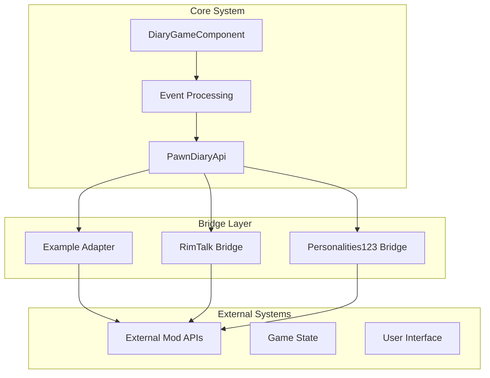
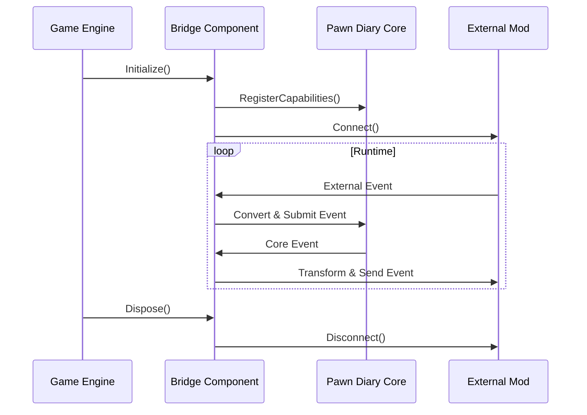
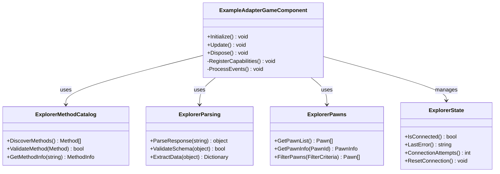
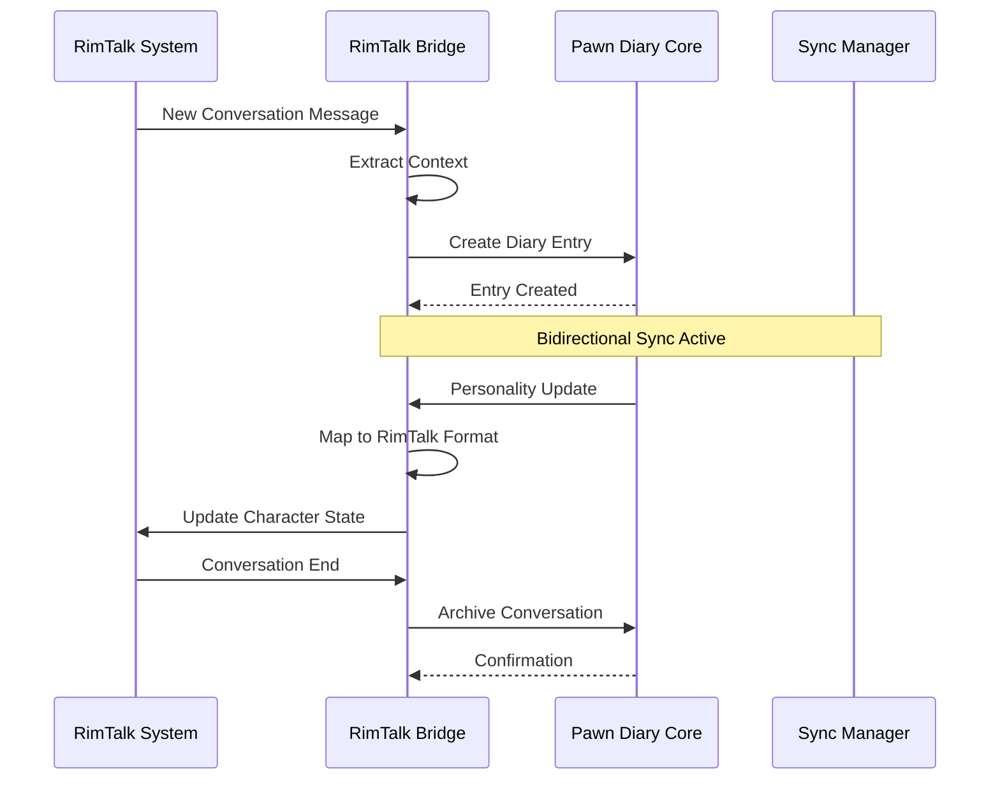
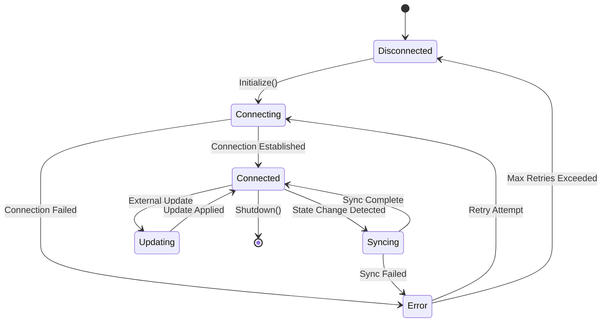

# Example Implementations

## Table of Contents
1. [Introduction](#introduction)
2. [Project Structure Overview](#project-structure-overview)
3. [Core Bridge Architecture](#core-bridge-architecture)
4. [Example Adapter: Basic Integration Patterns](#example-adapter-basic-integration-patterns)
5. [RimTalk Bridge: Advanced Bidirectional Synchronization](#rimtalk-bridge-advanced-bidirectional-synchronization)
6. [Personalities123 Bridge: Complex State Management](#personalities123-bridge-complex-state-management)
7. [Performance Optimization Strategies](#performance-optimization-strategies)
8. [Reusable Code Templates](#reusable-code-templates)
9. [Troubleshooting Guide](#troubleshooting-guide)
10. [Best Practices and Lessons Learned](#best-practices-and-lessons-learned)
11. [Conclusion](#conclusion)

## Introduction

This document provides a comprehensive analysis of existing bridge implementations in the Pawn Diary mod ecosystem, serving as practical examples for mod developers. The focus is on examining how different bridges integrate with the core Pawn Diary system, from basic API usage to complex bidirectional synchronization patterns.

The analysis covers three primary bridge implementations:
- **Example Adapter**: A reference implementation demonstrating basic integration patterns
- **RimTalk Bridge**: An advanced bridge showcasing bidirectional communication and conversation tracking
- **Personalities123 Bridge**: A complex bridge implementing sophisticated state management and personality synchronization

These implementations serve as templates for developers creating custom integrations, providing proven patterns for API usage, error handling, performance optimization, and architectural decisions.

## Project Structure Overview

The bridge implementations follow a consistent modular architecture pattern, organized within the `integrations` directory. Each bridge maintains its own self-contained package structure while adhering to common integration standards.



**Diagram sources**
- [PawnDiaryApi.cs:1-50](../../../../../Source/Integration/PawnDiaryApi.cs#L1-L50)
- [DiaryGameComponent.cs:1-100](../../../../../Source/Core/DiaryGameComponent.cs#L1-L100)

**Section sources**
- [PawnDiaryApi.cs:1-100](../../../../../Source/Integration/PawnDiaryApi.cs#L1-L100)
- [DiaryGameComponent.cs:1-200](../../../../../Source/Core/DiaryGameComponent.cs#L1-L200)

## Core Bridge Architecture

All bridge implementations share common architectural patterns that ensure consistency and maintainability across different integrations.

### Common Bridge Components

Every bridge typically includes these core components:

1. **Bridge Entry Point**: Main class that initializes and manages the bridge lifecycle
2. **API Client**: Handles communication with external mod APIs
3. **State Manager**: Maintains synchronization between systems
4. **Event Handlers**: Processes incoming events from both systems
5. **Configuration Manager**: Handles bridge-specific settings and preferences

### Integration Lifecycle



**Diagram sources**
- [ExampleAdapterGameComponent.cs:1-150](../../../../../integrations/PawnDiary.ExampleAdapter/Source/ExampleAdapterGameComponent.cs#L1-L150)
- [Personalities123GameComponent.cs:1-200](../../../../../integrations/PawnDiary.PersonalitiesBridge/Source/Personalities123GameComponent.cs#L1-L200)

## Example Adapter: Basic Integration Patterns

The Example Adapter serves as the primary reference implementation for new bridge developers, demonstrating fundamental integration concepts with clear, educational code organization.

### Key Implementation Features

The Example Adapter showcases several essential patterns:

#### 1. Simple API Registration Pattern
The adapter demonstrates how to register capabilities and establish basic communication channels with the core system.

#### 2. Event Conversion Pipeline
Shows the standard pattern for converting external events into Pawn Diary's internal event format.

#### 3. Error Handling Strategy
Implements robust error handling with graceful degradation when external services are unavailable.

#### 4. Configuration Management
Demonstrates simple configuration loading and validation patterns.

### Architecture Overview



**Diagram sources**
- [ExampleAdapterGameComponent.cs:1-200](../../../../../integrations/PawnDiary.ExampleAdapter/Source/ExampleAdapterGameComponent.cs#L1-L200)
- [ExplorerMethodCatalog.cs:1-150](../../../../../integrations/PawnDiary.ExampleAdapter/Source/ExplorerMethodCatalog.cs#L1-L150)
- [ExplorerParsing.cs:1-100](../../../../../integrations/PawnDiary.ExampleAdapter/Source/ExplorerParsing.cs#L1-L100)
- [ExplorerPawns.cs:1-120](../../../../../integrations/PawnDiary.ExampleAdapter/Source/ExplorerPawns.cs#L1-L120)
- [ExplorerState.cs:1-80](../../../../../integrations/PawnDiary.ExampleAdapter/Source/ExplorerState.cs#L1-L80)

### Implementation Walkthrough

#### Initialization Sequence
The adapter follows a structured initialization process:

1. **Capability Registration**: Declares supported features to the core system
2. **External Connection**: Establishes connection to the target mod
3. **Event Subscription**: Sets up listeners for relevant game events
4. **Configuration Loading**: Loads user preferences and settings

#### Event Processing Flow
External events flow through a standardized pipeline:

1. **Event Reception**: Captures raw events from external source
2. **Validation**: Ensures event data integrity and completeness
3. **Transformation**: Converts external format to Pawn Diary schema
4. **Submission**: Sends processed events to the core system
5. **Acknowledgment**: Provides feedback on processing results

**Section sources**
- [PawnDiaryExampleApi.cs:1-300](../../../../../integrations/PawnDiary.ExampleAdapter/Source/PawnDiaryExampleApi.cs#L1-L300)
- [ExampleAdapterGameComponent.cs:1-250](../../../../../integrations/PawnDiary.ExampleAdapter/Source/ExampleAdapterGameComponent.cs#L1-L250)
- [ExplorerMethodCatalog.cs:1-200](../../../../../integrations/PawnDiary.ExampleAdapter/Source/ExplorerMethodCatalog.cs#L1-L200)

## RimTalk Bridge: Advanced Bidirectional Synchronization

The RimTalk Bridge represents a sophisticated implementation showcasing advanced integration techniques, particularly bidirectional synchronization between conversation systems.

### Advanced Integration Features

#### 1. Bidirectional Communication
The bridge implements two-way synchronization, allowing seamless data flow between RimTalk conversations and Pawn Diary entries.

#### 2. Conversation Context Preservation
Maintains rich contextual information throughout conversation lifecycles, including speaker relationships, emotional states, and narrative continuity.

#### 3. Real-time Synchronization
Provides near-instantaneous updates between systems without blocking game operations.

#### 4. Conflict Resolution
Handles scenarios where both systems attempt to modify the same data simultaneously.

### Architecture Design



**Diagram sources**
- [PawnDiaryRimTalkBridgeApi.cs:1-200](../../../../../integrations/PawnDiary.RimTalkBridge/Source/PawnDiaryRimTalkBridgeApi.cs#L1-L200)
- [ConversationTracker.cs:1-150](../../../../../integrations/PawnDiary.RimTalkBridge/Source/ConversationTracker.cs#L1-L150)
- [PersonaSync.cs:1-180](../../../../../integrations/PawnDiary.RimTalkBridge/Source/PersonaSync.cs#L1-L180)

### Performance Optimization Techniques

The RimTalk Bridge implements several performance-critical optimizations:

#### Event Batching
Groups multiple related events to reduce API call overhead and improve throughput.

#### Lazy Loading
Defers expensive operations until data is actually needed, reducing memory footprint.

#### Caching Strategy
Implements intelligent caching for frequently accessed data with appropriate invalidation policies.

#### Asynchronous Processing
Uses non-blocking operations to prevent UI freezes and maintain game responsiveness.

**Section sources**
- [PawnDiaryRimTalkBridgeApi.cs:1-300](../../../../../integrations/PawnDiary.RimTalkBridge/Source/PawnDiaryRimTalkBridgeApi.cs#L1-L300)
- [ConversationTracker.cs:1-200](../../../../../integrations/PawnDiary.RimTalkBridge/Source/ConversationTracker.cs#L1-L200)
- [PersonaSync.cs:1-250](../../../../../integrations/PawnDiary.RimTalkBridge/Source/PersonaSync.cs#L1-L250)
- [ColonyContextInjector.cs:1-150](../../../../../integrations/PawnDiary.RimTalkBridge/Source/ColonyContextInjector.cs#L1-L150)

## Personalities123 Bridge: Complex State Management

The Personalities123 Bridge demonstrates sophisticated state management and personality trait synchronization, representing one of the most complex bridge implementations in the ecosystem.

### Complex State Management Features

#### 1. Multi-dimensional State Tracking
Manages personality traits, behavioral patterns, and character development across multiple dimensions simultaneously.

#### 2. State Reconciliation
Ensures consistency between local state and external mod state, automatically resolving conflicts.

#### 3. Historical State Preservation
Maintains complete history of personality changes for analysis and debugging purposes.

#### 4. Predictive State Updates
Anticipates state changes based on game events and pre-computes likely outcomes.

### State Management Architecture



**Diagram sources**
- [Personalities123GameComponent.cs:1-300](../../../../../integrations/PawnDiary.PersonalitiesBridge/Source/Personalities123GameComponent.cs#L1-L300)
- [EnneagramSync.cs:1-200](../../../../../integrations/PawnDiary.PersonalitiesBridge/Source/EnneagramSync.cs#L1-L200)
- [BridgeIds.cs:1-100](../../../../../integrations/PawnDiary.PersonalitiesBridge/Source/BridgeIds.cs#L1-L100)

### Data Synchronization Patterns

The bridge implements several sophisticated synchronization patterns:

#### Optimistic Concurrency Control
Allows concurrent updates with automatic conflict resolution based on timestamps and change priorities.

#### Delta Synchronization
Transmits only changed data rather than complete state snapshots, significantly reducing network overhead.

#### Eventual Consistency Model
Accepts temporary inconsistencies in favor of system availability and performance.

#### State Versioning
Maintains versioned state objects to support rollback and audit capabilities.

**Section sources**
- [Personalities123GameComponent.cs:1-350](../../../../../integrations/PawnDiary.PersonalitiesBridge/Source/Personalities123GameComponent.cs#L1-L350)
- [EnneagramSync.cs:1-250](../../../../../integrations/PawnDiary.PersonalitiesBridge/Source/EnneagramSync.cs#L1-L250)
- [BridgeIds.cs:1-150](../../../../../integrations/PawnDiary.PersonalitiesBridge/Source/BridgeIds.cs#L1-L150)

## Performance Optimization Strategies

Across all bridge implementations, several key performance optimization strategies emerge as best practices for mod developers.

### Memory Management

#### Object Pooling
Reuses frequently created objects to reduce garbage collection pressure and improve allocation performance.

#### Lazy Initialization
Defers resource-intensive operations until first use, minimizing startup time and memory footprint.

#### Weak References
Utilizes weak references for cached data to allow garbage collection when memory pressure occurs.

### Threading and Concurrency

#### Background Processing
Offloads heavy computations to background threads while maintaining UI thread responsiveness.

#### Thread-safe Collections
Uses specialized collections designed for concurrent access patterns.

#### Async/Await Patterns
Implements modern asynchronous programming patterns for non-blocking operations.

### Network Optimization

#### Request Coalescing
Combines multiple similar requests into single batch operations.

#### Compression
Applies data compression for large payloads to reduce bandwidth usage.

#### Connection Pooling
Maintains persistent connections to avoid repeated handshake overhead.

## Reusable Code Templates

Based on the analyzed implementations, here are reusable templates and patterns for bridge developers:

### Basic Bridge Template

```csharp
// Bridge initialization template
public class MyBridgeGameComponent : GameComponent
{
    private bool _isInitialized = false;
    private ExternalApiClient _apiClient;
    private StateManager _stateManager;

    public override void GameComponentTick()
    {
        if (!_isInitialized)
        {
            Initialize();
        }

        ProcessEvents();
    }

    private void Initialize()
    {
        try
        {
            RegisterCapabilities();
            ConnectToExternalService();
            SubscribeToEvents();
            LoadConfiguration();
            _isInitialized = true;
        }
        catch (Exception ex)
        {
            HandleInitializationError(ex);
        }
    }
}
```

### Event Processing Template

```csharp
// Standard event processing pipeline
public class EventProcessor
{
    public EventProcessingResult ProcessEvent(ExternalEvent externalEvent)
    {
        try
        {
            // Validate input
            if (!ValidateEvent(externalEvent))
            {
                return EventProcessingResult.Invalid;
            }

            // Transform to internal format
            var internalEvent = TransformEvent(externalEvent);

            // Process through pipeline
            var result = ProcessThroughPipeline(internalEvent);

            return result.IsSuccess ?
                EventProcessingResult.Success :
                EventProcessingResult.Failure;
        }
        catch (Exception ex)
        {
            LogError(ex);
            return EventProcessingResult.Error;
        }
    }
}
```

### State Synchronization Template

```csharp
// Bidirectional sync template
public class StateSynchronizer
{
    private ConcurrentDictionary<string, StateVersion> _localState;
    private ConcurrentDictionary<string, StateVersion> _remoteState;

    public void SyncState(StateChange change)
    {
        var localVersion = GetLocalVersion(change.Key);
        var remoteVersion = GetRemoteVersion(change.Key);

        if (ShouldApplyChange(localVersion, remoteVersion, change))
        {
            ApplyChangeLocally(change);
            PropagateToRemote(change);
        }
    }

    private bool ShouldApplyChange(StateVersion local, StateVersion remote, StateChange change)
    {
        // Implement conflict resolution logic
        return change.Timestamp > Math.Max(local.Timestamp, remote.Timestamp);
    }
}
```

## Troubleshooting Guide

Common issues and their solutions based on real-world bridge implementations:

### Connection Issues

**Problem**: External service connection failures
**Solution**: Implement exponential backoff retry logic with circuit breaker pattern

**Problem**: Authentication token expiration
**Solution**: Automatic token refresh with fallback authentication methods

### Performance Problems

**Problem**: Memory leaks in long-running bridges
**Solution**: Implement proper disposal patterns and monitor object lifetime

**Problem**: UI freezing during heavy operations
**Solution**: Offload work to background threads and implement progress reporting

### Data Synchronization Issues

**Problem**: Conflicting state updates from multiple sources
**Solution**: Implement deterministic conflict resolution based on timestamps and priorities

**Problem**: Inconsistent state after restart
**Solution**: Persist state checkpoints and implement recovery procedures

## Best Practices and Lessons Learned

### Architectural Decisions

#### Separation of Concerns
Keep bridge logic separate from core functionality to maintain testability and maintainability.

#### Defensive Programming
Always validate external inputs and handle unexpected data gracefully.

#### Logging and Diagnostics
Implement comprehensive logging with appropriate verbosity levels for debugging production issues.

### Testing Strategies

#### Unit Testing
Test individual components in isolation using mock external dependencies.

#### Integration Testing
Verify end-to-end functionality with actual external services in controlled environments.

#### Performance Testing
Monitor memory usage, CPU utilization, and response times under various load conditions.

### Deployment Considerations

#### Version Compatibility
Handle API version differences gracefully with feature detection and fallback mechanisms.

#### Configuration Management
Provide sensible defaults while allowing extensive customization through configuration files.

#### Error Reporting
Implement structured error reporting with actionable diagnostic information.

## Conclusion

The bridge implementations analyzed in this document demonstrate proven patterns for integrating external mods with the Pawn Diary system. From the educational Example Adapter to the sophisticated RimTalk and Personalities123 bridges, each implementation contributes valuable insights into effective bridge architecture.

Key takeaways for mod developers include:

1. **Start Simple**: Use the Example Adapter as a foundation and gradually add complexity
2. **Plan for Failure**: Implement robust error handling and recovery mechanisms
3. **Optimize Early**: Consider performance implications from the design phase
4. **Document Everything**: Maintain clear documentation for both developers and users
5. **Test Thoroughly**: Cover unit, integration, and performance testing scenarios

These implementations provide a solid foundation for developing reliable, performant, and maintainable bridges that enhance the Pawn Diary ecosystem while respecting the constraints and requirements of the underlying game engine.
