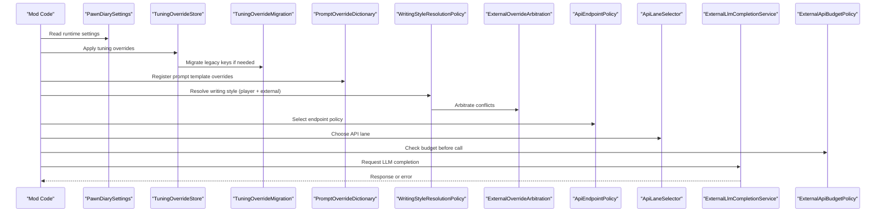
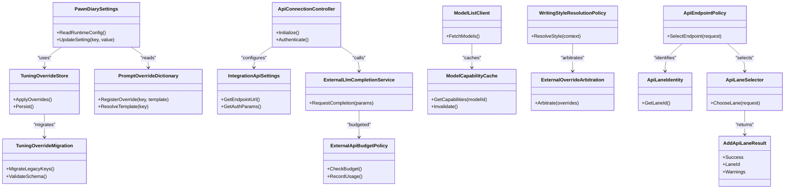

# Configuration API

<cite>
**Referenced Files in This Document**
- [PawnDiarySettings.cs](../../../../../Source/Settings/PawnDiarySettings.cs)
- [TuningOverrideStore.cs](../../../../../Source/Settings/TuningOverrideStore.cs)
- [TuningOverrideMigration.cs](../../../../../Source/Settings/TuningOverrideMigration.cs)
- [PromptOverrideDictionary.cs](../../../../../Source/Settings/PromptOverrideDictionary.cs)
- [ApiConnectionController.cs](../../../../../Source/Settings/ApiConnectionController.cs)
- [IntegrationApiSettings.cs](../../../../../Source/Settings/IntegrationApiSettings.cs)
- [ModelListClient.cs](../../../../../Source/Settings/ModelListClient.cs)
- [ModelCapabilityCache.cs](../../../../../Source/Settings/ModelCapabilityCache.cs)
- [ExternalLlmCompletionService.cs](../../../../../Source/Integration/ExternalLlmCompletionService.cs)
- [AddApiLaneResult.cs](../../../../../Source/Integration/AddApiLaneResult.cs)
- [DiaryGameComponent.ApiLanes.cs](../../../../../Source/Core/DiaryGameComponent.ApiLanes.cs)
- [ApiEndpointPolicy.cs](../../../../../Source/Pipeline/ApiEndpointPolicy.cs)
- [ApiLaneIdentity.cs](../../../../../Source/Pipeline/ApiLaneIdentity.cs)
- [ApiLaneSelector.cs](../../../../../Source/Pipeline/ApiLaneSelector.cs)
- [WritingStyleResolutionPolicy.cs](../../../../../Source/Pipeline/WritingStyleResolutionPolicy.cs)
- [PlayerWritingStyleText.cs](../../../../../Source/Pipeline/PlayerWritingStyleText.cs)
- [ExternalWritingStyleOverrideText.cs](../../../../../Source/Pipeline/ExternalWritingStyleOverrideText.cs)
- [ExternalOverrideArbitration.cs](../../../../../Source/Pipeline/ExternalOverrideArbitration.cs)
- PromptEnchantmentPlanner.cs
- [PromptVariants.cs](../../../../../Source/Generation/PromptVariants.cs)
- [PromptTextSanitizer.cs](../../../../../Source/Pipeline/PromptTextSanitizer.cs)
- [DiarySaveNormalization.cs](../../../../../Source/Pipeline/DiarySaveNormalization.cs)
- [DiaryArchiveFallback.cs](../../../../../Source/Pipeline/DiaryArchiveFallback.cs)
- [DiaryLifeBoundaryPolicy.cs](../../../../../Source/Pipeline/DiaryLifeBoundaryPolicy.cs)
- [ExternalApiBudgetPolicy.cs](../../../../../Source/Pipeline/ExternalApiBudgetPolicy.cs)
- [DiaryGameComponent.PublicApi.cs](../../../../../Source/Core/DiaryGameComponent.PublicApi.cs)
- [DiaryGameComponent.PromptPreview.cs](../../../../../Source/Core/DiaryGameComponent.PromptPreview.cs)
</cite>

## Table of Contents
1. [Introduction](#introduction)
2. [Project Structure](#project-structure)
3. [Core Components](#core-components)
4. [Architecture Overview](#architecture-overview)
5. [Detailed Component Analysis](#detailed-component-analysis)
6. [Dependency Analysis](#dependency-analysis)
7. [Performance Considerations](#performance-considerations)
8. [Troubleshooting Guide](#troubleshooting-guide)
9. [Conclusion](#conclusion)
10. [Appendices](#appendices)

## Introduction
This document provides comprehensive API documentation for configuration and customization interfaces exposed by the mod. It focuses on:
- Runtime settings access methods
- Tuning override capabilities
- Prompt customization APIs
- Dynamic API lane registration via AddApiLaneResult
- Configuration persistence, backup/restore operations, and migration handling
- Programmatic configuration changes, template overrides, and writing style modifications
- Security considerations, validation rules, and rollback mechanisms
- Best practices, performance implications, and troubleshooting guidance

The goal is to enable developers to integrate with the system safely and effectively while maintaining stability and performance.

## Project Structure
Configuration and customization are implemented across several modules:
- Settings and UI integration under Source/Settings
- Integration contracts and services under Source/Integration
- Pipeline policies for prompt generation and writing style resolution under Source/Pipeline
- Core orchestration and public API entry points under Source/Core
- Generation utilities for prompts and variants under Source/Generation

```mermaid
graph TB
subgraph "Settings"
S1["PawnDiarySettings.cs"]
S2["TuningOverrideStore.cs"]
S3["TuningOverrideMigration.cs"]
S4["PromptOverrideDictionary.cs"]
S5["ApiConnectionController.cs"]
S6["IntegrationApiSettings.cs"]
S7["ModelListClient.cs"]
S8["ModelCapabilityCache.cs"]
end
subgraph "Integration"
I1["ExternalLlmCompletionService.cs"]
I2["AddApiLaneResult.cs"]
end
subgraph "Pipeline"
P1["ApiEndpointPolicy.cs"]
P2["ApiLaneIdentity.cs"]
P3["ApiLaneSelector.cs"]
P4["WritingStyleResolutionPolicy.cs"]
P5["PlayerWritingStyleText.cs"]
P6["ExternalWritingStyleOverrideText.cs"]
P7["ExternalOverrideArbitration.cs"]
P8["PromptEnchantmentPlanner.cs"]
P9["PromptVariants.cs"]
P10["PromptTextSanitizer.cs"]
P11["DiarySaveNormalization.cs"]
P12["DiaryArchiveFallback.cs"]
P13["DiaryLifeBoundaryPolicy.cs"]
P14["ExternalApiBudgetPolicy.cs"]
end
subgraph "Core"
C1["DiaryGameComponent.ApiLanes.cs"]
C2["DiaryGameComponent.PublicApi.cs"]
C3["DiaryGameComponent.PromptPreview.cs"]
end
S1 --> S2
S2 --> S3
S1 --> S4
S1 --> S5
S5 --> I1
S6 --> I1
S7 --> S8
S8 --> I1
C1 --> P1
C1 --> P2
C1 --> P3
P4 --> P5
P4 --> P6
P4 --> P7
P8 --> P9
P9 --> P10
P11 --> P12
P11 --> P13
P14 --> I1
C2 --> P1
C2 --> P4
C3 --> P8
```

**Diagram sources**
- [PawnDiarySettings.cs](../../../../../Source/Settings/PawnDiarySettings.cs)
- [TuningOverrideStore.cs](../../../../../Source/Settings/TuningOverrideStore.cs)
- [TuningOverrideMigration.cs](../../../../../Source/Settings/TuningOverrideMigration.cs)
- [PromptOverrideDictionary.cs](../../../../../Source/Settings/PromptOverrideDictionary.cs)
- [ApiConnectionController.cs](../../../../../Source/Settings/ApiConnectionController.cs)
- [IntegrationApiSettings.cs](../../../../../Source/Settings/IntegrationApiSettings.cs)
- [ModelListClient.cs](../../../../../Source/Settings/ModelListClient.cs)
- [ModelCapabilityCache.cs](../../../../../Source/Settings/ModelCapabilityCache.cs)
- [ExternalLlmCompletionService.cs](../../../../../Source/Integration/ExternalLlmCompletionService.cs)
- [AddApiLaneResult.cs](../../../../../Source/Integration/AddApiLaneResult.cs)
- [ApiEndpointPolicy.cs](../../../../../Source/Pipeline/ApiEndpointPolicy.cs)
- [ApiLaneIdentity.cs](../../../../../Source/Pipeline/ApiLaneIdentity.cs)
- [ApiLaneSelector.cs](../../../../../Source/Pipeline/ApiLaneSelector.cs)
- [WritingStyleResolutionPolicy.cs](../../../../../Source/Pipeline/WritingStyleResolutionPolicy.cs)
- [PlayerWritingStyleText.cs](../../../../../Source/Pipeline/PlayerWritingStyleText.cs)
- [ExternalWritingStyleOverrideText.cs](../../../../../Source/Pipeline/ExternalWritingStyleOverrideText.cs)
- [ExternalOverrideArbitration.cs](../../../../../Source/Pipeline/ExternalOverrideArbitration.cs)
- PromptEnchantmentPlanner.cs
- [PromptVariants.cs](../../../../../Source/Generation/PromptVariants.cs)
- [PromptTextSanitizer.cs](../../../../../Source/Pipeline/PromptTextSanitizer.cs)
- [DiarySaveNormalization.cs](../../../../../Source/Pipeline/DiarySaveNormalization.cs)
- [DiaryArchiveFallback.cs](../../../../../Source/Pipeline/DiaryArchiveFallback.cs)
- [DiaryLifeBoundaryPolicy.cs](../../../../../Source/Pipeline/DiaryLifeBoundaryPolicy.cs)
- [ExternalApiBudgetPolicy.cs](../../../../../Source/Pipeline/ExternalApiBudgetPolicy.cs)
- [DiaryGameComponent.ApiLanes.cs](../../../../../Source/Core/DiaryGameComponent.ApiLanes.cs)
- [DiaryGameComponent.PublicApi.cs](../../../../../Source/Core/DiaryGameComponent.PublicApi.cs)
- [DiaryGameComponent.PromptPreview.cs](../../../../../Source/Core/DiaryGameComponent.PromptPreview.cs)

**Section sources**
- [PawnDiarySettings.cs](../../../../../Source/Settings/PawnDiarySettings.cs)
- [TuningOverrideStore.cs](../../../../../Source/Settings/TuningOverrideStore.cs)
- [TuningOverrideMigration.cs](../../../../../Source/Settings/TuningOverrideMigration.cs)
- [PromptOverrideDictionary.cs](../../../../../Source/Settings/PromptOverrideDictionary.cs)
- [ApiConnectionController.cs](../../../../../Source/Settings/ApiConnectionController.cs)
- [IntegrationApiSettings.cs](../../../../../Source/Settings/IntegrationApiSettings.cs)
- [ModelListClient.cs](../../../../../Source/Settings/ModelListClient.cs)
- [ModelCapabilityCache.cs](../../../../../Source/Settings/ModelCapabilityCache.cs)
- [ExternalLlmCompletionService.cs](../../../../../Source/Integration/ExternalLlmCompletionService.cs)
- [AddApiLaneResult.cs](../../../../../Source/Integration/AddApiLaneResult.cs)
- [ApiEndpointPolicy.cs](../../../../../Source/Pipeline/ApiEndpointPolicy.cs)
- [ApiLaneIdentity.cs](../../../../../Source/Pipeline/ApiLaneIdentity.cs)
- [ApiLaneSelector.cs](../../../../../Source/Pipeline/ApiLaneSelector.cs)
- [WritingStyleResolutionPolicy.cs](../../../../../Source/Pipeline/WritingStyleResolutionPolicy.cs)
- [PlayerWritingStyleText.cs](../../../../../Source/Pipeline/PlayerWritingStyleText.cs)
- [ExternalWritingStyleOverrideText.cs](../../../../../Source/Pipeline/ExternalWritingStyleOverrideText.cs)
- [ExternalOverrideArbitration.cs](../../../../../Source/Pipeline/ExternalOverrideArbitration.cs)
- PromptEnchantmentPlanner.cs
- [PromptVariants.cs](../../../../../Source/Generation/PromptVariants.cs)
- [PromptTextSanitizer.cs](../../../../../Source/Pipeline/PromptTextSanitizer.cs)
- [DiarySaveNormalization.cs](../../../../../Source/Pipeline/DiarySaveNormalization.cs)
- [DiaryArchiveFallback.cs](../../../../../Source/Pipeline/DiaryArchiveFallback.cs)
- [DiaryLifeBoundaryPolicy.cs](../../../../../Source/Pipeline/DiaryLifeBoundaryPolicy.cs)
- [ExternalApiBudgetPolicy.cs](../../../../../Source/Pipeline/ExternalApiBudgetPolicy.cs)
- [DiaryGameComponent.ApiLanes.cs](../../../../../Source/Core/DiaryGameComponent.ApiLanes.cs)
- [DiaryGameComponent.PublicApi.cs](../../../../../Source/Core/DiaryGameComponent.PublicApi.cs)
- [DiaryGameComponent.PromptPreview.cs](../../../../../Source/Core/DiaryGameComponent.PromptPreview.cs)

## Core Components
- Runtime settings access: Centralized settings object exposes runtime configuration values used throughout the pipeline and integration layers.
- Tuning overrides: A store manages tuning overrides with migration support to ensure compatibility across versions.
- Prompt overrides: A dictionary-based mechanism allows programmatic prompt template overrides.
- API connection control: Controller coordinates external LLM completion service connections and authentication.
- Model discovery and capability caching: Client retrieves available models; cache stores capabilities to reduce network overhead.
- Writing style resolution: Policies resolve player-defined styles and external overrides with arbitration logic.
- API lanes: Identity, selection, and endpoint policies govern dynamic lane registration and routing.

Key responsibilities:
- Persistence and migration of configuration data
- Validation and safety checks for overrides
- Budgeting and rate limiting for external API calls
- Prompt text sanitization and variant selection

**Section sources**
- [PawnDiarySettings.cs](../../../../../Source/Settings/PawnDiarySettings.cs)
- [TuningOverrideStore.cs](../../../../../Source/Settings/TuningOverrideStore.cs)
- [TuningOverrideMigration.cs](../../../../../Source/Settings/TuningOverrideMigration.cs)
- [PromptOverrideDictionary.cs](../../../../../Source/Settings/PromptOverrideDictionary.cs)
- [ApiConnectionController.cs](../../../../../Source/Settings/ApiConnectionController.cs)
- [IntegrationApiSettings.cs](../../../../../Source/Settings/IntegrationApiSettings.cs)
- [ModelListClient.cs](../../../../../Source/Settings/ModelListClient.cs)
- [ModelCapabilityCache.cs](../../../../../Source/Settings/ModelCapabilityCache.cs)
- [WritingStyleResolutionPolicy.cs](../../../../../Source/Pipeline/WritingStyleResolutionPolicy.cs)
- [PlayerWritingStyleText.cs](../../../../../Source/Pipeline/PlayerWritingStyleText.cs)
- [ExternalWritingStyleOverrideText.cs](../../../../../Source/Pipeline/ExternalWritingStyleOverrideText.cs)
- [ExternalOverrideArbitration.cs](../../../../../Source/Pipeline/ExternalOverrideArbitration.cs)
- [ApiEndpointPolicy.cs](../../../../../Source/Pipeline/ApiEndpointPolicy.cs)
- [ApiLaneIdentity.cs](../../../../../Source/Pipeline/ApiLaneIdentity.cs)
- [ApiLaneSelector.cs](../../../../../Source/Pipeline/ApiLaneSelector.cs)
- [ExternalLlmCompletionService.cs](../../../../../Source/Integration/ExternalLlmCompletionService.cs)
- [AddApiLaneResult.cs](../../../../../Source/Integration/AddApiLaneResult.cs)

## Architecture Overview
The configuration and customization architecture integrates settings, overrides, and pipeline policies to produce tailored prompts and entries. External API usage is controlled through a budget policy and connection controller.

**Diagram sources**
- [PawnDiarySettings.cs](../../../../../Source/Settings/PawnDiarySettings.cs)
- [TuningOverrideStore.cs](../../../../../Source/Settings/TuningOverrideStore.cs)
- [TuningOverrideMigration.cs](../../../../../Source/Settings/TuningOverrideMigration.cs)
- [PromptOverrideDictionary.cs](../../../../../Source/Settings/PromptOverrideDictionary.cs)
- [WritingStyleResolutionPolicy.cs](../../../../../Source/Pipeline/WritingStyleResolutionPolicy.cs)
- [ExternalOverrideArbitration.cs](../../../../../Source/Pipeline/ExternalOverrideArbitration.cs)
- [ApiEndpointPolicy.cs](../../../../../Source/Pipeline/ApiEndpointPolicy.cs)
- [ApiLaneSelector.cs](../../../../../Source/Pipeline/ApiLaneSelector.cs)
- [ExternalLlmCompletionService.cs](../../../../../Source/Integration/ExternalLlmCompletionService.cs)
- [ExternalApiBudgetPolicy.cs](../../../../../Source/Pipeline/ExternalApiBudgetPolicy.cs)

## Detailed Component Analysis

### Runtime Settings Access
- Centralized settings object provides getters for runtime configuration values consumed by components such as API controllers, writers, and policies.
- Typical usage involves reading values during initialization and reacting to changes where applicable.

Best practices:
- Cache frequently accessed values to avoid repeated lookups.
- Validate inputs when modifying settings at runtime.
- Avoid blocking operations during settings reads.

Security considerations:
- Ensure sensitive fields (e.g., tokens) are not logged or exposed in snapshots.
- Restrict write access to trusted code paths.

**Section sources**
- [PawnDiarySettings.cs](../../../../../Source/Settings/PawnDiarySettings.cs)

### Tuning Overrides and Migration
- TuningOverrideStore manages overrides applied to tuning definitions, enabling fine-grained behavior adjustments without altering base definitions.
- TuningOverrideMigration handles key evolution between versions, ensuring backward compatibility and safe upgrades.

Operational notes:
- Overrides should be validated against expected ranges and types.
- Migration routines must be idempotent and robust against partial failures.
- Persist overrides atomically to prevent corruption.

Rollback strategy:
- Maintain previous override snapshots before applying migrations.
- Provide restore functions to revert to known-good states.

**Section sources**
- [TuningOverrideStore.cs](../../../../../Source/Settings/TuningOverrideStore.cs)
- [TuningOverrideMigration.cs](../../../../../Source/Settings/TuningOverrideMigration.cs)

### Prompt Customization APIs
- PromptOverrideDictionary enables programmatic mapping of prompt keys to custom templates or content.
- PromptEnchantmentPlanner and PromptVariants coordinate enrichment and variation of prompts based on context and policies.
- PromptTextSanitizer ensures generated text adheres to safety and formatting constraints.

Programmatic examples (described):
- Register an override for a specific event type to inject additional context lines.
- Swap a default template with a domain-specific variant.
- Apply post-processing transformations to sanitize output.

Validation rules:
- Enforce maximum lengths and character sets.
- Prevent injection of disallowed markup or references.

**Section sources**
- [PromptOverrideDictionary.cs](../../../../../Source/Settings/PromptOverrideDictionary.cs)
- PromptEnchantmentPlanner.cs
- [PromptVariants.cs](../../../../../Source/Generation/PromptVariants.cs)
- [PromptTextSanitizer.cs](../../../../../Source/Pipeline/PromptTextSanitizer.cs)

### Writing Style Modifications
- WritingStyleResolutionPolicy resolves effective writing style by combining player preferences and external overrides.
- PlayerWritingStyleText and ExternalWritingStyleOverrideText represent distinct sources of style information.
- ExternalOverrideArbitration determines precedence and conflict resolution.

Guidance:
- Prefer small, incremental style changes to maintain readability.
- Use arbitration policies to avoid contradictory instructions.
- Test style changes across multiple contexts to ensure consistency.

**Section sources**
- [WritingStyleResolutionPolicy.cs](../../../../../Source/Pipeline/WritingStyleResolutionPolicy.cs)
- [PlayerWritingStyleText.cs](../../../../../Source/Pipeline/PlayerWritingStyleText.cs)
- [ExternalWritingStyleOverrideText.cs](../../../../../Source/Pipeline/ExternalWritingStyleOverrideText.cs)
- [ExternalOverrideArbitration.cs](../../../../../Source/Pipeline/ExternalOverrideArbitration.cs)

### Dynamic API Lane Registration and Management
- AddApiLaneResult defines the structure returned when registering a new API lane dynamically.
- DiaryGameComponent.ApiLanes orchestrates lane lifecycle and integration with core systems.
- ApiEndpointPolicy selects appropriate endpoints based on lane identity and request context.
- ApiLaneIdentity and ApiLaneSelector provide identification and selection semantics.

Registration workflow:
- Implement a lane descriptor and register it via the public API.
- The system returns AddApiLaneResult indicating success, lane ID, and any warnings.
- Subsequent requests route through the selected lane using endpoint and selector policies.

Error handling:
- Validate lane descriptors before registration.
- Handle duplicate registrations gracefully.
- Log lane selection decisions for diagnostics.

**Section sources**
- [AddApiLaneResult.cs](../../../../../Source/Integration/AddApiLaneResult.cs)
- [DiaryGameComponent.ApiLanes.cs](../../../../../Source/Core/DiaryGameComponent.ApiLanes.cs)
- [ApiEndpointPolicy.cs](../../../../../Source/Pipeline/ApiEndpointPolicy.cs)
- [ApiLaneIdentity.cs](../../../../../Source/Pipeline/ApiLaneIdentity.cs)
- [ApiLaneSelector.cs](../../../../../Source/Pipeline/ApiLaneSelector.cs)

### Configuration Persistence, Backup/Restore, and Migration
- DiarySaveNormalization normalizes save data structures to ensure consistent serialization.
- DiaryArchiveFallback provides fallback strategies when primary archives are unavailable.
- DiaryLifeBoundaryPolicy enforces lifecycle boundaries that affect persistence windows.

Backup/restore guidance:
- Create explicit backups before applying large-scale configuration changes.
- Use normalized formats to simplify restoration.
- Validate restored configurations against current schema versions.

Migration handling:
- Leverage TuningOverrideMigration for versioned updates.
- Apply migrations incrementally and verify integrity after each step.

**Section sources**
- [DiarySaveNormalization.cs](../../../../../Source/Pipeline/DiarySaveNormalization.cs)
- [DiaryArchiveFallback.cs](../../../../../Source/Pipeline/DiaryArchiveFallback.cs)
- [DiaryLifeBoundaryPolicy.cs](../../../../../Source/Pipeline/DiaryLifeBoundaryPolicy.cs)
- [TuningOverrideMigration.cs](../../../../../Source/Settings/TuningOverrideMigration.cs)

### External API Integration and Budgeting
- ApiConnectionController manages connection parameters and authentication for external LLM services.
- IntegrationApiSettings centralizes integration-related configuration.
- ModelListClient discovers available models; ModelCapabilityCache caches capabilities to reduce latency.
- ExternalLlmCompletionService executes completion requests.
- ExternalApiBudgetPolicy enforces quotas and rate limits.

Operational flow:
- Initialize connection settings and authenticate.
- Fetch model list and cache capabilities.
- Before each request, check budget and select appropriate model.
- Execute request and handle responses/errors consistently.

Security considerations:
- Store credentials securely and avoid logging sensitive data.
- Validate server URLs and enforce HTTPS where possible.
- Implement retry/backoff with jitter for transient errors.

**Section sources**
- [ApiConnectionController.cs](../../../../../Source/Settings/ApiConnectionController.cs)
- [IntegrationApiSettings.cs](../../../../../Source/Settings/IntegrationApiSettings.cs)
- [ModelListClient.cs](../../../../../Source/Settings/ModelListClient.cs)
- [ModelCapabilityCache.cs](../../../../../Source/Settings/ModelCapabilityCache.cs)
- [ExternalLlmCompletionService.cs](../../../../../Source/Integration/ExternalLlmCompletionService.cs)
- [ExternalApiBudgetPolicy.cs](../../../../../Source/Pipeline/ExternalApiBudgetPolicy.cs)

### Public API and Prompt Preview
- DiaryGameComponent.PublicApi exposes high-level methods for interacting with the diary system programmatically.
- DiaryGameComponent.PromptPreview supports previewing prompts before submission, aiding debugging and testing.

Usage patterns:
- Use public API methods to submit events, query entries, and manage lanes.
- Employ prompt preview to validate templates and overrides prior to live use.

**Section sources**
- [DiaryGameComponent.PublicApi.cs](../../../../../Source/Core/DiaryGameComponent.PublicApi.cs)
- [DiaryGameComponent.PromptPreview.cs](../../../../../Source/Core/DiaryGameComponent.PromptPreview.cs)

## Dependency Analysis
The following diagram highlights key dependencies among configuration and customization components.

**Diagram sources**
- [PawnDiarySettings.cs](../../../../../Source/Settings/PawnDiarySettings.cs)
- [TuningOverrideStore.cs](../../../../../Source/Settings/TuningOverrideStore.cs)
- [TuningOverrideMigration.cs](../../../../../Source/Settings/TuningOverrideMigration.cs)
- [PromptOverrideDictionary.cs](../../../../../Source/Settings/PromptOverrideDictionary.cs)
- [ApiConnectionController.cs](../../../../../Source/Settings/ApiConnectionController.cs)
- [IntegrationApiSettings.cs](../../../../../Source/Settings/IntegrationApiSettings.cs)
- [ModelListClient.cs](../../../../../Source/Settings/ModelListClient.cs)
- [ModelCapabilityCache.cs](../../../../../Source/Settings/ModelCapabilityCache.cs)
- [ExternalLlmCompletionService.cs](../../../../../Source/Integration/ExternalLlmCompletionService.cs)
- [ExternalApiBudgetPolicy.cs](../../../../../Source/Pipeline/ExternalApiBudgetPolicy.cs)
- [WritingStyleResolutionPolicy.cs](../../../../../Source/Pipeline/WritingStyleResolutionPolicy.cs)
- [ExternalOverrideArbitration.cs](../../../../../Source/Pipeline/ExternalOverrideArbitration.cs)
- [ApiEndpointPolicy.cs](../../../../../Source/Pipeline/ApiEndpointPolicy.cs)
- [ApiLaneIdentity.cs](../../../../../Source/Pipeline/ApiLaneIdentity.cs)
- [ApiLaneSelector.cs](../../../../../Source/Pipeline/ApiLaneSelector.cs)
- [AddApiLaneResult.cs](../../../../../Source/Integration/AddApiLaneResult.cs)

**Section sources**
- [PawnDiarySettings.cs](../../../../../Source/Settings/PawnDiarySettings.cs)
- [TuningOverrideStore.cs](../../../../../Source/Settings/TuningOverrideStore.cs)
- [TuningOverrideMigration.cs](../../../../../Source/Settings/TuningOverrideMigration.cs)
- [PromptOverrideDictionary.cs](../../../../../Source/Settings/PromptOverrideDictionary.cs)
- [ApiConnectionController.cs](../../../../../Source/Settings/ApiConnectionController.cs)
- [IntegrationApiSettings.cs](../../../../../Source/Settings/IntegrationApiSettings.cs)
- [ModelListClient.cs](../../../../../Source/Settings/ModelListClient.cs)
- [ModelCapabilityCache.cs](../../../../../Source/Settings/ModelCapabilityCache.cs)
- [ExternalLlmCompletionService.cs](../../../../../Source/Integration/ExternalLlmCompletionService.cs)
- [ExternalApiBudgetPolicy.cs](../../../../../Source/Pipeline/ExternalApiBudgetPolicy.cs)
- [WritingStyleResolutionPolicy.cs](../../../../../Source/Pipeline/WritingStyleResolutionPolicy.cs)
- [ExternalOverrideArbitration.cs](../../../../../Source/Pipeline/ExternalOverrideArbitration.cs)
- [ApiEndpointPolicy.cs](../../../../../Source/Pipeline/ApiEndpointPolicy.cs)
- [ApiLaneIdentity.cs](../../../../../Source/Pipeline/ApiLaneIdentity.cs)
- [ApiLaneSelector.cs](../../../../../Source/Pipeline/ApiLaneSelector.cs)
- [AddApiLaneResult.cs](../../../../../Source/Integration/AddApiLaneResult.cs)

## Performance Considerations
- Cache model capabilities and frequently read settings to minimize I/O and network calls.
- Apply tuning overrides in batches and persist changes atomically.
- Sanitize prompt text efficiently to avoid excessive allocations.
- Respect external API budgets to prevent throttling and ensure stable throughput.
- Normalize saves to reduce storage overhead and improve load times.

[No sources needed since this section provides general guidance]

## Troubleshooting Guide
Common issues and resolutions:
- Configuration not applied: Verify migration ran successfully and overrides persisted.
- Prompt rendering anomalies: Inspect sanitizer logs and validate template keys.
- API failures: Check connection settings, authentication, and budget status.
- Lane selection errors: Confirm lane identity and selector policies are correctly configured.

Diagnostic steps:
- Review normalization and archive fallback logs.
- Use prompt preview to isolate template issues.
- Enable detailed logging for endpoint selection and budget enforcement.

**Section sources**
- [TuningOverrideMigration.cs](../../../../../Source/Settings/TuningOverrideMigration.cs)
- [PromptTextSanitizer.cs](../../../../../Source/Pipeline/PromptTextSanitizer.cs)
- [ApiConnectionController.cs](../../../../../Source/Settings/ApiConnectionController.cs)
- [ExternalApiBudgetPolicy.cs](../../../../../Source/Pipeline/ExternalApiBudgetPolicy.cs)
- [DiarySaveNormalization.cs](../../../../../Source/Pipeline/DiarySaveNormalization.cs)
- [DiaryArchiveFallback.cs](../../../../../Source/Pipeline/DiaryArchiveFallback.cs)
- [DiaryGameComponent.PromptPreview.cs](../../../../../Source/Core/DiaryGameComponent.PromptPreview.cs)

## Conclusion
This configuration API provides robust mechanisms for runtime settings access, tuning overrides, prompt customization, and dynamic API lane management. By leveraging persistence, migration, and arbitration features, developers can tailor behavior safely and efficiently. Adhering to best practices around security, validation, and performance ensures reliable operation across diverse environments.

[No sources needed since this section summarizes without analyzing specific files]

## Appendices

### Example Workflows (Descriptive)
- Programmatic configuration change:
  - Update a setting via the settings object.
  - Apply tuning overrides and persist changes.
  - Rebuild relevant caches if necessary.

- Template override:
  - Register a new prompt template mapping in the override dictionary.
  - Validate the template and test via prompt preview.

- Writing style modification:
  - Define player style preferences.
  - Apply external overrides and let arbitration determine final style.

- Dynamic API lane registration:
  - Submit a lane descriptor through the public API.
  - Receive AddApiLaneResult and confirm lane availability.
  - Route subsequent requests using the selected lane.

[No sources needed since this section provides conceptual guidance]
