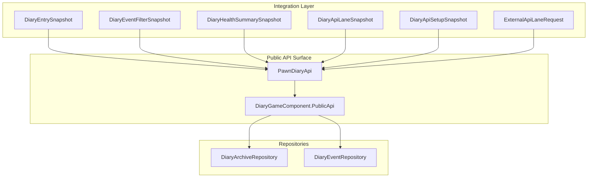
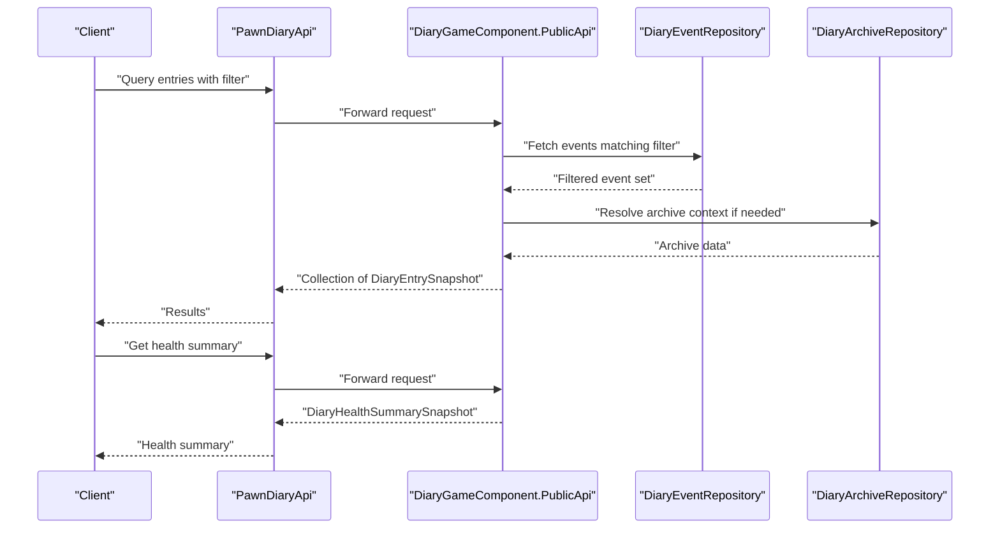
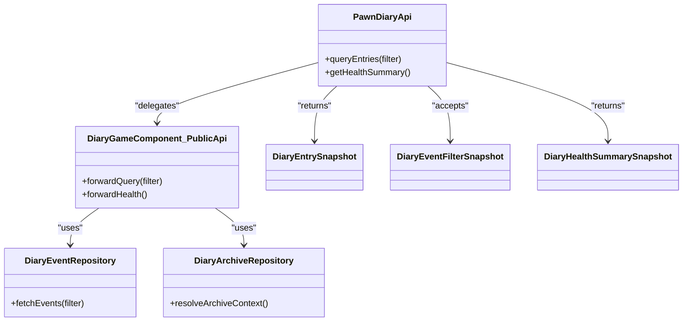

# Data Access API

<cite>
**Referenced Files in This Document**
- [PawnDiaryApi.cs](../../../../../Source/Integration/PawnDiaryApi.cs)
- [DiaryEntrySnapshot.cs](../../../../../Source/Integration/DiaryEntrySnapshot.cs)
- [DiaryEventFilterSnapshot.cs](../../../../../Source/Integration/DiaryEventFilterSnapshot.cs)
- [DiaryHealthSummarySnapshot.cs](../../../../../Source/Integration/DiaryHealthSummarySnapshot.cs)
- [DiaryGameComponent.PublicApi.cs](../../../../../Source/Core/DiaryGameComponent.PublicApi.cs)
- [DiaryArchiveRepository.cs](../../../../../Source/Core/DiaryArchiveRepository.cs)
- [DiaryEventRepository.cs](../../../../../Source/Core/DiaryEventRepository.cs)
- [ExternalApiLaneRequest.cs](../../../../../Source/Integration/ExternalApiLaneRequest.cs)
- [AddApiLaneResult.cs](../../../../../Source/Integration/AddApiLaneResult.cs)
- [DiaryApiLaneSnapshot.cs](../../../../../Source/Integration/DiaryApiLaneSnapshot.cs)
- [DiaryApiSetupSnapshot.cs](../../../../../Source/Integration/DiaryApiSetupSnapshot.cs)
- [DiaryEntryHandle.cs](../../../../../Source/Integration/DiaryEntryHandle.cs)
- [DiaryEntryStatsSnapshot.cs](../../../../../Source/Integration/DiaryEntryStatsSnapshot.cs)
- [DiaryEntryStatusSnapshot.cs](../../../../../Source/Integration/DiaryEntryStatusSnapshot.cs)
- [DiaryEntryTitleQuery.cs](../../../../../Source/Integration/DiaryEntryTitleQuery.cs)
- [DiaryEntryTitleSnapshot.cs](../../../../../Source/Integration/DiaryEntryTitleSnapshot.cs)
- [DiaryPromptPreviewSnapshot.cs](../../../../../Source/Integration/DiaryPromptPreviewSnapshot.cs)
- [DiaryWritingStyleSnapshot.cs](../../../../../Source/Integration/DiaryWritingStyleSnapshot.cs)
- [DiaryPsychotypeSnapshot.cs](../../../../../Source/Integration/DiaryPsychotypeSnapshot.cs)
- [DiaryContextBundleSnapshot.cs](../../../../../Source/Integration/DiaryContextBundleSnapshot.cs)
- [DiaryContextSnapshot.cs](../../../../../Source/Integration/DiaryContextSnapshot.cs)
- [ExternalDirectEntryRequest.cs](../../../../../Source/Integration/ExternalDirectEntryRequest.cs)
- [ExternalEventRequest.cs](../../../../../Source/Integration/ExternalEventRequest.cs)
- [SubmitEventOutcome.cs](../../../../../Source/Integration/SubmitEventOutcome.cs)
- [DiaryEventSubmissionResult.cs](../../../../../Source/Integration/DiaryEventSubmissionResult.cs)
</cite>

## Table of Contents
1. [Introduction](#introduction)
2. [Project Structure](#project-structure)
3. [Core Components](#core-components)
4. [Architecture Overview](#architecture-overview)
5. [Detailed Component Analysis](#detailed-component-analysis)
6. [Dependency Analysis](#dependency-analysis)
7. [Performance Considerations](#performance-considerations)
8. [Troubleshooting Guide](#troubleshooting-guide)
9. [Conclusion](#conclusion)
10. [Appendices](#appendices)

## Introduction
This document describes the data access API surface for reading and querying diary entries, filtering by criteria, accessing pawn-specific data, and retrieving health monitoring summaries. It focuses on:
- Query methods to retrieve diary entries and related metadata
- Filtering capabilities using structured filters (date ranges, event types, content search)
- Health monitoring APIs providing diagnostics and performance metrics
- Pagination support, sorting options, and bulk retrieval patterns
- Examples of complex queries, export formats, and efficient streaming approaches

The API is designed for external integrations and mod authors who need programmatic access to a pawn’s diary history and system health information.

## Project Structure
The data access API is exposed through integration snapshot types and public entry points implemented in core components. Key areas include:
- Integration snapshots that define query inputs and response shapes
- Public API surface exposing query and health endpoints
- Repositories that back persistence and retrieval operations
- Lane-based request/response contracts for extensibility

**Diagram sources**
- [DiaryEntrySnapshot.cs](../../../../../Source/Integration/DiaryEntrySnapshot.cs)
- [DiaryEventFilterSnapshot.cs](../../../../../Source/Integration/DiaryEventFilterSnapshot.cs)
- [DiaryHealthSummarySnapshot.cs](../../../../../Source/Integration/DiaryHealthSummarySnapshot.cs)
- [DiaryApiLaneSnapshot.cs](../../../../../Source/Integration/DiaryApiLaneSnapshot.cs)
- [DiaryApiSetupSnapshot.cs](../../../../../Source/Integration/DiaryApiSetupSnapshot.cs)
- [ExternalApiLaneRequest.cs](../../../../../Source/Integration/ExternalApiLaneRequest.cs)
- [PawnDiaryApi.cs](../../../../../Source/Integration/PawnDiaryApi.cs)
- [DiaryGameComponent.PublicApi.cs](../../../../../Source/Core/DiaryGameComponent.PublicApi.cs)
- [DiaryArchiveRepository.cs](../../../../../Source/Core/DiaryArchiveRepository.cs)
- [DiaryEventRepository.cs](../../../../../Source/Core/DiaryEventRepository.cs)

**Section sources**
- [PawnDiaryApi.cs](../../../../../Source/Integration/PawnDiaryApi.cs)
- [DiaryGameComponent.PublicApi.cs](../../../../../Source/Core/DiaryGameComponent.PublicApi.cs)
- [DiaryArchiveRepository.cs](../../../../../Source/Core/DiaryArchiveRepository.cs)
- [DiaryEventRepository.cs](../../../../../Source/Core/DiaryEventRepository.cs)

## Core Components
- DiaryEntrySnapshot: Represents a single diary entry with identity, timestamps, title, body, and relationship references. Used as the primary read model for entries.
- DiaryEventFilterSnapshot: Defines filter parameters for querying entries, including date range constraints, event type selection, and text search fields.
- DiaryHealthSummarySnapshot: Provides system diagnostics and performance metrics for health monitoring.
- PawnDiaryApi: The main integration surface exposing query and health methods.
- DiaryGameComponent.PublicApi: Internal orchestrator coordinating repository calls and returning snapshot results.
- Repositories: DiaryArchiveRepository and DiaryEventRepository implement persistence-backed retrieval and filtering.

Typical usage pattern:
- Build a filter using DiaryEventFilterSnapshot
- Call a query method via PawnDiaryApi or DiaryGameComponent.PublicApi
- Receive a collection of DiaryEntrySnapshot objects
- For health checks, call the health summary endpoint to obtain DiaryHealthSummarySnapshot

**Section sources**
- [DiaryEntrySnapshot.cs](../../../../../Source/Integration/DiaryEntrySnapshot.cs)
- [DiaryEventFilterSnapshot.cs](../../../../../Source/Integration/DiaryEventFilterSnapshot.cs)
- [DiaryHealthSummarySnapshot.cs](../../../../../Source/Integration/DiaryHealthSummarySnapshot.cs)
- [PawnDiaryApi.cs](../../../../../Source/Integration/PawnDiaryApi.cs)
- [DiaryGameComponent.PublicApi.cs](../../../../../Source/Core/DiaryGameComponent.PublicApi.cs)
- [DiaryArchiveRepository.cs](../../../../../Source/Core/DiaryArchiveRepository.cs)
- [DiaryEventRepository.cs](../../../../../Source/Core/DiaryEventRepository.cs)

## Architecture Overview
The data access flow integrates the public API surface with repositories and returns strongly-typed snapshots.

**Diagram sources**
- [PawnDiaryApi.cs](../../../../../Source/Integration/PawnDiaryApi.cs)
- [DiaryGameComponent.PublicApi.cs](../../../../../Source/Core/DiaryGameComponent.PublicApi.cs)
- [DiaryEventRepository.cs](../../../../../Source/Core/DiaryEventRepository.cs)
- [DiaryArchiveRepository.cs](../../../../../Source/Core/DiaryArchiveRepository.cs)

## Detailed Component Analysis

### DiaryEntrySnapshot
Purpose:
- Read-only representation of a diary entry returned by query methods.
- Contains identity, temporal metadata, textual content, and relationship pointers.

Key properties and semantics:
- Identity and linkage:
  - Entry identifier handle for stable reference across sessions
  - Associated pawn identifier for ownership
  - Optional parent entry handle for hierarchical relationships
- Temporal metadata:
  - Creation timestamp
  - Last updated timestamp
  - Event time (when applicable)
- Content:
  - Title string
  - Body text
  - Optional prose snapshot for formatted rendering
- Status and stats:
  - Current status indicator
  - Stats snapshot summarizing counts or tags
- Relationships:
  - References to related entities such as prompts, contexts, or writing styles

Usage notes:
- Use this snapshot for display, export, and analysis.
- Relationship handles can be resolved via additional lookups when necessary.

**Section sources**
- [DiaryEntrySnapshot.cs](../../../../../Source/Integration/DiaryEntrySnapshot.cs)
- [DiaryEntryHandle.cs](../../../../../Source/Integration/DiaryEntryHandle.cs)
- [DiaryEntryProseSnapshot.cs](../../../../../Source/Integration/DiaryEntryProseSnapshot.cs)
- [DiaryEntryStatsSnapshot.cs](../../../../../Source/Integration/DiaryEntryStatsSnapshot.cs)
- [DiaryEntryStatusSnapshot.cs](../../../../../Source/Integration/DiaryEntryStatusSnapshot.cs)

### DiaryEventFilterSnapshot
Purpose:
- Encapsulates query parameters for filtering diary entries.

Supported filter dimensions:
- Date range:
  - Start and end boundaries for event time or creation time
- Event types:
  - One or more event type identifiers to narrow results
- Content search:
  - Textual search terms applied to title/body fields
- Additional selectors:
  - Optional flags for inclusion/exclusion of specific categories or statuses

Behavioral notes:
- Filters are combined with logical AND unless otherwise specified by the API contract.
- Empty filters return all entries within default bounds.

**Section sources**
- [DiaryEventFilterSnapshot.cs](../../../../../Source/Integration/DiaryEventFilterSnapshot.cs)

### DiaryHealthSummarySnapshot
Purpose:
- Provides system diagnostics and performance metrics for health monitoring.

Typical fields:
- Service availability indicators
- Latency and throughput metrics
- Error rates and recent error counts
- Resource utilization summaries
- Feature readiness flags

Use cases:
- External dashboards and alerting systems
- Automated health checks and SLA verification

**Section sources**
- [DiaryHealthSummarySnapshot.cs](../../../../../Source/Integration/DiaryHealthSummarySnapshot.cs)

### Public API Surface
Responsibilities:
- Expose query methods for entries and health summaries
- Accept filter snapshots and return collections of entry snapshots
- Provide lane-based extension points for custom data access

Key interactions:
- Clients construct DiaryEventFilterSnapshot and pass it to query methods
- Health summary requests return DiaryHealthSummarySnapshot directly

Extensibility:
- Lane-based requests allow adding custom endpoints without changing core contracts
- Setup snapshots describe available lanes and capabilities

**Section sources**
- [PawnDiaryApi.cs](../../../../../Source/Integration/PawnDiaryApi.cs)
- [DiaryGameComponent.PublicApi.cs](../../../../../Source/Core/DiaryGameComponent.PublicApi.cs)
- [ExternalApiLaneRequest.cs](../../../../../Source/Integration/ExternalApiLaneRequest.cs)
- [AddApiLaneResult.cs](../../../../../Source/Integration/AddApiLaneResult.cs)
- [DiaryApiLaneSnapshot.cs](../../../../../Source/Integration/DiaryApiLaneSnapshot.cs)
- [DiaryApiSetupSnapshot.cs](../../../../../Source/Integration/DiaryApiSetupSnapshot.cs)

### Repository Layer
Responsibilities:
- Implement persistence-backed retrieval and filtering
- Coordinate between event and archive repositories for complete context

Components:
- DiaryEventRepository: Primary source for event-driven entries and filtering
- DiaryArchiveRepository: Secondary source for archived or historical data

Interaction:
- Public API delegates to repositories based on filter scope and data freshness requirements

**Section sources**
- [DiaryEventRepository.cs](../../../../../Source/Core/DiaryEventRepository.cs)
- [DiaryArchiveRepository.cs](../../../../../Source/Core/DiaryArchiveRepository.cs)

### Submission and Outcome Models
Purpose:
- Define request/response structures for submitting events and direct entries
- Capture outcomes and submission results for auditing and feedback

Models:
- ExternalEventRequest: Request payload for event submissions
- ExternalDirectEntryRequest: Request payload for direct diary entries
- SubmitEventOutcome: Outcome details after processing
- DiaryEventSubmissionResult: Aggregated result of submission attempts

**Section sources**
- [ExternalEventRequest.cs](../../../../../Source/Integration/ExternalEventRequest.cs)
- [ExternalDirectEntryRequest.cs](../../../../../Source/Integration/ExternalDirectEntryRequest.cs)
- [SubmitEventOutcome.cs](../../../../../Source/Integration/SubmitEventOutcome.cs)
- [DiaryEventSubmissionResult.cs](../../../../../Source/Integration/DiaryEventSubmissionResult.cs)

### Supporting Snapshots
Additional snapshots used across the API surface:
- DiaryEntryTitleQuery and DiaryEntryTitleSnapshot: Title-focused queries and responses
- DiaryPromptPreviewSnapshot: Prompt preview information
- DiaryWritingStyleSnapshot: Writing style metadata
- DiaryPsychotypeSnapshot: Psychotype-related data
- DiaryContextBundleSnapshot and DiaryContextSnapshot: Context bundles and individual contexts

These support richer queries and exports beyond basic entry retrieval.

**Section sources**
- [DiaryEntryTitleQuery.cs](../../../../../Source/Integration/DiaryEntryTitleQuery.cs)
- [DiaryEntryTitleSnapshot.cs](../../../../../Source/Integration/DiaryEntryTitleSnapshot.cs)
- [DiaryPromptPreviewSnapshot.cs](../../../../../Source/Integration/DiaryPromptPreviewSnapshot.cs)
- [DiaryWritingStyleSnapshot.cs](../../../../../Source/Integration/DiaryWritingStyleSnapshot.cs)
- [DiaryPsychotypeSnapshot.cs](../../../../../Source/Integration/DiaryPsychotypeSnapshot.cs)
- [DiaryContextBundleSnapshot.cs](../../../../../Source/Integration/DiaryContextBundleSnapshot.cs)
- [DiaryContextSnapshot.cs](../../../../../Source/Integration/DiaryContextSnapshot.cs)

## Dependency Analysis
High-level dependencies among API components:

**Diagram sources**
- [PawnDiaryApi.cs](../../../../../Source/Integration/PawnDiaryApi.cs)
- [DiaryGameComponent.PublicApi.cs](../../../../../Source/Core/DiaryGameComponent.PublicApi.cs)
- [DiaryEventRepository.cs](../../../../../Source/Core/DiaryEventRepository.cs)
- [DiaryArchiveRepository.cs](../../../../../Source/Core/DiaryArchiveRepository.cs)
- [DiaryEntrySnapshot.cs](../../../../../Source/Integration/DiaryEntrySnapshot.cs)
- [DiaryEventFilterSnapshot.cs](../../../../../Source/Integration/DiaryEventFilterSnapshot.cs)
- [DiaryHealthSummarySnapshot.cs](../../../../../Source/Integration/DiaryHealthSummarySnapshot.cs)

**Section sources**
- [PawnDiaryApi.cs](../../../../../Source/Integration/PawnDiaryApi.cs)
- [DiaryGameComponent.PublicApi.cs](../../../../../Source/Core/DiaryGameComponent.PublicApi.cs)
- [DiaryEventRepository.cs](../../../../../Source/Core/DiaryEventRepository.cs)
- [DiaryArchiveRepository.cs](../../../../../Source/Core/DiaryArchiveRepository.cs)

## Performance Considerations
- Prefer filtered queries using DiaryEventFilterSnapshot to reduce payload size and improve latency.
- Use pagination by combining date ranges and incremental offsets where supported by the API surface.
- Stream large datasets by requesting smaller batches and processing them incrementally.
- Cache health summaries locally and refresh at appropriate intervals to avoid frequent polling.
- Avoid redundant lookups; resolve relationship handles only when necessary.

[No sources needed since this section provides general guidance]

## Troubleshooting Guide
Common issues and resolutions:
- Empty results:
  - Verify filter date ranges and event type selections
  - Ensure the target pawn has diary entries within the requested window
- Slow queries:
  - Narrow filters further and paginate results
  - Check health summary metrics for service load or errors
- Relationship resolution failures:
  - Confirm that referenced handles exist and are accessible
  - Validate permissions or lane configurations for extended data

Operational checks:
- Use health summary endpoints to monitor availability and error rates
- Inspect submission results for failed entries and retry strategies

**Section sources**
- [DiaryHealthSummarySnapshot.cs](../../../../../Source/Integration/DiaryHealthSummarySnapshot.cs)
- [DiaryEventSubmissionResult.cs](../../../../../Source/Integration/DiaryEventSubmissionResult.cs)

## Conclusion
The data access API provides a robust, snapshot-based interface for querying diary entries, applying rich filters, and obtaining health diagnostics. By leveraging structured filters, pagination, and streaming patterns, clients can efficiently retrieve and process large volumes of data while maintaining responsiveness and reliability.

[No sources needed since this section summarizes without analyzing specific files]

## Appendices

### Example Workflows

#### Complex Query Pattern
- Construct a DiaryEventFilterSnapshot with:
  - Date range covering the desired period
  - Specific event types relevant to the use case
  - Text search terms for title/body content
- Call the query method via PawnDiaryApi
- Iterate over returned DiaryEntrySnapshot items
- Resolve relationship handles as needed for enriched context

#### Data Export Format
- Serialize collections of DiaryEntrySnapshot to JSON for downstream systems
- Include identity, timestamps, title, body, and status fields
- Attach relationship handles for later enrichment

#### Streaming Large Datasets
- Paginate by dividing the date range into smaller windows
- Process each batch independently to minimize memory footprint
- Aggregate results at the client side for final reporting

[No sources needed since this section provides conceptual examples]
