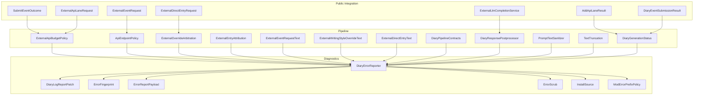
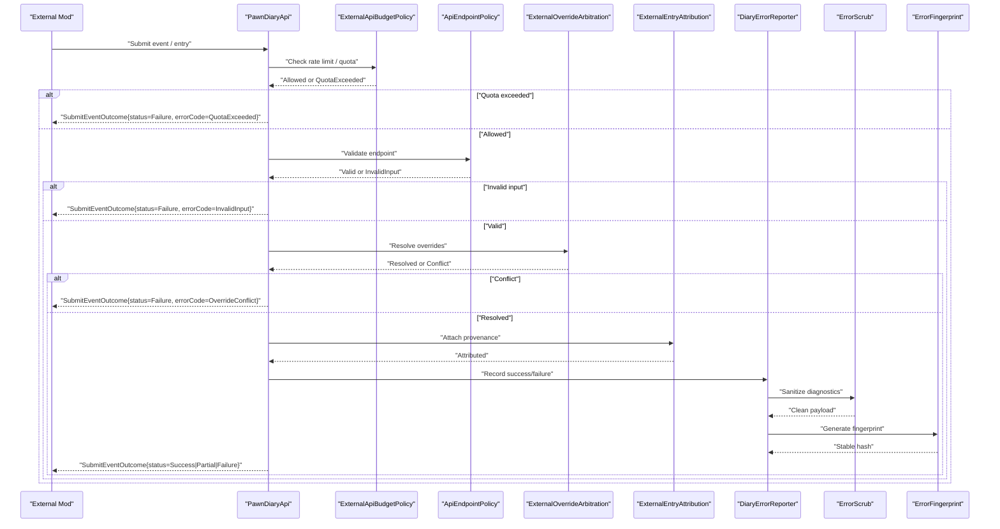
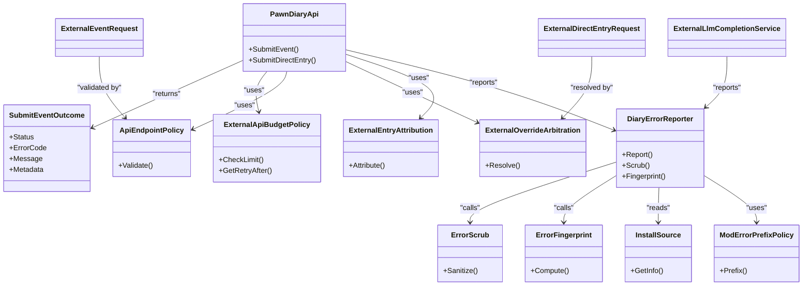

# Error Handling & Diagnostics

<cite>
**Referenced Files in This Document**
- [SubmitEventOutcome.cs](../../../../../Source/Integration/SubmitEventOutcome.cs)
- [DiaryErrorReporter.cs](../../../../../Source/Diagnostics/DiaryErrorReporter.cs)
- [DiaryLogReportPatch.cs](../../../../../Source/Diagnostics/DiaryLogReportPatch.cs)
- [ErrorFingerprint.cs](../../../../../Source/Diagnostics/Pure/ErrorFingerprint.cs)
- [ErrorReportPayload.cs](../../../../../Source/Diagnostics/Pure/ErrorReportPayload.cs)
- [ErrorScrub.cs](../../../../../Source/Diagnostics/Pure/ErrorScrub.cs)
- [InstallSource.cs](../../../../../Source/Diagnostics/Pure/InstallSource.cs)
- [ModErrorPrefixPolicy.cs](../../../../../Source/Diagnostics/Pure/ModErrorPrefixPolicy.cs)
- [ExternalApiBudgetPolicy.cs](../../../../../Source/Pipeline/ExternalApiBudgetPolicy.cs)
- [DiaryGameComponent.ExternalApiBudget.cs](../../../../../Source/Core/DiaryGameComponent.ExternalApiBudget.cs)
- [PawnDiaryApi.cs](../../../../../Source/Integration/PawnDiaryApi.cs)
- [ExternalEventRequest.cs](../../../../../Source/Integration/ExternalEventRequest.cs)
- [ExternalDirectEntryRequest.cs](../../../../../Source/Integration/ExternalDirectEntryRequest.cs)
- [ExternalLlmCompletionService.cs](../../../../../Source/Integration/ExternalLlmCompletionService.cs)
- [AddApiLaneResult.cs](../../../../../Source/Integration/AddApiLaneResult.cs)
- [DiaryEventSubmissionResult.cs](../../../../../Source/Integration/DiaryEventSubmissionResult.cs)
- [ExternalApiLaneRequest.cs](../../../../../Source/Integration/ExternalApiLaneRequest.cs)
- [ApiEndpointPolicy.cs](../../../../../Source/Pipeline/ApiEndpointPolicy.cs)
- [ExternalOverrideArbitration.cs](../../../../../Source/Pipeline/ExternalOverrideArbitration.cs)
- [ExternalEntryAttribution.cs](../../../../../Source/Pipeline/ExternalEntryAttribution.cs)
- [ExternalEventRequestText.cs](../../../../../Source/Pipeline/ExternalEventRequestText.cs)
- [ExternalWritingStyleOverrideText.cs](../../../../../Source/Pipeline/ExternalWritingStyleOverrideText.cs)
- [ExternalDirectEntryText.cs](../../../../../Source/Pipeline/ExternalDirectEntryText.cs)
- [DiaryPipelineContracts.cs](../../../../../Source/Pipeline/DiaryPipelineContracts.cs)
- [DiaryResponsePostprocessor.cs](../../../../../Source/Pipeline/DiaryResponsePostprocessor.cs)
- [PromptTextSanitizer.cs](../../../../../Source/Pipeline/PromptTextSanitizer.cs)
- [TextTruncation.cs](../../../../../Source/Pipeline/TextTruncation.cs)
- [DiaryGenerationStatus.cs](../../../../../Source/Pipeline/DiaryGenerationStatus.cs)
- [DiaryListText.cs](../../../../../Source/Pipeline/DiaryListText.cs)
- [DiaryRichTextDecorators.cs](../../../../../Source/Pipeline/DiaryRichTextDecorators.cs)
- [DiarySaveNormalization.cs](../../../../../Source/Pipeline/DiarySaveNormalization.cs)
- [DiarySentenceExcerpt.cs](../../../../../Source/Pipeline/DiarySentenceExcerpt.cs)
- [DiaryTextDecorationContracts.cs](../../../../../Source/Pipeline/DiaryTextDecorationContracts.cs)
- [DiaryTextDecorationFactCodec.cs](../../../../../Source/Pipeline/DiaryTextDecorationFactCodec.cs)
- [DiaryTextDecorationMatcher.cs](../../../../../Source/Pipeline/DiaryTextDecorationMatcher.cs)
- [DiaryTextDecorations.cs](../../../../../Source/Pipeline/DiaryTextDecorations.cs)
- [EventWindowPolicy.cs](../../../../../Source/Pipeline/EventWindowPolicy.cs)
- [ListenerRegistry.cs](../../../../../Source/Pipeline/ListenerRegistry.cs)
- [LlmRequestJsonBuilder.cs](../../../../../Source/Pipeline/LlmRequestJsonBuilder.cs)
- [ModelReasoningCapability.cs](../../../../../Source/Pipeline/ModelReasoningCapability.cs)
- [OdysseyContextFormatter.cs](../../../../../Source/Pipeline/OdysseyContextFormatter.cs)
- [OdysseyJourneyContracts.cs](../../../../../Source/Pipeline/OdysseyJourneyContracts.cs)
- [OdysseyLandingPolicy.cs](../../../../../Source/Pipeline/OdysseyLandingPolicy.cs)
- [OdysseyLifecyclePolicy.cs](../../../../../Source/Pipeline/OdysseyLifecyclePolicy.cs)
- [OdysseyLocationPolicy.cs](../../../../../Source/Pipeline/OdysseyLocationPolicy.cs)
- [OdysseyWriterPolicy.cs](../../../../../Source/Pipeline/OdysseyWriterPolicy.cs)
- [PlayerWritingStyleText.cs](../../../../../Source/Pipeline/PlayerWritingStyleText.cs)
- [ProgressionMilestonePolicy.cs](../../../../../Source/Pipeline/ProgressionMilestonePolicy.cs)
- [PromptContextDetail.cs](../../../../../Source/Pipeline/PromptContextDetail.cs)
- [PromptEnchantmentPlanner.cs](../../../../../Source/Pipeline/PromptEnchantmentPlanner.cs)
- [PsychotypeResolutionPolicy.cs](../../../../../Source/Pipeline/PsychotypeResolutionPolicy.cs)
- [PsychotypeRollPolicy.cs](../../../../../Source/Pipeline/PsychotypeRollPolicy.cs)
- [PsychotypeText.cs](../../../../../Source/Pipeline/PsychotypeText.cs)
- [PsychotypeTraitAffinities.cs](../../../../../Source/Pipeline/PsychotypeTraitAffinities.cs)
- [WritingStyleResolutionPolicy.cs](../../../../../Source/Pipeline/WritingStyleResolutionPolicy.cs)
</cite>

## Table of Contents
1. [Introduction](#introduction)
2. [Project Structure](#project-structure)
3. [Core Components](#core-components)
4. [Architecture Overview](#architecture-overview)
5. [Detailed Component Analysis](#detailed-component-analysis)
6. [Dependency Analysis](#dependency-analysis)
7. [Performance Considerations](#performance-considerations)
8. [Troubleshooting Guide](#troubleshooting-guide)
9. [Conclusion](#conclusion)
10. [Appendices](#appendices)

## Introduction
This document provides comprehensive API documentation for error handling and diagnostics across the public interface. It focuses on:
- Exception types, error codes, and recovery patterns exposed to external mods
- The SubmitEventOutcome structure for interpreting operation results and failure reasons
- Diagnostic data collection, error reporting mechanisms, and access to debugging information
- Rate limiting responses, quota exceeded scenarios, and graceful degradation patterns
- Logging best practices and troubleshooting workflows
- Guidance on error monitoring, alerting setup, and integration with external error tracking services

The goal is to help mod authors integrate robustly, handle failures predictably, and collect actionable diagnostics without compromising performance or stability.

## Project Structure
Error handling and diagnostics are implemented across several layers:
- Public Integration layer exposes structured outcomes and requests for external callers
- Pipeline layer enforces policies such as budgeting, sanitization, and response postprocessing
- Diagnostics layer centralizes error reporting, scrubbing, fingerprinting, and install source attribution
- Core components coordinate runtime behavior and expose APIs used by mods

**Diagram sources**
- [SubmitEventOutcome.cs](../../../../../Source/Integration/SubmitEventOutcome.cs)
- [ExternalEventRequest.cs](../../../../../Source/Integration/ExternalEventRequest.cs)
- [ExternalDirectEntryRequest.cs](../../../../../Source/Integration/ExternalDirectEntryRequest.cs)
- [ExternalLlmCompletionService.cs](../../../../../Source/Integration/ExternalLlmCompletionService.cs)
- [AddApiLaneResult.cs](../../../../../Source/Integration/AddApiLaneResult.cs)
- [DiaryEventSubmissionResult.cs](../../../../../Source/Integration/DiaryEventSubmissionResult.cs)
- [ExternalApiLaneRequest.cs](../../../../../Source/Integration/ExternalApiLaneRequest.cs)
- [ExternalApiBudgetPolicy.cs](../../../../../Source/Pipeline/ExternalApiBudgetPolicy.cs)
- [ApiEndpointPolicy.cs](../../../../../Source/Pipeline/ApiEndpointPolicy.cs)
- [ExternalOverrideArbitration.cs](../../../../../Source/Pipeline/ExternalOverrideArbitration.cs)
- [ExternalEntryAttribution.cs](../../../../../Source/Pipeline/ExternalEntryAttribution.cs)
- [ExternalEventRequestText.cs](../../../../../Source/Pipeline/ExternalEventRequestText.cs)
- [ExternalWritingStyleOverrideText.cs](../../../../../Source/Pipeline/ExternalWritingStyleOverrideText.cs)
- [ExternalDirectEntryText.cs](../../../../../Source/Pipeline/ExternalDirectEntryText.cs)
- [DiaryPipelineContracts.cs](../../../../../Source/Pipeline/DiaryPipelineContracts.cs)
- [DiaryResponsePostprocessor.cs](../../../../../Source/Pipeline/DiaryResponsePostprocessor.cs)
- [PromptTextSanitizer.cs](../../../../../Source/Pipeline/PromptTextSanitizer.cs)
- [TextTruncation.cs](../../../../../Source/Pipeline/TextTruncation.cs)
- [DiaryGenerationStatus.cs](../../../../../Source/Pipeline/DiaryGenerationStatus.cs)
- [DiaryErrorReporter.cs](../../../../../Source/Diagnostics/DiaryErrorReporter.cs)
- [DiaryLogReportPatch.cs](../../../../../Source/Diagnostics/DiaryLogReportPatch.cs)
- [ErrorFingerprint.cs](../../../../../Source/Diagnostics/Pure/ErrorFingerprint.cs)
- [ErrorReportPayload.cs](../../../../../Source/Diagnostics/Pure/ErrorReportPayload.cs)
- [ErrorScrub.cs](../../../../../Source/Diagnostics/Pure/ErrorScrub.cs)
- [InstallSource.cs](../../../../../Source/Diagnostics/Pure/InstallSource.cs)
- [ModErrorPrefixPolicy.cs](../../../../../Source/Diagnostics/Pure/ModErrorPrefixPolicy.cs)

**Section sources**
- [SubmitEventOutcome.cs](../../../../../Source/Integration/SubmitEventOutcome.cs)
- [ExternalEventRequest.cs](../../../../../Source/Integration/ExternalEventRequest.cs)
- [ExternalDirectEntryRequest.cs](../../../../../Source/Integration/ExternalDirectEntryRequest.cs)
- [ExternalLlmCompletionService.cs](../../../../../Source/Integration/ExternalLlmCompletionService.cs)
- [AddApiLaneResult.cs](../../../../../Source/Integration/AddApiLaneResult.cs)
- [DiaryEventSubmissionResult.cs](../../../../../Source/Integration/DiaryEventSubmissionResult.cs)
- [ExternalApiLaneRequest.cs](../../../../../Source/Integration/ExternalApiLaneRequest.cs)
- [ExternalApiBudgetPolicy.cs](../../../../../Source/Pipeline/ExternalApiBudgetPolicy.cs)
- [ApiEndpointPolicy.cs](../../../../../Source/Pipeline/ApiEndpointPolicy.cs)
- [ExternalOverrideArbitration.cs](../../../../../Source/Pipeline/ExternalOverrideArbitration.cs)
- [ExternalEntryAttribution.cs](../../../../../Source/Pipeline/ExternalEntryAttribution.cs)
- [ExternalEventRequestText.cs](../../../../../Source/Pipeline/ExternalEventRequestText.cs)
- [ExternalWritingStyleOverrideText.cs](../../../../../Source/Pipeline/ExternalWritingStyleOverrideText.cs)
- [ExternalDirectEntryText.cs](../../../../../Source/Pipeline/ExternalDirectEntryText.cs)
- [DiaryPipelineContracts.cs](../../../../../Source/Pipeline/DiaryPipelineContracts.cs)
- [DiaryResponsePostprocessor.cs](../../../../../Source/Pipeline/DiaryResponsePostprocessor.cs)
- [PromptTextSanitizer.cs](../../../../../Source/Pipeline/PromptTextSanitizer.cs)
- [TextTruncation.cs](../../../../../Source/Pipeline/TextTruncation.cs)
- [DiaryGenerationStatus.cs](../../../../../Source/Pipeline/DiaryGenerationStatus.cs)
- [DiaryErrorReporter.cs](../../../../../Source/Diagnostics/DiaryErrorReporter.cs)
- [DiaryLogReportPatch.cs](../../../../../Source/Diagnostics/DiaryLogReportPatch.cs)
- [ErrorFingerprint.cs](../../../../../Source/Diagnostics/Pure/ErrorFingerprint.cs)
- [ErrorReportPayload.cs](../../../../../Source/Diagnostics/Pure/ErrorReportPayload.cs)
- [ErrorScrub.cs](../../../../../Source/Diagnostics/Pure/ErrorScrub.cs)
- [InstallSource.cs](../../../../../Source/Diagnostics/Pure/InstallSource.cs)
- [ModErrorPrefixPolicy.cs](../../../../../Source/Diagnostics/Pure/ModErrorPrefixPolicy.cs)

## Core Components
This section documents the primary structures and policies that define error semantics and diagnostic capabilities.

- SubmitEventOutcome
  - Purpose: Represents the result of a submission operation (success, partial success, or failure).
  - Key fields typically include:
    - Status indicating overall outcome
    - Error code identifying the failure reason
    - Message providing human-readable details
    - Optional metadata for diagnostics (e.g., request ID, lane identity)
  - Usage: Returned by public methods that submit events or entries; callers should branch logic based on status and error code.

- ExternalApiBudgetPolicy
  - Purpose: Enforces rate limits and quotas for external API usage.
  - Behavior:
    - Tracks per-lane or global request counts over time windows
    - Returns specific error codes when limits are exceeded
    - Supports backoff hints and retry-after guidance

- ApiEndpointPolicy
  - Purpose: Validates and routes endpoint-specific requests.
  - Behavior:
    - Applies endpoint-level constraints
    - Produces standardized error responses for invalid inputs or unauthorized access

- ExternalOverrideArbitration
  - Purpose: Resolves conflicts among multiple overrides (e.g., writing style, context).
  - Behavior:
    - Selects winning override deterministically
    - Emits warnings or errors when arbitration fails

- ExternalEntryAttribution
  - Purpose: Attributes entries to their originating mod or source.
  - Behavior:
    - Ensures provenance metadata is attached
    - Guards against spoofed origins

- DiaryErrorReporter
  - Purpose: Centralized error reporting and logging.
  - Behavior:
    - Collects contextual diagnostics
    - Scrubs sensitive data before persistence or transmission
    - Generates stable fingerprints for deduplication

- ErrorFingerprint, ErrorReportPayload, ErrorScrub, InstallSource, ModErrorPrefixPolicy
  - Purpose: Support diagnostic payload construction, normalization, and safe reporting.
  - Behavior:
    - Normalize stack traces and messages
    - Remove or redact sensitive content
    - Attach installation source and mod prefix for traceability

**Section sources**
- [SubmitEventOutcome.cs](../../../../../Source/Integration/SubmitEventOutcome.cs)
- [ExternalApiBudgetPolicy.cs](../../../../../Source/Pipeline/ExternalApiBudgetPolicy.cs)
- [ApiEndpointPolicy.cs](../../../../../Source/Pipeline/ApiEndpointPolicy.cs)
- [ExternalOverrideArbitration.cs](../../../../../Source/Pipeline/ExternalOverrideArbitration.cs)
- [ExternalEntryAttribution.cs](../../../../../Source/Pipeline/ExternalEntryAttribution.cs)
- [DiaryErrorReporter.cs](../../../../../Source/Diagnostics/DiaryErrorReporter.cs)
- [ErrorFingerprint.cs](../../../../../Source/Diagnostics/Pure/ErrorFingerprint.cs)
- [ErrorReportPayload.cs](../../../../../Source/Diagnostics/Pure/ErrorReportPayload.cs)
- [ErrorScrub.cs](../../../../../Source/Diagnostics/Pure/ErrorScrub.cs)
- [InstallSource.cs](../../../../../Source/Diagnostics/Pure/InstallSource.cs)
- [ModErrorPrefixPolicy.cs](../../../../../Source/Diagnostics/Pure/ModErrorPrefixPolicy.cs)

## Architecture Overview
The error handling and diagnostics architecture integrates at three layers:
- Public API surface returns structured outcomes and uses consistent error codes
- Pipeline policies enforce constraints, sanitize inputs, and normalize outputs
- Diagnostics subsystem captures, scrubs, and reports errors with rich context

**Diagram sources**
- [PawnDiaryApi.cs](../../../../../Source/Integration/PawnDiaryApi.cs)
- [ExternalApiBudgetPolicy.cs](../../../../../Source/Pipeline/ExternalApiBudgetPolicy.cs)
- [ApiEndpointPolicy.cs](../../../../../Source/Pipeline/ApiEndpointPolicy.cs)
- [ExternalOverrideArbitration.cs](../../../../../Source/Pipeline/ExternalOverrideArbitration.cs)
- [ExternalEntryAttribution.cs](../../../../../Source/Pipeline/ExternalEntryAttribution.cs)
- [DiaryErrorReporter.cs](../../../../../Source/Diagnostics/DiaryErrorReporter.cs)
- [ErrorScrub.cs](../../../../../Source/Diagnostics/Pure/ErrorScrub.cs)
- [ErrorFingerprint.cs](../../../../../Source/Diagnostics/Pure/ErrorFingerprint.cs)
- [SubmitEventOutcome.cs](../../../../../Source/Integration/SubmitEventOutcome.cs)

## Detailed Component Analysis

### SubmitEventOutcome Structure
- Purpose: Encapsulates the result of an operation submitted via the public API.
- Typical fields:
  - Status: Success, Partial, Failure
  - ErrorCode: Enumerated reason (e.g., QuotaExceeded, InvalidInput, OverrideConflict, InternalError)
  - Message: Human-readable explanation
  - Metadata: Optional identifiers (request ID, lane identity), timestamps, and diagnostic hints
- Caller guidance:
  - Always check Status first
  - Branch on ErrorCode for specific recovery actions
  - Log Message and Metadata for diagnostics
  - For Partial, consider retrying non-failed items if applicable

**Section sources**
- [SubmitEventOutcome.cs](../../../../../Source/Integration/SubmitEventOutcome.cs)

### Rate Limiting and Quota Management
- Policy: ExternalApiBudgetPolicy
- Behaviors:
  - Enforces per-lane and global quotas
  - Returns QuotaExceeded when limits are hit
  - May include RetryAfter hints for backoff strategies
- Caller guidance:
  - Implement exponential backoff with jitter
  - Respect RetryAfter values
  - Cache successful results to reduce redundant calls

**Section sources**
- [ExternalApiBudgetPolicy.cs](../../../../../Source/Pipeline/ExternalApiBudgetPolicy.cs)
- [DiaryGameComponent.ExternalApiBudget.cs](../../../../../Source/Core/DiaryGameComponent.ExternalApiBudget.cs)

### Endpoint Validation and Override Arbitration
- Policies:
  - ApiEndpointPolicy validates endpoints and parameters
  - ExternalOverrideArbitration resolves conflicting overrides
- Error codes:
  - InvalidInput for malformed requests
  - OverrideConflict when resolution fails
- Caller guidance:
  - Validate inputs locally before calling
  - Provide clear fallbacks when conflicts occur

**Section sources**
- [ApiEndpointPolicy.cs](../../../../../Source/Pipeline/ApiEndpointPolicy.cs)
- [ExternalOverrideArbitration.cs](../../../../../Source/Pipeline/ExternalOverrideArbitration.cs)

### Entry Attribution and Provenance
- Policy: ExternalEntryAttribution
- Responsibilities:
  - Attach origin metadata to entries
  - Prevent spoofing by enforcing trusted sources
- Error codes:
  - UnauthorizedOrigin when attribution fails
- Caller guidance:
  - Ensure correct mod identification
  - Handle UnauthorizedOrigin gracefully

**Section sources**
- [ExternalEntryAttribution.cs](../../../../../Source/Pipeline/ExternalEntryAttribution.cs)

### Text Sanitization and Truncation
- Policies:
  - PromptTextSanitizer cleans prompts and text payloads
  - TextTruncation prevents oversized payloads
- Error codes:
  - PayloadTooLarge when truncation cannot satisfy constraints
- Caller guidance:
  - Pre-truncate large texts
  - Avoid embedding sensitive data

**Section sources**
- [PromptTextSanitizer.cs](../../../../../Source/Pipeline/PromptTextSanitizer.cs)
- [TextTruncation.cs](../../../../../Source/Pipeline/TextTruncation.cs)

### Response Postprocessing and Generation Status
- Components:
  - DiaryResponsePostprocessor normalizes responses
  - DiaryGenerationStatus tracks generation lifecycle
- Error codes:
  - GenerationFailed for pipeline errors
- Caller guidance:
  - Inspect status for partial successes
  - Use postprocessed output for UI rendering

**Section sources**
- [DiaryResponsePostprocessor.cs](../../../../../Source/Pipeline/DiaryResponsePostprocessor.cs)
- [DiaryGenerationStatus.cs](../../../../../Source/Pipeline/DiaryGenerationStatus.cs)

### Diagnostics Reporting and Fingerprinting
- Components:
  - DiaryErrorReporter centralizes reporting
  - ErrorScrub removes sensitive content
  - ErrorFingerprint generates stable hashes for deduplication
  - InstallSource and ModErrorPrefixPolicy add provenance and prefixes
- Caller guidance:
  - Use structured logs with mod prefixes
  - Include request IDs and lane identities
  - Avoid logging secrets or personal data

**Section sources**
- [DiaryErrorReporter.cs](../../../../../Source/Diagnostics/DiaryErrorReporter.cs)
- [DiaryLogReportPatch.cs](../../../../../Source/Diagnostics/DiaryLogReportPatch.cs)
- [ErrorFingerprint.cs](../../../../../Source/Diagnostics/Pure/ErrorFingerprint.cs)
- [ErrorReportPayload.cs](../../../../../Source/Diagnostics/Pure/ErrorReportPayload.cs)
- [ErrorScrub.cs](../../../../../Source/Diagnostics/Pure/ErrorScrub.cs)
- [InstallSource.cs](../../../../../Source/Diagnostics/Pure/InstallSource.cs)
- [ModErrorPrefixPolicy.cs](../../../../../Source/Diagnostics/Pure/ModErrorPrefixPolicy.cs)

### Public API Surface and Requests
- Entry points:
  - PawnDiaryApi exposes methods returning SubmitEventOutcome
  - ExternalEventRequest and ExternalDirectEntryRequest define request contracts
  - ExternalLlmCompletionService handles completion flows
- Caller guidance:
  - Follow request contracts strictly
  - Handle all documented error codes
  - Implement retries with backoff for transient failures

**Section sources**
- [PawnDiaryApi.cs](../../../../../Source/Integration/PawnDiaryApi.cs)
- [ExternalEventRequest.cs](../../../../../Source/Integration/ExternalEventRequest.cs)
- [ExternalDirectEntryRequest.cs](../../../../../Source/Integration/ExternalDirectEntryRequest.cs)
- [ExternalLlmCompletionService.cs](../../../../../Source/Integration/ExternalLlmCompletionService.cs)

### Additional Pipeline Contracts and Utilities
- Contracts and utilities ensure consistency across pipelines:
  - DiaryPipelineContracts defines shared interfaces
  - ExternalEventRequestText and ExternalDirectEntryText format text payloads
  - ExternalWritingStyleOverrideText manages style overrides
  - ListenerRegistry coordinates event listeners
  - LlmRequestJsonBuilder constructs JSON for LLM requests
  - ModelReasoningCapability checks model capabilities
  - EventWindowPolicy controls event windows
  - DiaryListText, DiaryRichTextDecorators, DiarySaveNormalization, DiarySentenceExcerpt, DiaryTextDecoration* support formatting and persistence

These components contribute to robust error handling by standardizing formats, validating inputs, and ensuring consistent state transitions.

**Section sources**
- [DiaryPipelineContracts.cs](../../../../../Source/Pipeline/DiaryPipelineContracts.cs)
- [ExternalEventRequestText.cs](../../../../../Source/Pipeline/ExternalEventRequestText.cs)
- [ExternalDirectEntryText.cs](../../../../../Source/Pipeline/ExternalDirectEntryText.cs)
- [ExternalWritingStyleOverrideText.cs](../../../../../Source/Pipeline/ExternalWritingStyleOverrideText.cs)
- [ListenerRegistry.cs](../../../../../Source/Pipeline/ListenerRegistry.cs)
- [LlmRequestJsonBuilder.cs](../../../../../Source/Pipeline/LlmRequestJsonBuilder.cs)
- [ModelReasoningCapability.cs](../../../../../Source/Pipeline/ModelReasoningCapability.cs)
- [EventWindowPolicy.cs](../../../../../Source/Pipeline/EventWindowPolicy.cs)
- [DiaryListText.cs](../../../../../Source/Pipeline/DiaryListText.cs)
- [DiaryRichTextDecorators.cs](../../../../../Source/Pipeline/DiaryRichTextDecorators.cs)
- [DiarySaveNormalization.cs](../../../../../Source/Pipeline/DiarySaveNormalization.cs)
- [DiarySentenceExcerpt.cs](../../../../../Source/Pipeline/DiarySentenceExcerpt.cs)
- [DiaryTextDecorationContracts.cs](../../../../../Source/Pipeline/DiaryTextDecorationContracts.cs)
- [DiaryTextDecorationFactCodec.cs](../../../../../Source/Pipeline/DiaryTextDecorationFactCodec.cs)
- [DiaryTextDecorationMatcher.cs](../../../../../Source/Pipeline/DiaryTextDecorationMatcher.cs)
- [DiaryTextDecorations.cs](../../../../../Source/Pipeline/DiaryTextDecorations.cs)

## Dependency Analysis
The following diagram highlights key dependencies between integration, pipeline, and diagnostics components involved in error handling and diagnostics.

**Diagram sources**
- [SubmitEventOutcome.cs](../../../../../Source/Integration/SubmitEventOutcome.cs)
- [ExternalApiBudgetPolicy.cs](../../../../../Source/Pipeline/ExternalApiBudgetPolicy.cs)
- [ApiEndpointPolicy.cs](../../../../../Source/Pipeline/ApiEndpointPolicy.cs)
- [ExternalOverrideArbitration.cs](../../../../../Source/Pipeline/ExternalOverrideArbitration.cs)
- [ExternalEntryAttribution.cs](../../../../../Source/Pipeline/ExternalEntryAttribution.cs)
- [DiaryErrorReporter.cs](../../../../../Source/Diagnostics/DiaryErrorReporter.cs)
- [ErrorScrub.cs](../../../../../Source/Diagnostics/Pure/ErrorScrub.cs)
- [ErrorFingerprint.cs](../../../../../Source/Diagnostics/Pure/ErrorFingerprint.cs)
- [InstallSource.cs](../../../../../Source/Diagnostics/Pure/InstallSource.cs)
- [ModErrorPrefixPolicy.cs](../../../../../Source/Diagnostics/Pure/ModErrorPrefixPolicy.cs)
- [PawnDiaryApi.cs](../../../../../Source/Integration/PawnDiaryApi.cs)
- [ExternalEventRequest.cs](../../../../../Source/Integration/ExternalEventRequest.cs)
- [ExternalDirectEntryRequest.cs](../../../../../Source/Integration/ExternalDirectEntryRequest.cs)
- [ExternalLlmCompletionService.cs](../../../../../Source/Integration/ExternalLlmCompletionService.cs)

**Section sources**
- [SubmitEventOutcome.cs](../../../../../Source/Integration/SubmitEventOutcome.cs)
- [ExternalApiBudgetPolicy.cs](../../../../../Source/Pipeline/ExternalApiBudgetPolicy.cs)
- [ApiEndpointPolicy.cs](../../../../../Source/Pipeline/ApiEndpointPolicy.cs)
- [ExternalOverrideArbitration.cs](../../../../../Source/Pipeline/ExternalOverrideArbitration.cs)
- [ExternalEntryAttribution.cs](../../../../../Source/Pipeline/ExternalEntryAttribution.cs)
- [DiaryErrorReporter.cs](../../../../../Source/Diagnostics/DiaryErrorReporter.cs)
- [ErrorScrub.cs](../../../../../Source/Diagnostics/Pure/ErrorScrub.cs)
- [ErrorFingerprint.cs](../../../../../Source/Diagnostics/Pure/ErrorFingerprint.cs)
- [InstallSource.cs](../../../../../Source/Diagnostics/Pure/InstallSource.cs)
- [ModErrorPrefixPolicy.cs](../../../../../Source/Diagnostics/Pure/ModErrorPrefixPolicy.cs)
- [PawnDiaryApi.cs](../../../../../Source/Integration/PawnDiaryApi.cs)
- [ExternalEventRequest.cs](../../../../../Source/Integration/ExternalEventRequest.cs)
- [ExternalDirectEntryRequest.cs](../../../../../Source/Integration/ExternalDirectEntryRequest.cs)
- [ExternalLlmCompletionService.cs](../../../../../Source/Integration/ExternalLlmCompletionService.cs)

## Performance Considerations
- Minimize diagnostic overhead:
  - Use lazy evaluation for expensive context gathering
  - Defer scrubbing until necessary
- Batch operations where possible:
  - Group submissions to reduce API calls
  - Respect rate limits to avoid throttling penalties
- Prefer deterministic outcomes:
  - Stable fingerprints reduce duplicate reports
  - Clear error codes enable efficient client-side branching

[No sources needed since this section provides general guidance]

## Troubleshooting Guide
Common issues and resolutions:
- QuotaExceeded
  - Symptom: Repeated failures with quota-related error codes
  - Action: Implement backoff, reduce call frequency, cache results
- InvalidInput
  - Symptom: Immediate rejection due to malformed requests
  - Action: Validate inputs locally, adhere to request contracts
- OverrideConflict
  - Symptom: Conflicting overrides prevent resolution
  - Action: Simplify override configuration, provide explicit precedence rules
- UnauthorizedOrigin
  - Symptom: Attribution fails due to untrusted source
  - Action: Ensure correct mod identification and permissions
- PayloadTooLarge
  - Symptom: Excessive payload size triggers truncation failure
  - Action: Pre-truncate content, remove unnecessary fields

Diagnostic steps:
- Enable detailed logging with mod prefixes
- Capture request IDs and lane identities
- Review sanitized error payloads for clues
- Use fingerprints to correlate repeated failures

**Section sources**
- [ExternalApiBudgetPolicy.cs](../../../../../Source/Pipeline/ExternalApiBudgetPolicy.cs)
- [ApiEndpointPolicy.cs](../../../../../Source/Pipeline/ApiEndpointPolicy.cs)
- [ExternalOverrideArbitration.cs](../../../../../Source/Pipeline/ExternalOverrideArbitration.cs)
- [ExternalEntryAttribution.cs](../../../../../Source/Pipeline/ExternalEntryAttribution.cs)
- [PromptTextSanitizer.cs](../../../../../Source/Pipeline/PromptTextSanitizer.cs)
- [TextTruncation.cs](../../../../../Source/Pipeline/TextTruncation.cs)
- [DiaryErrorReporter.cs](../../../../../Source/Diagnostics/DiaryErrorReporter.cs)
- [ErrorScrub.cs](../../../../../Source/Diagnostics/Pure/ErrorScrub.cs)
- [ErrorFingerprint.cs](../../../../../Source/Diagnostics/Pure/ErrorFingerprint.cs)

## Conclusion
By adhering to the structured outcomes, error codes, and diagnostic practices outlined here, external mods can achieve resilient integrations. Proper use of rate limiting, input validation, override arbitration, and centralized reporting ensures predictable behavior and actionable insights. Adopting these patterns reduces operational friction and improves user experience during both normal and degraded conditions.

[No sources needed since this section summarizes without analyzing specific files]

## Appendices

### Example Error Handling Patterns for External Mods
- Check SubmitEventOutcome.Status immediately
- Branch on ErrorCode to implement targeted recovery
- Log Message and Metadata with mod prefixes
- Apply backoff for QuotaExceeded and similar transient errors
- Gracefully degrade by caching or skipping non-critical operations

**Section sources**
- [SubmitEventOutcome.cs](../../../../../Source/Integration/SubmitEventOutcome.cs)
- [ExternalApiBudgetPolicy.cs](../../../../../Source/Pipeline/ExternalApiBudgetPolicy.cs)
- [DiaryErrorReporter.cs](../../../../../Source/Diagnostics/DiaryErrorReporter.cs)

### Monitoring and Alerting Guidance
- Instrument error rates by ErrorCode
- Track latency percentiles for API calls
- Set alerts for spikes in QuotaExceeded and InvalidInput
- Integrate with external error tracking using sanitized payloads
- Correlate incidents using stable fingerprints and request IDs

**Section sources**
- [DiaryErrorReporter.cs](../../../../../Source/Diagnostics/DiaryErrorReporter.cs)
- [ErrorFingerprint.cs](../../../../../Source/Diagnostics/Pure/ErrorFingerprint.cs)
- [ErrorReportPayload.cs](../../../../../Source/Diagnostics/Pure/ErrorReportPayload.cs)
