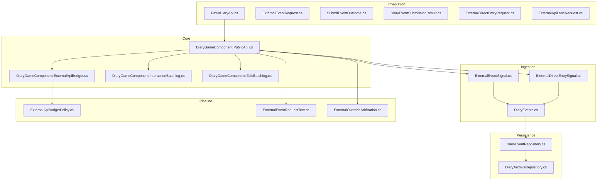
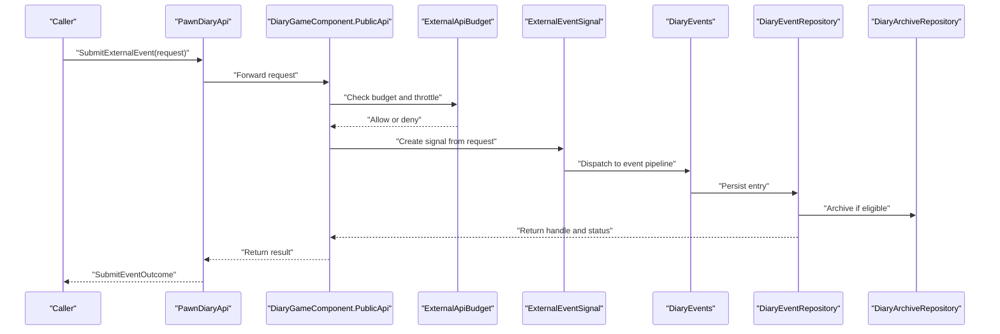
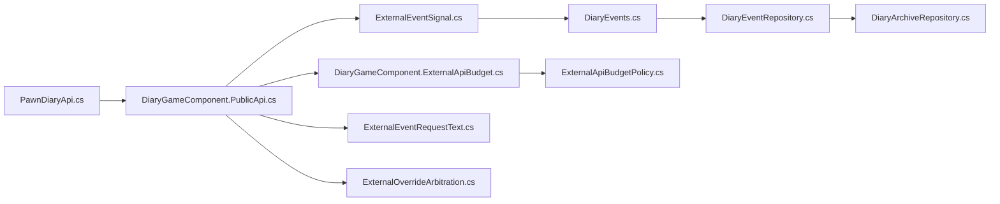

# Event Management API

<cite>
**Referenced Files in This Document**
- [ExternalEventRequest.cs](../../../../../Source/Integration/ExternalEventRequest.cs)
- [SubmitEventOutcome.cs](../../../../../Source/Integration/SubmitEventOutcome.cs)
- [DiaryEventSubmissionResult.cs](../../../../../Source/Integration/DiaryEventSubmissionResult.cs)
- [ExternalDirectEntryRequest.cs](../../../../../Source/Integration/ExternalDirectEntryRequest.cs)
- [ExternalApiLaneRequest.cs](../../../../../Source/Integration/ExternalApiLaneRequest.cs)
- [PawnDiaryApi.cs](../../../../../Source/Integration/PawnDiaryApi.cs)
- [DiaryGameComponent.PublicApi.cs](../../../../../Source/Core/DiaryGameComponent.PublicApi.cs)
- [DiaryGameComponent.ExternalApiBudget.cs](../../../../../Source/Core/DiaryGameComponent.ExternalApiBudget.cs)
- [ExternalEventSignal.cs](../../../../../Source/Ingestion/Sources/ExternalEventSignal.cs)
- [ExternalDirectEntrySignal.cs](../../../../../Source/Ingestion/Sources/ExternalDirectEntrySignal.cs)
- [DiaryEvents.cs](../../../../../Source/Ingestion/DiaryEvents.cs)
- [DiaryEventRepository.cs](../../../../../Source/Core/DiaryEventRepository.cs)
- [DiaryArchiveRepository.cs](../../../../../Source/Core/DiaryArchiveRepository.cs)
- [DiaryEntryStatusSnapshot.cs](../../../../../Source/Integration/DiaryEntryStatusSnapshot.cs)
- [EntryStatusListeners.cs](../../../../../Source/Integration/EntryStatusListeners.cs)
- [DiaryEntryHandle.cs](../../../../../Source/Integration/DiaryEntryHandle.cs)
- [DiaryGameComponent.InteractionBatching.cs](../../../../../Source/Core/DiaryGameComponent.InteractionBatching.cs)
- [DiaryGameComponent.TaleBatching.cs](../../../../../Source/Core/DiaryGameComponent.TaleBatching.cs)
- [GenericEventTypeDedup.cs](../../../../../Source/Capture/GenericEventTypeDedup.cs)
- [RecentEventExpiry.cs](../../../../../Source/Capture/RecentEventExpiry.cs)
- [ExternalApiBudgetPolicy.cs](../../../../../Source/Pipeline/ExternalApiBudgetPolicy.cs)
- [ExternalEventRequestText.cs](../../../../../Source/Pipeline/ExternalEventRequestText.cs)
- [ExternalOverrideArbitration.cs](../../../../../Source/Pipeline/ExternalOverrideArbitration.cs)
</cite>

## Table of Contents
1. [Introduction](#introduction)
2. [Project Structure](#project-structure)
3. [Core Components](#core-components)
4. [Architecture Overview](#architecture-overview)
5. [Detailed Component Analysis](#detailed-component-analysis)
6. [Dependency Analysis](#dependency-analysis)
7. [Performance Considerations](#performance-considerations)
8. [Troubleshooting Guide](#troubleshooting-guide)
9. [Conclusion](#conclusion)
10. [Appendices](#appendices)

## Introduction
This document provides comprehensive API documentation for the Event Management interface used to submit events into the diary system. It covers:
- Submitting internal and external events
- External event request structure, validation rules, and required fields
- Event lifecycle management, handle retrieval, and status tracking
- Batching operations for interactions and tales
- Error handling patterns, retry mechanisms, and asynchronous operation support
- Guidance on prioritization, deduplication strategies, and performance optimization

The goal is to enable integrators to reliably submit events (social interactions, work events, mood changes, etc.) with correct parameter formatting and robust error handling.

## Project Structure
The Event Management API spans several layers:
- Integration layer exposes public APIs and request/response models
- Core game component orchestrates submission, budgeting, and dispatch
- Ingestion layer converts requests into signals and events
- Repositories persist entries and manage archival
- Pipeline policies enforce budgets, overrides, and text processing

**Diagram sources**
- [PawnDiaryApi.cs](../../../../../Source/Integration/PawnDiaryApi.cs)
- [ExternalEventRequest.cs](../../../../../Source/Integration/ExternalEventRequest.cs)
- [SubmitEventOutcome.cs](../../../../../Source/Integration/SubmitEventOutcome.cs)
- [DiaryEventSubmissionResult.cs](../../../../../Source/Integration/DiaryEventSubmissionResult.cs)
- [ExternalDirectEntryRequest.cs](../../../../../Source/Integration/ExternalDirectEntryRequest.cs)
- [ExternalApiLaneRequest.cs](../../../../../Source/Integration/ExternalApiLaneRequest.cs)
- [DiaryGameComponent.PublicApi.cs](../../../../../Source/Core/DiaryGameComponent.PublicApi.cs)
- [DiaryGameComponent.ExternalApiBudget.cs](../../../../../Source/Core/DiaryGameComponent.ExternalApiBudget.cs)
- [DiaryGameComponent.InteractionBatching.cs](../../../../../Source/Core/DiaryGameComponent.InteractionBatching.cs)
- [DiaryGameComponent.TaleBatching.cs](../../../../../Source/Core/DiaryGameComponent.TaleBatching.cs)
- [ExternalEventSignal.cs](../../../../../Source/Ingestion/Sources/ExternalEventSignal.cs)
- [ExternalDirectEntrySignal.cs](../../../../../Source/Ingestion/Sources/ExternalDirectEntrySignal.cs)
- [DiaryEvents.cs](../../../../../Source/Ingestion/DiaryEvents.cs)
- [DiaryEventRepository.cs](../../../../../Source/Core/DiaryEventRepository.cs)
- [DiaryArchiveRepository.cs](../../../../../Source/Core/DiaryArchiveRepository.cs)
- [ExternalApiBudgetPolicy.cs](../../../../../Source/Pipeline/ExternalApiBudgetPolicy.cs)
- [ExternalEventRequestText.cs](../../../../../Source/Pipeline/ExternalEventRequestText.cs)
- [ExternalOverrideArbitration.cs](../../../../../Source/Pipeline/ExternalOverrideArbitration.cs)

**Section sources**
- [PawnDiaryApi.cs](../../../../../Source/Integration/PawnDiaryApi.cs)
- [DiaryGameComponent.PublicApi.cs](../../../../../Source/Core/DiaryGameComponent.PublicApi.cs)
- [ExternalEventRequest.cs](../../../../../Source/Integration/ExternalEventRequest.cs)

## Core Components
- Public API surface: Methods exposed to callers for submitting events and direct entries, including batching helpers.
- Request models: Structures defining parameters for external events and direct entries.
- Submission results and outcomes: Types returned to indicate success, failure, and diagnostics.
- Budgeting and throttling: Policies that limit external API usage and prevent overload.
- Ingestion signals: Internal representations bridging requests to event creation.
- Persistence: Repositories storing diary entries and managing archives.

Key responsibilities:
- Validate inputs and normalize text
- Enforce budget and override policies
- Dispatch to ingestion pipeline
- Persist entries and return handles/status

**Section sources**
- [PawnDiaryApi.cs](../../../../../Source/Integration/PawnDiaryApi.cs)
- [ExternalEventRequest.cs](../../../../../Source/Integration/ExternalEventRequest.cs)
- [SubmitEventOutcome.cs](../../../../../Source/Integration/SubmitEventOutcome.cs)
- [DiaryEventSubmissionResult.cs](../../../../../Source/Integration/DiaryEventSubmissionResult.cs)
- [ExternalDirectEntryRequest.cs](../../../../../Source/Integration/ExternalDirectEntryRequest.cs)
- [ExternalApiLaneRequest.cs](../../../../../Source/Integration/ExternalApiLaneRequest.cs)
- [DiaryGameComponent.PublicApi.cs](../../../../../Source/Core/DiaryGameComponent.PublicApi.cs)
- [DiaryGameComponent.ExternalApiBudget.cs](../../../../../Source/Core/DiaryGameComponent.ExternalApiBudget.cs)
- [ExternalApiBudgetPolicy.cs](../../../../../Source/Pipeline/ExternalApiBudgetPolicy.cs)

## Architecture Overview
End-to-end flow for external event submission:

**Diagram sources**
- [PawnDiaryApi.cs](../../../../../Source/Integration/PawnDiaryApi.cs)
- [DiaryGameComponent.PublicApi.cs](../../../../../Source/Core/DiaryGameComponent.PublicApi.cs)
- [DiaryGameComponent.ExternalApiBudget.cs](../../../../../Source/Core/DiaryGameComponent.ExternalApiBudget.cs)
- [ExternalEventSignal.cs](../../../../../Source/Ingestion/Sources/ExternalEventSignal.cs)
- [DiaryEvents.cs](../../../../../Source/Ingestion/DiaryEvents.cs)
- [DiaryEventRepository.cs](../../../../../Source/Core/DiaryEventRepository.cs)
- [DiaryArchiveRepository.cs](../../../../../Source/Core/DiaryArchiveRepository.cs)

## Detailed Component Analysis

### ExternalEventRequest Structure
Purpose: Defines a structured request to submit an external event into the diary system.

Properties and semantics:
- Identifier and categorization fields to classify the event type and source
- Contextual metadata such as pawn identifiers, timestamps, and labels
- Text content and optional overrides for writing style or narrative tone
- Flags controlling visibility, priority, and deduplication behavior
- Optional attachments for additional context (e.g., related entities, tags)

Validation rules and required fields:
- Required: core identity fields (event type/source), target pawn reference, and at least one meaningful text field
- Optional: timestamps default to current time if omitted; labels/tags are normalized and trimmed
- Constraints: length limits on text fields; allowed values for enums; uniqueness constraints for deduplication keys when provided

Recommended parameter formatting:
- Use consistent casing for enum-like fields
- Normalize whitespace and sanitize special characters in free-text fields
- Provide explicit timestamps for accurate ordering and deduplication windows

Error handling expectations:
- Invalid or missing required fields produce immediate rejection with diagnostic details
- Overly large payloads may be truncated or rejected based on policy
- Duplicate detection may suppress redundant submissions

**Section sources**
- [ExternalEventRequest.cs](../../../../../Source/Integration/ExternalEventRequest.cs)
- [ExternalEventRequestText.cs](../../../../../Source/Pipeline/ExternalEventRequestText.cs)

### SubmitEvent() Method
Responsibilities:
- Accepts internal event data structures and routes them through the standard pipeline
- Applies capture policies, deduplication, and retention rules
- Persists the resulting diary entry and returns a handle for later queries

Behavioral notes:
- Synchronous by default; integrates with the game’s update loop for non-blocking effects where applicable
- Returns a result object indicating success/failure and includes a handle for status tracking

Usage guidance:
- Prefer SubmitEvent() for native events captured by the system
- Ensure event spec matches expected schema and includes all required fields

**Section sources**
- [DiaryGameComponent.PublicApi.cs](../../../../../Source/Core/DiaryGameComponent.PublicApi.cs)
- [DiaryEventSubmissionResult.cs](../../../../../Source/Integration/DiaryEventSubmissionResult.cs)

### SubmitExternalEvent() Method
Responsibilities:
- Validates and normalizes ExternalEventRequest
- Enforces external API budget and throttling
- Converts request into an ingestion signal and dispatches it
- Returns a submission outcome with diagnostics and optional handle

Workflow highlights:
- Pre-flight checks: budget allowance, input validation, override arbitration
- Signal creation and dispatch to event pipeline
- Persistence and archiving decisions
- Result composition including status and handle

Asynchronous considerations:
- Heavy operations are offloaded; callers receive immediate outcomes and can poll status via handle

**Section sources**
- [PawnDiaryApi.cs](../../../../../Source/Integration/PawnDiaryApi.cs)
- [DiaryGameComponent.PublicApi.cs](../../../../../Source/Core/DiaryGameComponent.PublicApi.cs)
- [DiaryGameComponent.ExternalApiBudget.cs](../../../../../Source/Core/DiaryGameComponent.ExternalApiBudget.cs)
- [ExternalEventSignal.cs](../../../../../Source/Ingestion/Sources/ExternalEventSignal.cs)
- [ExternalApiBudgetPolicy.cs](../../../../../Source/Pipeline/ExternalApiBudgetPolicy.cs)
- [ExternalOverrideArbitration.cs](../../../../../Source/Pipeline/ExternalOverrideArbitration.cs)

### Direct Entry Submission
Use cases:
- Inserting arbitrary diary lines without full event modeling
- Quick logging of notes or annotations tied to a pawn

Request model:
- ExternalDirectEntryRequest defines minimal fields for direct entry submission

Flow:
- Validation and normalization
- Creation of a direct entry signal
- Persistence and optional archiving

**Section sources**
- [ExternalDirectEntryRequest.cs](../../../../../Source/Integration/ExternalDirectEntryRequest.cs)
- [ExternalDirectEntrySignal.cs](../../../../../Source/Ingestion/Sources/ExternalDirectEntrySignal.cs)

### Event Batching Operations
Interaction batching:
- Aggregates multiple interaction events to reduce overhead and improve coherence
- Applies grouping logic and deduplication across batch boundaries

Tale batching:
- Consolidates tale-related events for efficient processing and presentation

Benefits:
- Reduced persistence calls
- Improved narrative continuity
- Lower memory pressure during high-frequency events

**Section sources**
- [DiaryGameComponent.InteractionBatching.cs](../../../../../Source/Core/DiaryGameComponent.InteractionBatching.cs)
- [DiaryGameComponent.TaleBatching.cs](../../../../../Source/Core/DiaryGameComponent.TaleBatching.cs)

### Event Lifecycle Management
Lifecycle stages:
- Submission and validation
- Policy enforcement (budget, overrides)
- Ingestion and transformation
- Persistence and indexing
- Archival and retention cleanup

Handle retrieval and status tracking:
- Handles returned upon successful submission
- Status snapshots provide current state and metadata
- Listeners can subscribe to status changes for real-time updates

**Section sources**
- [DiaryEntryHandle.cs](../../../../../Source/Integration/DiaryEntryHandle.cs)
- [DiaryEntryStatusSnapshot.cs](../../../../../Source/Integration/DiaryEntryStatusSnapshot.cs)
- [EntryStatusListeners.cs](../../../../../Source/Integration/EntryStatusListeners.cs)
- [DiaryEventRepository.cs](../../../../../Source/Core/DiaryEventRepository.cs)
- [DiaryArchiveRepository.cs](../../../../../Source/Core/DiaryArchiveRepository.cs)

### Deduplication and Expiry
Strategies:
- Generic event-type deduplication to avoid near-duplicate entries
- Recent event expiry to prune stale entries and maintain performance

Guidance:
- Provide stable identifiers or composite keys to leverage deduplication
- Tune expiry windows based on gameplay cadence and storage constraints

**Section sources**
- [GenericEventTypeDedup.cs](../../../../../Source/Capture/GenericEventTypeDedup.cs)
- [RecentEventExpiry.cs](../../../../../Source/Capture/RecentEventExpiry.cs)

### Prioritization and Overrides
Prioritization:
- External events can include priority hints to influence scheduling and display order
- System applies default priorities when unspecified

Overrides:
- Arbitration policies allow controlled overrides for writing style, tone, or narrative framing
- Override precedence is enforced to ensure consistency

**Section sources**
- [ExternalEventRequestText.cs](../../../../../Source/Pipeline/ExternalEventRequestText.cs)
- [ExternalOverrideArbitration.cs](../../../../../Source/Pipeline/ExternalOverrideArbitration.cs)

## Dependency Analysis
High-level dependencies among components involved in event submission:

**Diagram sources**
- [PawnDiaryApi.cs](../../../../../Source/Integration/PawnDiaryApi.cs)
- [DiaryGameComponent.PublicApi.cs](../../../../../Source/Core/DiaryGameComponent.PublicApi.cs)
- [DiaryGameComponent.ExternalApiBudget.cs](../../../../../Source/Core/DiaryGameComponent.ExternalApiBudget.cs)
- [ExternalEventSignal.cs](../../../../../Source/Ingestion/Sources/ExternalEventSignal.cs)
- [DiaryEvents.cs](../../../../../Source/Ingestion/DiaryEvents.cs)
- [DiaryEventRepository.cs](../../../../../Source/Core/DiaryEventRepository.cs)
- [DiaryArchiveRepository.cs](../../../../../Source/Core/DiaryArchiveRepository.cs)
- [ExternalEventRequestText.cs](../../../../../Source/Pipeline/ExternalEventRequestText.cs)
- [ExternalOverrideArbitration.cs](../../../../../Source/Pipeline/ExternalOverrideArbitration.cs)
- [ExternalApiBudgetPolicy.cs](../../../../../Source/Pipeline/ExternalApiBudgetPolicy.cs)

**Section sources**
- [PawnDiaryApi.cs](../../../../../Source/Integration/PawnDiaryApi.cs)
- [DiaryGameComponent.PublicApi.cs](../../../../../Source/Core/DiaryGameComponent.PublicApi.cs)
- [DiaryEventRepository.cs](../../../../../Source/Core/DiaryEventRepository.cs)
- [DiaryArchiveRepository.cs](../../../../../Source/Core/DiaryArchiveRepository.cs)

## Performance Considerations
- Batch frequently occurring events (interactions, tales) to reduce persistence overhead
- Leverage deduplication to avoid redundant writes and UI churn
- Respect external API budget policies to prevent throttling and ensure stability
- Normalize and trim text early to minimize downstream processing costs
- Use appropriate timestamps to aid ordering and windowed expiry
- Monitor status snapshots and listener callbacks to avoid polling loops

[No sources needed since this section provides general guidance]

## Troubleshooting Guide
Common issues and resolutions:
- Validation failures: Check required fields and constraints in ExternalEventRequest
- Budget denials: Reduce submission frequency or adjust budget settings
- Duplicate suppression: Verify deduplication keys and time windows
- Stale entries: Review expiry policies and retention plans
- Status not updating: Ensure listeners are registered and handles are valid

Diagnostic resources:
- Submission outcomes include error codes and messages
- Status snapshots expose detailed state for debugging
- Repository and archive logs can help trace persistence paths

**Section sources**
- [SubmitEventOutcome.cs](../../../../../Source/Integration/SubmitEventOutcome.cs)
- [DiaryEventSubmissionResult.cs](../../../../../Source/Integration/DiaryEventSubmissionResult.cs)
- [DiaryEntryStatusSnapshot.cs](../../../../../Source/Integration/DiaryEntryStatusSnapshot.cs)
- [EntryStatusListeners.cs](../../../../../Source/Integration/EntryStatusListeners.cs)

## Conclusion
The Event Management API provides a robust, policy-driven pathway for submitting both internal and external events into the diary system. By adhering to the request schemas, leveraging batching and deduplication, and respecting budget and override policies, integrators can achieve reliable, performant event ingestion with clear lifecycle management and status tracking.

[No sources needed since this section summarizes without analyzing specific files]

## Appendices

### Example Scenarios and Parameter Formatting
- Social interactions: Include actor/target identifiers, interaction type, and concise description
- Work events: Specify task type, duration hints, and outcome indicators
- Mood changes: Provide mood category, intensity, and contextual triggers
- General tips:
  - Use explicit timestamps for accurate ordering
  - Keep descriptions concise and informative
  - Supply labels/tags to aid filtering and analytics

[No sources needed since this section provides general guidance]
