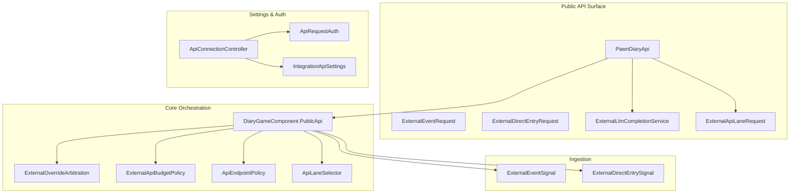
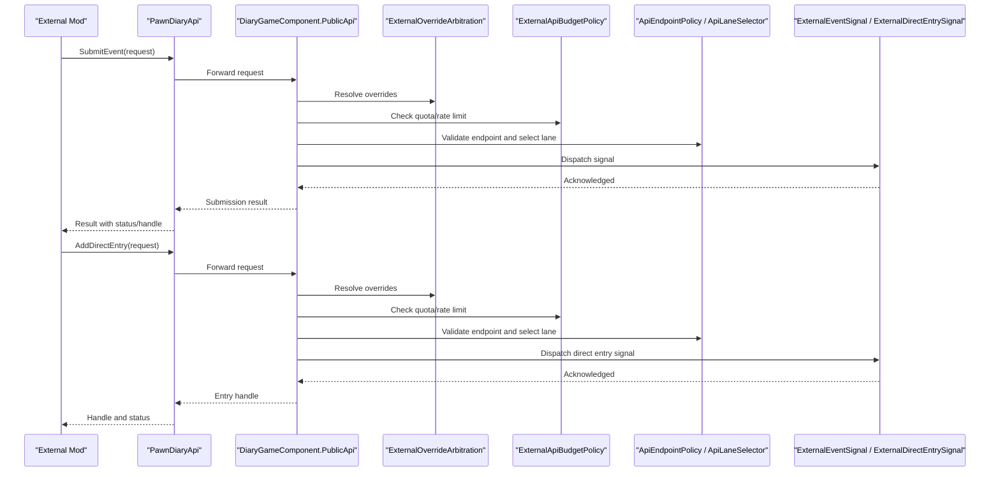
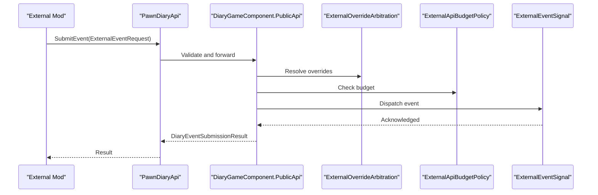
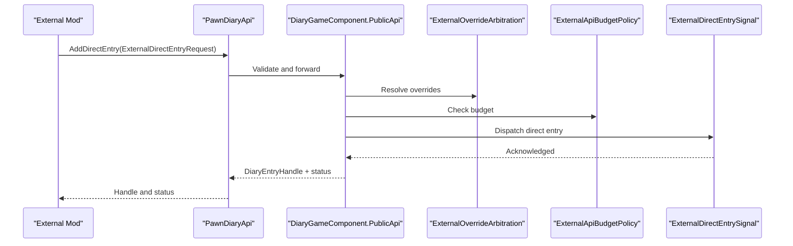
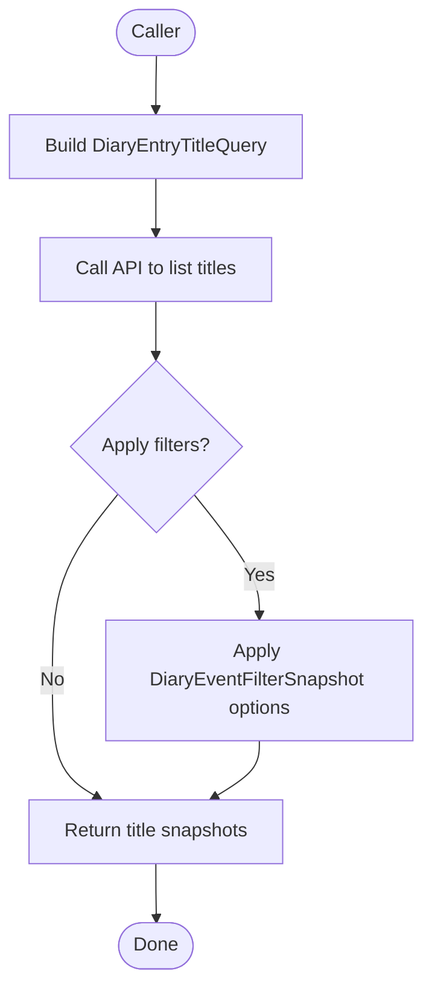
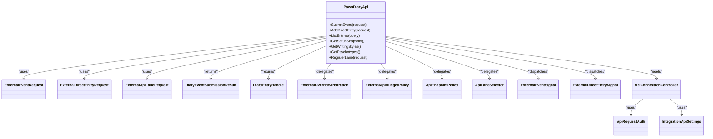

# Public API Reference

<cite>
**Referenced Files in This Document**
- [PawnDiaryApi.cs](../../../../../Source/Integration/PawnDiaryApi.cs)
- [ExternalEventRequest.cs](../../../../../Source/Integration/ExternalEventRequest.cs)
- [ExternalDirectEntryRequest.cs](../../../../../Source/Integration/ExternalDirectEntryRequest.cs)
- [ExternalLlmCompletionService.cs](../../../../../Source/Integration/ExternalLlmCompletionService.cs)
- [ExternalApiLaneRequest.cs](../../../../../Source/Integration/ExternalApiLaneRequest.cs)
- [DiaryEventSubmissionResult.cs](../../../../../Source/Integration/DiaryEventSubmissionResult.cs)
- [SubmitEventOutcome.cs](../../../../../Source/Integration/SubmitEventOutcome.cs)
- [DiaryEntryHandle.cs](../../../../../Source/Integration/DiaryEntryHandle.cs)
- [DiaryEntrySnapshot.cs](../../../../../Source/Integration/DiaryEntrySnapshot.cs)
- [DiaryEntryTitleQuery.cs](../../../../../Source/Integration/DiaryEntryTitleQuery.cs)
- [DiaryEntryTitleSnapshot.cs](../../../../../Source/Integration/DiaryEntryTitleSnapshot.cs)
- [DiaryEventFilterSnapshot.cs](../../../../../Source/Integration/DiaryEventFilterSnapshot.cs)
- [DiaryHealthSummarySnapshot.cs](../../../../../Source/Integration/DiaryHealthSummarySnapshot.cs)
- [DiaryPromptEnchantmentCandidateSnapshot.cs](../../../../../Source/Integration/DiaryPromptEnchantmentCandidateSnapshot.cs)
- [DiaryPromptPreviewSnapshot.cs](../../../../../Source/Integration/DiaryPromptPreviewSnapshot.cs)
- [DiaryPsychotypeSnapshot.cs](../../../../../Source/Integration/DiaryPsychotypeSnapshot.cs)
- [DiaryWritingStyleSnapshot.cs](../../../../../Source/Integration/DiaryWritingStyleSnapshot.cs)
- [DiaryApiSetupSnapshot.cs](../../../../../Source/Integration/DiaryApiSetupSnapshot.cs)
- [DiaryApiLaneSnapshot.cs](../../../../../Source/Integration/DiaryApiLaneSnapshot.cs)
- [AddApiLaneResult.cs](../../../../../Source/Integration/AddApiLaneResult.cs)
- [CaptureCapabilities.cs](../../../../../Source/Integration/CaptureCapabilities.cs)
- [EntryStatusListeners.cs](../../../../../Source/Integration/EntryStatusListeners.cs)
- [DiaryGameComponent.PublicApi.cs](../../../../../Source/Core/DiaryGameComponent.PublicApi.cs)
- [ExternalEventSignal.cs](../../../../../Source/Ingestion/Sources/ExternalEventSignal.cs)
- [ExternalDirectEntrySignal.cs](../../../../../Source/Ingestion/Sources/ExternalDirectEntrySignal.cs)
- [ExternalEventRequestText.cs](../../../../../Source/Pipeline/ExternalEventRequestText.cs)
- [ExternalDirectEntryText.cs](../../../../../Source/Pipeline/ExternalDirectEntryText.cs)
- [ExternalOverrideArbitration.cs](../../../../../Source/Pipeline/ExternalOverrideArbitration.cs)
- [ExternalApiBudgetPolicy.cs](../../../../../Source/Pipeline/ExternalApiBudgetPolicy.cs)
- [ApiEndpointPolicy.cs](../../../../../Source/Pipeline/ApiEndpointPolicy.cs)
- [ApiLaneIdentity.cs](../../../../../Source/Pipeline/ApiLaneIdentity.cs)
- [ApiLaneImport.cs](../../../../../Source/Pipeline/ApiLaneImport.cs)
- [ApiLaneSelector.cs](../../../../../Source/Pipeline/ApiLaneSelector.cs)
- [ListenerRegistry.cs](../../../../../Source/Pipeline/ListenerRegistry.cs)
- [PawnDiaryMod.ApiLanes.cs](../../../../../Source/Settings/PawnDiaryMod.ApiLanes.cs)
- [ApiConnectionController.cs](../../../../../Source/Settings/ApiConnectionController.cs)
- [ApiRequestAuth.cs](../../../../../Source/Settings/ApiRequestAuth.cs)
- [IntegrationApiSettings.cs](../../../../../Source/Settings/IntegrationApiSettings.cs)
- [ExternalSourceLoadOrder.cs](../../../../../Source/Util/ExternalSourceLoadOrder.cs)
</cite>

## Table of Contents
1. [Introduction](#introduction)
2. [Project Structure](#project-structure)
3. [Core Components](#core-components)
4. [Architecture Overview](#architecture-overview)
5. [Detailed Component Analysis](#detailed-component-analysis)
6. [Dependency Analysis](#dependency-analysis)
7. [Performance Considerations](#performance-considerations)
8. [Troubleshooting Guide](#troubleshooting-guide)
9. [Conclusion](#conclusion)
10. [Appendices](#appendices)

## Introduction
This document defines the public API surface exposed by Pawn Diary for external mods and integrations. It covers:
- How to submit events and direct diary entries
- How to query diary entries, titles, and filters
- How to access configuration and lane setup snapshots
- The request/response formats for external requests
- Authentication requirements, rate limiting, and best practices

The API is designed to be safe, deterministic, and sandboxed within the game runtime. External callers interact through a typed C# interface that validates inputs, enforces budgets, and routes requests into the internal ingestion pipeline.

## Project Structure
The public API surface is primarily defined in the Integration layer and orchestrated by core components. Key areas:
- Public entry points and method contracts
- Request and response data models
- Pipeline policies for budgeting, override arbitration, and endpoint routing
- Settings and authentication controllers
- Ingestion signals bridging external calls into the event system

**Diagram sources**
- [PawnDiaryApi.cs](../../../../../Source/Integration/PawnDiaryApi.cs)
- [DiaryGameComponent.PublicApi.cs](../../../../../Source/Core/DiaryGameComponent.PublicApi.cs)
- [ExternalEventRequest.cs](../../../../../Source/Integration/ExternalEventRequest.cs)
- [ExternalDirectEntryRequest.cs](../../../../../Source/Integration/ExternalDirectEntryRequest.cs)
- [ExternalLlmCompletionService.cs](../../../../../Source/Integration/ExternalLlmCompletionService.cs)
- [ExternalApiLaneRequest.cs](../../../../../Source/Integration/ExternalApiLaneRequest.cs)
- [ExternalOverrideArbitration.cs](../../../../../Source/Pipeline/ExternalOverrideArbitration.cs)
- [ExternalApiBudgetPolicy.cs](../../../../../Source/Pipeline/ExternalApiBudgetPolicy.cs)
- [ApiEndpointPolicy.cs](../../../../../Source/Pipeline/ApiEndpointPolicy.cs)
- [ApiLaneSelector.cs](../../../../../Source/Pipeline/ApiLaneSelector.cs)
- [ExternalEventSignal.cs](../../../../../Source/Ingestion/Sources/ExternalEventSignal.cs)
- [ExternalDirectEntrySignal.cs](../../../../../Source/Ingestion/Sources/ExternalDirectEntrySignal.cs)
- [ApiConnectionController.cs](../../../../../Source/Settings/ApiConnectionController.cs)
- [ApiRequestAuth.cs](../../../../../Source/Settings/ApiRequestAuth.cs)
- [IntegrationApiSettings.cs](../../../../../Source/Settings/IntegrationApiSettings.cs)

**Section sources**
- [PawnDiaryApi.cs](../../../../../Source/Integration/PawnDiaryApi.cs)
- [DiaryGameComponent.PublicApi.cs](../../../../../Source/Core/DiaryGameComponent.PublicApi.cs)

## Core Components
- Public API facade: Provides methods to submit events, add direct entries, preview prompts, manage lanes, and read snapshots.
- Request models: Define payloads for external event submission and direct entry creation.
- Response models: Represent outcomes, handles, and snapshot views of entries and settings.
- Budget and override policies: Enforce rate limits and resolve conflicts between multiple external sources.
- Endpoint and lane routing: Select appropriate processing lanes and validate endpoints.
- Settings and auth: Manage connection parameters, authentication tokens, and integration toggles.

**Section sources**
- [PawnDiaryApi.cs](../../../../../Source/Integration/PawnDiaryApi.cs)
- [ExternalEventRequest.cs](../../../../../Source/Integration/ExternalEventRequest.cs)
- [ExternalDirectEntryRequest.cs](../../../../../Source/Integration/ExternalDirectEntryRequest.cs)
- [ExternalLlmCompletionService.cs](../../../../../Source/Integration/ExternalLlmCompletionService.cs)
- [ExternalApiLaneRequest.cs](../../../../../Source/Integration/ExternalApiLaneRequest.cs)
- [ExternalApiBudgetPolicy.cs](../../../../../Source/Pipeline/ExternalApiBudgetPolicy.cs)
- [ExternalOverrideArbitration.cs](../../../../../Source/Pipeline/ExternalOverrideArbitration.cs)
- [ApiEndpointPolicy.cs](../../../../../Source/Pipeline/ApiEndpointPolicy.cs)
- [ApiLaneSelector.cs](../../../../../Source/Pipeline/ApiLaneSelector.cs)
- [ApiConnectionController.cs](../../../../../Source/Settings/ApiConnectionController.cs)
- [ApiRequestAuth.cs](../../../../../Source/Settings/ApiRequestAuth.cs)
- [IntegrationApiSettings.cs](../../../../../Source/Settings/IntegrationApiSettings.cs)

## Architecture Overview
The public API follows a layered flow:
- Caller invokes typed methods on the public API facade.
- Requests are validated against endpoint policies and lane selectors.
- Override arbitration resolves conflicting external inputs.
- Budget policy enforces rate limits and quotas.
- Ingestion signals dispatch events or direct entries into the diary pipeline.
- Responses return structured results, handles, or snapshots.

**Diagram sources**
- [PawnDiaryApi.cs](../../../../../Source/Integration/PawnDiaryApi.cs)
- [DiaryGameComponent.PublicApi.cs](../../../../../Source/Core/DiaryGameComponent.PublicApi.cs)
- [ExternalOverrideArbitration.cs](../../../../../Source/Pipeline/ExternalOverrideArbitration.cs)
- [ExternalApiBudgetPolicy.cs](../../../../../Source/Pipeline/ExternalApiBudgetPolicy.cs)
- [ApiEndpointPolicy.cs](../../../../../Source/Pipeline/ApiEndpointPolicy.cs)
- [ApiLaneSelector.cs](../../../../../Source/Pipeline/ApiLaneSelector.cs)
- [ExternalEventSignal.cs](../../../../../Source/Ingestion/Sources/ExternalEventSignal.cs)
- [ExternalDirectEntrySignal.cs](../../../../../Source/Ingestion/Sources/ExternalDirectEntrySignal.cs)

## Detailed Component Analysis

### Public API Facade (PawnDiaryApi)
Responsibilities:
- Expose typed methods for event submission, direct entry creation, prompt preview, and snapshot queries.
- Provide access to LLM completion service and lane management utilities.
- Return structured results and handles for tracking.

Key capabilities:
- Event submission with validation and outcome reporting
- Direct entry creation with attribution and style overrides
- Prompt preview and enchantment candidate inspection
- Lane registration and selection helpers
- Snapshot retrieval for health, setup, writing styles, psychotypes, and more

Method categories:
- Submission: Submit events and direct entries
- Querying: Retrieve entry snapshots, titles, filters, and stats
- Configuration: Access setup snapshots, writing styles, psychotypes, and capture capabilities
- Utilities: LLM completion, lane operations, and listener management

Return types and error handling:
- Submission returns structured results indicating success, partial success, or failure with reasons
- Queries return snapshots or empty collections when no data matches
- Exceptions are avoided where possible; errors are represented via result objects and status codes

**Section sources**
- [PawnDiaryApi.cs](../../../../../Source/Integration/PawnDiaryApi.cs)
- [DiaryGameComponent.PublicApi.cs](../../../../../Source/Core/DiaryGameComponent.PublicApi.cs)

### Request Models

#### ExternalEventRequest
Purpose:
- Defines the payload for submitting an external event to the diary pipeline.

Fields:
- Identifier and categorization keys for domain classification
- Contextual metadata such as pawn references, timestamps, and tags
- Optional text decorations and enrichment fields
- Source attribution and lane hints

Validation:
- Required fields enforced at the API boundary
- Domain-specific constraints applied during ingestion

Response:
- Returns a submission result with status and optional diagnostic details

**Section sources**
- [ExternalEventRequest.cs](../../../../../Source/Integration/ExternalEventRequest.cs)
- [ExternalEventRequestText.cs](../../../../../Source/Pipeline/ExternalEventRequestText.cs)

#### ExternalDirectEntryRequest
Purpose:
- Defines the payload for creating a direct diary entry without event processing.

Fields:
- Title and body content
- Pawn association and timestamp
- Writing style override and text decorations
- Attribution and lane hints

Validation:
- Content length and formatting constraints
- Style and decoration compatibility checks

Response:
- Returns an entry handle and status

**Section sources**
- [ExternalDirectEntryRequest.cs](../../../../../Source/Integration/ExternalDirectEntryRequest.cs)
- [ExternalDirectEntryText.cs](../../../../../Source/Pipeline/ExternalDirectEntryText.cs)

#### ExternalApiLaneRequest
Purpose:
- Describes lane-based operations for advanced integrations.

Fields:
- Lane identity and import descriptors
- Capability flags and priority hints

Usage:
- Used by mod developers to register custom lanes and control routing behavior

**Section sources**
- [ExternalApiLaneRequest.cs](../../../../../Source/Integration/ExternalApiLaneRequest.cs)
- [ApiLaneIdentity.cs](../../../../../Source/Pipeline/ApiLaneIdentity.cs)
- [ApiLaneImport.cs](../../../../../Source/Pipeline/ApiLaneImport.cs)
- [ApiLaneSelector.cs](../../../../../Source/Pipeline/ApiLaneSelector.cs)

### Response Models

#### DiaryEventSubmissionResult
Purpose:
- Represents the outcome of an event submission attempt.

Fields:
- Status code indicating success, partial success, or failure
- Diagnostic messages and error codes
- Optional handle if applicable

Error codes:
- Validation failures
- Rate limit exceeded
- Lane not available
- Override conflict resolved unfavorably

**Section sources**
- [DiaryEventSubmissionResult.cs](../../../../../Source/Integration/DiaryEventSubmissionResult.cs)
- [SubmitEventOutcome.cs](../../../../../Source/Integration/SubmitEventOutcome.cs)

#### DiaryEntryHandle
Purpose:
- Immutable reference to a created diary entry.

Usage:
- Used to track and later retrieve entry snapshots or update status listeners

**Section sources**
- [DiaryEntryHandle.cs](../../../../../Source/Integration/DiaryEntryHandle.cs)

#### Snapshots
- DiaryEntrySnapshot: Read-only view of an entry’s state and content
- DiaryEntryTitleQuery and DiaryEntryTitleSnapshot: Filtering and listing titles
- DiaryEventFilterSnapshot: Available filter definitions
- DiaryHealthSummarySnapshot: System health overview
- DiaryPromptEnchantmentCandidateSnapshot: Potential prompt enchantments
- DiaryPromptPreviewSnapshot: Preview of generated prompt text
- DiaryPsychotypeSnapshot: Psychotype resolution details
- DiaryWritingStyleSnapshot: Active writing style information
- DiaryApiSetupSnapshot: Current API setup and capabilities
- DiaryApiLaneSnapshot: Registered lanes and their statuses
- CaptureCapabilities: Feature flags and supported domains

**Section sources**
- [DiaryEntrySnapshot.cs](../../../../../Source/Integration/DiaryEntrySnapshot.cs)
- [DiaryEntryTitleQuery.cs](../../../../../Source/Integration/DiaryEntryTitleQuery.cs)
- [DiaryEntryTitleSnapshot.cs](../../../../../Source/Integration/DiaryEntryTitleSnapshot.cs)
- [DiaryEventFilterSnapshot.cs](../../../../../Source/Integration/DiaryEventFilterSnapshot.cs)
- [DiaryHealthSummarySnapshot.cs](../../../../../Source/Integration/DiaryHealthSummarySnapshot.cs)
- [DiaryPromptEnchantmentCandidateSnapshot.cs](../../../../../Source/Integration/DiaryPromptEnchantmentCandidateSnapshot.cs)
- [DiaryPromptPreviewSnapshot.cs](../../../../../Source/Integration/DiaryPromptPreviewSnapshot.cs)
- [DiaryPsychotypeSnapshot.cs](../../../../../Source/Integration/DiaryPsychotypeSnapshot.cs)
- [DiaryWritingStyleSnapshot.cs](../../../../../Source/Integration/DiaryWritingStyleSnapshot.cs)
- [DiaryApiSetupSnapshot.cs](../../../../../Source/Integration/DiaryApiSetupSnapshot.cs)
- [DiaryApiLaneSnapshot.cs](../../../../../Source/Integration/DiaryApiLaneSnapshot.cs)
- [CaptureCapabilities.cs](../../../../../Source/Integration/CaptureCapabilities.cs)

### Policies and Routing

#### ExternalOverrideArbitration
Purpose:
- Resolves conflicts when multiple external sources provide overlapping context or styling.

Behavior:
- Applies precedence rules based on lane priority and source trust levels
- Produces a single effective configuration for processing

**Section sources**
- [ExternalOverrideArbitration.cs](../../../../../Source/Pipeline/ExternalOverrideArbitration.cs)

#### ExternalApiBudgetPolicy
Purpose:
- Enforces rate limits and quotas for external API usage.

Policies:
- Per-mod request caps
- Global throughput limits
- Backoff and retry guidance

**Section sources**
- [ExternalApiBudgetPolicy.cs](../../../../../Source/Pipeline/ExternalApiBudgetPolicy.cs)

#### Endpoint and Lane Selection
- ApiEndpointPolicy: Validates requested endpoints and ensures safety boundaries
- ApiLaneSelector: Chooses the appropriate processing lane based on request attributes
- ListenerRegistry: Manages callbacks for entry status changes

**Section sources**
- [ApiEndpointPolicy.cs](../../../../../Source/Pipeline/ApiEndpointPolicy.cs)
- [ApiLaneSelector.cs](../../../../../Source/Pipeline/ApiLaneSelector.cs)
- [ListenerRegistry.cs](../../../../../Source/Pipeline/ListenerRegistry.cs)

### Settings and Authentication

#### ApiConnectionController
Purpose:
- Centralizes connection lifecycle and configuration access for external integrations.

Features:
- Toggle integration features
- Inspect active connections and capabilities

**Section sources**
- [ApiConnectionController.cs](../../../../../Source/Settings/ApiConnectionController.cs)

#### ApiRequestAuth and IntegrationApiSettings
Purpose:
- Define authentication tokens and integration-wide settings.

Security:
- Tokens are validated before processing sensitive operations
- Settings can restrict allowed domains and endpoints

**Section sources**
- [ApiRequestAuth.cs](../../../../../Source/Settings/ApiRequestAuth.cs)
- [IntegrationApiSettings.cs](../../../../../Source/Settings/IntegrationApiSettings.cs)

### Ingestion Signals
- ExternalEventSignal: Bridges submitted events into the ingestion pipeline
- ExternalDirectEntrySignal: Bridges direct entries into the pipeline

These signals carry validated payloads and trigger downstream processing.

**Section sources**
- [ExternalEventSignal.cs](../../../../../Source/Ingestion/Sources/ExternalEventSignal.cs)
- [ExternalDirectEntrySignal.cs](../../../../../Source/Ingestion/Sources/ExternalDirectEntrySignal.cs)

### Example Workflows

#### Event Submission Flow

**Diagram sources**
- [PawnDiaryApi.cs](../../../../../Source/Integration/PawnDiaryApi.cs)
- [DiaryGameComponent.PublicApi.cs](../../../../../Source/Core/DiaryGameComponent.PublicApi.cs)
- [ExternalOverrideArbitration.cs](../../../../../Source/Pipeline/ExternalOverrideArbitration.cs)
- [ExternalApiBudgetPolicy.cs](../../../../../Source/Pipeline/ExternalApiBudgetPolicy.cs)
- [ExternalEventSignal.cs](../../../../../Source/Ingestion/Sources/ExternalEventSignal.cs)

#### Direct Entry Creation Flow

**Diagram sources**
- [PawnDiaryApi.cs](../../../../../Source/Integration/PawnDiaryApi.cs)
- [DiaryGameComponent.PublicApi.cs](../../../../../Source/Core/DiaryGameComponent.PublicApi.cs)
- [ExternalOverrideArbitration.cs](../../../../../Source/Pipeline/ExternalOverrideArbitration.cs)
- [ExternalApiBudgetPolicy.cs](../../../../../Source/Pipeline/ExternalApiBudgetPolicy.cs)
- [ExternalDirectEntrySignal.cs](../../../../../Source/Ingestion/Sources/ExternalDirectEntrySignal.cs)

#### Querying Entries and Titles

[No sources needed since this diagram shows conceptual workflow, not actual code structure]

## Dependency Analysis
The public API depends on several pipeline and settings components to ensure safe and controlled interactions.

**Diagram sources**
- [PawnDiaryApi.cs](../../../../../Source/Integration/PawnDiaryApi.cs)
- [ExternalEventRequest.cs](../../../../../Source/Integration/ExternalEventRequest.cs)
- [ExternalDirectEntryRequest.cs](../../../../../Source/Integration/ExternalDirectEntryRequest.cs)
- [ExternalApiLaneRequest.cs](../../../../../Source/Integration/ExternalApiLaneRequest.cs)
- [DiaryEventSubmissionResult.cs](../../../../../Source/Integration/DiaryEventSubmissionResult.cs)
- [DiaryEntryHandle.cs](../../../../../Source/Integration/DiaryEntryHandle.cs)
- [ExternalOverrideArbitration.cs](../../../../../Source/Pipeline/ExternalOverrideArbitration.cs)
- [ExternalApiBudgetPolicy.cs](../../../../../Source/Pipeline/ExternalApiBudgetPolicy.cs)
- [ApiEndpointPolicy.cs](../../../../../Source/Pipeline/ApiEndpointPolicy.cs)
- [ApiLaneSelector.cs](../../../../../Source/Pipeline/ApiLaneSelector.cs)
- [ExternalEventSignal.cs](../../../../../Source/Ingestion/Sources/ExternalEventSignal.cs)
- [ExternalDirectEntrySignal.cs](../../../../../Source/Ingestion/Sources/ExternalDirectEntrySignal.cs)
- [ApiConnectionController.cs](../../../../../Source/Settings/ApiConnectionController.cs)
- [ApiRequestAuth.cs](../../../../../Source/Settings/ApiRequestAuth.cs)
- [IntegrationApiSettings.cs](../../../../../Source/Settings/IntegrationApiSettings.cs)

**Section sources**
- [PawnDiaryApi.cs](../../../../../Source/Integration/PawnDiaryApi.cs)
- [ExternalEventRequest.cs](../../../../../Source/Integration/ExternalEventRequest.cs)
- [ExternalDirectEntryRequest.cs](../../../../../Source/Integration/ExternalDirectEntryRequest.cs)
- [ExternalApiLaneRequest.cs](../../../../../Source/Integration/ExternalApiLaneRequest.cs)
- [DiaryEventSubmissionResult.cs](../../../../../Source/Integration/DiaryEventSubmissionResult.cs)
- [DiaryEntryHandle.cs](../../../../../Source/Integration/DiaryEntryHandle.cs)
- [ExternalOverrideArbitration.cs](../../../../../Source/Pipeline/ExternalOverrideArbitration.cs)
- [ExternalApiBudgetPolicy.cs](../../../../../Source/Pipeline/ExternalApiBudgetPolicy.cs)
- [ApiEndpointPolicy.cs](../../../../../Source/Pipeline/ApiEndpointPolicy.cs)
- [ApiLaneSelector.cs](../../../../../Source/Pipeline/ApiLaneSelector.cs)
- [ExternalEventSignal.cs](../../../../../Source/Ingestion/Sources/ExternalEventSignal.cs)
- [ExternalDirectEntrySignal.cs](../../../../../Source/Ingestion/Sources/ExternalDirectEntrySignal.cs)
- [ApiConnectionController.cs](../../../../../Source/Settings/ApiConnectionController.cs)
- [ApiRequestAuth.cs](../../../../../Source/Settings/ApiRequestAuth.cs)
- [IntegrationApiSettings.cs](../../../../../Source/Settings/IntegrationApiSettings.cs)

## Performance Considerations
- Batch submissions: Group related events to reduce overhead and improve throughput.
- Respect rate limits: Monitor budget policy responses and implement backoff strategies.
- Prefer snapshots: Use snapshot queries for read-heavy scenarios instead of repeated detailed lookups.
- Avoid redundant decorations: Minimize heavy text decorations and style overrides unless necessary.
- Leverage lanes: Register efficient lanes for high-volume sources to optimize routing.

[No sources needed since this section provides general guidance]

## Troubleshooting Guide
Common issues and resolutions:
- Validation failures: Ensure required fields are present and conform to expected formats.
- Rate limit exceeded: Implement exponential backoff and reduce request frequency.
- Override conflicts: Adjust lane priorities or source trust levels to resolve conflicts.
- Endpoint not available: Verify endpoint permissions and integration settings.
- Authentication errors: Confirm tokens are valid and not expired; check integration settings.

Operational tips:
- Use health summary snapshots to diagnose system state.
- Inspect setup snapshots to confirm feature availability.
- Subscribe to entry status listeners for real-time feedback on long-running operations.

**Section sources**
- [DiaryHealthSummarySnapshot.cs](../../../../../Source/Integration/DiaryHealthSummarySnapshot.cs)
- [DiaryApiSetupSnapshot.cs](../../../../../Source/Integration/DiaryApiSetupSnapshot.cs)
- [EntryStatusListeners.cs](../../../../../Source/Integration/EntryStatusListeners.cs)
- [ExternalApiBudgetPolicy.cs](../../../../../Source/Pipeline/ExternalApiBudgetPolicy.cs)
- [ExternalOverrideArbitration.cs](../../../../../Source/Pipeline/ExternalOverrideArbitration.cs)
- [ApiEndpointPolicy.cs](../../../../../Source/Pipeline/ApiEndpointPolicy.cs)
- [ApiConnectionController.cs](../../../../../Source/Settings/ApiConnectionController.cs)
- [ApiRequestAuth.cs](../../../../../Source/Settings/ApiRequestAuth.cs)
- [IntegrationApiSettings.cs](../../../../../Source/Settings/IntegrationApiSettings.cs)

## Conclusion
The Pawn Diary public API provides a robust, policy-driven interface for external mods to contribute events, create entries, and inspect system state. By adhering to request formats, respecting rate limits, and leveraging snapshots and lanes, mod developers can integrate safely and efficiently.

[No sources needed since this section summarizes without analyzing specific files]

## Appendices

### Best Practices for Mod Developers
- Always validate inputs locally before calling the API.
- Implement retries with backoff for transient failures.
- Use lane registration to optimize routing for high-volume sources.
- Prefer reading snapshots over frequent detailed queries.
- Keep text decorations minimal and compatible with target writing styles.
- Monitor health and setup snapshots to adapt to runtime changes.

[No sources needed since this section provides general guidance]

### External Event Request Format Summary
- Identify the event type and domain using provided keys.
- Include contextual metadata such as pawn references and timestamps.
- Optionally attach text decorations and enrichment fields.
- Provide source attribution and lane hints for routing.

**Section sources**
- [ExternalEventRequest.cs](../../../../../Source/Integration/ExternalEventRequest.cs)
- [ExternalEventRequestText.cs](../../../../../Source/Pipeline/ExternalEventRequestText.cs)

### Direct Entry Request Format Summary
- Supply title and body content within size limits.
- Associate with a pawn and set timestamp.
- Optionally override writing style and apply text decorations.
- Provide attribution and lane hints.

**Section sources**
- [ExternalDirectEntryRequest.cs](../../../../../Source/Integration/ExternalDirectEntryRequest.cs)
- [ExternalDirectEntryText.cs](../../../../../Source/Pipeline/ExternalDirectEntryText.cs)

### Authentication and Security Notes
- Use tokens configured in integration settings.
- Restrict allowed domains and endpoints via settings.
- Validate tokens before performing sensitive operations.

**Section sources**
- [ApiRequestAuth.cs](../../../../../Source/Settings/ApiRequestAuth.cs)
- [IntegrationApiSettings.cs](../../../../../Source/Settings/IntegrationApiSettings.cs)
- [ApiConnectionController.cs](../../../../../Source/Settings/ApiConnectionController.cs)

### Load Order and Compatibility
- External sources should respect load order to avoid initialization races.
- Use capability checks to conditionally enable features.

**Section sources**
- [ExternalSourceLoadOrder.cs](../../../../../Source/Util/ExternalSourceLoadOrder.cs)
- [CaptureCapabilities.cs](../../../../../Source/Integration/CaptureCapabilities.cs)
