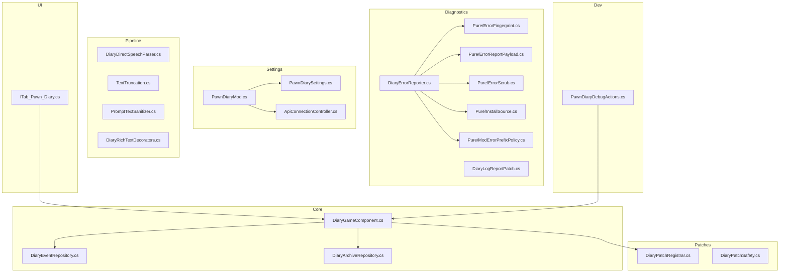
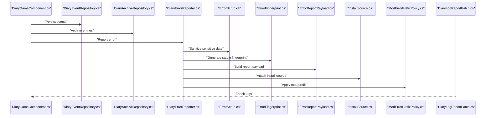
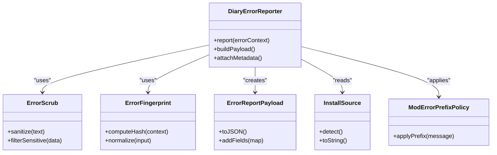
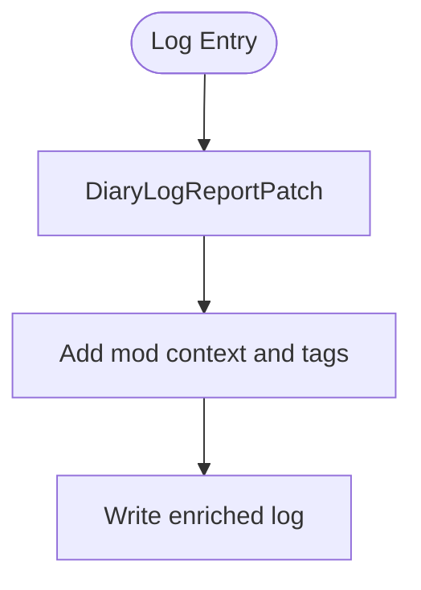
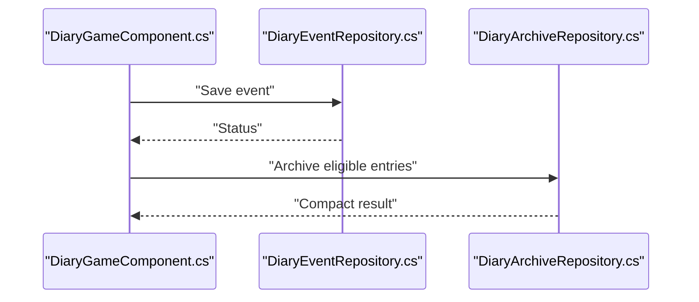
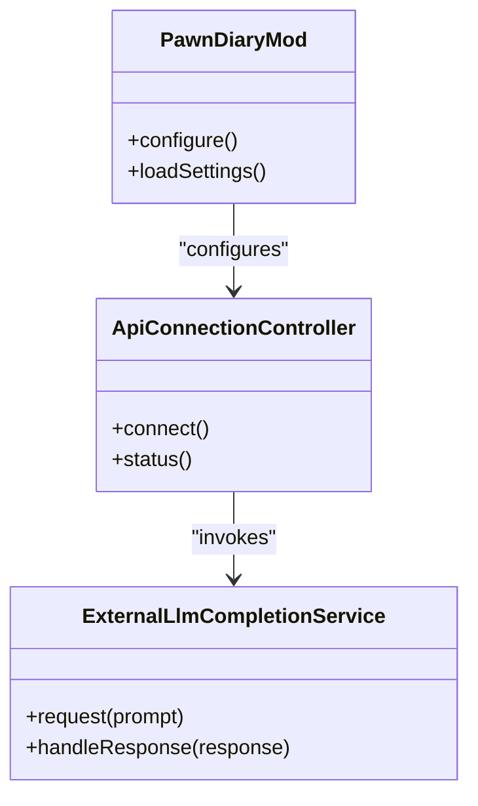
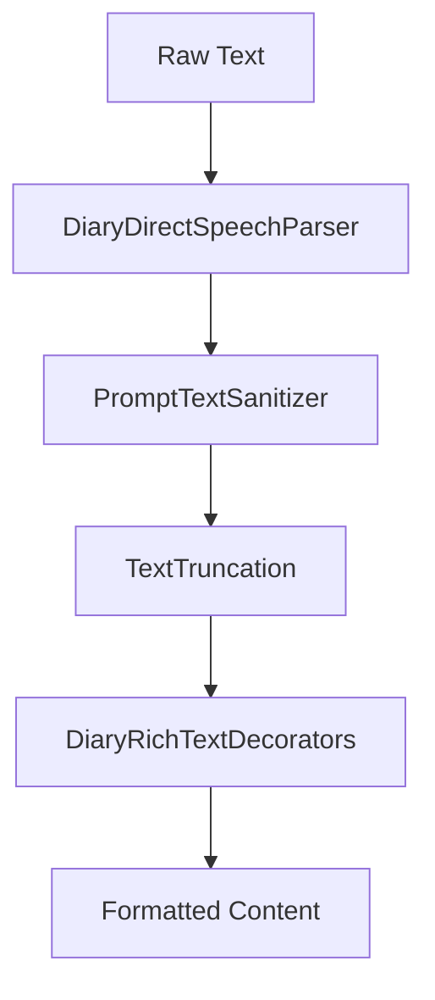
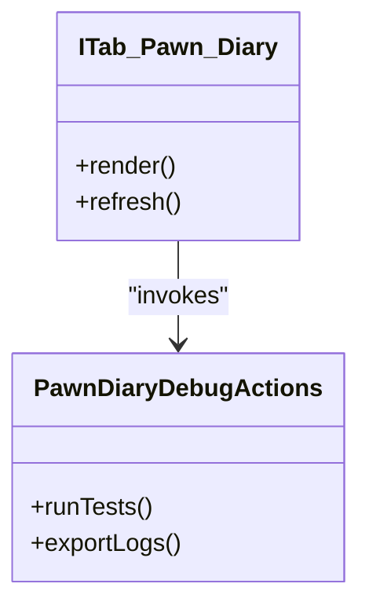
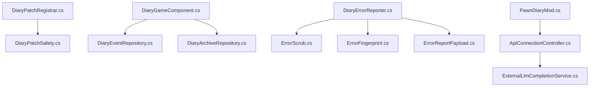

# Troubleshooting & FAQ

## Table of Contents
1. Introduction
2. Project Structure
3. Core Components
4. Architecture Overview
5. Detailed Component Analysis
6. Dependency Analysis
7. Performance Considerations
8. Troubleshooting Guide
9. Conclusion
10. Appendices

## Introduction
This document provides comprehensive troubleshooting guidance for the mod, including error reporting mechanisms, log analysis techniques, performance monitoring approaches, and step-by-step diagnostics for configuration problems, integration conflicts, and performance bottlenecks. It also includes frequently asked questions, known limitations, workarounds, and community resources.

## Project Structure
The mod organizes diagnostic and error handling under Source/Diagnostics, with pure utilities for fingerprinting, scrubbing, and payload construction. The runtime integrates via a game component and patch registration system. Settings and API connectivity are managed under Source/Settings, while UI and development tools provide additional diagnostics.

**Diagram sources**
- [DiaryErrorReporter.cs:1-200](../../../Source/Diagnostics/DiaryErrorReporter.cs#L1-L200)
- [DiaryLogReportPatch.cs:1-200](../../../Source/Diagnostics/DiaryLogReportPatch.cs#L1-L200)
- [ErrorFingerprint.cs:1-200](../../../Source/Diagnostics/Pure/ErrorFingerprint.cs#L1-L200)
- [ErrorReportPayload.cs:1-200](../../../Source/Diagnostics/Pure/ErrorReportPayload.cs#L1-L200)
- [ErrorScrub.cs:1-200](../../../Source/Diagnostics/Pure/ErrorScrub.cs#L1-L200)
- [InstallSource.cs:1-200](../../../Source/Diagnostics/Pure/InstallSource.cs#L1-L200)
- [ModErrorPrefixPolicy.cs:1-200](../../../Source/Diagnostics/Pure/ModErrorPrefixPolicy.cs#L1-L200)
- [DiaryGameComponent.cs:1-200](../../../Source/Core/DiaryGameComponent.cs#L1-L200)
- [DiaryEventRepository.cs:1-200](../../../Source/Core/DiaryEventRepository.cs#L1-L200)
- [DiaryArchiveRepository.cs:1-200](../../../Source/Core/DiaryArchiveRepository.cs#L1-L200)
- [DiaryPatchRegistrar.cs:1-200](../../../Source/Patches/DiaryPatchRegistrar.cs#L1-L200)
- [DiaryPatchSafety.cs:1-200](../../../Source/Patches/DiaryPatchSafety.cs#L1-L200)
- [PawnDiaryMod.cs:1-200](../../../Source/Settings/PawnDiaryMod.cs#L1-L200)
- [PawnDiarySettings.cs:1-200](../../../Source/Settings/PawnDiarySettings.cs#L1-L200)
- [ApiConnectionController.cs:1-200](../../../Source/Settings/ApiConnectionController.cs#L1-L200)
- [DiaryDirectSpeechParser.cs:1-200](../../../Source/Pipeline/DiaryDirectSpeechParser.cs#L1-L200)
- [TextTruncation.cs:1-200](../../../Source/Pipeline/TextTruncation.cs#L1-L200)
- [PromptTextSanitizer.cs:1-200](../../../Source/Pipeline/PromptTextSanitizer.cs#L1-L200)
- [DiaryRichTextDecorators.cs:1-200](../../../Source/Pipeline/DiaryRichTextDecorators.cs#L1-L200)
- [ITab_Pawn_Diary.cs:1-200](../../../Source/UI/ITab_Pawn_Diary.cs#L1-L200)
- [PawnDiaryDebugActions.cs:1-200](../../../Source/Dev/PawnDiaryDebugActions.cs#L1-L200)

**Section sources**
- [README.md:1-200](../../../README.md#L1-L200)

## Core Components
- Error Reporting Pipeline: Centralized error reporter coordinates fingerprinting, scrubbing, and payload creation before submission.
- Log Report Patch: Intercepts and enriches logs to aid diagnosis.
- Pure Utilities: Provide deterministic fingerprints, safe scrubbing, install source detection, and consistent error prefixes.
- Game Component and Repositories: Orchestrate lifecycle, event persistence, and archival.
- Settings and API Connectivity: Manage mod settings, API lanes, and external service connections.
- Pipeline Utilities: Handle text parsing, sanitization, truncation, and rich text decoration.
- UI and Dev Tools: Offer in-game diagnostics and developer actions.

**Section sources**
- [DiaryErrorReporter.cs:1-200](../../../Source/Diagnostics/DiaryErrorReporter.cs#L1-L200)
- [DiaryLogReportPatch.cs:1-200](../../../Source/Diagnostics/DiaryLogReportPatch.cs#L1-L200)
- [ErrorFingerprint.cs:1-200](../../../Source/Diagnostics/Pure/ErrorFingerprint.cs#L1-L200)
- [ErrorReportPayload.cs:1-200](../../../Source/Diagnostics/Pure/ErrorReportPayload.cs#L1-L200)
- [ErrorScrub.cs:1-200](../../../Source/Diagnostics/Pure/ErrorScrub.cs#L1-L200)
- [InstallSource.cs:1-200](../../../Source/Diagnostics/Pure/InstallSource.cs#L1-L200)
- [ModErrorPrefixPolicy.cs:1-200](../../../Source/Diagnostics/Pure/ModErrorPrefixPolicy.cs#L1-L200)
- [DiaryGameComponent.cs:1-200](../../../Source/Core/DiaryGameComponent.cs#L1-L200)
- [DiaryEventRepository.cs:1-200](../../../Source/Core/DiaryEventRepository.cs#L1-L200)
- [DiaryArchiveRepository.cs:1-200](../../../Source/Core/DiaryArchiveRepository.cs#L1-L200)
- [PawnDiaryMod.cs:1-200](../../../Source/Settings/PawnDiaryMod.cs#L1-L200)
- [PawnDiarySettings.cs:1-200](../../../Source/Settings/PawnDiarySettings.cs#L1-L200)
- [ApiConnectionController.cs:1-200](../../../Source/Settings/ApiConnectionController.cs#L1-L200)
- [DiaryDirectSpeechParser.cs:1-200](../../../Source/Pipeline/DiaryDirectSpeechParser.cs#L1-L200)
- [TextTruncation.cs:1-200](../../../Source/Pipeline/TextTruncation.cs#L1-L200)
- [PromptTextSanitizer.cs:1-200](../../../Source/Pipeline/PromptTextSanitizer.cs#L1-L200)
- [DiaryRichTextDecorators.cs:1-200](../../../Source/Pipeline/DiaryRichTextDecorators.cs#L1-L200)
- [ITab_Pawn_Diary.cs:1-200](../../../Source/UI/ITab_Pawn_Diary.cs#L1-L200)
- [PawnDiaryDebugActions.cs:1-200](../../../Source/Dev/PawnDiaryDebugActions.cs#L1-L200)

## Architecture Overview
The error reporting architecture centralizes diagnostics through a reporter that composes pure utilities to produce stable, privacy-safe payloads. The log report patch augments logs for easier triage. The game component orchestrates core operations and interacts with repositories for persistence and archival. Settings and API controllers manage connectivity and feature toggles.

**Diagram sources**
- [DiaryGameComponent.cs:1-200](../../../Source/Core/DiaryGameComponent.cs#L1-L200)
- [DiaryEventRepository.cs:1-200](../../../Source/Core/DiaryEventRepository.cs#L1-L200)
- [DiaryArchiveRepository.cs:1-200](../../../Source/Core/DiaryArchiveRepository.cs#L1-L200)
- [DiaryErrorReporter.cs:1-200](../../../Source/Diagnostics/DiaryErrorReporter.cs#L1-L200)
- [ErrorScrub.cs:1-200](../../../Source/Diagnostics/Pure/ErrorScrub.cs#L1-L200)
- [ErrorFingerprint.cs:1-200](../../../Source/Diagnostics/Pure/ErrorFingerprint.cs#L1-L200)
- [ErrorReportPayload.cs:1-200](../../../Source/Diagnostics/Pure/ErrorReportPayload.cs#L1-L200)
- [InstallSource.cs:1-200](../../../Source/Diagnostics/Pure/InstallSource.cs#L1-L200)
- [ModErrorPrefixPolicy.cs:1-200](../../../Source/Diagnostics/Pure/ModErrorPrefixPolicy.cs#L1-L200)
- [DiaryLogReportPatch.cs:1-200](../../../Source/Diagnostics/DiaryLogReportPatch.cs#L1-L200)

## Detailed Component Analysis

### Error Reporter and Pure Utilities
- Responsibilities:
  - Collect error context and metadata.
  - Sanitize sensitive information using scrubbing utilities.
  - Generate deterministic fingerprints for deduplication.
  - Build structured payloads for reporting.
  - Attach installation source and apply consistent mod prefixes.
- Key interactions:
  - Uses pure utilities to ensure reproducibility and safety.
  - Integrates with log patches to enrich diagnostics.

**Diagram sources**
- [DiaryErrorReporter.cs:1-200](../../../Source/Diagnostics/DiaryErrorReporter.cs#L1-L200)
- [ErrorScrub.cs:1-200](../../../Source/Diagnostics/Pure/ErrorScrub.cs#L1-L200)
- [ErrorFingerprint.cs:1-200](../../../Source/Diagnostics/Pure/ErrorFingerprint.cs#L1-L200)
- [ErrorReportPayload.cs:1-200](../../../Source/Diagnostics/Pure/ErrorReportPayload.cs#L1-L200)
- [InstallSource.cs:1-200](../../../Source/Diagnostics/Pure/InstallSource.cs#L1-L200)
- [ModErrorPrefixPolicy.cs:1-200](../../../Source/Diagnostics/Pure/ModErrorPrefixPolicy.cs#L1-L200)

**Section sources**
- [DiaryErrorReporter.cs:1-200](../../../Source/Diagnostics/DiaryErrorReporter.cs#L1-L200)
- [ErrorScrub.cs:1-200](../../../Source/Diagnostics/Pure/ErrorScrub.cs#L1-L200)
- [ErrorFingerprint.cs:1-200](../../../Source/Diagnostics/Pure/ErrorFingerprint.cs#L1-L200)
- [ErrorReportPayload.cs:1-200](../../../Source/Diagnostics/Pure/ErrorReportPayload.cs#L1-L200)
- [InstallSource.cs:1-200](../../../Source/Diagnostics/Pure/InstallSource.cs#L1-L200)
- [ModErrorPrefixPolicy.cs:1-200](../../../Source/Diagnostics/Pure/ModErrorPrefixPolicy.cs#L1-L200)

### Log Report Patch
- Purpose:
  - Intercept and augment logs to include mod-specific context.
  - Ensure consistent formatting and categorization for easier searching.
- Integration:
  - Hooks into logging pipeline to prepend or append diagnostic markers.

**Diagram sources**
- [DiaryLogReportPatch.cs:1-200](../../../Source/Diagnostics/DiaryLogReportPatch.cs#L1-L200)

**Section sources**
- [DiaryLogReportPatch.cs:1-200](../../../Source/Diagnostics/DiaryLogReportPatch.cs#L1-L200)

### Game Component and Repositories
- Responsibilities:
  - Lifecycle management and orchestration of diary features.
  - Event persistence and archival strategies.
- Diagnostics:
  - Expose health summaries and snapshots for troubleshooting.

**Diagram sources**
- [DiaryGameComponent.cs:1-200](../../../Source/Core/DiaryGameComponent.cs#L1-L200)
- [DiaryEventRepository.cs:1-200](../../../Source/Core/DiaryEventRepository.cs#L1-L200)
- [DiaryArchiveRepository.cs:1-200](../../../Source/Core/DiaryArchiveRepository.cs#L1-L200)

**Section sources**
- [DiaryGameComponent.cs:1-200](../../../Source/Core/DiaryGameComponent.cs#L1-L200)
- [DiaryEventRepository.cs:1-200](../../../Source/Core/DiaryEventRepository.cs#L1-L200)
- [DiaryArchiveRepository.cs:1-200](../../../Source/Core/DiaryArchiveRepository.cs#L1-L200)

### Settings and API Connectivity
- Responsibilities:
  - Manage mod settings and advanced options.
  - Control API lane setup and connection state.
- Diagnostics:
  - Provide snapshots of API setup and health status.

**Diagram sources**
- [PawnDiaryMod.cs:1-200](../../../Source/Settings/PawnDiaryMod.cs#L1-L200)
- [ApiConnectionController.cs:1-200](../../../Source/Settings/ApiConnectionController.cs#L1-L200)
- [ExternalLlmCompletionService.cs:1-200](../../../Source/Integration/ExternalLlmCompletionService.cs#L1-L200)

**Section sources**
- [PawnDiaryMod.cs:1-200](../../../Source/Settings/PawnDiaryMod.cs#L1-L200)
- [PawnDiarySettings.cs:1-200](../../../Source/Settings/PawnDiarySettings.cs#L1-L200)
- [ApiConnectionController.cs:1-200](../../../Source/Settings/ApiConnectionController.cs#L1-L200)
- [ExternalLlmCompletionService.cs:1-200](../../../Source/Integration/ExternalLlmCompletionService.cs#L1-L200)

### Pipeline Utilities (Parsing, Sanitization, Truncation, Decoration)
- Responsibilities:
  - Parse direct speech inputs safely.
  - Sanitize prompts to prevent injection issues.
  - Truncate long texts to fit constraints.
  - Apply rich text decorations consistently.
- Diagnostics:
  - Fail-fast on malformed input; return clear errors for upstream handling.

**Diagram sources**
- [DiaryDirectSpeechParser.cs:1-200](../../../Source/Pipeline/DiaryDirectSpeechParser.cs#L1-L200)
- [PromptTextSanitizer.cs:1-200](../../../Source/Pipeline/PromptTextSanitizer.cs#L1-L200)
- [TextTruncation.cs:1-200](../../../Source/Pipeline/TextTruncation.cs#L1-L200)
- [DiaryRichTextDecorators.cs:1-200](../../../Source/Pipeline/DiaryRichTextDecorators.cs#L1-L200)

**Section sources**
- [DiaryDirectSpeechParser.cs:1-200](../../../Source/Pipeline/DiaryDirectSpeechParser.cs#L1-L200)
- [PromptTextSanitizer.cs:1-200](../../../Source/Pipeline/PromptTextSanitizer.cs#L1-L200)
- [TextTruncation.cs:1-200](../../../Source/Pipeline/TextTruncation.cs#L1-L200)
- [DiaryRichTextDecorators.cs:1-200](../../../Source/Pipeline/DiaryRichTextDecorators.cs#L1-L200)

### UI and Development Tools
- Responsibilities:
  - Provide in-game tabs and controls for viewing diary entries and diagnostics.
  - Offer developer actions for testing and debugging.
- Diagnostics:
  - Visualize entry statuses and allow quick access to logs and reports.

**Diagram sources**
- [ITab_Pawn_Diary.cs:1-200](../../../Source/UI/ITab_Pawn_Diary.cs#L1-L200)
- [PawnDiaryDebugActions.cs:1-200](../../../Source/Dev/PawnDiaryDebugActions.cs#L1-L200)

**Section sources**
- [ITab_Pawn_Diary.cs:1-200](../../../Source/UI/ITab_Pawn_Diary.cs#L1-L200)
- [PawnDiaryDebugActions.cs:1-200](../../../Source/Dev/PawnDiaryDebugActions.cs#L1-L200)

## Dependency Analysis
- Patch Registration and Safety:
  - Registrar manages patch application order and dependencies.
  - Safety layer guards against incompatible environments and prevents crashes.
- Core Dependencies:
  - Game component depends on repositories for persistence and archival.
  - Error reporter depends on pure utilities for safe processing.
- Settings and API:
  - Mod settings influence API connectivity and behavior.
  - External LLM service is invoked conditionally based on configuration.

**Diagram sources**
- [DiaryPatchRegistrar.cs:1-200](../../../Source/Patches/DiaryPatchRegistrar.cs#L1-L200)
- [DiaryPatchSafety.cs:1-200](../../../Source/Patches/DiaryPatchSafety.cs#L1-L200)
- [DiaryGameComponent.cs:1-200](../../../Source/Core/DiaryGameComponent.cs#L1-L200)
- [DiaryEventRepository.cs:1-200](../../../Source/Core/DiaryEventRepository.cs#L1-L200)
- [DiaryArchiveRepository.cs:1-200](../../../Source/Core/DiaryArchiveRepository.cs#L1-L200)
- [DiaryErrorReporter.cs:1-200](../../../Source/Diagnostics/DiaryErrorReporter.cs#L1-L200)
- [ErrorScrub.cs:1-200](../../../Source/Diagnostics/Pure/ErrorScrub.cs#L1-L200)
- [ErrorFingerprint.cs:1-200](../../../Source/Diagnostics/Pure/ErrorFingerprint.cs#L1-L200)
- [ErrorReportPayload.cs:1-200](../../../Source/Diagnostics/Pure/ErrorReportPayload.cs#L1-L200)
- [PawnDiaryMod.cs:1-200](../../../Source/Settings/PawnDiaryMod.cs#L1-L200)
- [ApiConnectionController.cs:1-200](../../../Source/Settings/ApiConnectionController.cs#L1-L200)
- [ExternalLlmCompletionService.cs:1-200](../../../Source/Integration/ExternalLlmCompletionService.cs#L1-L200)

**Section sources**
- [DiaryPatchRegistrar.cs:1-200](../../../Source/Patches/DiaryPatchRegistrar.cs#L1-L200)
- [DiaryPatchSafety.cs:1-200](../../../Source/Patches/DiaryPatchSafety.cs#L1-L200)
- [DiaryGameComponent.cs:1-200](../../../Source/Core/DiaryGameComponent.cs#L1-L200)
- [DiaryEventRepository.cs:1-200](../../../Source/Core/DiaryEventRepository.cs#L1-L200)
- [DiaryArchiveRepository.cs:1-200](../../../Source/Core/DiaryArchiveRepository.cs#L1-L200)
- [DiaryErrorReporter.cs:1-200](../../../Source/Diagnostics/DiaryErrorReporter.cs#L1-L200)
- [ErrorScrub.cs:1-200](../../../Source/Diagnostics/Pure/ErrorScrub.cs#L1-L200)
- [ErrorFingerprint.cs:1-200](../../../Source/Diagnostics/Pure/ErrorFingerprint.cs#L1-L200)
- [ErrorReportPayload.cs:1-200](../../../Source/Diagnostics/Pure/ErrorReportPayload.cs#L1-L200)
- [PawnDiaryMod.cs:1-200](../../../Source/Settings/PawnDiaryMod.cs#L1-L200)
- [ApiConnectionController.cs:1-200](../../../Source/Settings/ApiConnectionController.cs#L1-L200)
- [ExternalLlmCompletionService.cs:1-200](../../../Source/Integration/ExternalLlmCompletionService.cs#L1-L200)

## Performance Considerations
- Text Processing:
  - Use truncation and sanitization to avoid oversized payloads and reduce memory pressure.
  - Prefer incremental parsing and streaming where possible.
- Persistence:
  - Batch writes to repositories to minimize disk I/O overhead.
  - Archive old entries proactively to keep active datasets small.
- Network Calls:
  - Implement retries and timeouts for external LLM requests.
  - Cache responses when appropriate to reduce latency.
- Logging:
  - Avoid excessive verbose logging in hot paths; use selective debug flags.

[No sources needed since this section provides general guidance]

## Troubleshooting Guide

### Common Issues and Resolutions
- Errors not reported:
  - Verify error reporter initialization and ensure it is invoked during error paths.
  - Check pure utilities for scrubbing and fingerprinting failures.
- Logs missing context:
  - Confirm log report patch is applied and not suppressed by other mods.
  - Inspect mod prefix policy to ensure messages are tagged correctly.
- API connectivity failures:
  - Validate settings and connection controller status.
  - Review external LLM completion service response handling and error codes.
- UI not updating:
  - Ensure game component refresh methods are called after state changes.
  - Check for exceptions in UI rendering and debug actions.

**Section sources**
- [DiaryErrorReporter.cs:1-200](../../../Source/Diagnostics/DiaryErrorReporter.cs#L1-L200)
- [DiaryLogReportPatch.cs:1-200](../../../Source/Diagnostics/DiaryLogReportPatch.cs#L1-L200)
- [ModErrorPrefixPolicy.cs:1-200](../../../Source/Diagnostics/Pure/ModErrorPrefixPolicy.cs#L1-L200)
- [PawnDiaryMod.cs:1-200](../../../Source/Settings/PawnDiaryMod.cs#L1-L200)
- [ApiConnectionController.cs:1-200](../../../Source/Settings/ApiConnectionController.cs#L1-L200)
- [ExternalLlmCompletionService.cs:1-200](../../../Source/Integration/ExternalLlmCompletionService.cs#L1-L200)
- [ITab_Pawn_Diary.cs:1-200](../../../Source/UI/ITab_Pawn_Diary.cs#L1-L200)

### Error Reporting Mechanisms
- Steps:
  - Capture error context and pass to the reporter.
  - Reporter scrubs sensitive data and computes a stable fingerprint.
  - Build a structured payload and attach install source metadata.
  - Optionally submit to remote endpoint if configured.
- Tips:
  - Include stack traces and relevant state snapshots.
  - Use consistent prefixes to filter logs easily.

**Section sources**
- [DiaryErrorReporter.cs:1-200](../../../Source/Diagnostics/DiaryErrorReporter.cs#L1-L200)
- [ErrorScrub.cs:1-200](../../../Source/Diagnostics/Pure/ErrorScrub.cs#L1-L200)
- [ErrorFingerprint.cs:1-200](../../../Source/Diagnostics/Pure/ErrorFingerprint.cs#L1-L200)
- [ErrorReportPayload.cs:1-200](../../../Source/Diagnostics/Pure/ErrorReportPayload.cs#L1-L200)
- [InstallSource.cs:1-200](../../../Source/Diagnostics/Pure/InstallSource.cs#L1-L200)

### Log Analysis Techniques
- Search for mod-prefixed entries to isolate relevant logs.
- Look for enrichment tags added by the log report patch.
- Correlate timestamps with UI actions and API calls.
- Export logs via dev actions for offline analysis.

**Section sources**
- [DiaryLogReportPatch.cs:1-200](../../../Source/Diagnostics/DiaryLogReportPatch.cs#L1-L200)
- [PawnDiaryDebugActions.cs:1-200](../../../Source/Dev/PawnDiaryDebugActions.cs#L1-L200)

### Performance Monitoring Approaches
- Monitor repository write frequency and archive compaction results.
- Track external LLM request durations and failure rates.
- Observe UI refresh intervals and rendering costs.
- Use dev actions to run targeted tests and export metrics.

**Section sources**
- [DiaryEventRepository.cs:1-200](../../../Source/Core/DiaryEventRepository.cs#L1-L200)
- [DiaryArchiveRepository.cs:1-200](../../../Source/Core/DiaryArchiveRepository.cs#L1-L200)
- [ExternalLlmCompletionService.cs:1-200](../../../Source/Integration/ExternalLlmCompletionService.cs#L1-L200)
- [ITab_Pawn_Diary.cs:1-200](../../../Source/UI/ITab_Pawn_Diary.cs#L1-L200)
- [PawnDiaryDebugActions.cs:1-200](../../../Source/Dev/PawnDiaryDebugActions.cs#L1-L200)

### Frequently Asked Questions
- How do I enable detailed logging?
  - Adjust settings and ensure the log report patch is active.
- Why are my API requests failing?
  - Check connection controller status and review external service responses.
- Can I export logs for support?
  - Use dev actions to export logs and include them with your report.
- How do I verify patch compatibility?
  - Confirm patch registrar and safety checks pass at startup.

**Section sources**
- [PawnDiarySettings.cs:1-200](../../../Source/Settings/PawnDiarySettings.cs#L1-L200)
- [DiaryLogReportPatch.cs:1-200](../../../Source/Diagnostics/DiaryLogReportPatch.cs#L1-L200)
- [ApiConnectionController.cs:1-200](../../../Source/Settings/ApiConnectionController.cs#L1-L200)
- [ExternalLlmCompletionService.cs:1-200](../../../Source/Integration/ExternalLlmCompletionService.cs#L1-L200)
- [DiaryPatchRegistrar.cs:1-200](../../../Source/Patches/DiaryPatchRegistrar.cs#L1-L200)
- [DiaryPatchSafety.cs:1-200](../../../Source/Patches/DiaryPatchSafety.cs#L1-L200)
- [PawnDiaryDebugActions.cs:1-200](../../../Source/Dev/PawnDiaryDebugActions.cs#L1-L200)

### Known Limitations and Workarounds
- Large text inputs may be truncated to fit constraints.
  - Workaround: Split content into smaller segments or adjust truncation policies.
- External services may rate-limit or timeout.
  - Workaround: Implement backoff and retry logic; cache frequent responses.
- Patch conflicts can suppress logs or disable features.
  - Workaround: Disable conflicting mods temporarily and re-enable incrementally.

**Section sources**
- [TextTruncation.cs:1-200](../../../Source/Pipeline/TextTruncation.cs#L1-L200)
- [ExternalLlmCompletionService.cs:1-200](../../../Source/Integration/ExternalLlmCompletionService.cs#L1-L200)
- [DiaryPatchSafety.cs:1-200](../../../Source/Patches/DiaryPatchSafety.cs#L1-L200)

### Step-by-Step Diagnostic Procedures

#### Configuration Problems
- Verify mod settings and API connection status.
- Check patch registrar output for warnings or errors.
- Confirm log report patch is active and prefixed messages appear.
- Re-run dev actions to validate configuration.

**Section sources**
- [PawnDiaryMod.cs:1-200](../../../Source/Settings/PawnDiaryMod.cs#L1-L200)
- [ApiConnectionController.cs:1-200](../../../Source/Settings/ApiConnectionController.cs#L1-L200)
- [DiaryPatchRegistrar.cs:1-200](../../../Source/Patches/DiaryPatchRegistrar.cs#L1-L200)
- [DiaryLogReportPatch.cs:1-200](../../../Source/Diagnostics/DiaryLogReportPatch.cs#L1-L200)
- [PawnDiaryDebugActions.cs:1-200](../../../Source/Dev/PawnDiaryDebugActions.cs#L1-L200)

#### Integration Conflicts
- Identify conflicting mods by disabling them one by one.
- Inspect patch safety checks and registrar logs for incompatibilities.
- Use dev actions to test isolated functionality.

**Section sources**
- [DiaryPatchSafety.cs:1-200](../../../Source/Patches/DiaryPatchSafety.cs#L1-L200)
- [DiaryPatchRegistrar.cs:1-200](../../../Source/Patches/DiaryPatchRegistrar.cs#L1-L200)
- [PawnDiaryDebugActions.cs:1-200](../../../Source/Dev/PawnDiaryDebugActions.cs#L1-L200)

#### Performance Bottlenecks
- Profile repository writes and archive compactions.
- Measure external LLM request latencies and failure rates.
- Observe UI refresh cycles and consider reducing update frequency.

**Section sources**
- [DiaryEventRepository.cs:1-200](../../../Source/Core/DiaryEventRepository.cs#L1-L200)
- [DiaryArchiveRepository.cs:1-200](../../../Source/Core/DiaryArchiveRepository.cs#L1-L200)
- [ExternalLlmCompletionService.cs:1-200](../../../Source/Integration/ExternalLlmCompletionService.cs#L1-L200)
- [ITab_Pawn_Diary.cs:1-200](../../../Source/UI/ITab_Pawn_Diary.cs#L1-L200)

### Community Resources and Support Channels
- Refer to the project README for links to documentation and community channels.
- Use dev actions to export logs and include them in bug reports.
- Engage with community discussions for shared solutions and updates.

**Section sources**
- [README.md:1-200](../../../README.md#L1-L200)
- [PawnDiaryDebugActions.cs:1-200](../../../Source/Dev/PawnDiaryDebugActions.cs#L1-L200)

## Conclusion
This guide consolidates error reporting, log analysis, and performance monitoring practices, providing actionable steps to diagnose and resolve common issues. By leveraging the mod’s built-in diagnostics, settings, and dev tools, users can efficiently troubleshoot configuration problems, integration conflicts, and performance bottlenecks. For further assistance, consult the README and engage with the community.

[No sources needed since this section summarizes without analyzing specific files]

## Appendices

### Appendix A: Quick Reference Checklist
- Enable detailed logging and confirm mod prefixes.
- Validate API connection and external service responses.
- Run dev actions to export logs and test isolated features.
- Check patch safety and registrar outputs for conflicts.
- Monitor repository and archive performance metrics.

**Section sources**
- [DiaryLogReportPatch.cs:1-200](../../../Source/Diagnostics/DiaryLogReportPatch.cs#L1-L200)
- [ApiConnectionController.cs:1-200](../../../Source/Settings/ApiConnectionController.cs#L1-L200)
- [ExternalLlmCompletionService.cs:1-200](../../../Source/Integration/ExternalLlmCompletionService.cs#L1-L200)
- [DiaryPatchSafety.cs:1-200](../../../Source/Patches/DiaryPatchSafety.cs#L1-L200)
- [DiaryPatchRegistrar.cs:1-200](../../../Source/Patches/DiaryPatchRegistrar.cs#L1-L200)
- [DiaryEventRepository.cs:1-200](../../../Source/Core/DiaryEventRepository.cs#L1-L200)
- [DiaryArchiveRepository.cs:1-200](../../../Source/Core/DiaryArchiveRepository.cs#L1-L200)
- [PawnDiaryDebugActions.cs:1-200](../../../Source/Dev/PawnDiaryDebugActions.cs#L1-L200)
